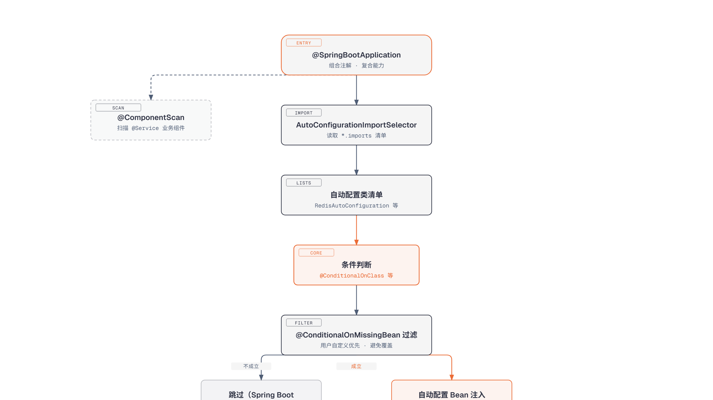

# 第1篇：Spring Boot 自动配置与启动原理

> 技术点：Spring Boot 自动配置、启动流程、内嵌容器
> 场景项目：mall-micro-cloud 订单服务（mall-order-service）

---

## 一、基础篇：概念与价值

### 1.1 Spring Boot 解决了什么问题？

传统 Spring 开发的问题：
- **XML 配置地狱**：数据源、事务、MVC 每样都要写 XML
- **依赖版本冲突**：各组件版本需要手工对齐
- **部署环境复杂**：Tomcat 需单独安装配置

Spring Boot 的答案：**约定大于配置 + 自动装配 + 内嵌容器**

### 1.2 核心概念

| 概念 | 说明 |
|------|------|
| 自动配置 | 根据 classpath 依赖自动注入 Bean |
| Starter | 一键引入场景依赖（如 `spring-boot-starter-web`） |
| 内嵌容器 | 内嵌 Tomcat/Jetty，jar 包直接运行 |
| Actuator | 生产级监控端点 |

---

## 二、进阶篇：原理深剖

### 2.1 自动配置原理



*流程图：从 @SpringBootApplication 到 Bean 注入容器的完整链路，条件判断为焦点节点*

### 2.2 核心条件注解

| 注解 | 含义 |
|------|------|
| `@ConditionalOnClass` | 类路径存在指定类时生效 |
| `@ConditionalOnMissingBean` | 容器没有指定 Bean 时生效 |
| `@ConditionalOnProperty` | 配置中存在指定属性时生效 |
| `@ConditionalOnWebApplication` | 当前是 Web 应用时生效 |

### 2.3 启动流程

```
① SpringApplication.run()
    ↓
② 判断应用类型 → ③ 加载初始化器 → ④ 加载监听器
    ↓
⑤ 准备 Environment → ⑥ 打印 Banner
    ↓
⑦ 创建 ApplicationContext → ⑧ 刷新上下文（refresh）
    ↓
⑨ 内嵌容器启动 → ⑩ 返回 ApplicationContext
```

---

## 三、项目篇：mall-micro-cloud 中的实际应用

### 3.1 应用场景

在 `mall-micro-cloud` 项目中，每个微服务都是一个 Spring Boot 应用：

| 服务 | 包名 | 启动类 |
|------|------|--------|
| 订单服务 | `mall-order-service` | `OrderServiceApplication.java` |
| 商品服务 | `mall-product-service` | `ProductServiceApplication.java` |
| 秒杀服务 | `mall-seckill-service` | `SeckillServiceApplication.java` |

### 3.2 父工程统一版本管理

```xml
<!-- mall-micro-cloud/pom.xml — Spring Boot 3.3.2 -->
<parent>
    <groupId>org.springframework.boot</groupId>
    <artifactId>spring-boot-starter-parent</artifactId>
    <version>3.3.2</version>
    <relativePath/>
</parent>
```

### 3.3 自动配置在项目中的体现

```java
// 秒杀服务启动类
@SpringBootApplication
@MapperScan("itcast.cloud.mall.services.seckill.mapper")
public class SeckillServiceApplication {
    public static void main(String[] args) {
        SpringApplication.run(SeckillServiceApplication.class, args);
    }
}
```

一行 `@SpringBootApplication` 背后：
- `@EnableAutoConfiguration` → 自动配置 RedisTemplate、RocketMQ 客户端等
- `@ComponentScan` → 扫描 `@Service`、`@Controller`、`@Component`
- `@SpringBootConfiguration` → 允许注册额外 Bean

### 3.4 配置绑定（@ConfigurationProperties）

```java
// 项目中的配置绑定示例
@ConfigurationProperties(prefix = "baidu.qianfan")
public class BaiduAIProperties {
    private String apiKey;
    private String baseUrl;
    private String model;
}
```

### 3.5 多环境配置

```yaml
# application.yml → 公共配置
# application-dev.yml → 开发环境
# application-prod.yml → 生产环境

spring:
  profiles:
    active: dev  # 激活开发环境
```

---

> 下一篇：[第2篇：Spring Cloud 微服务架构设计](https://github.com/1byteone/interview-note/blob/master/projects/tutorials/02-microservice-arch/README.md)