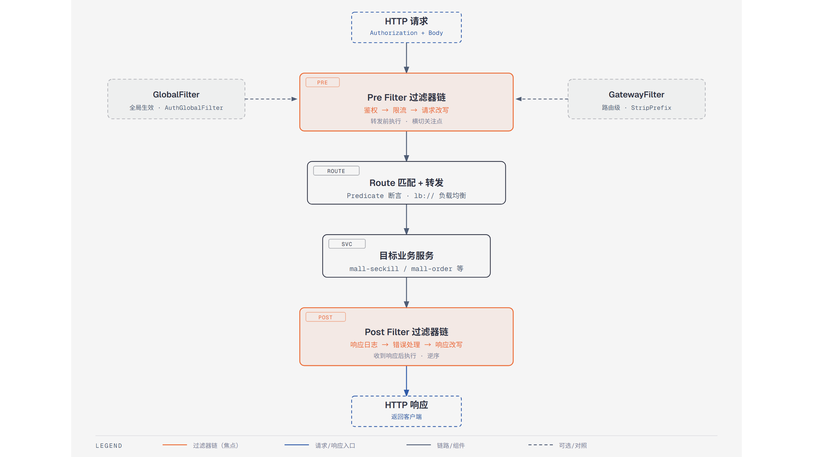

# 第4篇：Spring Cloud Gateway 网关

> 技术点：路由转发、断言、过滤器链、限流
> 场景项目：mall-micro-cloud（mall-gateway 模块）

---

## 一、基础篇：概念与价值

### 1.1 什么是 API 网关？

API 网关是微服务架构的**统一入口**，负责请求路由、鉴权、限流、日志等横切关注点。没有网关时，客户端需要知道每个服务的地址；有了网关，客户端只和网关通信。

### 1.2 Gateway 核心三要素

| 要素 | 作用 | 类比 |
|------|------|------|
| Route（路由） | 请求匹配 + 转发目标 | 快递单上的地址 |
| Predicate（断言） | 匹配条件（Path/Header/参数） | 门禁规则 |
| Filter（过滤器） | 请求/响应拦截处理 | 安检通道 |

---

## 二、进阶篇：过滤器链执行机制

### 2.1 过滤器链执行顺序



*请求从 Pre Filter 经路由转发到目标服务，再经 Post Filter 返回的完整过滤器链*

```
请求 → Pre Filter（鉴权/限流/改写）→ 转发到目标服务
                                       ↓
响应 ← Post Filter（日志/错误处理/改写）
```

### 2.2 过滤器类型

| 类型 | 作用 | 示例 |
|------|------|------|
| Pre Filter | 请求转发前执行 | 鉴权、限流 |
| Post Filter | 收到响应后执行 | 日志、响应改写 |
| GlobalFilter | 全局（所有路由生效） | 鉴权过滤器 |
| GatewayFilter | 路由级（指定路由生效） | StripPrefix |

---

## 三、项目篇：mall-gateway 实际应用

### 3.1 路由配置

```yaml
spring:
  cloud:
    gateway:
      routes:
        - id: mall-seckill
          uri: lb://mall-seckill-service
          predicates:
            - Path=/api/seckill/**
          filters:
            - StripPrefix=1
```

### 3.2 自定义鉴权过滤器

```java
@Component
public class AuthGlobalFilter implements GlobalFilter, Ordered {
    @Override
    public Mono<Void> filter(ServerWebExchange exchange, GatewayFilterChain chain) {
        String token = exchange.getRequest().getHeaders()
            .getFirst("Authorization");
        if (StringUtils.isEmpty(token)) {
            exchange.getResponse().setStatusCode(HttpStatus.UNAUTHORIZED);
            return exchange.getResponse().setComplete();
        }
        return chain.filter(exchange);
    }
    @Override
    public int getOrder() { return -100; }
}
```

### 3.3 Sentinel 限流集成

```yaml
filters:
  - name: RequestRateLimiter
    args:
      key-resolver: "#{@userKeyResolver}"
      redis-rate-limiter:
        replenishRate: 100
        burstCapacity: 200
```

---

> 下一篇：[第5篇：OpenFeign 远程调用与负载均衡](https://github.com/1byteone/interview-note/blob/master/projects/tutorials/05-openfeign/README.md)