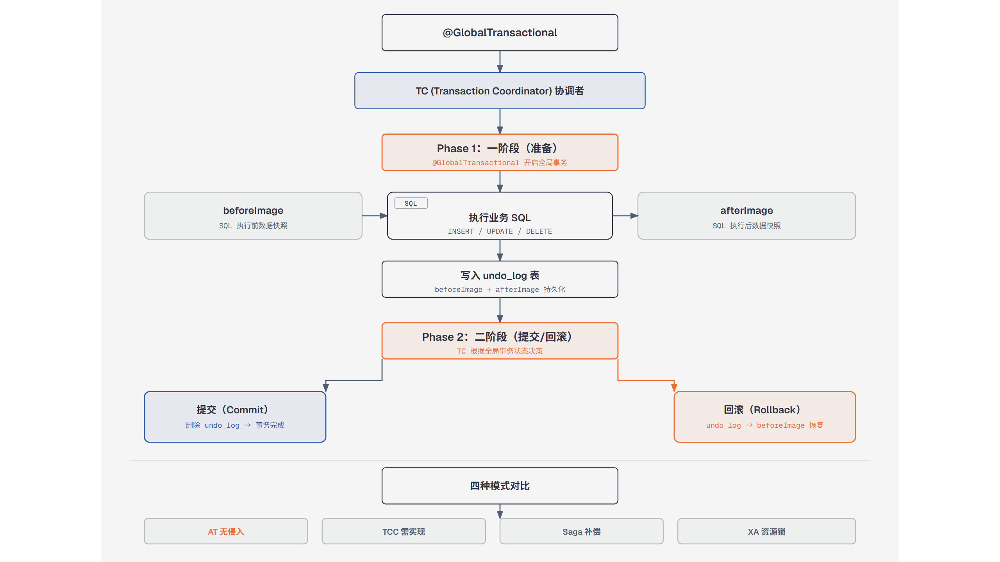

# 第7篇：Seata 分布式事务

> 技术点：AT 模式、TCC、Saga、全局事务、undo_log
> 场景项目：mall-micro-cloud（商品服务 + 订单服务跨服务事务）

---

## 一、基础篇：概念与价值

### 1.1 什么是分布式事务？

分布式事务指涉及多个数据库、多个服务的事务操作，需要保证所有参与的节点要么全部成功、要么全部失败。

### 1.2 为什么需要？

```
用户下单
 ├── 订单服务 → 创建订单（本地 ACID ✅）
 ├── 商品服务 → 扣减库存（本地 ACID ✅）
 └── 用户服务 → 扣减余额（本地 ACID ✅）
         ↓ 任意一个失败 → 需要全部回滚！
```

本地事务只能保证单库，跨服务需要分布式事务方案。

---

## 二、进阶篇：AT 模式原理



*一阶段生成前后镜像和 undo_log，二阶段提交删除日志或回滚恢复数据*

### 2.1 两阶段提交

```
【一阶段：本地提交】
业务 SQL 执行前 → 生成前置镜像（beforeImage）
执行业务 SQL → 生成后置镜像（afterImage）
写入 undo_log 表 → 本地提交（事务已生效）

【二阶段：全局决策】
全局提交 → 删除 undo_log（数据已提交无需回滚）
全局回滚 → 读取 undo_log 反向 SQL → 校验镜像 → 恢复数据
```

### 2.2 四种模式对比

| 模式 | 一致性 | 侵入性 | 性能 | 适用 |
|------|--------|--------|------|------|
| AT | 最终一致 | 低 | 高 | 常规业务（推荐） |
| TCC | 最终一致 | 高 | 中 | 资金类 |
| Saga | 最终一致 | 中 | 高 | 长事务 |
| XA | 强一致 | 低 | 低 | 银行核心 |

---

## 三、项目篇：下单扣库存

### 3.1 依赖引入

```xml
<!-- mall-product-service / mall-order-service -->
<dependency>
    <groupId>com.alibaba.cloud</groupId>
    <artifactId>spring-cloud-starter-alibaba-seata</artifactId>
</dependency>
```

### 3.2 全局事务入口

```java
@GlobalTransactional(rollbackFor = Exception.class)
public void createOrder(OrderDTO order) {
    orderService.create(order);        // 本地事务（订单库）
    productService.deductStock(order); // 远程调用（商品库，Seata 协调）
}
```

### 3.3 场景选择

| 场景 | 方案 | 原因 |
|------|------|------|
| 非秒杀下单 | Seata AT | 需要强一致性 |
| 秒杀扣库存 | Redis 预扣 + MQ | 高并发，可接受最终一致 |
| 支付回调 | MQ 异步 | 解耦 + 幂等 |

---

> 下一篇：[第8篇：RocketMQ 消息队列与事务消息](https://github.com/1byteone/interview-note/blob/master/projects/tutorials/08-rocketmq/README.md)