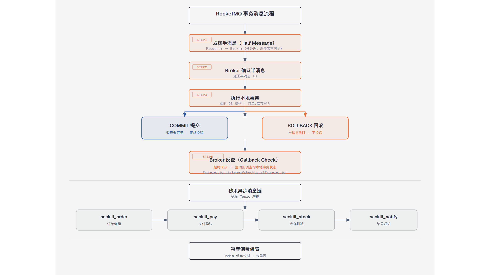

# 第8篇：RocketMQ 消息队列与事务消息

> 技术点：消息模型、事务消息、幂等、削峰填谷
> 场景项目：mall-micro-cloud（秒杀服务 + 消费服务）

---

## 一、基础篇：概念与价值

### 1.1 RocketMQ 核心组件

| 组件 | 作用 |
|------|------|
| NameServer | 路由注册中心 |
| Broker | 消息存储与转发 |
| Producer | 消息生产者 |
| Consumer | 消息消费者 |
| Topic | 消息主题 |
| Queue | 消息队列（分区） |

### 1.2 消息类型

| 类型 | 特性 | 场景 |
|------|------|------|
| 普通消息 | 无顺序无事务 | 日志、通知 |
| 顺序消息 | 分区内有序 | 订单状态流转 |
| 事务消息 | 本地事务+消息最终一致 | 下单+扣库存 |
| 延迟消息 | 指定延迟投递 | 订单超时取消 |

---

## 二、进阶篇：事务消息原理



*半消息发送、本地事务执行、提交/回滚及回查机制*

### 2.1 RocketMQ 事务消息（2PC + 回查）

```
Producer                    Broker
    │ ① 发送半消息(prepare) ──────►│ 半消息不可见
    │ ② 返回半消息确认 ◄─────      │
    │ ③ 执行本地事务               │
    │ ④ 提交/回滚 ──────►         │ 提交→可见 回滚→删除
    │ ⑤ 未确认时反查 ◄─────       │ 回查本地事务状态
```

### 2.2 代码实现

```java
public class OrderTransactionListener implements TransactionListener {
    @Override
    public LocalTransactionState executeLocalTransaction(Message msg, Object arg) {
        try {
            orderService.createOrder(arg);
            return LocalTransactionState.COMMIT_MESSAGE;
        } catch (Exception e) {
            return LocalTransactionState.ROLLBACK_MESSAGE;
        }
    }

    @Override
    public LocalTransactionState checkLocalTransaction(MessageExt msg) {
        return orderService.checkOrder(msg.getKeys())
            ? COMMIT_MESSAGE : ROLLBACK_MESSAGE;
    }
}
```

---

## 三、项目篇：秒杀削峰 + 幂等

### 3.1 秒杀异步链路

```
① Redis 预扣库存成功
    ↓
② 发送 RocketMQ 消息（异步）
    ↓
③ StockDeductConsumer 消费
    ↓ 幂等校验 + 乐观锁
④ DB 库存更新 + 流水落库
```

### 3.2 幂等性实现

```java
// 幂等 key：que:lock:stock:{transactionId}
Boolean acquired = redisTemplate.opsForValue()
    .setIfAbsent(lockKey, "1", 30, TimeUnit.SECONDS);
if (!Boolean.TRUE.equals(acquired)) {
    return; // 重复消息直接跳过
}
```

### 3.3 消息可靠性

| 阶段 | 保障 |
|------|------|
| 生产 | 同步发送 + 重试 |
| Broker | 同步刷盘 + 主从复制 |
| 消费 | 消费成功后才提交 offset |

---

> 下一篇：[第9篇：Redis 缓存与分布式锁](https://github.com/1byteone/interview-note/blob/master/projects/tutorials/09-redis/README.md)