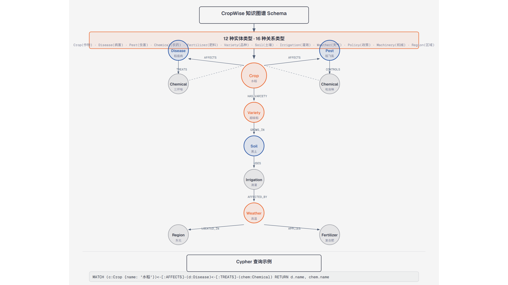

# 第15篇：Neo4j 知识图谱与 GraphRAG

> 技术点：知识图谱 Schema、Cypher 查询、GraphRAG、实体关系推理
> 场景项目：CropWise（12 实体 + 16 关系农业知识图谱）

> 📚 这是 [AI 应用开发专项教程](../00-ai-application-learning-path/README.md) 的配套专题。概念见 [农业 GraphRAG](../00-ai-application-learning-path/08-agri-graph-rag.md)。

---

## 一、基础篇：概念与价值



*实体-关系图结构及向量检索+图检索融合*

### 1.1 什么是知识图谱？

知识图谱以**图结构**存储实体（节点）和实体间的关系（边），支持结构化推理。与向量存储的语义相似相比，知识图谱能回答"谁影响了谁"这类多跳推理问题。

### 1.2 为什么 RAG 需要知识图谱？

| 对比 | 向量检索 | 知识图谱 |
|------|----------|----------|
| 查询方式 | 语义相似 | 结构化查边 |
| 多跳推理 | 不支持 | 原生支持 |
| 关系表达 | 隐性 | 显性（实体-关系） |
| 可解释性 | 中 | 高 |

---

## 二、进阶篇：Cypher 与 Schema

### 2.1 CropWise 知识图谱 Schema

```
实体类型 (12)：Crop, Disease, Pest, Chemical, Fertilizer,
               Variety, Soil, Irrigation, Weather, Policy,
               Machinery, Region

关系类型 (16)：AFFECTS, DAMAGES, TREATS, REQUIRES,
                RECOMMENDS, PREVENTS, GROWS_IN, ...
```

### 2.2 Cypher 查询

```cypher
// 查询"水稻"相关的病虫害及防治方法
MATCH (c:Crop {name: '水稻'})
      <-[:AFFECTS]-(d:Disease)
      <-[:TREATS]-(chem:Chemical)
RETURN d.name AS disease, chem.name AS treatment
```

---

## 三、项目篇：Docker 部署 + Python 集成

### 3.1 Docker 部署 Neo4j

```yaml
# docker-compose.neo4j.yml
services:
  neo4j:
    image: neo4j:5-community
    ports:
      - "7474:7474"   # HTTP 浏览器
      - "7687:7687"   # Bolt 驱动
    environment:
      NEO4J_AUTH: neo4j/cropwise2026
      NEO4J_PLUGINS: '["apoc"]'
    volumes:
      - neo4j_data:/data
      - ./backend/kg/init.cypher:/init.cypher
```

### 3.2 Python 驱动

```python
# kg/connection.py
from neo4j import GraphDatabase

class Neo4jConnection:
    def __init__(self):
        self.driver = GraphDatabase.driver(
            settings.neo4j_uri,
            auth=(settings.neo4j_user, settings.neo4j_password))

    def query_graph(self, entity: str) -> List[Dict]:
        with self.driver.session() as session:
            result = session.run(
                "MATCH (n)-[r]->(m) WHERE n.name CONTAINS $e RETURN n, r, m",
                e=entity)
            return [record.data() for record in result]
```

### 3.3 图检索与向量检索融合

```
用户问：水稻得了稻瘟病怎么治？
    ↓
向量检索：找到"稻瘟病"相关文档（语义相似）
    ↓
图检索：MATCH 水稻-[:AFFECTS]-稻瘟病-[:TREATS]-药剂（结构化）
    ↓
RRF 融合 → Reranker 精排 → LLM 生成
```

---

> 下一篇：[第16篇：SSE 流式响应与前端对接](https://github.com/1byteone/interview-note/blob/master/projects/tutorials/16-sse-streaming/README.md)