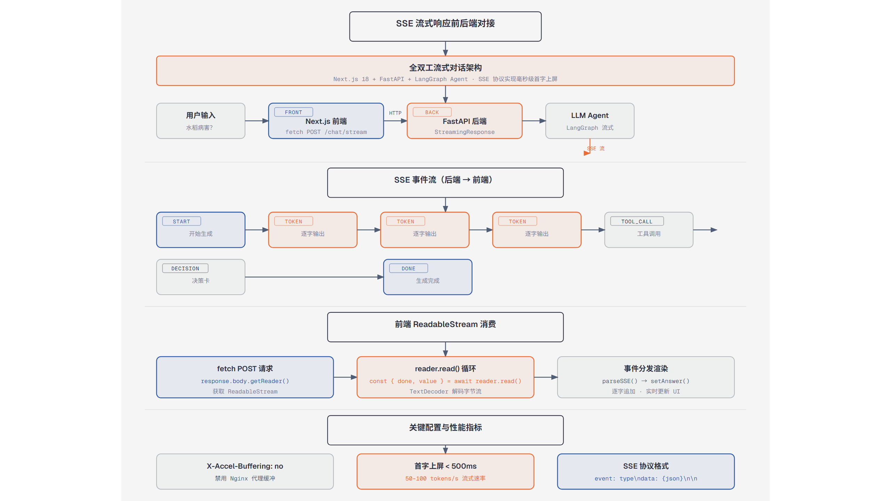

# 第16篇：SSE 流式响应与前端对接

> 技术点：SSE 协议、StreamingResponse、前端 ReadableStream、毫秒级首字上屏
> 场景项目：CropWise（Next.js 前端 + FastAPI 后端流式对话）

---

## 一、基础篇：概念与价值

### 1.1 SSE vs WebSocket

| 对比 | SSE | WebSocket |
|------|-----|-----------|
| 方向 | 单向（服务端→客户端） | 双向 |
| 协议 | HTTP | 独立协议 |
| 自动重连 | 原生支持 | 需手动实现 |
| 适用 | 服务端推送 | 实时通信 |

### 1.2 为什么大模型应用用 SSE？

大模型生成需要时间（几秒到几十秒），SSE 能让用户**看到逐字输出**，消除等待焦虑。

---

## 二、进阶篇：SSE 协议格式



*FastAPI SSE 端点→Next.js ReadableStream 消费的全链路*

### 2.1 标准格式

```
event: token\ndata: {"text": "水"}\n\n
event: token\ndata: {"text": "稻"}\n\n
event: token\ndata: {"text": "病"}\n\n
event: done\ndata: {}\n\n
```

### 2.2 后端关键配置

```python
# FastAPI StreamingResponse
@app.post("/chat/stream")
async def chat_stream(request: ChatRequest):
    async def generate():
        async for event in agri_agent.stream(request.message, request.session_id):
            yield f"event: {event['type']}\ndata: {json.dumps(event)}\n\n"

    return StreamingResponse(
        generate(),
        media_type="text/event-stream",
        headers={
            "Cache-Control": "no-cache",
            "Connection": "keep-alive",
            "X-Accel-Buffering": "no",  # 禁用 Nginx 缓冲
        })
```

---

## 三、项目篇：CropWise 流式对话实现

### 3.1 后端 SSE 事件类型

| 事件类型 | 作用 | 触发时机 |
|----------|------|----------|
| start | 开始生成 | Agent 进入生成 |
| token | 文本片段 | 每生成一个字 |
| tool_call | 工具调用 | 调用工具时 |
| decision_card | 决策卡 | 结构化输出 |
| done | 完成 | 生成结束 |

### 3.2 前端消费 SSE

```tsx
const response = await fetch('/api/chat/stream', {
    method: 'POST',
    body: JSON.stringify({ message, session_id }),
});

const reader = response.body!.getReader();
const decoder = new TextDecoder();

while (true) {
    const { done, value } = await reader.read();
    if (done) break;
    const text = decoder.decode(value);
    // 解析 SSE 事件
    for (const event of parseSSE(text)) {
        if (event.type === 'token') {
            setAnswer(prev => prev + event.data);
        } else if (event.type === 'tool_call') {
            setToolStatus(event.data);
        }
    }
}
```

### 3.3 性能指标

| 指标 | 值 |
|------|-----|
| 首字上屏 | < 500ms |
| 流式速率 | 50-100 tokens/s |
| 用户体验 | 无需等待全文生成 |

---

## 总结：全栈技术栈回顾

```
┌──────────────────────────────────────────────────────────────────┐
│                     《Java + AI 融合开发》16 篇教程               │
├──────────────────────────────────────────────────────────────────┤
│  上篇：Java 微服务（1-12）             下篇：AI 应用（13-16）      │
│  ┌─────────────────────┐            ┌─────────────────────────┐  │
│  │ 1. Spring Boot       │            │ 13. Hybrid RAG          │  │
│  │ 2. 微服务架构        │            │ 14. LangGraph Agent     │  │
│  │ 3. Nacos             │            │ 15. Neo4j 知识图谱      │  │
│  │ 4. Gateway           │            │ 16. SSE 流式响应        │  │
│  │ 5. OpenFeign         │            └─────────────────────────┘  │
│  │ 6. Sentinel          │                                         │
│  │ 7. Seata             │           项目配套：                     │
│  │ 8. RocketMQ          │           mall-micro-cloud（微云商城）   │
│  │ 9. Redis             │           CropWise（农业知识问答）       │
│  │ 10. MySQL            │                                         │
│  │ 11. Elasticsearch    │           官网：1byteone.github.io       │
│  │ 12. Docker           │                                         │
│  └─────────────────────┘                                         │
└──────────────────────────────────────────────────────────────────┘
```

---

> 全部 16 篇教程已输出到 `interview-note/projects/tutorials/` 目录下。