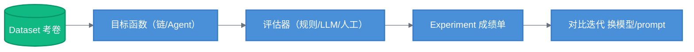

# Dataset 与 Experiment · 评测流程（核心概念）

> 目标：掌握 LangSmith 评测体系的"考卷-考生-判卷-成绩单"模型，跑通第一个评测实验。
> 这是 LangSmith 作为"评测平台"的核心价值，也是面试最高频考点。

---

## 一、评测体系四要素（必背比喻）

| 概念 | 比喻 | 说明 |
|------|------|------|
| **Dataset（数据集）** | 考卷 | 一组测试样本（输入 + 期望输出 + 标签） |
| **Target（目标函数）** | 考生 | 待测的链 / Agent / 模型，即你要评测的对象 |
| **Evaluator（评估器）** | 判卷老师 | 给每个样本输出打分（代码规则 / LLM 裁判 / 人工） |
| **Experiment（实验）** | 成绩单 | 目标函数在数据集上跑完 + 打分后的完整记录与对比矩阵 |

**评测的本质**：固定考卷（Dataset），换不同的考生（prompt 版本 / 模型 / 检索参数），看成绩单（Experiment）对比——**用数据代替感觉做决策**。



> 流程图：固定 Dataset，替换目标函数（模型 / prompt / 检索参数），经评估器打分产出 Experiment，横向对比决策。

---

## 二、Dataset 从哪来？（四种来源）

1. **手工创建**：UI 或 SDK 添加（输入 + 期望回答 + 元数据）
2. **从 Trace 沉淀**（推荐）：生产中的失败样本 / 用户负反馈，一键"Add to Dataset"——让评测集覆盖真实坏例
3. **批量导入**：从 JSON / CSV 批量上传
4. **SDK 创建**：

```python
from langsmith import Client

client = Client()
examples = [
    ("性价比高的拍照手机推荐", "推荐 3 款手机并说明理由"),
    ("这款手机支持 5G 吗", "查询商品参数确认是否支持 5G"),
    ("帮我退个货", "引导进入退货流程，不虚构政策"),
]
client.create_dataset(
    dataset_name="mall-qa-v1",
    description="商城问答评测集：覆盖推荐/参数/售后三类",
)
for question, answer in examples:
    client.create_example(
        inputs={"question": question},
        outputs={"expected": answer},
        dataset_id="<dataset_id>",
    )
```

> **工程建议**：起步 50-200 条，覆盖主要分支 + 边界 + 已知坏例；评测集本身要有版本，增删走 review。

---

## 三、评估器三态（Evaluator 类型）

### 1. 代码型评估器（确定性）

适合：格式、必含实体、长度、JSON 合法性、API 契约等**可验证规则**。

```python
from langsmith.schemas import Run, Example

def answer_contains_products(run: Run, example: Example | None = None) -> dict:
    answer = run.outputs.get("answer", "")
    # 业务规则：回答必须提到至少 1 个商品
    has_product = any(kw in answer for kw in ["手机", "耳机", "平板"])
    return {
        "key": "has_product",
        "score": 1 if has_product else 0,
        "comment": "回答未提及任何商品" if not has_product else "ok",
    }
```

### 2. LLM-as-Judge（语义型）

适合：相关性、忠实度、有用性、无害性等**无标准答案**的语义评价。详细校准见 `03-advanced/01-llm-as-judge.md`。

### 3. 人工评估（Annotation）

适合：复杂轨迹、价值观判断、代码对错——自动判分不可靠时，用标注队列人工审阅。

---

## 四、跑第一个评测实验（完整示例）

```python
from langsmith import evaluate
from langchain_openai import ChatOpenAI
from langchain_core.prompts import ChatPromptTemplate

prompt = ChatPromptTemplate.from_messages([
    ("system", "你是商城客服，基于商品资料回答。资料不足时说明，禁止编造。"),
    ("human", "{question}"),
])
llm = ChatOpenAI(model="gpt-4o-mini")
chain = prompt | llm

def predict(inputs: dict) -> dict:
    return {"answer": chain.invoke({"question": inputs["question"]}).content}

# 目标函数 + 数据集 + 评估器列表 → 批量评测
results = evaluate(
    predict,
    data="mall-qa-v1",                      # 数据集名
    evaluators=[
        answer_contains_products,           # 代码规则
        # llm_judge,                        # LLM 裁判（见进阶篇）
    ],
    experiment_prefix="gpt-4o-mini-v1",     # 实验名前缀
)

print(results)  # 平均分 / 逐样本明细
```

**运行后看 UI**：Experiments 页面出现一张"矩阵表"——每一行是一个样本，每一列是一个评估指标（Score 0-1），底部是平均值；同一数据集跑多个实验可并排对比，一眼看出**哪个模型 / 哪个 prompt 版本分数更高**。

---

## 五、评测实验的决策场景

| 场景 | 怎么用 Experiment |
|------|------------------|
| 换模型 | 同一 Dataset，换 ChatModel 各跑一次，对比分数 + 成本 |
| 改 prompt | 同一 Dataset，prompt v2 跑一次 vs baseline 跑一次 |
| 调检索参数 | 改 top-k / 混合检索权重，看忠实度分数变化 |
| 上线前回归 | 新版本在固定 Dataset 上跑，分数不得低于阈值（CI 门禁） |

**关键纪律**：改了一处（模型 / prompt / 参数），就跑一次对比实验——**没有 Experiment 支撑的改动都是拍脑袋**。

---

## 六、RAG 专用评估器（省钱省力）

LangSmith 为 RAG 预置了官方评估器族（`langsmith.evaluation`）：

| 评估器 | 评测维度 | 说明 |
|--------|---------|------|
| `rag_context_accuracy` | 检索质量 | 检索到的上下文是否相关 |
| `rag_answer_faithfulness` | 忠实度 | 回答是否忠于检索证据（防幻觉核心） |
| `rag_answer_relevance` | 相关性 | 回答是否与问题相关 |

```python
from langsmith.evaluation import evaluate as ls_evaluate
from langsmith.evaluation.evaluator import RagEvaluatorFactory
# 或用官方预置：
from langsmith.evaluation import LangChainStringEvaluator

faithfulness = LangChainStringEvaluator("rag_answer_faithfulness")  # 开箱即用
```

RAG 项目直接复用官方评估器，避免重复造轮子。

---

## 七、小结

- **四要素**：Dataset（考卷）/ Target（考生）/ Evaluator（判卷）/ Experiment（成绩单）
- **数据来源**：手工 / Trace 沉淀 / 批量导入——生产失败样本回流是核心闭环
- **评估器三态**：代码规则（确定性）+ LLM 裁判（语义）+ 人工（复杂轨迹）
- **决策纪律**：每次改动跑一次对比实验

**下一步**：[03-advanced/01-llm-as-judge.md](../03-advanced/01-llm-as-judge.md) —— LLM-as-Judge 原理与校准，以及自定义评估器进阶。