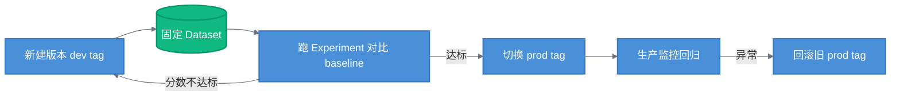

# Prompt Hub · 提示词版本管理（进阶技巧）

> 目标：理解"提示词也是需要工程化管理的资产"，掌握 Prompt Hub 的版本化、热更新与发布纪律。
> 面试高频：版本管理价值、热更新、如何与评测结合。

---

## 一、为什么需要提示词管理

没有管理的提示词（反面教材）：

- 散落在各人代码里的字符串，改一版就覆盖一版
- 生产环境出了 bug，不知道哪次的 prompt 导致
- 团队协作靠"把 prompt 贴到群里"

Prompt Hub 解决的正是这些问题：**提示词从"代码里的字符串"变成"团队共享、版本化、可评测的资产"**。

---

## 二、Prompt Hub 核心能力

| 能力 | 说明 |
|------|------|
| 版本化 | 每个修改产生新 commit，可回溯、可回滚 |
| 标签 | 打 tag（`prod` / `dev`），发布与回滚按 tag |
| 协作 | 团队共享、评论、评星、fork |
| 环境隔离 | 不同环境拉不同版本 |
| 绑定评测 | prompt 版本与 Experiment 分数关联，选型有数据 |
| Code 集成 | 本地用 SDK 拉取，支持运行时热更新 |

---

## 三、核心用法

### 保存与拉取

```python
from langchain import hub
from langchain_core.prompts import ChatPromptTemplate

# 保存 prompt 到 Hub
prompt = ChatPromptTemplate.from_messages([
    ("system", "你是商城客服，基于商品资料回答。资料不足说明，禁止编造。"),
    ("human", "{question}"),
])
hub.push("your-org/mall-qa-system", prompt, new_tags=["prod"])

# 运行时按 tag 拉取（生产热更新用）
prod_prompt = hub.pull("your-org/mall-qa-system:prod")
```

### 热更新（生产常用）

```python
# 服务启动时拉取 prod tag；发布新版本时只需更新 tag，无需重启服务
prompt = hub.pull("your-org/mall-qa-system:prod")
```

> **热更新的真相**：prompt 是"数据化配置"而非代码——改 prompt 不入代码库、不发版、不重启，秒级生效。配合监控验证线上效果。

---

## 四、发布纪律（面试加分项）

提示词变更必须走"评测前置"流程：



> 发布纪律：**先评测 → 再切 prod → 监控回归 → 秒回滚**。不是"改完直接上线"——prompt 是上线前最容易改、也最容易改出问题的地方。
> > 缩写说明：baseline=基准实验分数；tag=版本标签；Experiment=评测实验。

---

## 五、Prompt Hub vs 代码管理

| 维度 | 把 prompt 写死在代码里 | Prompt Hub |
|------|----------------------|------------|
| 变更流程 | 改代码 + 发版 | 改版本 + 切 tag（秒级） |
| 回滚 | git 回滚 + 发版 | 切旧 tag |
| 协作 | 代码 review | UI 评审 + 评论 + 评星 |
| 评测绑定 | 手动记录"用了哪版" | 版本与实验分数自动关联 |
| 热更新 | 不支持 | 支持（不重启） |

> 现实工程：**代码内保留默认 prompt 兜底 → 优先从 Hub 拉 tag**——两者结合，既满足离线可用，又享受在线热更新。
> 对应开源替代方案：Langfuse 的 prompt 管理 / 自建版本表。

---

## 六、小结

- **版本化 + 热更新 + 绑评测**是 Prompt Hub 的三大价值
- **发布纪律**：先评测 → 再切 prod → 监控回归 → 秒回滚
- **代码兜底 + Hub 拉取**是最稳的组合

**下一步**：[03-feedback-automation.md](03-feedback-automation.md) —— Feedback 反馈闭环与 Annotation Queue / Automation。