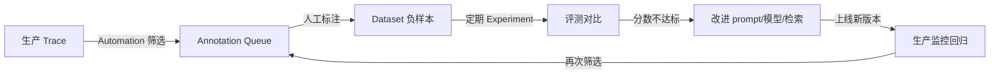

# Feedback 反馈闭环 · Annotation Queue · Automation（进阶技巧）

> 目标：掌握 LangSmith 的"生产数据飞轮"——Feedback（反馈）、Annotation Queue（标注队列）、Automation（自动化规则）三者如何配合，形成"生产 → 数据 → 评测 → 改进"的闭环。
> 面试高频：反馈闭环、数据回流、生产监控。

---

## 一、Feedback（反馈）——数据飞轮的燃料

Feedback 是挂在任何 Run / Trace / Thread 上的**结构化反馈数据**：

```python
from langsmith import Client

client = Client()

# 用户给回答点赞 / 点踩
client.create_feedback(
    run_id="<run_id>",          # 要打分的 run
    key="user_reaction",        # 指标名
    score=0,                    # 1 赞 / 0 踩（或 0-1 连续分）
    comment="答非所问",          # 可选的补充说明
)
```

多维反馈示例：

| key | score 含义 | 用途 |
|-----|-----------|------|
| `user_reaction` | 1 赞 / 0 踩 | 用户满意度 |
| `answer_quality` | 0-1 人工评分 | 标注评审 |
| `llm_judge_score` | 0-1 在线裁判分 | 自动质量监控 |
| `cost_anomaly` | 1 = 超预算 | 成本异常标记 |

**核心思想**：任何一条反馈（尤其负反馈）都是"接下来要改进什么"的证据——它是评测数据最宝贵的来源。

---

## 二、Annotation Queue（标注队列）——人工评审工作流

把特定 trace 筛选出来，分派给专业人员打标、纠错、分类：

```
生产 trace
  → Automation 规则筛选（负反馈 / 低分 / 异常）
  → 送入 Annotation Queue
  → 专家在队列中审阅、打分、打标签
  → 标注结果沉淀为 Dataset 用例
  → 定期跑 Experiment 评测
  → 驱动 prompt / 模型 / 检索改进
```

> Annotation Queue 解决的问题：自动评测不可靠时（复杂轨迹、价值观、代码对错），人工"聚焦式"复核——只标异常样本，不标全部，控制人力成本。

---

## 三、Automation（自动化规则）——事件驱动的哨兵

Automation = **条件 + 动作** 的规则引擎，监听生产 trace 自动触发：

| 触发器（条件） | 动作（Actions） |
|---------------|----------------|
| 负反馈 / 低分（score < 阈值） | 加入 Annotation Queue（人工复核） |
| 错误率 / p95 延迟超限 | 触发 Webhook（通知 Slack / 钉钉 / 自建系统） |
| 特定关键词 / 敏感词出现 | 创建 Dataset 条目（沉淀评测数据） |
| 某 prompt 版本 / 模型表现漂移 | 打 Trace 标签 + 告警 |
| 成本异常（单 run 超预算） | 通知团队 |

**价值一句话**：把"失败"自动变成"待评审项 + 评测集素材 + 即时告警"三样东西——**可观测从"人盯"进化到"系统自动发现"**。

---

## 四、完整闭环（生产 → 改进）



> 1. 生产跑出负反馈 → Automation 自动入队
> 2. 人工确认坏例 → 沉淀进评测集
> 3. 评测集驱动改进 → 上线 → 监控回归
> 4. 循环往复——**评测集是"活"的，不是一次性考卷**

---

## 五、生产监控的三层指标（配合使用）

| 层 | 指标 | 发现问题 |
|----|------|---------|
| 质量 | 在线评估分数、用户反馈、错误样本率 | 回答变差（隐性回归） |
| 健康 | 错误率、p95/p99 延迟、工具失败率 | 服务慢 / 挂（显性问题） |
| 成本 | 每 run 价格、token 趋势、单用户成本 | 费用失控 / 滥用 |

**定位方法**：监控指标告警 → 打开 trace 瀑布视图 → 定位是模型慢 / 检索慢 / 工具失败 → 修复 → 样本入评测集回归。

---

## 六、防告警疲劳与成本控制

- **分级阈值**：P0（错误率 > 5%）告警，P2（延迟 p95 微升）只看板不打扰
- **冷却窗口**：同一规则在 N 分钟内最多触发一次
- **聚合去重**：同类错误聚合为一条告警
- **成本预算**：在线评估抽样 + 便宜裁判模型，避免评测成本反超收益

---

## 七、小结

- **Feedback**：给 run 挂分数 / 评论，负反馈是最宝贵的评测素材
- **Annotation Queue**：人工聚焦式评审异常样本，沉淀入集
- **Automation**：条件 + 动作的规则引擎，自动把失败变成告警 + 数据
- **飞轮闭环**：生产 → 标注 → 评测集 → 改进 → 监控 → 再标注

**下一步**：[04-project/01-mall-ai-evaluation.md](../04-project/01-mall-ai-evaluation.md) —— 把整套体系落到商城 RAG 项目。