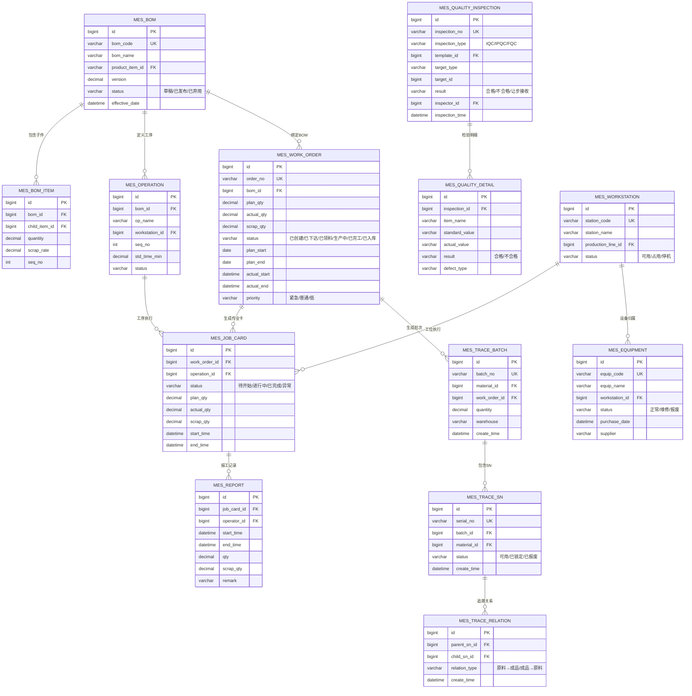

# MES 数据库设计 — ER 图与核心表结构

> 本篇给出 MES 核心实体的 ER 图和表结构设计，可直接用于项目落地。
> 配套 Mermaid 源文件：[`_assets/diagrams/mes/mes-er.mmd`](../../../_assets/diagrams/mes/mes-er.mmd)

---

## 一、MES 核心 ER 图



---

## 二、核心表结构（MySQL DDL）

### 2.1 主数据表

```sql
-- 物料主数据
CREATE TABLE mes_material (
    id BIGINT AUTO_INCREMENT PRIMARY KEY,
    material_code VARCHAR(32) NOT NULL COMMENT '物料编码',
    material_name VARCHAR(128) NOT NULL COMMENT '物料名称',
    material_type ENUM('RAW','SEMI','FINISHED','PACKAGING') NOT NULL COMMENT '物料类型：原料/半成品/成品/包材',
    unit VARCHAR(16) NOT NULL COMMENT '单位',
    specifications VARCHAR(256) COMMENT '规格型号',
    is_batch_tracked TINYINT(1) DEFAULT 0 COMMENT '是否批次管理',
    is_sn_tracked TINYINT(1) DEFAULT 0 COMMENT '是否SN管理',
    default_warehouse_id BIGINT COMMENT '默认仓库',
    status ENUM('ACTIVE','INACTIVE') DEFAULT 'ACTIVE',
    create_time DATETIME DEFAULT CURRENT_TIMESTAMP,
    update_time DATETIME DEFAULT CURRENT_TIMESTAMP ON UPDATE CURRENT_TIMESTAMP,
    UNIQUE KEY uk_material_code (material_code)
) COMMENT '物料主数据表';

-- BOM 表
CREATE TABLE mes_bom (
    id BIGINT AUTO_INCREMENT PRIMARY KEY,
    bom_code VARCHAR(32) NOT NULL COMMENT 'BOM 编码',
    bom_name VARCHAR(128) NOT NULL COMMENT 'BOM 名称',
    product_item_id BIGINT NOT NULL COMMENT '成品物料ID',
    version DECIMAL(10,2) DEFAULT 1.00 COMMENT '版本号',
    status ENUM('DRAFT','PUBLISHED','DEPRECATED') DEFAULT 'DRAFT',
    effective_date DATE COMMENT '生效日期',
    expire_date DATE COMMENT '失效日期',
    create_by BIGINT,
    create_time DATETIME DEFAULT CURRENT_TIMESTAMP,
    update_time DATETIME DEFAULT CURRENT_TIMESTAMP ON UPDATE CURRENT_TIMESTAMP,
    UNIQUE KEY uk_bom_code (bom_code)
) COMMENT 'BOM 物料清单表';

-- BOM 子件表
CREATE TABLE mes_bom_item (
    id BIGINT AUTO_INCREMENT PRIMARY KEY,
    bom_id BIGINT NOT NULL COMMENT 'BOM ID',
    child_item_id BIGINT NOT NULL COMMENT '子件物料ID',
    quantity DECIMAL(10,4) NOT NULL COMMENT '用量',
    scrap_rate DECIMAL(5,4) DEFAULT 0 COMMENT '损耗率',
    seq_no INT DEFAULT 0 COMMENT '顺序号',
    remark VARCHAR(256) COMMENT '备注',
    KEY idx_bom_id (bom_id)
) COMMENT 'BOM 子件明细表';

-- 工序定义表
CREATE TABLE mes_operation (
    id BIGINT AUTO_INCREMENT PRIMARY KEY,
    bom_id BIGINT NOT NULL COMMENT 'BOM ID',
    op_code VARCHAR(32) NOT NULL COMMENT '工序编码',
    op_name VARCHAR(64) NOT NULL COMMENT '工序名称',
    workstation_id BIGINT COMMENT '默认工位ID',
    seq_no INT NOT NULL COMMENT '工序顺序',
    std_time_min DECIMAL(10,2) COMMENT '标准工时(分钟)',
    setup_time_min DECIMAL(10,2) COMMENT '换型时间(分钟)',
    status ENUM('ACTIVE','INACTIVE') DEFAULT 'ACTIVE',
    KEY idx_bom_id (bom_id)
) COMMENT '工序定义表';
```

### 2.2 生产执行表

```sql
-- 生产工单表
CREATE TABLE mes_work_order (
    id BIGINT AUTO_INCREMENT PRIMARY KEY,
    order_no VARCHAR(32) NOT NULL COMMENT '工单号',
    erp_order_no VARCHAR(32) COMMENT 'ERP 生产订单号',
    bom_id BIGINT NOT NULL COMMENT 'BOM ID',
    plan_qty DECIMAL(10,2) NOT NULL COMMENT '计划数量',
    actual_qty DECIMAL(10,2) DEFAULT 0 COMMENT '实际产出',
    scrap_qty DECIMAL(10,2) DEFAULT 0 COMMENT '不良数量',
    status ENUM('CREATED','RELEASED','ISSUED','IN_PROGRESS','COMPLETED','STORED','CLOSED') DEFAULT 'CREATED',
    priority ENUM('URGENT','NORMAL','LOW') DEFAULT 'NORMAL',
    plan_start DATE COMMENT '计划开始日期',
    plan_end DATE COMMENT '计划结束日期',
    actual_start DATETIME COMMENT '实际开始时间',
    actual_end DATETIME COMMENT '实际结束时间',
    source_warehouse_id BIGINT COMMENT '原料仓库',
    wip_warehouse_id BIGINT COMMENT 'WIP 仓库',
    target_warehouse_id BIGINT COMMENT '成品仓库',
    create_by BIGINT,
    create_time DATETIME DEFAULT CURRENT_TIMESTAMP,
    update_time DATETIME DEFAULT CURRENT_TIMESTAMP ON UPDATE CURRENT_TIMESTAMP,
    UNIQUE KEY uk_order_no (order_no),
    KEY idx_status (status),
    KEY idx_plan_start (plan_start)
) COMMENT '生产工单表';

-- 作业卡表（工序级执行）
CREATE TABLE mes_job_card (
    id BIGINT AUTO_INCREMENT PRIMARY KEY,
    card_no VARCHAR(32) NOT NULL COMMENT '作业卡号',
    work_order_id BIGINT NOT NULL COMMENT '工单ID',
    operation_id BIGINT NOT NULL COMMENT '工序ID',
    workstation_id BIGINT COMMENT '实际工位ID',
    status ENUM('PENDING','IN_PROGRESS','COMPLETED','ABNORMAL') DEFAULT 'PENDING',
    plan_qty DECIMAL(10,2) COMMENT '计划数量',
    actual_qty DECIMAL(10,2) DEFAULT 0 COMMENT '实际完成',
    scrap_qty DECIMAL(10,2) DEFAULT 0 COMMENT '不良数量',
    start_time DATETIME COMMENT '开始时间',
    end_time DATETIME COMMENT '结束时间',
    create_time DATETIME DEFAULT CURRENT_TIMESTAMP,
    update_time DATETIME DEFAULT CURRENT_TIMESTAMP ON UPDATE CURRENT_TIMESTAMP,
    UNIQUE KEY uk_card_no (card_no),
    KEY idx_work_order_id (work_order_id)
) COMMENT '作业卡表';

-- 报工记录表
CREATE TABLE mes_report (
    id BIGINT AUTO_INCREMENT PRIMARY KEY,
    report_no VARCHAR(32) NOT NULL COMMENT '报工单号',
    job_card_id BIGINT NOT NULL COMMENT '作业卡ID',
    operator_id BIGINT NOT NULL COMMENT '操作员ID',
    start_time DATETIME NOT NULL COMMENT '开始时间',
    end_time DATETIME COMMENT '结束时间',
    qty DECIMAL(10,2) NOT NULL COMMENT '完成数量',
    scrap_qty DECIMAL(10,2) DEFAULT 0 COMMENT '不良数量',
    defect_code VARCHAR(32) COMMENT '不良代码',
    remark VARCHAR(256) COMMENT '备注',
    create_time DATETIME DEFAULT CURRENT_TIMESTAMP,
    UNIQUE KEY uk_report_no (report_no),
    KEY idx_job_card_id (job_card_id)
) COMMENT '报工记录表';
```

### 2.3 质量与追溯表

```sql
-- 质检模板表
CREATE TABLE mes_quality_template (
    id BIGINT AUTO_INCREMENT PRIMARY KEY,
    template_name VARCHAR(64) NOT NULL COMMENT '模板名称',
    inspection_type ENUM('IQC','IPQC','FQC') NOT NULL COMMENT '检验类型',
    items JSON COMMENT '检验项JSON: [{"name":"尺寸","standard":"10.0","upper":"10.1","lower":"9.9","method":"卡尺"}]',
    status ENUM('ACTIVE','INACTIVE') DEFAULT 'ACTIVE',
    create_time DATETIME DEFAULT CURRENT_TIMESTAMP
) COMMENT '质检模板表';

-- 质检单表
CREATE TABLE mes_quality_inspection (
    id BIGINT AUTO_INCREMENT PRIMARY KEY,
    inspection_no VARCHAR(32) NOT NULL COMMENT '质检单号',
    inspection_type ENUM('IQC','IPQC','FQC') NOT NULL COMMENT '检验类型',
    template_id BIGINT COMMENT '质检模板ID',
    target_type VARCHAR(32) COMMENT '检验对象类型：MATERIAL/WORK_ORDER/JOB_CARD',
    target_id BIGINT COMMENT '检验对象ID',
    batch_id BIGINT COMMENT '批次ID',
    result ENUM('PASS','FAIL','CONCESSION') COMMENT '检验结果',
    inspector_id BIGINT COMMENT '检验员ID',
    inspection_time DATETIME COMMENT '检验时间',
    remark VARCHAR(256),
    create_time DATETIME DEFAULT CURRENT_TIMESTAMP,
    UNIQUE KEY uk_inspection_no (inspection_no),
    KEY idx_target (target_type, target_id)
) COMMENT '质检单表';

-- 批次追溯表
CREATE TABLE mes_trace_batch (
    id BIGINT AUTO_INCREMENT PRIMARY KEY,
    batch_no VARCHAR(32) NOT NULL COMMENT '批次号',
    material_id BIGINT NOT NULL COMMENT '物料ID',
    work_order_id BIGINT COMMENT '关联工单ID',
    quantity DECIMAL(10,2) COMMENT '数量',
    warehouse_id BIGINT COMMENT '仓库ID',
    supplier_batch_no VARCHAR(64) COMMENT '供应商批次号',
    produce_date DATE COMMENT '生产日期',
    expire_date DATE COMMENT '过期日期',
    status ENUM('ACTIVE','LOCKED','SCRAPPED') DEFAULT 'ACTIVE',
    create_time DATETIME DEFAULT CURRENT_TIMESTAMP,
    UNIQUE KEY uk_batch_no (batch_no)
) COMMENT '批次追溯表';

-- SN 追溯表
CREATE TABLE mes_trace_sn (
    id BIGINT AUTO_INCREMENT PRIMARY KEY,
    serial_no VARCHAR(64) NOT NULL COMMENT '序列号',
    batch_id BIGINT COMMENT '批次ID',
    material_id BIGINT NOT NULL COMMENT '物料ID',
    work_order_id BIGINT COMMENT '关联工单ID',
    status ENUM('AVAILABLE','LOCKED','SCRAPPED') DEFAULT 'AVAILABLE',
    create_time DATETIME DEFAULT CURRENT_TIMESTAMP,
    UNIQUE KEY uk_serial_no (serial_no)
) COMMENT 'SN 追溯表';

-- 追溯关系表（正向/反向追溯）
CREATE TABLE mes_trace_relation (
    id BIGINT AUTO_INCREMENT PRIMARY KEY,
    parent_sn_id BIGINT NOT NULL COMMENT '父级SN（成品）',
    child_sn_id BIGINT NOT NULL COMMENT '子级SN（原料）',
    relation_type ENUM('FORWARD','BACKWARD') NOT NULL COMMENT '正向/反向',
    work_order_id BIGINT COMMENT '关联工单',
    create_time DATETIME DEFAULT CURRENT_TIMESTAMP,
    KEY idx_parent (parent_sn_id),
    KEY idx_child (child_sn_id)
) COMMENT '追溯关系表';
```

---

## 三、索引设计要点

| 表 | 索引 | 理由 |
|----|------|------|
| `mes_work_order` | `idx_status`, `idx_plan_start` | 按状态和日期筛选工单 |
| `mes_job_card` | `idx_work_order_id` | 工单下查所有作业卡 |
| `mes_report` | `idx_job_card_id` | 作业卡下查所有报工 |
| `mes_quality_inspection` | `idx_target(type,id)` | 按检验对象查质检单 |
| `mes_trace_batch` | `uk_batch_no` | 批次号唯一查询 |
| `mes_trace_sn` | `uk_serial_no` | SN 唯一查询 |
| `mes_trace_relation` | `idx_parent`, `idx_child` | 正向/反向追溯查询 |

---

## 四、设计要点总结

1. **工单号/质检单号/批次号**：业务编码唯一索引，支持按编码快速查询
2. **状态字段**：所有核心实体都有状态字段，配合索引支持状态筛选
3. **JSON 字段**：质检模板的检验项用 JSON 存储，灵活扩展
4. **追溯关系**：正向/反向通过 `mes_trace_relation` 表关联，支持递归查询
5. **软删除**：建议所有表增加 `is_deleted` 字段，避免物理删除

---

## 📖 导航

| ← 上一篇 | 📚 目录 | 下一篇 → |
|----------|---------|----------|
| [← 架构设计](./02-architecture.md) | [📚 19-MES](../../README.md) | [生产追溯引擎 →](../03-advanced/01-engine-pattern.md) |
