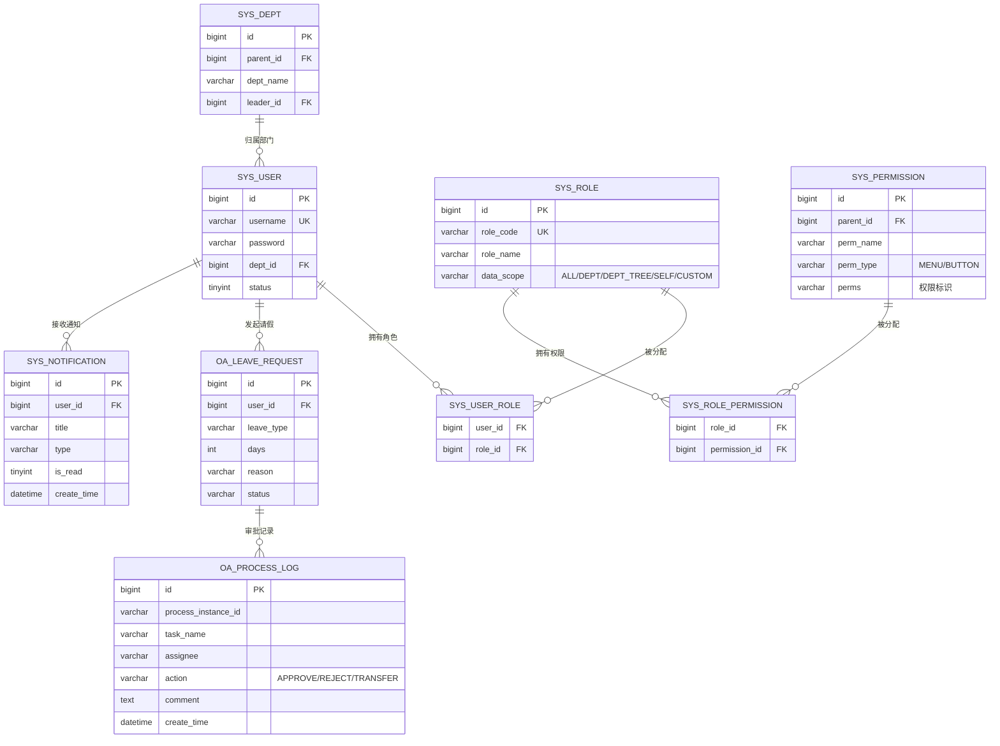

# OA 数据库设计 — ER 图与核心表结构

> 本篇给出 OA 核心实体的 ER 图和表结构设计。

---

## 一、OA 核心 ER 图



---

## 二、核心表结构（MySQL DDL）

### 2.1 系统管理表

```sql
-- 用户表
CREATE TABLE sys_user (
    id BIGINT AUTO_INCREMENT PRIMARY KEY,
    username VARCHAR(32) NOT NULL COMMENT '用户名',
    password VARCHAR(128) NOT NULL COMMENT '密码（BCrypt）',
    nickname VARCHAR(64) COMMENT '昵称',
    email VARCHAR(128) COMMENT '邮箱',
    phone VARCHAR(20) COMMENT '手机号',
    dept_id BIGINT COMMENT '所属部门',
    avatar VARCHAR(256) COMMENT '头像',
    status TINYINT DEFAULT 1 COMMENT '状态：0禁用 1启用',
    create_time DATETIME DEFAULT CURRENT_TIMESTAMP,
    update_time DATETIME DEFAULT CURRENT_TIMESTAMP ON UPDATE CURRENT_TIMESTAMP,
    UNIQUE KEY uk_username (username)
) COMMENT '用户表';

-- 角色表
CREATE TABLE sys_role (
    id BIGINT AUTO_INCREMENT PRIMARY KEY,
    role_code VARCHAR(32) NOT NULL COMMENT '角色编码',
    role_name VARCHAR(64) NOT NULL COMMENT '角色名称',
    data_scope VARCHAR(16) DEFAULT 'SELF' COMMENT '数据范围',
    sort_order INT DEFAULT 0,
    status TINYINT DEFAULT 1,
    create_time DATETIME DEFAULT CURRENT_TIMESTAMP,
    UNIQUE KEY uk_role_code (role_code)
) COMMENT '角色表';

-- 权限表
CREATE TABLE sys_permission (
    id BIGINT AUTO_INCREMENT PRIMARY KEY,
    parent_id BIGINT DEFAULT 0 COMMENT '父权限ID',
    perm_name VARCHAR(64) NOT NULL COMMENT '权限名称',
    perm_type VARCHAR(16) NOT NULL COMMENT '类型：MENU/BUTTON',
    perms VARCHAR(128) COMMENT '权限标识如 system:user:list',
    path VARCHAR(256) COMMENT '前端路由',
    icon VARCHAR(64) COMMENT '菜单图标',
    sort_order INT DEFAULT 0,
    visible TINYINT DEFAULT 1 COMMENT '是否可见',
    status TINYINT DEFAULT 1
) COMMENT '权限表';

-- 用户-角色关联表
CREATE TABLE sys_user_role (
    user_id BIGINT NOT NULL,
    role_id BIGINT NOT NULL,
    PRIMARY KEY (user_id, role_id)
) COMMENT '用户角色关联表';

-- 角色-权限关联表
CREATE TABLE sys_role_permission (
    role_id BIGINT NOT NULL,
    permission_id BIGINT NOT NULL,
    PRIMARY KEY (role_id, permission_id)
) COMMENT '角色权限关联表';

-- 部门表
CREATE TABLE sys_dept (
    id BIGINT AUTO_INCREMENT PRIMARY KEY,
    parent_id BIGINT DEFAULT 0 COMMENT '父部门ID',
    dept_name VARCHAR(64) NOT NULL COMMENT '部门名称',
    leader_id BIGINT COMMENT '部门负责人',
    sort_order INT DEFAULT 0,
    status TINYINT DEFAULT 1,
    create_time DATETIME DEFAULT CURRENT_TIMESTAMP
) COMMENT '部门表';
```

### 2.2 审批流程表

```sql
-- 请假申请表（业务表单）
CREATE TABLE oa_leave_request (
    id BIGINT AUTO_INCREMENT PRIMARY KEY,
    user_id BIGINT NOT NULL COMMENT '申请人ID',
    leave_type VARCHAR(32) NOT NULL COMMENT '请假类型：年假/事假/病假/婚假',
    start_date DATE NOT NULL COMMENT '开始日期',
    end_date DATE NOT NULL COMMENT '结束日期',
    days DECIMAL(4,1) NOT NULL COMMENT '请假天数',
    reason VARCHAR(512) COMMENT '请假原因',
    status VARCHAR(32) DEFAULT 'PENDING' COMMENT 'PENDING/APPROVED/REJECTED/WITHDRAWN',
    process_instance_id VARCHAR(64) COMMENT 'Flowable 流程实例ID',
    create_time DATETIME DEFAULT CURRENT_TIMESTAMP,
    update_time DATETIME DEFAULT CURRENT_TIMESTAMP ON UPDATE CURRENT_TIMESTAMP,
    KEY idx_user_id (user_id),
    KEY idx_status (status)
) COMMENT '请假申请表';

-- 审批日志表
CREATE TABLE oa_process_log (
    id BIGINT AUTO_INCREMENT PRIMARY KEY,
    process_instance_id VARCHAR(64) NOT NULL COMMENT '流程实例ID',
    task_id VARCHAR(64) COMMENT '任务ID',
    task_name VARCHAR(64) COMMENT '任务名称',
    assignee VARCHAR(64) COMMENT '审批人',
    action VARCHAR(16) NOT NULL COMMENT 'APPROVE/REJECT/TRANSFER/ADD_SIGN',
    comment TEXT COMMENT '审批意见',
    create_time DATETIME DEFAULT CURRENT_TIMESTAMP,
    KEY idx_process_instance (process_instance_id)
) COMMENT '审批日志表';
```

### 2.3 消息与文档表

```sql
-- 消息通知表
CREATE TABLE sys_notification (
    id BIGINT AUTO_INCREMENT PRIMARY KEY,
    user_id BIGINT NOT NULL COMMENT '接收人',
    title VARCHAR(128) NOT NULL COMMENT '标题',
    content TEXT COMMENT '内容',
    type VARCHAR(32) COMMENT 'APPROVAL/RESULT/CC/SYSTEM',
    biz_type VARCHAR(32) COMMENT '业务类型',
    biz_id BIGINT COMMENT '业务ID',
    is_read TINYINT DEFAULT 0 COMMENT '是否已读',
    create_time DATETIME DEFAULT CURRENT_TIMESTAMP,
    KEY idx_user_read (user_id, is_read)
) COMMENT '消息通知表';

-- 文件表
CREATE TABLE sys_file (
    id BIGINT AUTO_INCREMENT PRIMARY KEY,
    original_name VARCHAR(256) NOT NULL COMMENT '原始文件名',
    storage_path VARCHAR(512) NOT NULL COMMENT '存储路径',
    file_size BIGINT COMMENT '文件大小(字节)',
    file_type VARCHAR(32) COMMENT '文件类型',
    biz_type VARCHAR(32) COMMENT '业务类型',
    biz_id BIGINT COMMENT '业务ID',
    upload_by BIGINT COMMENT '上传人',
    create_time DATETIME DEFAULT CURRENT_TIMESTAMP
) COMMENT '文件表';
```

---

## 三、索引设计要点

| 表 | 索引 | 理由 |
|----|------|------|
| `sys_user` | `uk_username` | 登录查询 |
| `sys_role` | `uk_role_code` | 角色编码查询 |
| `oa_leave_request` | `idx_user_id`, `idx_status` | 按用户/状态筛选 |
| `oa_process_log` | `idx_process_instance` | 按流程实例查审批日志 |
| `sys_notification` | `idx_user_read` | 按用户+已读状态查询 |

---

## 📖 导航

| ← 上一篇 | 📚 目录 | 下一篇 → |
|----------|---------|----------|
| [← 架构设计](./02-architecture.md) | [📚 20-OA](../../README.md) | [Flowable 深入 →](../03-advanced/01-flowable-deep.md) |
