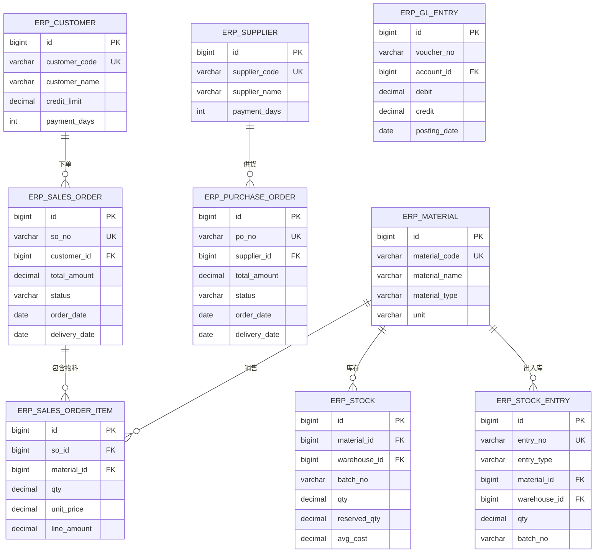

# ERP 数据库设计 — ER 图与核心表结构

---

## 一、ERP 核心 ER 图



---

## 二、核心表结构

```sql
-- 客户表
CREATE TABLE erp_customer (
    id BIGINT AUTO_INCREMENT PRIMARY KEY,
    customer_code VARCHAR(32) NOT NULL UNIQUE,
    customer_name VARCHAR(128) NOT NULL,
    contact_person VARCHAR(64),
    phone VARCHAR(20),
    email VARCHAR(128),
    address VARCHAR(256),
    credit_limit DECIMAL(12,2) DEFAULT 0 COMMENT '信用额度',
    payment_days INT DEFAULT 30 COMMENT '账期天数',
    status ENUM('ACTIVE','INACTIVE') DEFAULT 'ACTIVE',
    create_time DATETIME DEFAULT CURRENT_TIMESTAMP
);

-- 销售订单
CREATE TABLE erp_sales_order (
    id BIGINT AUTO_INCREMENT PRIMARY KEY,
    so_no VARCHAR(32) NOT NULL UNIQUE,
    customer_id BIGINT NOT NULL,
    total_amount DECIMAL(12,2) DEFAULT 0,
    status ENUM('DRAFT','CONFIRMED','SHIPPED','COMPLETED','CANCELLED') DEFAULT 'DRAFT',
    order_date DATE,
    delivery_date DATE,
    remark VARCHAR(512),
    create_by BIGINT,
    create_time DATETIME DEFAULT CURRENT_TIMESTAMP,
    update_time DATETIME DEFAULT CURRENT_TIMESTAMP ON UPDATE CURRENT_TIMESTAMP,
    KEY idx_customer (customer_id),
    KEY idx_status (status)
);

-- 销售订单明细
CREATE TABLE erp_sales_order_item (
    id BIGINT AUTO_INCREMENT PRIMARY KEY,
    so_id BIGINT NOT NULL,
    material_id BIGINT NOT NULL,
    qty DECIMAL(10,2) NOT NULL,
    unit_price DECIMAL(10,4) NOT NULL,
    line_amount DECIMAL(12,2) GENERATED ALWAYS AS (qty * unit_price) STORED,
    delivered_qty DECIMAL(10,2) DEFAULT 0 COMMENT '已发货数量',
    KEY idx_so_id (so_id)
);

-- 供应商表
CREATE TABLE erp_supplier (
    id BIGINT AUTO_INCREMENT PRIMARY KEY,
    supplier_code VARCHAR(32) NOT NULL UNIQUE,
    supplier_name VARCHAR(128) NOT NULL,
    contact_person VARCHAR(64),
    phone VARCHAR(20),
    email VARCHAR(128),
    payment_days INT DEFAULT 30,
    status ENUM('ACTIVE','INACTIVE') DEFAULT 'ACTIVE',
    create_time DATETIME DEFAULT CURRENT_TIMESTAMP
);

-- 采购订单
CREATE TABLE erp_purchase_order (
    id BIGINT AUTO_INCREMENT PRIMARY KEY,
    po_no VARCHAR(32) NOT NULL UNIQUE,
    supplier_id BIGINT NOT NULL,
    total_amount DECIMAL(12,2) DEFAULT 0,
    status ENUM('DRAFT','CONFIRMED','RECEIVED','COMPLETED','CANCELLED') DEFAULT 'DRAFT',
    order_date DATE,
    delivery_date DATE,
    create_by BIGINT,
    create_time DATETIME DEFAULT CURRENT_TIMESTAMP,
    KEY idx_supplier (supplier_id),
    KEY idx_status (status)
);

-- 物料主数据
CREATE TABLE erp_material (
    id BIGINT AUTO_INCREMENT PRIMARY KEY,
    material_code VARCHAR(32) NOT NULL UNIQUE,
    material_name VARCHAR(128) NOT NULL,
    material_type ENUM('RAW','SEMI','FINISHED') NOT NULL,
    unit VARCHAR(16) NOT NULL,
    is_batch_tracked TINYINT(1) DEFAULT 0,
    is_sn_tracked TINYINT(1) DEFAULT 0,
    safety_stock DECIMAL(10,2) DEFAULT 0 COMMENT '安全库存',
    status ENUM('ACTIVE','INACTIVE') DEFAULT 'ACTIVE',
    create_time DATETIME DEFAULT CURRENT_TIMESTAMP
);

-- 库存表
CREATE TABLE erp_stock (
    id BIGINT AUTO_INCREMENT PRIMARY KEY,
    material_id BIGINT NOT NULL,
    warehouse_id BIGINT NOT NULL,
    batch_no VARCHAR(32),
    qty DECIMAL(10,2) DEFAULT 0,
    reserved_qty DECIMAL(10,2) DEFAULT 0,
    avg_cost DECIMAL(10,4) DEFAULT 0,
    UNIQUE KEY uk_material_warehouse_batch (material_id, warehouse_id, batch_no),
    KEY idx_material (material_id)
);

-- 出入库记录
CREATE TABLE erp_stock_entry (
    id BIGINT AUTO_INCREMENT PRIMARY KEY,
    entry_no VARCHAR(32) NOT NULL UNIQUE,
    entry_type VARCHAR(32) NOT NULL,
    material_id BIGINT NOT NULL,
    warehouse_id BIGINT NOT NULL,
    qty DECIMAL(10,2) NOT NULL,
    batch_no VARCHAR(32),
    unit_cost DECIMAL(10,4),
    total_cost DECIMAL(12,2),
    biz_type VARCHAR(32),
    biz_id BIGINT,
    create_time DATETIME DEFAULT CURRENT_TIMESTAMP,
    KEY idx_material (material_id),
    KEY idx_entry_type (entry_type)
);

-- 总账凭证
CREATE TABLE erp_gl_entry (
    id BIGINT AUTO_INCREMENT PRIMARY KEY,
    voucher_no VARCHAR(32) NOT NULL,
    account_id BIGINT NOT NULL COMMENT '科目ID',
    debit DECIMAL(12,2) DEFAULT 0,
    credit DECIMAL(12,2) DEFAULT 0,
    posting_date DATE NOT NULL,
    biz_type VARCHAR(32),
    biz_id BIGINT,
    create_time DATETIME DEFAULT CURRENT_TIMESTAMP,
    KEY idx_voucher (voucher_no),
    KEY idx_account_date (account_id, posting_date)
);
```

---

## 📖 导航

| ← 上一篇 | 📚 目录 | 下一篇 → |
|----------|---------|----------|
| [← 架构设计](./02-architecture.md) | [📚 21-ERP](../../README.md) | [MRP 引擎 →](../03-advanced/01-mrp-engine.md) |
