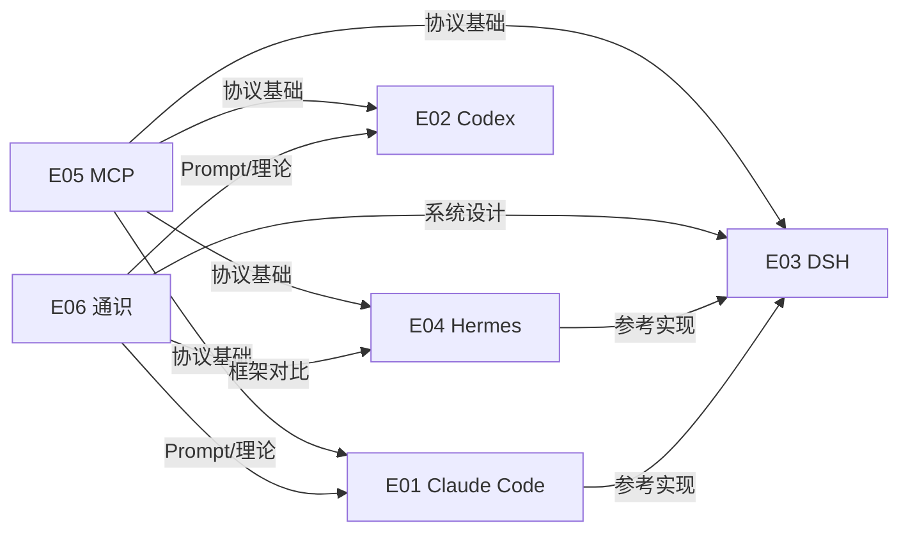

# 🌐 AI Agent 生态全景图（Mermaid）

> 6 大技术栈生态 · 27 个仓库 · 交叉引用关系  
> 生成日期: 2026-08-22

---

## 1. 生态总览

```mermaid
graph TB
    subgraph E01[E01 · Claude Code 生态]
        direction TB
        A1[claude-code-ultimate-guide<br/>⭐5.8k 深度教学]
        A2[claude-code-guide<br/>⭐4.6k 功能手册]
        A3[claudecode-guide<br/>⭐34 入门]
    end

    subgraph E02[E02 · Codex 生态]
        direction TB
        B1[CodexGuide<br/>⭐3.2k 实践指南]
    end

    subgraph E03[E03 · DSH/Harness 生态]
        direction TB
        C1[harness_engineering_guide<br/>⭐116 理论专著]
        C2[deepeseek-harness-guide<br/>⭐13 DSH框架]
        C3[awesome-harness-engineering<br/>⭐3.9k 资源索引]
        C4[dsh-kun-like-pet<br/>⭐81 DSH桌面宠物]
    end

    subgraph E04[E04 · Hermes/OpenClaw 生态]
        direction TB
        D1[hermes-agent-guide<br/>⭐650 30万字指南]
        D2[openclaw-security-practice-guide<br/>⭐2.9k 零信任安全]
        D3[awesome-hermes-agent<br/>⭐5.4k 资源索引]
        D4[openclaw-guide (yupi)<br/>⭐186 中文文档]
        D5[github-claw (yupi)<br/>⭐68 GitHub Agent]
    end

    subgraph E05[E05 · MCP 协议生态]
        direction TB
        E[MCP-Chinese-Getting-Started-Guide<br/>⭐3.6k 入门实战]
    end

    subgraph E06[E06 · 通识与基础]
        direction TB
        F1[Prompt-Engineering-Guide<br/>⭐77.7k 提示工程圣经]
        F2[AgentGuide<br/>⭐8.6k 求职体系]
        F3[ai-system-design-guide<br/>⭐2.7k 系统设计]
        F4[ai-agent-interview-guide<br/>⭐2.1k 面试题库]
        F5[ai-agents-from-zero<br/>⭐4.0k 速成指南]
        F6[python-guide<br/>⭐29.8k Python工程]
        F7[ai-guide (yupi)<br/>⭐19.0k AI资源大全]
        F8[awesome-agent-skills x2<br/>⭐11k Skills合集]
        F9[ai-code-helper (yupi)<br/>⭐733 Spring AI实战]
    end

    E06 --- E01
    E06 --- E02
    E06 --- E03
    E06 --- E04
    E05 --- E01
    E05 --- E02
    E05 --- E03
    E05 --- E04
    E03 --- E01
    E03 --- E04
    E01 -. 竞品 .- E02
    E03 -. 竞品 .- E04

    classDef eco fill:#1e1e2e,stroke:#89b4fa,stroke-width:2px,color:#cdd6f4
    class E01,E02,E03,E04,E05,E06 eco
```

---

## 2. 生态关联矩阵（简化版）



---

> 本图与 [`guide/data/landscape.md`](../data/landscape.md) 和 [`guide/data/cross-reference.md`](../data/cross-reference.md) 内容一致，为可视化表达。