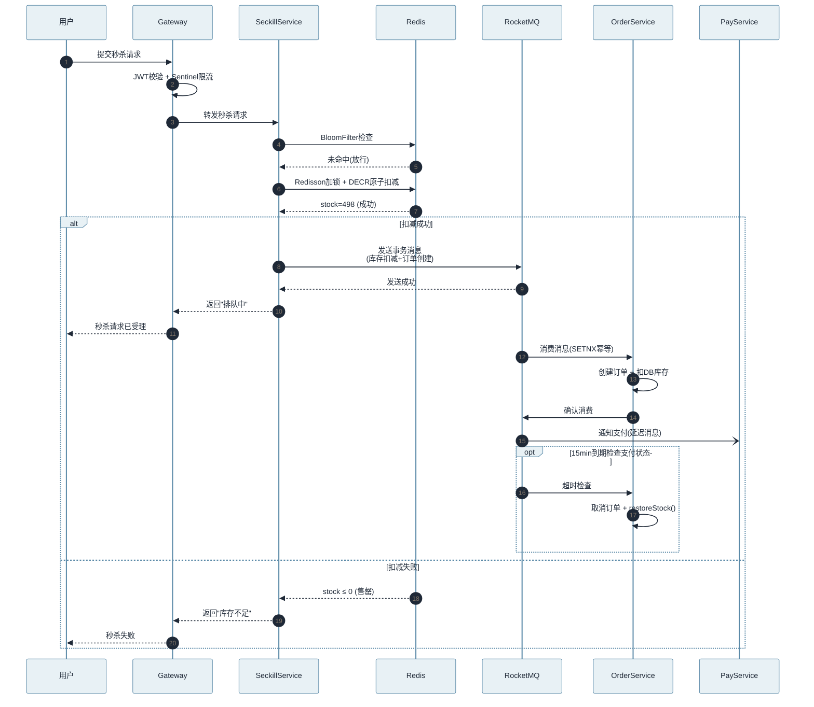
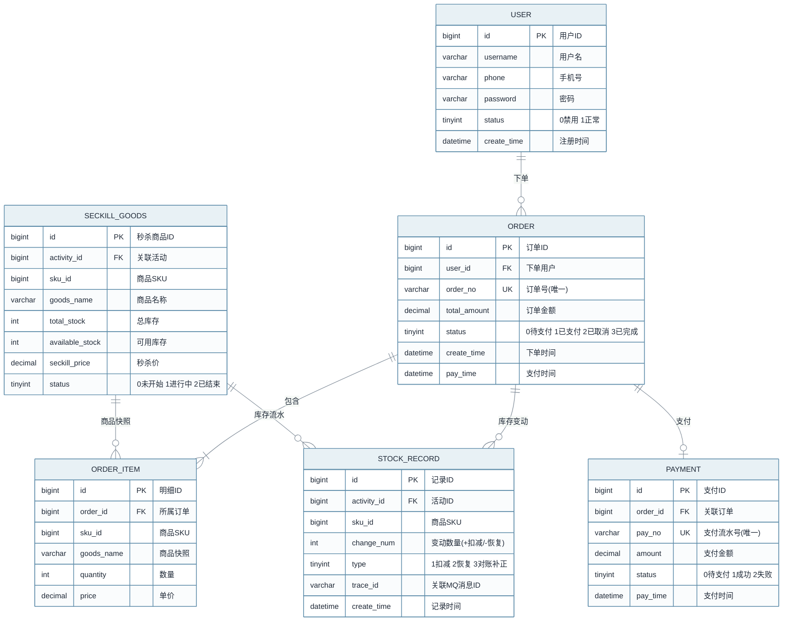

# 分布式微云商城 — 项目速记卡

> 面试前 10 分钟快速过一遍的速记卡，详细展开见同目录 [项目深度面试.md](./项目深度面试.md)
> **项目**: mall-micro-cloud | **角色**: 核心后端负责人 | **时间**: 2026.04-2026.08 | **团队**: 4 人
> **GitHub**: [mall-micro-cloud](https://github.com/1byteone/mall-micro-cloud)
> **技术栈**: Spring Boot 3 + Spring Cloud Alibaba + MyBatis-Plus + Redis/Redisson + RocketMQ + Elasticsearch + Seata + Sentinel + Elastic-Job

---

## 一、快速复习知识点速记

1. **分布式锁 + 原子扣减**: Redisson RLock（看门狗 30s 自动续期），锁粒度 `lock:seckill:{activityId}:{skuId}` 按商品隔离；Redis `decrement()` 原子扣减，返回值为负立即 `increment()` 回滚，杜绝超卖。单次扣减用原生原子命令，复合操作才考虑 Lua 脚本。
2. **布隆过滤器防缓存穿透**: 库存预热时把全部库存 key 写入 `CacheBloomFilter`（1% 误判率、约 10KB 内存拦 99% 无效请求），请求先过布隆再进 Redis；误判流量由 Redis 层 `get == null` 兜底，不会造成超卖。
3. **MQ 异步解耦**: RocketMQ 承载库存落库、事务消息、延迟消息三类场景；事务消息保证本地事务与消息发送原子性，延迟消息用于订单超时未支付处理；消费端 `transactionId` + Redis SETNX（30s 过期）幂等去重。
4. **Seata AT 分布式事务**: 下单链路 `@GlobalTransactional` 零侵入，拦截 SQL 自动生成 undo log，任一参与者异常由 TC 协调回滚；适合团队经验一般、追求开发效率的场景。
5. **Sentinel 限流熔断**: 网关路由级 QPS 限流 + 热点参数限流（秒杀商品 ID）+ 熔断降级，下游不可用时快速失败，防止级联雪崩；AI 服务熔断后降级纯 ES 搜索。
6. **ES 关键词搜索**: IK 分词（索引 `ik_max_word`、搜索 `ik_smart`）+ Spring Data Elasticsearch DSL，标题 > 描述 > 销量权重排序，响应 20ms 以内。
7. **RAG 语义搜索**: Java 经 OpenFeign 调 Python（FastAPI + LangChain）AI 服务，`recommend` 多轮对话 + `extract` 自然语言转结构化条件（如"两千以下华为手机"→ `{price:0-2000, brand:华为}`）；Python 侧用 RedisStack 向量检索 + 重排序做语义召回。
8. **Elastic-Job 定时对账**: 每 10 分钟校验 Redis 与 MySQL 库存一致性，差异走恢复流水补正，保障最终一致性。
9. **Nacos**: 注册中心（AP）+ 配置中心（CP）一体化，服务发现与配置动态推送，配置变更无需重启。
10. **Gateway 网关**: 统一路由转发 + JWT 鉴权 + 跨域处理，与 Sentinel 配合做路由级限流，是流量统一入口。
11. **OpenFeign 服务调用**: `mall-api` 模块统一维护 DTO + FeignClient，服务间声明式调用；跨语言调 Python AI 服务也走 Feign（HTTP JSON）。
12. **Spring Boot 3 + MyBatis-Plus**: 单表零 SQL + 代码生成器；订单表按 userId 哈希分 16 张表（`order_0`~`order_15`），`@TableName` 动态解析，保证同用户订单同表。
13. **MQ 幂等消费**: `SETNX transactionId` 30s 窗口内重复消息直接跳过；`transactionId = lockKey + System.currentTimeMillis()` 全局唯一，覆盖 MQ At Least Once 语义。
14. **静态化承载峰值**: 秒杀详情页 `generateHtml()` 静态化推送 Nginx，静态页 QPS 10 万+，动态接口受 Tomcat 线程池限制约单机 2000，静态化与缓存分层削峰。

---

## 二、面试要点速记

### 项目一句话定位

"一个面向百万级交易场景的分布式微服务电商平台，基于 Spring Boot 3 + Spring Cloud Alibaba 全家桶，共 12 个微服务模块；我作为核心后端负责人，主导了秒杀链路、搜索 / RAG 双检索体系与分布式一致性保障三条主线。"

### 核心技术亮点（必提 6-8 个）

1. **秒杀四层防护架构**: 布隆过滤器拦无效请求 → Redisson 分布式锁防超卖 → Redis 原子扣减 + MQ 异步落库 → Elastic-Job 定时对账，每一层解决一类问题，压测 QPS 5000+。
2. **搜索双体系**: ES 关键词（IK 分词 + DSL，20ms）+ RAG 语义（OpenFeign 调 Python，语义召回率提升 35%、幻觉率下降 90%），互为兜底。
3. **分布式一致性保障**: Seata AT（跨服务强一致）+ RocketMQ 事务消息 + 基于 SETNX 的幂等消费 + 对账任务，事务成功率 99.9%。
4. **幂等设计贯穿全链路**: MQ 消费幂等（transactionId）、库存恢复幂等、支付回调幂等，统一用"唯一键 + Redis + DB 唯一索引"双保险。
5. **跨语言服务编排**: Java 与 Python（FastAPI + LangChain）通过 OpenFeign HTTP JSON 集成，`CamelCastUtils.jsonToObject()` 解决驼峰 / 下划线命名差异。
6. **高可用与降级**: AI 服务熔断降级纯 ES 搜索、秒杀详情页静态化削峰、Sentinel 热点参数限流防刷单。

### 成果数据（甩数据）

| 指标 | 数值 |
|------|------|
| 秒杀 QPS | 5000+（比乐观锁方案提升 5 倍） |
| ES 搜索响应 | 20ms 以内（MySQL 2s → ES 20ms） |
| 语义召回准确率 | 提升 35%，幻觉率下降 90% |
| 跨服务事务成功率 | 99.9% |
| 数据库压力 | 下降 70%（Redis 缓存 + MQ 异步） |

> 面试话术顺序：先一句话定位 → 按"秒杀 / 搜索 / 一致性"三个亮点展开 → 结尾用 5000+ QPS、20ms、99.9% 收尾。

---

## 三、面试追问速记（高频追问 + 答案要点）

1. **为什么选 Seata AT 而不是 TCC？**
   - AT 对业务零侵入，SQL 拦截自动生成 undo log，开发成本低，适合项目节奏快、团队分布式事务经验不足
   - TCC 性能更好但需手写 Try/Confirm/Cancel 三套接口；若订单核心链路出现性能瓶颈可局部升级 TCC

2. **Redis 预扣库存宕机怎么办？**
   - 高可用层面：Redis 开启 RDB/AOF 持久化 + 主从/集群，避免单点
   - 兜底层面：库存以 MySQL 为事实源，Elastic-Job 定时对账从 DB 恢复 Redis 库存；MQ 消息持久化，恢复后重放不丢
   - 预热阶段重新执行 `loadStockCache()` 重建缓存与布隆过滤器

3. **为什么用 MQ 异步落库而不是 Redisson 拿锁后直接扣 DB？**
   - 直接扣 DB 受连接池与行锁限制，QPS 上不去；Redis 单键 O(1) 原子操作可支撑万级 QPS
   - Redis 扣减 + MQ 异步落库把 DB 压力削峰，数据库压力下降 70%
   - Redis 是加速层、MySQL 是事实源，最终一致性由对账兜底

4. **布隆过滤器的误判率怎么处理？**
   - 误判只会多放行一次 Redis 查询（`get == null` 拦截），不会导致超卖
   - 误判率与内存成反比：`falseProbability=0.01` 对应 10 万数据约 120KB，性价比最高，可调参权衡

5. **RocketMQ 消息丢失怎么保证？**
   - 生产端：同步发送 + 重试，事务消息保证本地事务与发送原子性
   - Broker 端：同步刷盘 + 主从复制持久化
   - 消费端：At Least Once + 手动 ACK，业务侧幂等消费兜底；对账任务发现缺口即补发/恢复

6. **分布式锁的看门狗机制怎么实现的？**
   - Redisson RLock 默认锁超时 30s，看门狗每 10s（超时/3）检查锁仍被持有则自动续期到 30s，unlock 后停止
   - 解决原生 SETNX 两难：超时太短业务没跑完锁已释放，太长死锁窗口大

7. **ES 搜索怎么保证高亮和排序？**
   - 高亮用 ES Highlight 返回 `<em>` 标签片段，前端渲染；搜索词与索引分词模式匹配
   - 排序：BM25 相关度 + 字段权重（标题 > 描述 > 销量）+ 价格/销量显式排序 + 多条件布尔过滤
   - 深度分页用 search_after，避免 from+size 性能劣化

8. **秒杀链路中 MQ 消息积压怎么处理？**
   - 先定位：消费者能力不足还是下游 DB 慢
   - 扩容同消费组消费者实例，或开批量消费模式拉高吞吐
   - 对账任务保证最终一致，积压不丢数据；极端情况临时重建 topic 分流

9. **Seata AT 模式的性能开销？**
   - 开销来自 undo log 生成 + 全局写锁 + 二阶段提交额外 RPC
   - 项目里读多写少、非热点场景可接受；库存这种热点写不走 AT（Redis + MQ 最终一致）
   - 优化手段：精简参与者、缩短全局事务时长，必要时核心链路换 TCC

10. **如何做全链路压测？**
    - 工具：JMeter/wrk，从网关入口打全链路，隔离压测环境 + 压测数据打标
    - 指标：QPS、RT 分位、错误率、GC、线程池、Redis/DB 负载
    - 结果验证：秒杀 5000+ QPS、搜索 20ms、DB 压力下降 70%

11. **服务间调用链路追踪怎么做？**
    - Sleuth + Zipkin（或 SkyWalking），traceId 贯通 Gateway → 服务 → Feign → MQ
    - traceId 经 MDC 透传日志，Feign 拦截器与 MQ 消息头携带
    - 价值：快速定位慢调用、跨服务排障、查看调用拓扑

12. **网关层鉴权怎么做？**
    - Gateway 全局过滤器解析 JWT：校验签名、过期时间，解析 userId 放入请求头下传
    - 白名单放行（登录、商品详情等公开接口），其余校验失败返回 401
    - 用户态由网关统一管控，服务间默认互信（内网隔离）

13. **如何保证接口幂等性？**
    - 下单：客户端幂等 token + 订单号唯一约束
    - 支付回调：以 paymentId 为唯一键首笔落库，重复回调直接返回成功
    - 通用：Redis SETNX 幂等锁 + DB 唯一索引双保险；MQ 消费用 transactionId

14. **缓存和数据库一致性怎么保证？**
    - Cache Aside：先更新 DB 再删缓存，并发场景延迟双删 + 过期时间兜底
    - 缓存 miss 回源 DB，加锁防击穿；热点 key 布隆过滤防穿透
    - Elastic-Job 定时对账修正不一致数据

15. **Sentinel 限流规则配置？**
    - 控制台动态推送或注解（`@SentinelResource`）两种方式
    - 维度：QPS 限流、线程数限流、热点参数限流（秒杀商品 ID）
    - 限流效果：直接拒绝 / 预热 / 排队；熔断策略：慢调用比例、异常比例、异常数

16. **Nacos 是 AP 还是 CP？**
    - 注册中心走 AP：临时实例 + 心跳，故障节点自动摘除，优先可用性
    - 配置中心走 CP：持久化 + 长轮询推送，保证配置强一致
    - 两者并存，不能一概而论

17. **如何做服务降级？**
    - 熔断降级：下游异常率超阈值触发 Sentinel 熔断，走 fallback 快速失败
    - 功能降级：AI 搜索不可用时降级纯 ES 关键词搜索，前端按钮置灰
    - 数据降级：优先缓存与静态化保底，峰值流量不穿透到 DB

18. **跨服务事务失败怎么处理？**
    - Seata AT：TC 协调全局回滚，各参与者按 undo log 恢复数据镜像
    - 场景化：扣库存失败 → 订单标记失败；支付失败 → 定时对账 + 人工介入
    - 非强一致场景走 MQ 最终一致，失败消息进死信队列人工兜底

19. **库存分段如何实现？**
    - 思路：把单商品库存 key 拆成 N 段（`stock:{actId}:{skuId}:{seg}`），请求按 hash/随机路由到段，段内原子扣减，段耗尽切换下一段
    - 收益：消除单 key 热点锁竞争，段间并行提升吞吐；牺牲部分计数精度
    - 当前项目锁粒度已到商品维度，若单商品流量进一步放大再启用分段；对账需按段汇总

20. **订单超时未支付如何处理？**
    - 创建订单时发送 RocketMQ 延迟消息（15 分钟），到期消费检查订单状态
    - 未支付则取消订单，调用 `restoreStock()` 幂等恢复预扣库存，发流水消息同步 DB
    - 兜底：定时任务扫描超时订单补偿，防止延迟消息丢失

---

## 四、面试辅助图（Mermaid）

> 以下四张图可在面试白板/手绘时辅助讲解，也适合作为面试材料附录。

### 1. 秒杀四层防护流程

```mermaid
%%{init: {"theme": "base", "fontFamily": "Arial, Microsoft YaHei, sans-serif", "fontSize": 14, "themeVariables": {"fontFamily": "Arial, Microsoft YaHei, sans-serif", "fontSize": "14px", "primaryColor": "#E8F1F5", "primaryTextColor": "#1F2937", "primaryBorderColor": "#5B8AA8", "lineColor": "#7B8794", "secondaryColor": "#F5EFE7", "tertiaryColor": "#EEF3EE"}}}%%
flowchart TD
    accTitle: 秒杀四层防护流程
    accDescr: 请求经过网关、过滤、锁扣和异步落库，补偿与对账路径保障库存最终一致性。
    A[用户请求] --> B[Gateway 网关<br/>JWT鉴权 + Sentinel限流]
    B --> C{BloomFilter<br/>布隆过滤器}
    C -- 命中 --> D[直接返回: 已售罄]
    C -- 未命中 --> E[Redisson 分布式锁<br/>lock:seckill:{actId}:{skuId}]
    E --> F[Redis 原子扣减<br/>DECR 库存]
    F -- 返回值 < 0 --> G[INCR 回滚 + 返回售罄]
    F -- 扣减成功 --> H[RocketMQ 异步消息<br/>事务消息保证原子性]
    H --> I[Consumer 幂等消费<br/>SETNX 30s 去重]
    I --> J[写入 order + stock_record<br/>同步DB库存]
    H -. "超时/异常" .-> K[延迟消息: 30s 后<br/>检查是否需要回滚]
    K -.-> L[restoreStock 幂等恢复]
    J -.-> M[Elastic-Job 每10分钟<br/>Redis ↔ MySQL 对账]
    L -.-> M
    G -.-> M

    classDef external fill:#F1F5F9,stroke:#64748B,color:#1F2937;
    classDef core fill:#E8F1F5,stroke:#5B8AA8,color:#1F2937;
    classDef store fill:#EEF0F7,stroke:#7A7FA8,color:#1F2937;
    classDef async fill:#F5EFE7,stroke:#B08B5B,color:#1F2937;
    classDef decision fill:#F3F1E8,stroke:#A58B42,color:#1F2937;
    classDef success fill:#EAF3EC,stroke:#668F70,color:#1F2937;
    classDef risk fill:#F7ECEC,stroke:#B56B6B,color:#1F2937;

    class A external;
    class B,E,I core;
    class C decision;
    class D,G,K risk;
    class F,J,M store;
    class H async;
    class L success;
```

> **面试话术**: "秒杀请求从网关进来，先过布隆过滤器拦掉无效请求（99%），再拿 Redisson 分布式锁按商品粒度防并发，Redis 原子扣减库存成功后发 RocketMQ 事务消息异步落库——如果 Redis 返回值为负立即回滚不超卖。MQ 消费端用 SETNX 做 30 秒幂等窗口。扣减失败或超时由延迟消息触发 `restoreStock()` 恢复库存，最后 Elastic-Job 每 10 分钟对账兜底。整体是'四层各管一件事'：过滤→锁扣→异步落库→对账。"

### 2. 秒杀下单时序



> **面试话术**: "用户请求经过 Gateway 鉴权限流后进入秒杀服务，依次过布隆过滤器、Redisson 锁、Redis 原子扣减，成功后发 RocketMQ 事务消息。MQ 消费端 ORDER 服务做幂等校验后落库。支付环节通过延迟消息做 15 分钟超时检查，未支付则自动取消并恢复库存。整个链路从用户到最终落库可以一条线讲清楚。"

### 3. 核心实体 ER 图



> **面试话术**: "核心实体有六个：USER、SECKILL_GOODS、ORDER、ORDER_ITEM、PAYMENT、STOCK_RECORD。USER 与 ORDER 是一对多；每个 ORDER 下有多个 ORDER_ITEM 明细；PAYMENT 与 ORDER 是一对一，通过 pay_no 唯一约束做支付幂等。STOCK_RECORD 记录每次库存变动（扣减/恢复/对账补正），通过 trace_id 可追溯到具体 MQ 消息，是排查问题和对账的关键表。"

### 4. 订单状态流转

```mermaid
%%{init: {"theme": "base", "fontFamily": "Arial, Microsoft YaHei, sans-serif", "fontSize": 14, "themeVariables": {"fontFamily": "Arial, Microsoft YaHei, sans-serif", "fontSize": "14px", "primaryColor": "#E8F1F5", "primaryTextColor": "#1F2937", "primaryBorderColor": "#5B8AA8", "lineColor": "#7B8794", "secondaryColor": "#F5EFE7", "tertiaryColor": "#EEF3EE"}}}%%
stateDiagram-v2
    direction LR
    accTitle: 订单状态流转
    accDescr: 订单从创建到完成的四个核心状态，含取消和退款分支，重点展示超时取消路径。

    classDef start fill:#EAF3EC,stroke:#668F70,color:#1F2937;
    classDef pending fill:#F3F1E8,stroke:#A58B42,color:#1F2937;
    classDef success fill:#E8F1F5,stroke:#5B8AA8,color:#1F2937;
    classDef risk fill:#F7ECEC,stroke:#B56B6B,color:#1F2937;
    classDef endState fill:#F1F5F9,stroke:#64748B,color:#1F2937;

    [*] --> PendingPay: 创建订单
    PendingPay --> Paid: 支付成功
    PendingPay --> Cancelled: 超时未付(15min)
    PendingPay --> Cancelled: 主动取消
    PendingPay --> Failed: 支付失败
    Paid --> Completed: 收货确认
    Paid --> Refunding: 申请退款
    Refunding --> Cancelled: 退款成功
    Failed --> PendingPay: 重新支付

    note right of PendingPay
        RocketMQ 延迟消息 15min
        到期检查 → 取消 + 恢复库存
    end note

    note right of Cancelled
        restoreStock() 幂等恢复
        MQ事务消息保证一致性
    end note

    class [*] start;
    class PendingPay pending;
    class Paid,Completed success;
    class Cancelled,Failed,Refunding risk;
```

> **面试话术**: "订单有四个核心状态：待支付 → 已支付 → 已完成，另有取消和退款分支。关键是 PendingPay → Cancelled 这条超时路径：创建订单时发 15 分钟延迟消息，到期检查未支付则取消并调 `restoreStock()` 恢复库存。取消操作用幂等恢复保证可重入，防止延迟消息重复消费导致库存多恢复。"

---

**面试使用建议**:
- **流程图(1)** 适合回答"秒杀链路怎么设计的"，从上往下一层层讲
- **时序图(2)** 适合回答"请求从用户到落库的完整流程"，按时间线讲
- **ER图(3)** 适合回答"订单/库存/支付表怎么设计的"，讲清楚关联关系
- **状态图(4)** 适合回答"订单超时怎么处理的"，重点讲超时取消路径