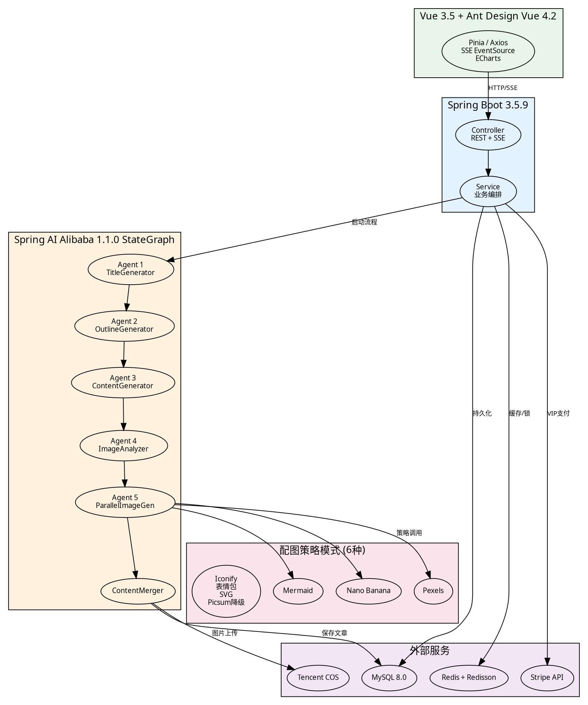

# ai-passage-creator-demo 项目技术栈深度剖析 — 项目全景总览

> 项目地址: https://github.com/1byteone/ai-passage-creator-demo
> 技术栈版本: Spring Boot 3.5.9 + Spring AI Alibaba 1.1.0 + MyBatis-Flex 1.11.1 + Vue 3.5 + Ant Design Vue 4.2

---

## 一、项目定位

**AI 爆款文章创作器 (AI Passage Creator)** 是一个基于 **AI 多 Agent 协作** 的图文创作平台。

用户只需输入一个选题，系统通过 **5 个 AI Agent 的流水线协作**，自动完成从标题生成、大纲撰写、正文创作到配图插入的全流程。同时，项目支持**三阶段人机协作**（选题选择、大纲编辑、正文确认），让用户在每一阶段都能介入修改，兼顾 AI 效率与人工质量。

**核心卖点：**
- **5 Agent 流水线**：选题 → 大纲 → 正文 → 配图分析 → 并行配图 → 图文合并
- **6 种配图策略**：Pexels / Mermaid / Iconify / 表情包 / Nano Banana AI 生图 / SVG Diagram，策略模式可扩展
- **SSE 实时推送**：Agent 执行过程实时推送到前端，用户可观看生成进度
- **VIP 会员体系**：Stripe 支付集成，高级配图方式仅限 VIP 用户
- **三语言教学实现**：Java / Go / Python 三种后端实现，面向"编程导航"学员

---

## 二、架构全景图

```
┌─────────────────────────────────────────────────────────────────────┐
│                        前端 (Vue 3.5 + Ant Design Vue 4.2)          │
│   Pinia 状态管理 │ Axios 请求层 │ SSE EventSource │ ECharts 图表     │
└────────────────────────────┬────────────────────────────────────────┘
                             │ HTTP / SSE
                             ▼
┌─────────────────────────────────────────────────────────────────────┐
│                    Spring Boot 3.5.9 后端                           │
│  ┌──────────────┐  ┌──────────────┐  ┌──────────────┐              │
│  │ Controller层  │  │  Service层   │  │  AOP 切面     │              │
│  │ REST + SSE   │  │ 业务逻辑编排  │  │ @AgentExec   │              │
│  └──────┬───────┘  └──────┬───────┘  └──────────────┘              │
│         │                 │                                         │
│         ▼                 ▼                                         │
│  ┌─────────────────────────────────────────────────────────────┐    │
│  │           Spring AI Alibaba 1.1.0 StateGraph               │    │
│  │  ┌──────────┐  ┌──────────┐  ┌──────────┐  ┌──────────┐   │    │
│  │  │ Agent 1  │  │ Agent 2  │  │ Agent 3  │  │ Agent 4  │   │    │
│  │  │ TitleGen │→│OutlineGen│→│ContentGen│→│ImgAnalyzr│   │    │
│  │  └──────────┘  └──────────┘  └──────────┘  └─────┬────┘   │    │
│  │                                                   │        │    │
│  │                     ┌─────────────────────────────┘        │    │
│  │                     ▼                                      │    │
│  │              ┌──────────────┐     ┌──────────────┐         │    │
│  │              │  Agent 5     │     │ContentMerger │         │    │
│  │              │  Parallel    │────→│  图文合并     │         │    │
│  │              │  ImageGen    │     └──────────────┘         │    │
│  │              └──────┬───────┘                              │    │
│  │                     │                                      │    │
│  │         ┌───────────┼───────────┐                          │    │
│  │         ▼           ▼           ▼                          │    │
│  │    ┌────────┐ ┌──────────┐ ┌────────┐                     │    │
│  │    │ Pexels │ │ Mermaid  │ │NnBnnana│ ... +3 更多策略      │    │
│  │    └────────┘ └──────────┘ └────────┘                     │    │
│  └─────────────────────────────────────────────────────────────┘    │
│                                                                     │
│  ┌────────────┐  ┌────────────┐  ┌────────────┐  ┌────────────┐   │
│  │  MySQL 8.0 │  │   Redis    │  │ Stripe API │  │ Tencent COS│   │
│  │  文章/用户  │  │  缓存/锁   │  │  VIP 支付  │  │  图片存储   │   │
│  └────────────┘  └────────────┘  └────────────┘  └────────────┘   │
└─────────────────────────────────────────────────────────────────────┘
```

### Graphviz 源码



---

## 三、技术栈总表

| 层次 | 技术 | 版本 | 用途 |
|------|------|------|------|
| **后端框架** | Spring Boot | 3.5.9 | Web 应用基础框架 |
| **AI 编排** | Spring AI Alibaba | 1.1.0 | StateGraph 多 Agent 编排 |
| **大模型** | DashScope (通义千问) | — | LLM 推理服务 |
| **ORM** | MyBatis-Flex | 1.11.1 | 编译期代码生成，高性能 ORM |
| **数据库** | MySQL | 8.0 | 文章/用户/支付数据存储 |
| **缓存** | Spring Data Redis + Redisson | 3.50.0 | 缓存 + 分布式锁 |
| **支付** | Stripe Java SDK | 31.2.0 | VIP 会员支付集成 |
| **对象存储** | Tencent COS SDK | 5.6.228 | 图片存储与 CDN |
| **AI 生图** | Google Gen AI SDK | 1.35.0 | Nano Banana 配图生成 |
| **API 文档** | Knife4j | 4.4.0 | Swagger UI + 在线调试 |
| **前端框架** | Vue | 3.5 | 响应式 UI 框架 |
| **UI 组件库** | Ant Design Vue | 4.2 | 企业级组件库 |
| **构建工具** | Vite | 7.0 | 极速开发服务器 |
| **状态管理** | Pinia | 3.0 | Vue 3 官方状态库 |
| **数据可视化** | ECharts | 6.0 | 图表展示 |
| **类型系统** | TypeScript | 5.8 | 前端类型安全 |

---

## 四、模块划分

### 4.1 后端模块结构

```
backend/
├── src/main/java/com/yupi/aipassagecreator/
│   ├── controller/             # REST 接口 + SSE 推送
│   │   ├── ArticleController   # 文章 CRUD + 生成触发
│   │   ├── UserController      # 用户注册/登录/VIP 管理
│   │   └── PaymentController   # Stripe 支付回调
│   ├── service/                # 业务逻辑层
│   │   ├── agent/              # 5 个 Agent 实现
│   │   │   ├── TitleGeneratorAgent
│   │   │   ├── OutlineGeneratorAgent
│   │   │   ├── ContentGeneratorAgent
│   │   │   ├── ImageAnalyzerAgent
│   │   │   └── ParallelImageGenerator
│   │   ├── image/              # 配图策略模式
│   │   │   ├── ImageSearchService        # 策略接口
│   │   │   ├── PexelsImageSearchService
│   │   │   ├── MermaidImageSearchService
│   │   │   ├── NanoBananaImageService
│   │   │   └── ImageServiceStrategy      # 策略选择器
│   │   ├── graph/              # StateGraph 编排
│   │   │   └── PassageCreationGraph
│   │   └── sse/                # SSE 推送管理
│   │       └── SseEmitterManager
│   ├── mapper/                 # MyBatis-Flex Mapper
│   │   ├── ArticleMapper
│   │   └── UserMapper
│   ├── model/                  # 实体 + DTO
│   │   ├── entity/             # 数据库实体
│   │   ├── enums/              # 枚举 (ArticlePhase, ImageMethodEnum)
│   │   └── dto/                # 数据传输对象
│   └── config/                 # 配置类
│       ├── DashScopeConfig     # LLM 配置
│       ├── RedisConfig         # Redis 配置
│       └── StripeConfig        # Stripe 配置
├── src/main/resources/
│   └── application.yml         # 主配置文件
└── pom.xml                     # Maven 依赖
```

### 4.2 前端模块结构

```
frontend/
├── src/
│   ├── pages/              # 页面组件
│   │   ├── CreatePage      # 创作主页面（三阶段）
│   │   ├── ListPage        # 文章列表页
│   │   └── AdminPage       # 管理后台
│   ├── components/         # 可复用组件
│   │   ├── SseProgress     # SSE 进度条
│   │   ├── ImageSelector   # 配图选择器
│   │   └── TitleSelector   # 标题选择器
│   ├── api/                # API 请求层
│   ├── stores/             # Pinia 状态管理
│   ├── router/             # Vue Router 配置
│   ├── types/              # TypeScript 类型
│   └── utils/              # 工具函数
├── vite.config.ts
└── package.json
```

---

## 五、核心业务流程

### 5.1 完整创作流程

```
用户输入选题
    │
    ▼
┌─────────────────────────────────────────────────────┐
│  Stage 1: 选题阶段 (Human-in-the-loop)              │
│  Agent 1 (TitleGenerator) → LLM 生成 3-5 个标题方案  │
│  ← 用户选择标题 or 要求重新生成                       │
├─────────────────────────────────────────────────────┤
│  Stage 2: 大纲阶段 (Human-in-the-loop)              │
│  Agent 2 (OutlineGenerator) → 流式 SSE 输出大纲      │
│  ← 用户编辑大纲 / 要求 AI 优化                       │
├─────────────────────────────────────────────────────┤
│  Stage 3: 正文 + 配图 (StateGraph 自动编排)          │
│  ┌─────────────────────────────────────────────────┐│
│  │ Agent 3: ContentGenerator → 流式输出 Markdown   ││
│  │        ↓                                        ││
│  │ Agent 4: ImageAnalyzer → 分析配图需求           ││
│  │        ↓                                        ││
│  │ Agent 5: ParallelImageGenerator                ││
│  │   ┌──────┬──────┬──────┐                       ││
│  │   │Pexels│Mermaid│NnBnnana│ 并行获取配图       ││
│  │   └──────┴──────┴──────┘                       ││
│  │        ↓                                        ││
│  │ ContentMerger → 图文合并 → 完整文章              ││
│  └─────────────────────────────────────────────────┘│
└─────────────────────────────────────────────────────┘
```

### 5.2 SSE 事件推送序列

| 事件名 | 触发时机 | 数据内容 |
|--------|----------|----------|
| `AGENT1_COMPLETE` | 标题生成完成 | 标题列表 JSON |
| `AGENT2_STREAMING` | 大纲流式输出中 | 当前生成片段 |
| `AGENT2_COMPLETE` | 大纲生成完成 | 完整大纲文本 |
| `AGENT3_STREAMING` | 正文流式输出中 | 当前生成片段 |
| `AGENT3_COMPLETE` | 正文生成完成 | 完整 Markdown |
| `AGENT4_COMPLETE` | 配图分析完成 | 配图需求列表 |
| `IMAGE_COMPLETE` | 单张配图完成 | 图片 URL |
| `AGENT5_COMPLETE` | 全部配图就绪 | 完整图片列表 |
| `MERGE_COMPLETE` | 图文合并完成 | 最终文章 |
| `ERROR` | 发生错误 | 错误信息 |

### 5.3 数据库状态流转

```
ArticlePhase 状态机:

TITLE_SELECTION ──→ OUTLINE_EDITING ──→ CONTENT_GENERATION ──→ COMPLETED
     ↑                    ↑                       ↑
  重新生成              重新生成               重新生成
```

每条文章记录的 `phase` 字段追踪当前阶段，支持断点续作。

---

## 六、面试介绍话术

### 6.1 三分钟版本（项目深挖场景）

> 我最近做了一个 **AI 多 Agent 图文创作平台**，用户输入一个选题，系统通过 **5 个 AI Agent** 的流水线协作，自动生成完整图文文章。
>
> 技术架构上，后端使用 **Spring Boot 3.5.9**，核心编排层采用 **Spring AI Alibaba 1.1.0 的 StateGraph**，实现了 Agent 间的状态管理和自动流转。5 个 Agent 分别负责标题生成、大纲撰写、正文创作、配图分析和并行配图获取，其中配图模块设计了 **策略模式**，支持 Pexels 图库、Mermaid 流程图、AI 生图等 6 种配图方式，并通过降级链（主策略 → Picsum 随机图片 → 跳过）保证生成不中断。
>
> 项目的一大亮点是 **人机协作设计**：三阶段创作流程（选题、大纲、正文），每个阶段用户都能介入编辑。同时 Agent 的执行过程通过 **SSE 实时推送到前端**，用户可以实时观看 AI 生成进度。
>
> 存储层使用 **MyBatis-Flex**（编译期代码生成，性能优于 MyBatis-Plus），**Redis + Redisson** 处理缓存和分布式锁（配额扣减场景），**Stripe** 集成 VIP 会员支付，**Tencent COS** 存储生成的配图。
>
> 前端是 **Vue 3.5 + Ant Design Vue 4.2 + Vite 7.0**，通过 Pinia 管理状态，EventSource 接收 SSE 事件并实时渲染进度。

### 6.2 一分钟版本（简历/自我介绍场景）

> 我做了一个 **AI 多 Agent 图文创作平台**，后端基于 **Spring Boot + Spring AI Alibaba**，用 StateGraph 编排 5 个 Agent 流水线协作（标题→大纲→正文→配图分析→并行配图），配图模块用策略模式支持 6 种方式并带降级机制。支持 **SSE 实时推送**生成进度，**三阶段人机协作**让用户介入编辑。存储用 MyBatis-Flex + MySQL + Redis，支付集成 Stripe，图片存腾讯 COS。前端 Vue 3.5 + Ant Design Vue。

### 6.3 面试高频问题速查

| 问题方向 | 关键回答点 |
|----------|-----------|
| 为什么用 5 个 Agent | 单一职责、降低 Prompt 复度、支持并行、独立测试优化 |
| StateGraph 核心概念 | Node / Edge / ConditionalEdge / State / KeyStrategy / CompiledGraph |
| 策略模式配图 | 接口抽象 + 枚举注册 + 降级链，新增方式三步完成 |
| SSE vs WebSocket | SSE 单向推送、自动重连、天然流式；WebSocket 全双工 |
| MyBatis-Flex vs Plus | 编译期生成无 SQL 解析、零依赖、性能更高 |
| VIP 支付设计 | Stripe Checkout Session + Webhook 签名验证 + 幂等处理 |

---

## 七、系列文档导航

| 文档 | 内容 |
|------|------|
| [00-PROJECT-OVERVIEW.md](./00-PROJECT-OVERVIEW.md) | 项目全景总览（本文） |
| [01-spring-ai-alibaba.md](./01-spring-ai-alibaba.md) | Spring AI Alibaba + StateGraph 深度剖析 |
| [02-multi-agent-orchestration.md](./02-multi-agent-orchestration.md) | 多 Agent 编排实战与面试题 |
