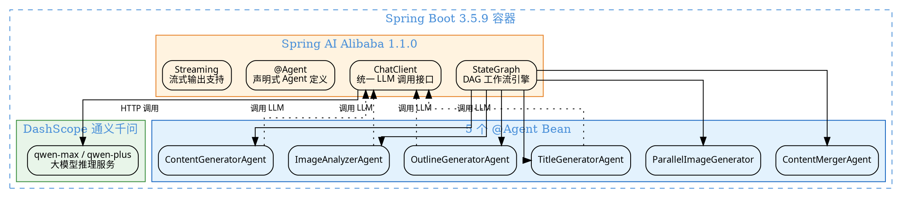

# 01 Spring AI Alibaba 1.1.0：StateGraph + @Agent 深度剖析

> Spring AI Alibaba 是阿里巴巴开源的 Spring AI 扩展项目，深度集成阿里云大模型服务，为 Java/Spring 生态提供 AI 应用开发框架。1.1.0 版本引入了 Graph 工作流引擎（StateGraph），是 Java 生态中与 LangGraph 对标的关键技术方案。
>
> **对应项目：** `ai-passage-creator/ai-passage-creator-java` 模块 `graph` 包

---

## 一、你必须知道的 3 个核心概念

### 1.1 Spring AI Alibaba

Spring AI Alibaba 是阿里巴巴基于 Spring AI 规范构建的 AI 框架扩展，定位是**为 Java 开发者提供一套统一的 AI 应用开发体验**。

**核心能力：**

| 能力 | 说明 | 项目中的应用 |
|------|------|-------------|
| **ChatClient** | 统一的大模型调用接口，屏蔽不同 LLM 提供商的 API 差异 | 所有 Agent 通过 ChatClient 调用 DashScope 通义千问 |
| **StateGraph** | 有向图工作流引擎，管理节点和边的编排 | 编排 5 个 Agent 的流水线执行 |
| **@Agent 注解** | 声明式 Agent 定义，简化 Agent 开发 | 标注每个 Agent 的职责和参数 |
| **Tool Calling** | 让 LLM 可以调用外部工具/函数 | 配图策略选择、数据库查询等 |
| **Memory** | 对话记忆管理，支持持久化 | 创作过程中的上下文保持 |
| **Streaming** | 原生流式输出支持 | Agent 2/3 的流式 SSE 推送 |

**为什么不直接用 Spring AI 官方？** Spring AI 官方主要对接 OpenAI 生态，而 Spring AI Alibaba 深度适配了阿里云 DashScope（通义千问），同时额外提供了 StateGraph 工作流引擎和 @Agent 注解等高级特性。

### 1.2 StateGraph（状态图工作流引擎）

StateGraph 是 Spring AI Alibaba 1.1.0 的核心特性，它是一个**基于有向图（DAG）的工作流引擎**，用于编排多个 AI Agent 的执行顺序和数据流转。

**核心概念一览：**

| 概念 | 说明 | 类比 |
|------|------|------|
| `StateGraph` | 有向图工作流，管理节点和边的编排 | 类似 LangGraph 的 Graph |
| `Node` | 图中的一个处理步骤，封装 Agent 逻辑 | 流水线中的工位 |
| `Edge` | 节点之间的流转关系 | 决定执行顺序的"传送带" |
| `ConditionalEdge` | 根据状态条件路由到不同节点 | if-else 分支 |
| `State` | 节点间共享的状态数据 | 流水线上的"工件" |
| `KeyStrategy` | 状态合并策略（覆盖 / 追加） | 决定工件如何被加工 |
| `CompiledGraph` | 编译后的图，可执行 | 可运行的 Pipeline |
| `ParallelNode` | 并行执行多个子节点 | 多工位同时工作 |
| `node_async` | 异步执行节点，不阻塞主线程 | 非阻塞式的工位 |

**StateGraph 的工作流程：**

```
1. 定义 State → 确定节点间共享的数据结构
2. 添加 Node → 注册每个处理节点（Agent）
3. 连接 Edge → 定义节点间的流转顺序
4. 设置 KeyStrategy → 配置状态合并策略
5. compile() 编译 → 将图定义编译为可执行实例
6. invoke(state) 执行 → 传入初始状态，启动工作流
```

### 1.3 @Agent 注解

`@Agent` 是 Spring AI Alibaba 提供的**声明式 Agent 定义注解**，用于标记一个 Spring Bean 为 AI Agent，并配置其行为特征。

```java
// @Agent 注解的核心属性
@Target(ElementType.TYPE)
@Retention(RetentionPolicy.RUNTIME)
public @interface Agent {

    // Agent 的名称，用于在 StateGraph 中引用
    String name() default "";

    // Agent 的描述，LLM 理解该 Agent 职责的依据
    String description() default "";

    // 使用的 ChatModel Bean 名称，默认使用 primary
    String chatModel() default "";

    // 工具类列表，Agent 可调用的工具
    Class<?>[] tools() default {};
}
```

**@Agent 的工作原理：**

```
Spring 容器启动时
    → 扫描 @Agent 注解
    → 为每个 Agent 创建代理对象
    → 注入 ChatClient 和工具类
    → 注册到 AgentRegistry
    → StateGraph 通过名称引用 Agent
```

---

## 二、项目中的实战应用

### 2.1 解决了什么问题

**问题场景：** AI 文章创作需要多个步骤（标题生成 → 大纲撰写 → 正文创作 → 配图分析 → 配图生成 → 图文合并），每个步骤依赖前一步的结果，且需要支持流式输出、并行执行和人机交互。

| 痛点 | 解决方案 |
|------|----------|
| 多步骤流程耦合度高，代码难以维护 | StateGraph 将每个步骤抽象为独立节点，流程清晰可见 |
| 步骤间数据传递混乱 | State 统一管理共享数据，KeyStrategy 控制合并策略 |
| 需要并行执行（配图生成） | ParallelNode + node_async 原生支持并行 |
| 需要人机交互（选题/大纲确认） | ConditionalEdge 支持等待用户输入 |
| 流式输出需求 | 节点内通过 ChatClient 的流式 API 实现 |

### 2.2 设计结构图



### 2.3 核心代码

#### 2.3.1 pom.xml 依赖

```xml
<!-- pom.xml —— Spring AI Alibaba 核心依赖 -->
<dependencies>
    <!-- Spring AI Alibaba 核心起步依赖 -->
    <dependency>
        <groupId>com.alibaba.cloud.ai</groupId>
        <artifactId>spring-ai-alibaba-starter</artifactId>
        <version>1.1.0</version>
    </dependency>

    <!-- DashScope 通义千问模型适配器 -->
    <!-- 让 Spring AI 通过 DashScope 调用通义千问 -->
    <dependency>
        <groupId>com.alibaba.cloud.ai</groupId>
        <artifactId>spring-ai-alibaba-dashscope-adapter</artifactId>
        <version>1.1.0</version>
    </dependency>

    <!-- StateGraph 工作流引擎 -->
    <!-- 提供 DAG 图编排能力 -->
    <dependency>
        <groupId>com.alibaba.cloud.ai</groupId>
        <artifactId>spring-ai-alibaba-graph</artifactId>
        <version>1.1.0</version>
    </dependency>
</dependencies>
```

#### 2.3.2 application.yml 配置

```yaml
# application.yml —— DashScope 配置
spring:
  ai:
    dashscope:
      # DashScope API Key，从阿里云控制台获取
      api-key: ${DASHSCOPE_API_KEY}
      # 通义千问模型，qwen-max 为最强版本
      chat:
        options:
          model: qwen-max
      # 可选：qwen-plus（性价比高）/ qwen-turbo（速度快）
```

#### 2.3.3 DashScopeConfig 配置类

```java
/**
 * DashScope 配置类 —— 配置 LLM 客户端和 ChatClient
 *
 * 核心职责：
 * 1. 创建 DashScope 的 ChatModel Bean
 * 2. 创建统一的 ChatClient Bean（所有 Agent 共用）
 * 3. 配置模型参数（温度、最大 Token 等）
 */
@Configuration
@ConditionalOnClass(DashScopeChatModel.class)  // 仅在 DashScope 依赖存在时加载
public class DashScopeConfig {

    /**
     * DashScope ChatModel —— 通义千问的模型客户端
     *
     * Spring AI Alibaba 自动配置会读取
     * spring.ai.dashscope 前缀的配置项
     * 自动创建 DashScopeChatModel Bean
     */

    /**
     * 统一的 ChatClient —— 所有 Agent 通过此客户端调用 LLM
     *
     * @param chatModel DashScope 自动注入的 ChatModel
     * @return 配置了默认参数的 ChatClient
     */
    @Bean
    public ChatClient chatClient(ChatModel chatModel) {
        // 构建 ChatClient，设置默认系统提示词
        return ChatClient.builder(chatModel)
            .defaultSystem("""
                你是一个专业的 AI 文章创作助手。
                请根据用户需求生成高质量的中文文章内容。
                使用 Markdown 格式输出，确保结构清晰、内容详实。
                """)
            .build();
    }
}
```

#### 2.3.4 StateGraph 定义 —— PassageCreationGraph

```java
/**
 * 文章创作 StateGraph —— 5 个 Agent 的核心编排器
 *
 * 工作流程：
 * content_generator（生成正文）
 *   → image_analyzer（分析配图需求）
 *     → parallel_image_generator（并行获取配图）
 *       → content_merger（图文合并）
 *
 * 每个节点使用 node_async 异步执行，不阻塞主线程
 */
@Component
public class PassageCreationGraph {

    // 注入 5 个 Agent 的 NodeAction
    // NodeAction 是 StateGraph 中节点的执行单元
    private final NodeAction contentGeneratorAgent;
    private final NodeAction imageAnalyzerAgent;
    private final NodeAction parallelImageGenerator;
    private final NodeAction contentMergerAgent;

    // KeyStrategy 工厂 —— 用于创建状态合并策略
    private final KeyStrategyFactory keyStrategyFactory;

    /**
     * 构造函数注入 —— 所有 Agent 和策略工厂
     */
    public PassageCreationGraph(
            @Qualifier("contentGeneratorAgent") NodeAction contentGeneratorAgent,
            @Qualifier("imageAnalyzerAgent") NodeAction imageAnalyzerAgent,
            @Qualifier("parallelImageGenerator") NodeAction parallelImageGenerator,
            @Qualifier("contentMergerAgent") NodeAction contentMergerAgent,
            KeyStrategyFactory keyStrategyFactory) {
        this.contentGeneratorAgent = contentGeneratorAgent;
        this.imageAnalyzerAgent = imageAnalyzerAgent;
        this.parallelImageGenerator = parallelImageGenerator;
        this.contentMergerAgent = contentMergerAgent;
        this.keyStrategyFactory = keyStrategyFactory;
    }

    /**
     * 构建 StateGraph —— 定义节点和边
     *
     * 流程拓扑：
     * START → content_generator → image_analyzer
     *   → parallel_image_generator → content_merger → END
     *
     * @return 编译后的 StateGraph，可直接 invoke 执行
     */
    public CompiledGraph buildGraph() {
        // 创建 StateGraph 实例，传入 KeyStrategy 工厂
        // KeyStrategy 控制节点间状态数据的合并行为
        StateGraph graph = new StateGraph(keyStrategyFactory)

            // 添加 4 个核心节点，全部使用异步执行
            // node_async 让节点在独立线程中执行，不阻塞主流程
            .addNode("content_generator",
                node_async(contentGeneratorAgent))
            .addNode("image_analyzer",
                node_async(imageAnalyzerAgent))
            .addNode("parallel_image_generator",
                node_async(parallelImageGenerator))
            .addNode("content_merger",
                node_async(contentMergerAgent))

            // 定义边 —— 连接节点形成有向图
            // START 是 StateGraph 内置的起始节点
            .addEdge(START, "content_generator")
            // 正文生成完成后，自动流转到配图分析
            .addEdge("content_generator", "image_analyzer")
            // 配图分析完成后，自动流转到并行配图生成
            .addEdge("image_analyzer", "parallel_image_generator")
            // 配图生成完成后，自动流转到图文合并
            .addEdge("parallel_image_generator", "content_merger")
            // content_merger 完成后，到达 END 终止节点
            .addEdge("content_merger", END);

        // 编译图 —— 编译后不可修改，但执行效率更高
        return graph.compile();
    }

    /**
     * 执行文章创作流程
     *
     * @param outline 用户确认的大纲
     * @param taskId 任务 ID，用于 SSE 推送
     * @return 最终生成的完整文章
     */
    public Article generateArticle(String outline, String taskId) {
        // 1. 构建 StateGraph
        CompiledGraph compiledGraph = buildGraph();

        // 2. 创建初始状态，传入大纲
        // OverAllState 是节点间共享的状态对象
        OverAllState initialState = new OverAllState();
        initialState.put("outline", outline);
        initialState.put("taskId", taskId);

        // 3. 执行图，获取最终状态
        OverAllState finalState = compiledGraph.invoke(initialState);

        // 4. 从最终状态中提取生成的完整文章
        return (Article) finalState.get("mergedArticle");
    }
}
```

#### 2.3.5 @Agent 注解使用 —— TitleGeneratorAgent

```java
/**
 * 标题生成 Agent —— 使用 @Agent 注解声明
 *
 * 职责：根据用户输入的选题，调用 LLM 生成 3-5 个标题方案
 *
 * @Agent 注解会自动：
 * 1. 将该 Bean 注册到 AgentRegistry
 * 2. 注入 ChatClient 实例
 * 3. 启用工具调用能力（如果配置了 tools）
 */
@Agent(
    name = "title_generator",
    description = "根据用户选题生成 3-5 个吸引人的标题方案"
)
@Component
public class TitleGeneratorAgent implements NodeAction {

    // ChatClient 由 Spring AI Alibaba 自动注入
    // 基于 DashScopeConfig 中配置的 ChatModel
    private final ChatClient chatClient;

    // SSE 推送管理器，用于实时推送事件
    private final SseEmitterManager sseEmitterManager;

    public TitleGeneratorAgent(
            ChatClient chatClient,
            SseEmitterManager sseEmitterManager) {
        this.chatClient = chatClient;
        this.sseEmitterManager = sseEmitterManager;
    }

    /**
     * NodeAction 接口的核心方法 —— 执行节点逻辑
     *
     * @param state 当前共享状态，包含前序节点的输出
     * @return 处理后的新状态，包含本节点的输出
     */
    @Override
    public OverAllState apply(OverAllState state) {
        // 1. 从共享状态中读取用户输入的选题
        String topic = state.get("topic").toString();

        // 2. 构建 Prompt，要求 LLM 生成标题方案
        String prompt = """
            你是一个专业的标题创作专家。
            请根据以下选题，生成 3-5 个吸引人的标题方案。
            要求：
            - 标题要有吸引力，能引发读者点击欲望
            - 覆盖不同风格（悬念式、清单式、故事式、干货式）
            - 每个标题不超过 30 个字
            - 以 JSON 数组格式返回

            选题：%s
            """.formatted(topic);

        // 3. 调用 LLM 生成标题
        String result = chatClient.prompt()
            .user(prompt)
            .call()
            .content();

        // 4. 解析 LLM 返回的 JSON 标题列表
        List<String> titles = parseTitleList(result);

        // 5. 通过 SSE 推送标题生成完成事件
        sseEmitterManager.sendEvent(
            state.get("taskId").toString(),
            "AGENT1_COMPLETE",
            titles
        );

        // 6. 将标题列表写入共享状态，供后续节点使用
        state.put("titleOptions", titles);
        return state;
    }

    /**
     * 解析 LLM 返回的 JSON 标题列表
     */
    private List<String> parseTitleList(String json) {
        // 使用 Jackson 解析 JSON 数组
        // 实际项目中需要异常处理
        try {
            ObjectMapper mapper = new ObjectMapper();
            return mapper.readValue(json,
                new TypeReference<List<String>>() {});
        } catch (Exception e) {
            // 解析失败时返回默认标题
            return List.of("AI 时代的机遇与挑战");
        }
    }
}
```

#### 2.3.6 ChatClient 流式调用 —— ContentGeneratorAgent

```java
/**
 * 正文生成 Agent —— 展示 ChatClient 的流式调用
 *
 * 职责：根据大纲，流式输出 Markdown 格式的正文内容
 * 使用 ChatClient 的 stream() 方法实现逐 Token 推送
 */
@Agent(
    name = "content_generator",
    description = "根据文章大纲生成完整的 Markdown 正文"
)
@Component
public class ContentGeneratorAgent implements NodeAction {

    private final ChatClient chatClient;
    private final SseEmitterManager sseEmitterManager;

    public ContentGeneratorAgent(
            ChatClient chatClient,
            SseEmitterManager sseEmitterManager) {
        this.chatClient = chatClient;
        this.sseEmitterManager = sseEmitterManager;
    }

    @Override
    public OverAllState apply(OverAllState state) {
        // 1. 从共享状态中读取大纲
        String outline = state.get("outline").toString();
        String taskId = state.get("taskId").toString();

        // 2. 构建 Prompt
        String prompt = """
            你是一个专业的文章写作专家。
            请根据以下大纲，生成一篇完整的 Markdown 格式文章。
            要求：
            - 语言生动、逻辑清晰
            - 每个段落不少于 200 字
            - 使用 Markdown 标题、列表、引用等格式
            - 在需要配图的位置插入 [IMAGE:描述] 标记

            大纲：
            %s
            """.formatted(outline);

        // 3. 使用 StringBuilder 流式拼接结果
        StringBuilder fullContent = new StringBuilder();

        // 4. 流式调用 LLM —— 逐 Token 推送
        // stream() 返回 Flux<String>，响应式流
        chatClient.prompt()
            .user(prompt)
            .stream()
            .content()
            .doOnNext(token -> {
                // 每收到一个 Token，追加到完整内容
                fullContent.append(token);

                // 通过 SSE 实时推送给前端
                sseEmitterManager.sendEvent(
                    taskId,
                    "AGENT3_STREAMING",
                    token
                );
            })
            .doOnComplete(() -> {
                // 流式输出完成，推送完成事件
                sseEmitterManager.sendEvent(
                    taskId,
                    "AGENT3_COMPLETE",
                    fullContent.toString()
                );
            })
            .blockLast();  // 阻塞等待流式输出完成

        // 5. 将完整正文写入共享状态
        state.put("content", fullContent.toString());
        return state;
    }
}
```

---

## 三、面试题

### Q1: Spring AI Alibaba 与 LangChain4j 的对比

| 维度 | Spring AI Alibaba | LangChain4j |
|------|-------------------|-------------|
| **定位** | 阿里云 AI 生态的 Spring 扩展 | 通用的 Java LLM 框架 |
| **LLM 支持** | 深度集成 DashScope（通义千问），也支持 OpenAI | 支持 OpenAI、Google、Azure、Hugging Face 等 |
| **工作流引擎** | 内置 StateGraph（DAG 编排） | 需自行实现或使用第三方 |
| **Agent 注解** | @Agent 声明式定义 | 无原生注解 |
| **流式输出** | 原生支持，基于 Reactor Flux | 原生支持 |
| **社区生态** | 较新，文档逐步完善 | 相对成熟，社区活跃 |
| **Spring 集成** | 原生 Spring AI 规范，无缝集成 | 通过 Spring Boot 自动配置集成 |
| **适用场景** | 阿里云用户、中文场景、需要 StateGraph 编排 | 多 LLM 提供商、通用场景 |

**回答要点：**
- Spring AI Alibaba 是**阿里云生态的深度集成方案**，StateGraph 是其差异化优势
- LangChain4j 是**通用 LLM 框架**，对多 LLM 提供商支持更广
- 选择依据：如果项目使用阿里云 + 需要 DAG 编排 → Spring AI Alibaba；如果项目对接多个 LLM 提供商 → LangChain4j

### Q2: StateGraph 的核心原理是什么？

StateGraph 的核心原理是**基于有向无环图（DAG）的工作流编排**，借鉴了 LangGraph 的设计思想，但用 Java 实现。

**核心原理拆解：**

1. **图结构定义**：通过 `addNode()` 和 `addEdge()` 构建一个有向图，节点是 Agent 执行单元，边是流转关系
2. **状态传递**：每个节点接收 `OverAllState` 对象，读取输入、写入输出，图引擎自动传递状态
3. **KeyStrategy 合并**：当多个节点写入同一个 key 时，KeyStrategy 决定合并策略（覆盖 / 追加）
4. **编译执行**：`compile()` 将图定义编译为执行计划，`invoke()` 按拓扑排序顺序执行节点
5. **异步执行**：`node_async` 将节点包装为异步任务，在独立线程池中执行

**类比理解：**
```
StateGraph  ≈ 工厂的流水线传送带
Node        ≈ 流水线上的工位（每个工位做一件事）
State       ≈ 在传送带上流转的工件
Edge        ≈ 连接工位的传送带段落
KeyStrategy ≈ 工位上的加工标准（如何合并多个零件）
```

### Q3: @Agent 注解的工作原理是什么？

`@Agent` 注解的工作原理涉及 Spring 容器的 Bean 后置处理机制：

**工作流程：**

```
1. Spring 容器启动，扫描 @Agent 注解
       │
       ▼
2. BeanPostProcessor 拦截 @Agent 标注的 Bean
       │
       ▼
3. 读取 @Agent 的元数据（name、description、tools）
       │
       ▼
4. 创建 Agent 代理对象（JDK 动态代理或 CGLIB）
       │
       ├─→ 注入 ChatClient（可指定 chatModel 名称）
       ├─→ 注入工具类（tools 属性指定的工具 Bean）
       └─→ 注册到 AgentRegistry（名称 → Agent 的映射）
       │
       ▼
5. StateGraph 通过名称引用 Agent
       │
       ▼
6. 执行时，代理对象拦截 apply() 调用
       ├─→ 记录执行日志（AOP 切面）
       ├─→ 监控执行时间
       ├─→ 处理异常和重试
       └─→ 调用实际的 Agent 逻辑
```

**关键设计点：**
- `@Agent` 本质是**声明式编程**的体现，让开发者专注于 Agent 的业务逻辑
- 代理对象负责**横切关注点**（日志、监控、异常处理），与业务逻辑分离
- 结合 `@AgentExecution` 切面，可以实现**自动化的执行追踪**

---

## 四、避坑指南

### 4.1 StateGraph 节点不可重复添加

```java
// 错误写法 —— 同一个节点名称重复添加会报错
graph.addNode("content_generator", node_async(agent))
     .addNode("content_generator", node_async(agent));  // 运行时异常！

// 正确写法 —— 节点名称必须唯一
graph.addNode("content_generator", node_async(agent))
     .addNode("image_analyzer", node_async(imageAgent));
```

### 4.2 DashScope API Key 安全配置

```yaml
# 错误写法 —— API Key 硬编码在配置文件中
spring:
  ai:
    dashscope:
      api-key: sk-xxxxxxxxxxxxxxxx  # 切勿提交到 Git！

# 正确写法 —— 使用环境变量或占位符
spring:
  ai:
    dashscope:
      api-key: ${DASHSCOPE_API_KEY}  # 从环境变量读取
```

### 4.3 流式调用必须 blockLast

```java
// 错误写法 —— 不阻塞等待，会导致状态未更新就进入下一节点
chatClient.prompt().user(prompt).stream().content()
    .subscribe(token -> buffer.append(token));  // 异步非阻塞，状态未写完！

// 正确写法 —— 使用 blockLast() 等待流式输出完成
chatClient.prompt().user(prompt).stream().content()
    .doOnNext(token -> buffer.append(token))
    .blockLast();  // 阻塞直到流式输出完成
```

### 4.4 KeyStrategy 配置不当导致数据覆盖

```java
// 错误写法 —— 默认覆盖策略，后写入的值覆盖前值
state.put("images", image1);  // 被覆盖
state.put("images", image2);  // 覆盖了 image1！

// 正确写法 —— 使用 AppendStrategy 追加
// 在构建 StateGraph 时配置
KeyStrategy appendStrategy = keyStrategyFactory.createAppendStrategy();
graph.addKeyStrategy("images", appendStrategy);  // images 字段使用追加策略
```

### 4.5 节点超时处理

```java
// 建议为每个节点设置超时时间，防止 LLM 卡死
// 在 NodeAction 中通过异步方式实现
@Override
public OverAllState apply(OverAllState state) {
    // 使用 CompletableFuture 设置超时
    CompletableFuture<OverAllState> future = CompletableFuture
        .supplyAsync(() -> doApply(state));

    try {
        // 30 秒超时
        return future.get(30, TimeUnit.SECONDS);
    } catch (TimeoutException e) {
        // 超时处理：返回默认值，不阻塞整个流程
        log.warn("Agent 执行超时，使用默认值。taskId={}",
            state.get("taskId"));
        state.put("content", "内容生成超时，请重试");
        return state;
    }
}
```

---

## 五、参考资料

| 资源 | 链接 |
|------|------|
| Spring AI Alibaba 官方文档 | https://github.com/alibaba/spring-ai-alibaba |
| DashScope 通义千问文档 | https://help.aliyun.com/zh/model-studio/ |
| Spring AI 官方文档 | https://docs.spring.io/spring-ai/reference/ |
| StateGraph 使用示例 | https://github.com/alibaba/spring-ai-alibaba/tree/main/spring-ai-alibaba-examples/graph-example |
| LangGraph 概念（对照学习） | https://langchain-ai.github.io/langgraph/ |
| Reactor 响应式编程 | https://projectreactor.io/docs |