# 02 多 Agent 编排实战：5 Agent 流水线 + 并行执行

> 多 Agent 编排是 AI 应用从"单点能力"迈向"复杂工作流"的关键一步。ai-passage-creator 通过 5 个 Agent 的流水线 + 并行混合编排，实现了从选题输入到完整图文文章的全自动生成。
>
> **对应项目：** `ai-passage-creator/ai-passage-creator-java` 模块 `service/agent/` 包 + `graph/` 包

---

## 一、架构总览

### 1.1 5 Agent 流水线架构图

```dot
digraph MultiAgentPipeline {
    rankdir = LR;
    splines = ortho;
    node [fontname = "Microsoft YaHei", fontsize = 11, shape = box, style = rounded];
    edge [fontname = "Microsoft YaHei", fontsize = 10];

    // 图标题
    labelloc = "t";
    label = "ai-passage-creator 5 Agent 流水线 + 并行编排架构图";
    fontsize = 14;
    fontname = "Microsoft YaHei";

    // 第一阶段：选题
    subgraph cluster_phase1 {
        label = "阶段 1：选题（Human-in-the-loop）";
        style = filled;
        fillcolor = "#E3F2FD";
        color = "#1565C0";
        fontcolor = "#1565C0";

        user_input [label = "用户输入选题", shape = ellipse, fillcolor = "#BBDEFB"];
        title_gen [label = "TitleGeneratorAgent\n生成 3-5 个标题方案\n输入：用户选题\n输出：标题列表"];
        user_select [label = "用户选择标题", shape = ellipse, fillcolor = "#BBDEFB"];
    }

    // 第二阶段：大纲
    subgraph cluster_phase2 {
        label = "阶段 2：大纲（Human-in-the-loop）";
        style = filled;
        fillcolor = "#E8F5E9";
        color = "#388E3C";
        fontcolor = "#388E3C";

        outline_gen [label = "OutlineGeneratorAgent\n流式输出结构化大纲\n输入：标题\n输出：大纲"];
        user_edit [label = "用户编辑/优化大纲", shape = ellipse, fillcolor = "#C8E6C9"];
    }

    // 第三阶段：正文 + 配图（StateGraph 自动编排）
    subgraph cluster_phase3 {
        label = "阶段 3：正文 + 配图（StateGraph 自动编排 + 并行）";
        style = filled;
        fillcolor = "#FFF3E0";
        color = "#E65100";
        fontcolor = "#E65100";

        content_gen [label = "ContentGeneratorAgent\n流式输出 Markdown 正文\n输入：大纲\n输出：正文"];
        img_analyzer [label = "ImageAnalyzerAgent\n分析配图需求\n输入：正文\n输出：配图需求列表"];

        // 并行节点
        parallel [label = "ParallelImageGenerator\n并行获取多张配图\n输入：配图需求\n输出：图片 URL 列表", fillcolor = "#FFE0B2"];

        // 并行内部子策略
        p1 [label = "Pexels", shape = note, fillcolor = "#FFCC80"];
        p2 [label = "Mermaid", shape = note, fillcolor = "#FFCC80"];
        p3 [label = "Nano Banana", shape = note, fillcolor = "#FFCC80"];
        p4 [label = "Iconify/表情包/SVG", shape = note, fillcolor = "#FFCC80"];

        merger [label = "ContentMergerAgent\n图文合并\n输入：正文 + 图片 URL\n输出：完整文章"];
    }

    // 连接关系
    user_input -> title_gen;
    title_gen -> user_select [label = "AGENT1_COMPLETE"];
    user_select -> outline_gen [label = "用户确认"];
    outline_gen -> user_edit [label = "AGENT2_STREAMING"];
    user_edit -> content_gen [label = "用户确认"];
    content_gen -> img_analyzer;
    img_analyzer -> parallel;
    parallel -> p1 [label = "并行", style = dashed];
    parallel -> p2 [label = "并行", style = dashed];
    parallel -> p3 [label = "并行", style = dashed];
    parallel -> p4 [label = "并行", style = dashed];
    p1 -> merger [label = "图片 URL", style = dotted];
    p2 -> merger [label = "图片 URL", style = dotted];
    p3 -> merger [label = "图片 URL", style = dotted];
    p4 -> merger [label = "图片 URL", style = dotted];
    merger -> content_gen [label = "MERGE_COMPLETE", style = bold, color = "#E65100"];
}
```



### 1.2 五 Agent 职责总览

| Agent | 类名 | 职责 | 输入 | 输出 | 执行方式 |
|-------|------|------|------|------|----------|
| Agent 1 | `TitleGeneratorAgent` | 根据选题生成 3-5 个标题方案 | 用户选题（字符串） | 标题列表（`List<String>`） | 同步 LLM 调用 |
| Agent 2 | `OutlineGeneratorAgent` | 根据选定标题生成文章大纲 | 标题（字符串） | 结构化大纲（流式 Markdown） | 流式 LLM 调用 |
| Agent 3 | `ContentGeneratorAgent` | 根据大纲生成 Markdown 正文 | 大纲（Markdown） | 正文（流式 Markdown + 配图标记） | 流式 LLM 调用 |
| Agent 4 | `ImageAnalyzerAgent` | 分析正文确定配图需求 | 正文（Markdown） | 配图需求列表（`List<ImageRequirement>`） | 同步 LLM 调用 |
| Agent 5 | `ParallelImageGenerator` | 并行获取多张配图 | 配图需求列表 | 图片 URL 列表 | 并行多线程执行 |
| 合成器 | `ContentMergerAgent` | 将配图嵌入正文对应位置 | 正文 + 图片 URL | 完整图文文章 | 纯逻辑处理 |

---

## 二、你必须知道的 3 个核心概念

### 2.1 Agent 编排（Agent Orchestration）

Agent 编排是指**将多个 AI Agent 按照一定的流程组织起来，让它们协同完成一个复杂任务**的设计模式。每个 Agent 负责一个子任务，通过定义好的数据流和控制流连接在一起。

**常见编排模式：**

| 模式 | 说明 | 本项目中的应用 |
|------|------|---------------|
| **流水线（Pipeline）** | Agent 按顺序执行，前一个的输出是后一个的输入 | 标题 → 大纲 → 正文 → 配图分析 |
| **并行执行（Parallel）** | 多个 Agent 同时执行，互不依赖 | 配图生成并行获取多张图片 |
| **扇入（Fan-in）** | 多个并行结果汇聚到一个节点 | ContentMerger 合并正文和图片 |
| **条件路由（Conditional）** | 根据状态条件选择不同路径 | 用户选择不同标题走入不同分支 |
| **Human-in-the-loop** | 在流程中插入人工确认节点 | 选题选择、大纲编辑、正文确认 |

**为什么需要编排？**

```
单 Agent 问题：
  一个 Prompt 里塞入所有指令 → Prompt 过长 → LLM 注意力分散 → 质量下降

多 Agent 编排优势：
  Agent 1: "生成标题" → 专注，Prompt 简短
  Agent 2: "撰写大纲" → 专注，Prompt 简短
  Agent 3: "创作正文" → 专注，Prompt 简短
  ... → 每个 Agent 的任务更聚焦，质量更高
```

### 2.2 状态图（State Graph）

状态图（StateGraph）是 Spring AI Alibaba 提供的**有向无环图（DAG）工作流引擎**，用于管理 Agent 编排中的状态流转。

**状态流转的核心机制：**

```
OverAllState（共享状态对象）
    │
    ├── outline: "一、引言..."          ← Agent 2 写入
    ├── content: "随着 AI 技术的发展..." ← Agent 3 写入
    ├── imageRequirements: [...]        ← Agent 4 写入
    ├── imageUrls: ["url1", "url2"]     ← Agent 5 写入
    └── mergedArticle: {...}            ← ContentMerger 写入
          ↑
    所有节点共享同一个状态对象，每个节点读取所需输入，写入自己的输出
```

**关键设计点：**

- **单向数据流**：每个节点只负责写入自己的输出字段，不修改其他节点的输出
- **KeyStrategy 控制合并**：当多个节点写入同一个 key 时，通过 KeyStrategy 决定合并行为
- **编译时验证**：`compile()` 阶段会验证图的连通性，确保没有孤立节点

### 2.3 并行执行（Parallel Execution）

并行执行是指**将多个不依赖的任务同时执行**，以提高整体系统的吞吐量和响应速度。

**本项目中的并行执行场景：**

```
配图生成阶段 —— 需要为文章生成多张配图
每张配图可能使用不同的策略

串行执行（低效）：
  配图1 → 配图2 → 配图3 → 配图4
  总耗时 = 4 张 × 2 秒/张 = 8 秒

并行执行（高效）：
  配图1 ──┐
  配图2 ──┤
  配图3 ──┤ 同时执行
  配图4 ──┘
  总耗时 ≈ 2 秒（最慢的那张）
```

**并行执行的实现方式：**

| 方式 | 适用场景 | 优点 | 缺点 |
|------|----------|------|------|
| `node_async` | StateGraph 节点级并行 | 简单，与 StateGraph 原生集成 | 粒度较粗 |
| `CompletableFuture` | 方法内部并行 | 灵活，可控制线程池 | 需手动管理 |
| 虚拟线程（Java 21） | 高并发 I/O 场景 | 轻量级，高吞吐 | 需 Java 21+ |
| 响应式（Reactor） | 流式数据处理 | 背压支持，资源可控 | 学习曲线陡 |

---

## 三、项目中的实战应用

### 3.1 完整协作流程

```
┌─────────────────────────────────────────────────────────────────────────┐
│                       多 Agent 协作完整流程                               │
├─────────────────────────────────────────────────────────────────────────┤
│                                                                         │
│  【阶段 1：选题】                                                        │
│  ┌─────────────────────────────────────────────────────────────────────┐│
│  │ 1. 用户输入选题 "2024 AI 编程趋势"                                  ││
│  │ 2. TitleGeneratorAgent 调用 LLM                                    ││
│  │ 3. 生成 3-5 个标题：                                                ││
│  │    - "2024 年 AI 编程的 10 大趋势"                                   ││
│  │    - "AI 正在如何改变程序员的工作方式"                                 ││
│  │    - "从 Copilot 到 Devin：AI 编程进化史"                            ││
│  │ 4. SSE 推送 AGENT1_COMPLETE 事件                                    ││
│  │ 5. 用户选择标题 → 进入阶段 2                                         ││
│  └─────────────────────────────────────────────────────────────────────┘│
│                                                                         │
│  【阶段 2：大纲】                                                        │
│  ┌─────────────────────────────────────────────────────────────────────┐│
│  │ 1. OutlineGeneratorAgent 基于选定标题生成大纲                        ││
│  │ 2. 流式 SSE 推送 AGENT2_STREAMING 事件                              ││
│  │ 3. 用户可实时看到大纲逐步生成                                        ││
│  │ 4. 生成完成后推送 AGENT2_COMPLETE                                    ││
│  │ 5. 用户可编辑大纲或要求 AI 优化                                      ││
│  │ 6. 用户确认后 → 进入阶段 3                                           ││
│  └─────────────────────────────────────────────────────────────────────┘│
│                                                                         │
│  【阶段 3：正文 + 配图（StateGraph 自动执行）】                          │
│  ┌─────────────────────────────────────────────────────────────────────┐│
│  │  ┌────────────────────────────────────────────────────────────────┐ ││
│  │  │ Step 1: ContentGeneratorAgent                                 │ ││
│  │  │  → 根据大纲流式生成 Markdown 正文                              │ ││
│  │  │  → 在需要配图位置插入 [IMAGE:关键词] 标记                       │ ││
│  │  │  → SSE 推送 AGENT3_STREAMING / AGENT3_COMPLETE                │ ││
│  │  └────────────────────────────┬───────────────────────────────────┘ ││
│  │                               ▼                                     ││
│  │  ┌────────────────────────────────────────────────────────────────┐ ││
│  │  │ Step 2: ImageAnalyzerAgent                                    │ ││
│  │  │  → 分析正文，扫描 [IMAGE:关键词] 标记                           │ ││
│  │  │  → 为每个标记确定最佳配图方式（Pexels/Mermaid/...）            │ ││
│  │  │  → 输出 List<ImageRequirement>                                │ ││
│  │  │  → SSE 推送 AGENT4_COMPLETE                                    │ ││
│  │  └────────────────────────────┬───────────────────────────────────┘ ││
│  │                               ▼                                     ││
│  │  ┌────────────────────────────────────────────────────────────────┐ ││
│  │  │ Step 3: ParallelImageGenerator（并行执行）                      │ ││
│  │  │  ┌──────────┐ ┌──────────┐ ┌──────────┐ ┌──────────┐         │ ││
│  │  │  │ Pexels   │ │ Mermaid  │ │NnBnnana  │ │ Iconify  │         │ ││
│  │  │  │ 搜索图片  │ │ 渲染图表  │ │ AI 生图  │ │ 查找图标  │         │ ││
│  │  │  └────┬─────┘ └────┬─────┘ └────┬─────┘ └────┬─────┘         │ ││
│  │  │       └────────────┼─────────────┼────────────┘               │ ││
│  │  │                    ▼                                          │ ││
│  │  │              图片 URL 列表                                     │ ││
│  │  │  → 每完成一张推送 IMAGE_COMPLETE                               │ ││
│  │  │  → 全部完成后推送 AGENT5_COMPLETE                              │ ││
│  │  └────────────────────────────┬───────────────────────────────────┘ ││
│  │                               ▼                                     ││
│  │  ┌────────────────────────────────────────────────────────────────┐ ││
│  │  │ Step 4: ContentMergerAgent                                    │ ││
│  │  │  → 遍历正文，将 [IMAGE:关键词] 替换为  标签               │ ││
│  │  │  → 生成最终完整图文文章                                        │ ││
│  │  │  → 保存到数据库，上传图片到 COS                               │ ││
│  │  │  → SSE 推送 MERGE_COMPLETE                                    │ ││
│  │  └────────────────────────────────────────────────────────────────┘ ││
│  └─────────────────────────────────────────────────────────────────────┘│
│                                                                         │
└─────────────────────────────────────────────────────────────────────────┘
```

### 3.2 核心代码

#### 3.2.1 各 Agent 定义

##### TitleGeneratorAgent —— 标题生成

```java
/**
 * 标题生成 Agent —— 多 Agent 流水线的第一个节点
 *
 * 职责：根据用户输入的选题，调用 LLM 生成 3-5 个标题方案
 * 输入：state.get("topic") —— 用户选题
 * 输出：state.put("titleOptions", titles) —— 标题列表
 * 事件：AGENT1_COMPLETE —— 通知前端展示标题选项
 */
@Agent(
    name = "title_generator",
    description = "根据用户选题生成 3-5 个吸引人的标题方案"
)
@Component
public class TitleGeneratorAgent implements NodeAction {

    private final ChatClient chatClient;
    private final SseEmitterManager sseEmitterManager;

    public TitleGeneratorAgent(
            ChatClient chatClient,
            SseEmitterManager sseEmitterManager) {
        this.chatClient = chatClient;
        this.sseEmitterManager = sseEmitterManager;
    }

    @Override
    public OverAllState apply(OverAllState state) {
        // 1. 从共享状态中读取用户的选题输入
        String topic = state.get("topic").toString();

        // 2. 构建 Prompt —— 聚焦单一任务：生成标题
        String prompt = """
            你是一个专业的标题创作专家。
            根据以下选题，生成 3-5 个吸引人的标题方案。
            要求：
            - 覆盖不同风格（悬念式、清单式、故事式、干货式）
            - 每个标题不超过 30 字
            - 以 JSON 数组格式返回

            选题：%s
            """.formatted(topic);

        // 3. 调用 LLM 生成标题
        String result = chatClient.prompt()
            .user(prompt)
            .call()
            .content();

        // 4. 解析 LLM 返回的 JSON 标题列表
        List<String> titles = parseTitleList(result);

        // 5. 推送 SSE 事件，前端展示标题选项
        sseEmitterManager.sendEvent(
            state.get("taskId").toString(),
            "AGENT1_COMPLETE",
            titles
        );

        // 6. 将标题列表写入共享状态
        state.put("titleOptions", titles);
        return state;
    }

    /**
     * 解析 LLM 返回的 JSON 字符串为标题列表
     */
    private List<String> parseTitleList(String json) {
        try {
            ObjectMapper mapper = new ObjectMapper();
            return mapper.readValue(json,
                new TypeReference<List<String>>() {});
        } catch (Exception e) {
            // 解析失败时返回兜底标题
            return List.of("AI 时代的技术革新与实践");
        }
    }
}
```

##### OutlineGeneratorAgent —— 大纲生成

```java
/**
 * 大纲生成 Agent —— 流水线的第二个节点
 *
 * 职责：根据用户选定的标题，流式输出结构化文章大纲
 * 输入：state.get("selectedTitle") —— 用户选择的标题
 * 输出：state.put("outline", outline) —— 完整大纲
 * 事件：AGENT2_STREAMING / AGENT2_COMPLETE
 *
 * 特点：使用 ChatClient 的流式 API，逐 Token 推送
 */
@Agent(
    name = "outline_generator",
    description = "根据选定标题生成结构化文章大纲"
)
@Component
public class OutlineGeneratorAgent implements NodeAction {

    private final ChatClient chatClient;
    private final SseEmitterManager sseEmitterManager;

    public OutlineGeneratorAgent(
            ChatClient chatClient,
            SseEmitterManager sseEmitterManager) {
        this.chatClient = chatClient;
        this.sseEmitterManager = sseEmitterManager;
    }

    @Override
    public OverAllState apply(OverAllState state) {
        // 1. 读取用户选定的标题和补充要求
        String title = state.get("selectedTitle").toString();
        String extraRequirements = state.get("extraRequirements") != null
            ? state.get("extraRequirements").toString()
            : "";
        String taskId = state.get("taskId").toString();

        // 2. 构建 Prompt
        String prompt = """
            你是一个专业的文章大纲规划专家。
            请根据以下标题，生成一份详细的结构化文章大纲。
            要求：
            - 使用 Markdown 标题层级（#, ##, ###）
            - 包含引言、正文（至少 3 个章节）、总结
            - 每个章节标注预计字数
            - 在需要配图的位置标注 [IMAGE:描述]

            标题：%s
            补充要求：%s
            """.formatted(title, extraRequirements);

        // 3. 流式调用 LLM，逐 Token 拼接并推送
        StringBuilder fullOutline = new StringBuilder();

        chatClient.prompt()
            .user(prompt)
            .stream()
            .content()
            .doOnNext(token -> {
                // 每收到一个 Token，追加到完整大纲
                fullOutline.append(token);

                // 实时推送给前端，用户可看到大纲逐步生成
                sseEmitterManager.sendEvent(
                    taskId,
                    "AGENT2_STREAMING",
                    token
                );
            })
            .doOnComplete(() -> {
                // 流式输出完成，推送完成事件
                sseEmitterManager.sendEvent(
                    taskId,
                    "AGENT2_COMPLETE",
                    fullOutline.toString()
                );
            })
            .blockLast();  // 阻塞等待流式输出完成

        // 4. 将完整大纲写入共享状态
        state.put("outline", fullOutline.toString());
        return state;
    }
}
```

##### ContentGeneratorAgent —— 正文生成

```java
/**
 * 正文生成 Agent —— 流水线的第三个节点
 *
 * 职责：根据大纲生成完整的 Markdown 正文
 * 输入：state.get("outline") —— 用户确认的大纲
 * 输出：state.put("content", content) —— 完整正文
 * 事件：AGENT3_STREAMING / AGENT3_COMPLETE
 *
 * 特点：在正文中插入 [IMAGE:关键词] 标记，供后续 Agent 识别配图位置
 */
@Agent(
    name = "content_generator",
    description = "根据文章大纲生成完整的 Markdown 正文"
)
@Component
public class ContentGeneratorAgent implements NodeAction {

    private final ChatClient chatClient;
    private final SseEmitterManager sseEmitterManager;

    public ContentGeneratorAgent(
            ChatClient chatClient,
            SseEmitterManager sseEmitterManager) {
        this.chatClient = chatClient;
        this.sseEmitterManager = sseEmitterManager;
    }

    @Override
    public OverAllState apply(OverAllState state) {
        String outline = state.get("outline").toString();
        String taskId = state.get("taskId").toString();

        String prompt = """
            你是一个专业的文章写作专家。
            请根据以下大纲，生成一篇完整的 Markdown 格式文章。
            要求：
            - 语言生动、逻辑清晰
            - 每个段落不少于 200 字
            - 使用 Markdown 标题、列表、引用等格式
            - 在需要配图的位置插入 [IMAGE:描述] 标记

            大纲：
            %s
            """.formatted(outline);

        StringBuilder fullContent = new StringBuilder();

        // 流式调用 LLM，逐 Token 推送正文内容
        chatClient.prompt()
            .user(prompt)
            .stream()
            .content()
            .doOnNext(token -> {
                fullContent.append(token);
                sseEmitterManager.sendEvent(
                    taskId,
                    "AGENT3_STREAMING",
                    token
                );
            })
            .doOnComplete(() -> {
                sseEmitterManager.sendEvent(
                    taskId,
                    "AGENT3_COMPLETE",
                    fullContent.toString()
                );
            })
            .blockLast();

        // 将完整正文写入共享状态
        state.put("content", fullContent.toString());
        return state;
    }
}
```

##### ImageAnalyzerAgent —— 配图分析

```java
/**
 * 配图分析 Agent —— 流水线的第四个节点
 *
 * 职责：分析正文内容，确定每段内容的配图需求和最佳配图方式
 * 输入：state.get("content") —— 完整正文
 * 输出：state.put("imageRequirements", requirements) —— 配图需求列表
 * 事件：AGENT4_COMPLETE
 *
 * 关键设计：
 * - 通过 LLM 分析正文语义，智能选择配图方式
 * - 技术段落 → Mermaid 图表
 * - 风景/产品描述 → Pexels 照片
 * - 幽默段落 → 表情包
 * - VIP 用户 → AI 生图 / SVG 图解
 */
@Agent(
    name = "image_analyzer",
    description = "分析正文内容，确定配图需求和最佳配图方式"
)
@Component
public class ImageAnalyzerAgent implements NodeAction {

    private final ChatClient chatClient;
    private final SseEmitterManager sseEmitterManager;

    public ImageAnalyzerAgent(
            ChatClient chatClient,
            SseEmitterManager sseEmitterManager) {
        this.chatClient = chatClient;
        this.sseEmitterManager = sseEmitterManager;
    }

    @Override
    public OverAllState apply(OverAllState state) {
        String content = state.get("content").toString();
        String taskId = state.get("taskId").toString();

        // 构建 Prompt，要求 LLM 分析正文并生成配图需求
        String prompt = """
            你是一个专业的配图策划专家。
            请分析以下正文内容，找出需要配图的位置。
            对于每个配图需求，请给出：
            1. paragraphIndex：段落序号（从 0 开始）
            2. keyword：搜索关键词（英文，用于图片搜索）
            3. method：配图方式（pexels / mermaid / iconify / emoji / nanobanana / svg）
            4. styleHint：风格提示词
            5. priority：优先级（0 最高）

            以 JSON 数组格式返回。

            正文：
            %s
            """.formatted(content);

        // 调用 LLM 分析配图需求
        String result = chatClient.prompt()
            .user(prompt)
            .call()
            .content();

        // 解析 LLM 返回的 JSON 为配图需求列表
        List<ImageRequirement> requirements = parseRequirements(result);

        // 推送配图分析完成事件
        sseEmitterManager.sendEvent(
            taskId,
            "AGENT4_COMPLETE",
            requirements
        );

        // 将配图需求列表写入共享状态
        state.put("imageRequirements", requirements);
        return state;
    }

    /**
     * 解析配图需求 JSON
     */
    private List<ImageRequirement> parseRequirements(String json) {
        try {
            ObjectMapper mapper = new ObjectMapper();
            return mapper.readValue(json,
                new TypeReference<List<ImageRequirement>>() {});
        } catch (Exception e) {
            // 解析失败时返回空列表，ContentMerger 会跳过配图
            return List.of();
        }
    }
}
```

##### ParallelImageGenerator —— 并行配图生成

```java
/**
 * 并行配图生成 Agent —— 流水线的第五个节点（并行执行）
 *
 * 职责：根据配图需求列表，并行获取多张配图
 * 输入：state.get("imageRequirements") —— 配图需求列表
 * 输出：state.put("imageUrls", urls) —— 图片 URL 列表
 * 事件：IMAGE_COMPLETE（每张完成）/ AGENT5_COMPLETE（全部完成）
 *
 * 核心设计：使用 CompletableFuture 实现并行执行
 * 每张配图在独立线程中执行，互不阻塞
 */
@Agent(
    name = "parallel_image_generator",
    description = "根据配图需求并行获取多张配图"
)
@Component
public class ParallelImageGenerator implements NodeAction {

    // 策略选择器 —— 根据配图方式选择对应的策略实现
    private final ImageServiceStrategy imageServiceStrategy;

    // 通用线程池 —— 并行执行配图任务
    // 核心线程数 = CPU 核数，避免过多线程竞争
    private final ExecutorService executor = Executors.newFixedThreadPool(
        Runtime.getRuntime().availableProcessors()
    );

    private final SseEmitterManager sseEmitterManager;

    public ParallelImageGenerator(
            ImageServiceStrategy imageServiceStrategy,
            SseEmitterManager sseEmitterManager) {
        this.imageServiceStrategy = imageServiceStrategy;
        this.sseEmitterManager = sseEmitterManager;
    }

    @Override
    public OverAllState apply(OverAllState state) {
        // 1. 从共享状态中读取配图需求列表
        @SuppressWarnings("unchecked")
        List<ImageRequirement> requirements =
            (List<ImageRequirement>) state.get("imageRequirements");
        String taskId = state.get("taskId").toString();

        // 2. 为每个配图需求创建异步任务
        // 使用 CompletableFuture 实现并行执行
        List<CompletableFuture<ImageResult>> futures = requirements
            .stream()
            .map(req -> CompletableFuture
                // 在独立线程中执行配图任务
                .supplyAsync(() -> fetchImage(req), executor)
                // 处理执行过程中的异常，避免单个失败影响整体
                .exceptionally(ex -> {
                    log.warn("配图获取失败，使用降级策略。keyword={}",
                        req.getKeyword(), ex);
                    // 降级：返回 Picsum 随机图片
                    return fallbackImage(req);
                }))
            .toList();

        // 3. 等待所有并行任务完成
        // 使用 allOf 等待所有 CompletableFuture 完成
        CompletableFuture<Void> allFutures = CompletableFuture
            .allOf(futures.toArray(new CompletableFuture[0]));

        // 阻塞等待所有并行任务完成
        allFutures.join();

        // 4. 收集所有配图结果，按原始顺序排列
        List<ImageResult> results = futures.stream()
            .map(CompletableFuture::join)
            .toList();

        // 5. 每张配图完成时推送 IMAGE_COMPLETE
        for (ImageResult result : results) {
            sseEmitterManager.sendEvent(
                taskId,
                "IMAGE_COMPLETE",
                result
            );
        }

        // 6. 推送全部配图完成事件
        sseEmitterManager.sendEvent(
            taskId,
            "AGENT5_COMPLETE",
            results
        );

        // 7. 将图片 URL 列表写入共享状态
        state.put("imageUrls", results);
        return state;
    }

    /**
     * 执行单张配图获取
     * 根据配图方式选择对应的策略实现
     */
    private ImageResult fetchImage(ImageRequirement req) {
        // 通过策略选择器获取对应的配图策略
        ImageSearchService service = imageServiceStrategy
            .getService(req.getMethod());

        // 执行配图搜索
        return service.search(req.getKeyword(), 1);
    }

    /**
     * 降级策略 —— 当主策略失败时返回 Picsum 随机图片
     */
    private ImageResult fallbackImage(ImageRequirement req) {
        // Picsum 提供随机图片，无需 API Key
        String fallbackUrl = String.format(
            "https://picsum.photos/seed/%s/800/600",
            req.getKeyword()
        );
        return new ImageResult(fallbackUrl, req.getParagraphIndex());
    }
}
```

##### ContentMergerAgent —— 图文合并

```java
/**
 * 图文合并 Agent —— 流水线的最后一个节点
 *
 * 职责：将配图嵌入正文的对应位置，生成最终完整文章
 * 输入：state.get("content") —— 正文 + state.get("imageUrls") —— 图片 URL
 * 输出：state.put("mergedArticle", article) —— 完整图文文章
 * 事件：MERGE_COMPLETE
 */
@Agent(
    name = "content_merger",
    description = "将配图嵌入正文对应位置，生成完整图文文章"
)
@Component
public class ContentMergerAgent implements NodeAction {

    private final SseEmitterManager sseEmitterManager;

    public ContentMergerAgent(SseEmitterManager sseEmitterManager) {
        this.sseEmitterManager = sseEmitterManager;
    }

    @Override
    @SuppressWarnings("unchecked")
    public OverAllState apply(OverAllState state) {
        // 1. 从共享状态中读取正文和图片 URL
        String content = state.get("content").toString();
        List<ImageResult> imageResults =
            (List<ImageResult>) state.get("imageUrls");
        String taskId = state.get("taskId").toString();

        // 2. 将正文按段落分割
        String[] paragraphs = content.split("\n\n");

        // 3. 构建最终的 Markdown 文章
        StringBuilder merged = new StringBuilder();

        for (int i = 0; i < paragraphs.length; i++) {
            // 添加段落原文
            merged.append(paragraphs[i]).append("\n\n");

            // 查找该段落是否有配图
            // 通过 paragraphIndex 匹配
            for (ImageResult img : imageResults) {
                if (img.getParagraphIndex() == i) {
                    // 插入图片 Markdown 语法
                    // 
                    merged.append(String.format(
                        "\n\n",
                        img.getKeyword(),
                        img.getUrl()
                    ));
                }
            }
        }

        // 4. 创建最终文章对象
        Article article = new Article();
        article.setContent(merged.toString());
        article.setImages(imageResults.stream()
            .map(ImageResult::getUrl)
            .toList()
        );
        article.setPhase(ArticlePhase.COMPLETED);

        // 5. 推送图文合并完成事件
        sseEmitterManager.sendEvent(
            taskId,
            "MERGE_COMPLETE",
            article
        );

        // 6. 将完整文章写入共享状态
        state.put("mergedArticle", article);
        return state;
    }
}
```

#### 3.2.2 状态流转 —— PassageCreationGraph

```java
/**
 * 文章创作 StateGraph —— 多 Agent 编排的核心
 *
 * 定义 5 个 Agent 之间的流转关系和并行执行策略
 *
 * 状态流转图：
 *
 * START
 *   │
 *   ▼
 * content_generator ──→ image_analyzer
 *                            │
 *                            ▼
 *                   parallel_image_generator（并行节点）
 *                            │
 *                            ▼
 *                   content_merger ──→ END
 *
 * KeyStrategy 配置：
 * - "imageUrls" 使用 AppendStrategy（多张配图追加到列表）
 * - 其他字段使用默认的 OverrideStrategy（覆盖）
 */
@Component
public class PassageCreationGraph {

    private final NodeAction contentGeneratorAgent;
    private final NodeAction imageAnalyzerAgent;
    private final NodeAction parallelImageGenerator;
    private final NodeAction contentMergerAgent;
    private final KeyStrategyFactory keyStrategyFactory;

    public PassageCreationGraph(
            @Qualifier("contentGeneratorAgent") NodeAction contentGeneratorAgent,
            @Qualifier("imageAnalyzerAgent") NodeAction imageAnalyzerAgent,
            @Qualifier("parallelImageGenerator") NodeAction parallelImageGenerator,
            @Qualifier("contentMergerAgent") NodeAction contentMergerAgent,
            KeyStrategyFactory keyStrategyFactory) {
        this.contentGeneratorAgent = contentGeneratorAgent;
        this.imageAnalyzerAgent = imageAnalyzerAgent;
        this.parallelImageGenerator = parallelImageGenerator;
        this.contentMergerAgent = contentMergerAgent;
        this.keyStrategyFactory = keyStrategyFactory;
    }

    /**
     * 构建 StateGraph
     *
     * 节点说明：
     * - content_generator：生成 Markdown 正文
     * - image_analyzer：分析配图需求
     * - parallel_image_generator：并行获取配图（内部并行）
     * - content_merger：图文合并
     *
     * 所有节点使用 node_async 异步执行，避免阻塞主线程
     */
    public CompiledGraph buildGraph() {
        StateGraph graph = new StateGraph(keyStrategyFactory)

            // === 添加节点（全部异步执行） ===

            // 节点 1：正文生成
            // 根据大纲流式输出 Markdown 正文
            .addNode("content_generator",
                node_async(contentGeneratorAgent))

            // 节点 2：配图分析
            // 分析正文，确定配图需求
            .addNode("image_analyzer",
                node_async(imageAnalyzerAgent))

            // 节点 3：并行配图生成
            // 内部使用 CompletableFuture 并行获取多张配图
            .addNode("parallel_image_generator",
                node_async(parallelImageGenerator))

            // 节点 4：图文合并
            // 将配图嵌入正文对应位置
            .addNode("content_merger",
                node_async(contentMergerAgent))

            // === 定义边（流转关系） ===

            // START 是 StateGraph 内置的起始节点
            .addEdge(START, "content_generator")

            // 正文生成完成后，自动流转到配图分析
            // 这是顺序执行的核心：前一个节点的输出是后一个节点的输入
            .addEdge("content_generator", "image_analyzer")

            // 配图分析完成后，自动流转到并行配图生成
            .addEdge("image_analyzer", "parallel_image_generator")

            // 配图生成完成后，自动流转到图文合并
            .addEdge("parallel_image_generator", "content_merger")

            // content_merger 完成后，到达 END 终止节点
            .addEdge("content_merger", END);

        // 编译图 —— 编译后不可修改，但执行效率更高
        return graph.compile();
    }

    /**
     * 执行文章创作流程
     *
     * @param outline 用户确认的大纲
     * @param taskId 任务 ID，用于 SSE 推送
     * @return 最终生成的完整文章
     */
    public Article generateArticle(String outline, String taskId) {
        // 1. 构建 StateGraph
        CompiledGraph compiledGraph = buildGraph();

        // 2. 创建初始状态
        OverAllState initialState = new OverAllState();
        initialState.put("outline", outline);
        initialState.put("taskId", taskId);

        // 3. 执行图，获取最终状态
        // invoke() 会按拓扑排序依次执行每个节点
        OverAllState finalState = compiledGraph.invoke(initialState);

        // 4. 从最终状态中提取生成的完整文章
        return (Article) finalState.get("mergedArticle");
    }
}
```

#### 3.2.3 并行节点详细实现

```java
/**
 * 并行配图生成 —— 展示 CompletableFuture 并行执行的核心实现
 *
 * 设计要点：
 * 1. 每个配图需求创建独立 CompletableFuture
 * 2. 使用自定义线程池控制并发度
 * 3. 异常处理不中断整体流程
 * 4. 降级策略保证容错
 */
@Service
public class ParallelImageGeneratorService {

    // 配图线程池
    // 核心线程数：4，最大线程数：8
    // 队列容量：100，拒绝策略：调用者线程执行
    private final ExecutorService imageExecutor = new ThreadPoolExecutor(
        4,                          // corePoolSize：核心线程数
        8,                          // maximumPoolSize：最大线程数
        60L,                        // keepAliveTime：空闲线程存活时间
        TimeUnit.SECONDS,           // 时间单位
        new LinkedBlockingQueue<>(100),  // 工作队列
        new ThreadPoolExecutor.CallerRunsPolicy()  // 拒绝策略：调用者线程执行
    );

    // 策略选择器
    private final ImageServiceStrategy strategy;

    // SSE 推送管理器
    private final SseEmitterManager sseEmitterManager;

    /**
     * 并行执行所有配图任务
     *
     * @param requirements 配图需求列表
     * @param taskId 任务 ID
     * @return 所有配图结果列表
     */
    public List<ImageResult> executeParallel(
            List<ImageRequirement> requirements,
            String taskId) {

        // Step 1：为每个配图需求创建异步任务
        List<CompletableFuture<ImageResult>> futures = requirements
            .stream()
            .map(req -> createImageTask(req, taskId))
            .toList();

        // Step 2：等待所有任务完成
        CompletableFuture<Void> allDone = CompletableFuture
            .allOf(futures.toArray(new CompletableFuture[0]));

        // 阻塞等待
        allDone.join();

        // Step 3：收集结果
        List<ImageResult> results = futures.stream()
            .map(CompletableFuture::join)
            .collect(Collectors.toList());

        return results;
    }

    /**
     * 创建单个配图任务
     *
     * 每个任务包含：
     * 1. 主策略执行
     * 2. 异常降级
     * 3. SSE 推送
     */
    private CompletableFuture<ImageResult> createImageTask(
            ImageRequirement req, String taskId) {

        return CompletableFuture
            // 在独立线程中执行配图任务
            .supplyAsync(() -> {
                // 根据配图方式选择对应策略
                ImageSearchService service = strategy
                    .getService(req.getMethod());

                // 执行配图搜索
                ImageResult result = service.search(
                    req.getKeyword(),
                    req.getStyleHint()
                );

                // 推送单张配图完成事件
                sseEmitterManager.sendEvent(
                    taskId,
                    "IMAGE_COMPLETE",
                    result
                );

                return result;
            }, imageExecutor)
            // 异常处理：主策略失败时降级
            .exceptionally(ex -> {
                log.warn("配图策略 {} 执行失败，降级到 Picsum。keyword={}",
                    req.getMethod(), req.getKeyword(), ex);

                // 降级：使用 Picsum 随机图片
                ImageResult fallback = new ImageResult(
                    "https://picsum.photos/seed/" +
                        req.getKeyword() + "/800/600",
                    req.getParagraphIndex()
                );

                // 推送降级通知
                sseEmitterManager.sendEvent(
                    taskId,
                    "IMAGE_COMPLETE",
                    fallback
                );

                return fallback;
            });
    }
}
```

---

## 四、面试题

### Q1: 为什么要用 5 个 Agent 而不是一个 Agent 完成所有工作？

**核心答案：单一职责原则在 AI Agent 中的应用。**

**详细回答：**

| 维度 | 单 Agent 方案 | 多 Agent 方案 |
|------|--------------|---------------|
| **Prompt 复杂度** | 一个 Prompt 包含所有指令，长达数千字 | 每个 Agent 的 Prompt 聚焦单一任务，简短清晰 |
| **LLM 注意力** | LLM 需要在多个任务间切换注意力，容易遗漏 | 每个 Agent 只关注一个任务，LLM 注意力更集中 |
| **可测试性** | 所有逻辑耦合在一起，难以单独测试 | 每个 Agent 可独立测试和优化 |
| **可扩展性** | 新增功能需要修改整个 Prompt | 新增 Agent 即可，不修改现有代码 |
| **并行执行** | 所有步骤串行执行 | 独立步骤可并行执行（如配图生成） |
| **错误隔离** | 一个步骤失败影响整体 | 单个 Agent 失败可降级，不影响其他 Agent |

**举例说明：**

```
单 Agent Prompt（约 1500 字）：
"请根据选题生成标题，然后根据用户选择的标题生成大纲，
然后根据大纲生成正文，然后在正文中配图，最后合并成文章..."

→ LLM 在生成到后半段时，可能已经忘记了前面的要求

多 Agent 分工：
Agent 1: "请根据以下选题生成 3-5 个标题"（约 100 字）
Agent 2: "请根据以下标题生成大纲"（约 100 字）
Agent 3: "请根据以下大纲生成正文"（约 100 字）
→ 每个 Prompt 简短聚焦，LLM 输出质量更高
```

### Q2: 多 Agent 之间如何共享状态？

**核心答案：通过 OverAllState 统一状态对象 + KeyStrategy 合并策略。**

**详细回答：**

```
OverAllState（共享状态容器）
    │
    ├── 每个 Agent 从状态中读取自己需要的输入
    ├── 每个 Agent 将输出写入状态
    ├── 图引擎自动在节点间传递状态
    └── KeyStrategy 控制写入冲突时的合并行为
```

**状态共享的三种机制：**

| 机制 | 说明 | 代码实现 |
|------|------|----------|
| **直接读写** | Agent 从 state 中 get 输入，put 输出 | `state.get("outline")` / `state.put("content", ...)` |
| **KeyStrategy 合并** | 多个节点写入同一 key 时，按策略合并 | 覆盖策略（默认）/ 追加策略（列表） |
| **条件写入** | 根据状态中的条件字段决定是否写入 | `if (state.get("phase") == "CONTENT")` |

**状态共享的注意事项：**
- 每个 Agent 的输入输出字段应当有清晰的命名约定（如 `outline`、`content`、`imageUrls`）
- 避免多个 Agent 写入同一个 key（除非明确使用 AppendStrategy）
- 状态对象中的字段应当有明确的类型定义，避免运行时类型转换错误

### Q3: 多 Agent 编排中的错误传播如何处理？

**核心答案：隔离 + 降级 + 补偿的三层错误处理策略。**

**详细回答：**

```
错误传播路径：
                        ┌──────────────────┐
Agent 3 失败 ──────────→│  ContentGenerator │
     │                   │  返回默认内容     │
     │                   └────────┬─────────┘
     │                            ▼
     │                   ┌──────────────────┐
     └─────────────────→│  ImageAnalyzer    │
                         │  分析失败 → 空列表│
                         └────────┬─────────┘
                                  ▼
                         ┌──────────────────┐
                         │ ParallelImageGen  │
                         │  空列表 → 跳过配图│
                         └────────┬─────────┘
                                  ▼
                         ┌──────────────────┐
                         │ ContentMerger     │
                         │  无图 → 纯文本文章│
                         └──────────────────┘
```

**三层错误处理策略：**

| 层级 | 策略 | 实现方式 | 示例 |
|------|------|----------|------|
| **第一层：隔离** | 每个 Agent 独立 try-catch | `CompletableFuture.exceptionally()` | 配图失败不影响正文生成 |
| **第二层：降级** | 失败时返回默认值或空值 | `fallbackImage()` 返回 Picsum 随机图 | 配图策略失败 → Picsum 兜底 |
| **第三层：补偿** | 后续节点检测空值并跳过 | `if (images.isEmpty()) { skipMerge() }` | 所有配图失败 → 纯文本文章 |

**代码示例：**

```java
// 第一层：隔离 —— 每个 Agent 使用 try-catch
@Override
public OverAllState apply(OverAllState state) {
    try {
        // 正常执行逻辑
        return doApply(state);
    } catch (Exception e) {
        // 记录错误，但不抛异常
        log.error("Agent 执行失败，使用默认值。", e);
        state.put("content", "内容生成失败，请稍后重试");
        return state;
    }
}

// 第二层：降级 —— 主策略失败时使用备选
private ImageResult fetchImage(ImageRequirement req) {
    try {
        return primaryStrategy.search(req.getKeyword());
    } catch (Exception e) {
        // 降级到 Picsum
        return fallbackStrategy.search(req.getKeyword());
    }
}

// 第三层：补偿 —— 后续节点检测空值
@Override
public OverAllState apply(OverAllState state) {
    List<ImageResult> images = (List<ImageResult>) state.get("imageUrls");
    if (images == null || images.isEmpty()) {
        // 没有配图，跳过合并，直接返回纯文本
        state.put("mergedArticle", createTextOnlyArticle(state));
        return state;
    }
    // 正常执行图文合并
    return doMerge(state, images);
}
```

---

## 五、避坑指南

### 5.1 并行执行线程池配置不当

```java
// 错误写法 —— 未指定线程池，使用 ForkJoinPool.commonPool()
// 会导致所有并行任务共享同一个线程池，可能阻塞其他模块
List<CompletableFuture<ImageResult>> futures = requirements
    .stream()
    .map(req -> CompletableFuture.supplyAsync(() -> fetchImage(req)))
    .toList();  // 使用默认线程池，风险高！

// 正确写法 —— 使用独立的线程池，隔离影响
private final ExecutorService imageExecutor = new ThreadPoolExecutor(
    4,                              // 核心线程数
    8,                              // 最大线程数
    60L, TimeUnit.SECONDS,          // 空闲线程存活时间
    new LinkedBlockingQueue<>(100), // 工作队列
    new ThreadPoolExecutor.CallerRunsPolicy()  // 拒绝策略
);

List<CompletableFuture<ImageResult>> futures = requirements
    .stream()
    .map(req -> CompletableFuture
        .supplyAsync(() -> fetchImage(req), imageExecutor))  // 使用独立线程池
    .toList();
```

### 5.2 流式输出未阻塞导致状态不完整

```java
// 错误写法 —— 不阻塞等待，状态未写完就进入下一节点
chatClient.prompt().user(prompt).stream().content()
    .subscribe(token -> buffer.append(token));
// 下一节点立即执行，此时 buffer 可能还是空的！

// 正确写法 —— 使用 blockLast() 阻塞等待
chatClient.prompt().user(prompt).stream().content()
    .doOnNext(token -> buffer.append(token))
    .blockLast();  // 阻塞直到流式输出完成
```

### 5.3 状态字段命名冲突

```java
// 错误写法 —— 两个 Agent 写入同一个 key，互相覆盖
// Agent 3 写入
state.put("result", fullContent);  // 正文内容

// Agent 4 也写入
state.put("result", requirements);  // 配图需求 → 覆盖了正文！

// 正确写法 —— 使用有意义的命名约定
// 命名约定：{agentRole}_{fieldName}
state.put("content_result", fullContent);     // Agent 3 写入正文
state.put("image_requirements", requirements);  // Agent 4 写入配图需求
```

### 5.4 串行与并行混淆

```java
// 错误写法 —— 将串行依赖的任务放在并行中执行
// 配图分析必须在正文生成之后，不能并行
CompletableFuture.allOf(
    CompletableFuture.runAsync(() -> contentGenerator.apply(state)),
    CompletableFuture.runAsync(() -> imageAnalyzer.apply(state))  // 此时正文还没生成完！
);

// 正确写法 —— 明确区分串行和并行边界
// 串行段：正文 → 配图分析 → 配图生成
// 并行段：配图生成内部的多张图片并行获取
// 在 StateGraph 中通过 addEdge 定义串行，节点内部实现并行
```

### 5.5 缺少超时控制导致线程泄漏

```java
// 错误写法 —— 没有超时控制
CompletableFuture<ImageResult> future = CompletableFuture
    .supplyAsync(() -> fetchImage(req), executor);
ImageResult result = future.join();  // 可能永久阻塞！

// 正确写法 —— 设置超时时间
CompletableFuture<ImageResult> future = CompletableFuture
    .supplyAsync(() -> fetchImage(req), executor);

try {
    // 30 秒超时，防止 LLM 卡死
    ImageResult result = future.get(30, TimeUnit.SECONDS);
} catch (TimeoutException e) {
    // 超时处理：取消任务，使用降级结果
    future.cancel(true);
    result = fallbackImage(req);
}
```

---

## 六、参考资料

| 资源 | 链接 |
|------|------|
| Spring AI Alibaba StateGraph 文档 | https://github.com/alibaba/spring-ai-alibaba |
| CompletableFuture 官方文档 | https://docs.oracle.com/en/java/javase/21/docs/api/java.base/java/util/concurrent/CompletableFuture.html |
| Java 线程池最佳实践 | https://www.baeldung.com/java-thread-pool |
| 多 Agent 模式设计 | https://github.com/alibaba/spring-ai-alibaba/wiki/Agent |
| SSE 推送规范 | https://html.spec.whatwg.org/multipage/server-sent-events.html |
| LangGraph 多 Agent 模式（对照学习） | https://langchain-ai.github.io/langgraph/tutorials/multi_agent/ |