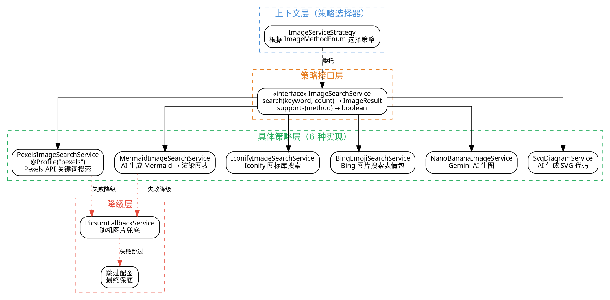

# 03 · 配图策略模式：6 种配图方式 + 降级链

> 一篇文章千字长，配图不能"一张图走天下"。ai-passage-creator 通过 **策略模式（Strategy Pattern）** 封装了 6 种截然不同的配图方式，并设计了一条从高质量到兜底的降级链，保证在任何情况下文章都能"图文并茂"地完成生成。
>
> **对应项目：** `ai-passage-creator/ai-passage-creator-java` 模块 `image` 包

---

## 一、你必须知道的 3 个核心概念

### 1.1 策略模式（Strategy Pattern）

策略模式是一种**行为型设计模式**，定义一系列算法（策略），将每个算法封装起来，使它们可以相互替换。策略模式让算法的变化独立于使用算法的客户端。

**核心三要素：**

| 要素 | 说明 | 项目中的体现 |
|------|------|-------------|
| **策略接口（Strategy）** | 定义所有策略必须实现的方法 | `ImageSearchService` 接口 |
| **具体策略（ConcreteStrategy）** | 实现策略接口的具体算法类 | Pexels、Mermaid、Iconify 等 6 个实现类 |
| **上下文（Context）** | 持有策略引用，维护对策略的调用 | `ImageServiceStrategy` 选择器 |

**为什么要用策略模式？**

配图场景天然存在"多种算法、动态选择、频繁扩展"的特性：

- 多种算法：Pexels 搜索、Mermaid 渲染、AI 生图……算法完全不同
- 动态选择：同一段正文，VIP 用户用 AI 生图，普通用户用 Pexels
- 频繁扩展：未来可能新增 Unsplash、DALL-E 等方式，不能改现有代码

策略模式正好解决了这三个问题——开闭原则、策略独立、运行时切换。

### 1.2 降级机制（Degradation / Fallback Chain）

降级机制是**保证系统稳定性的最后一层防线**。在配图场景中，降级指"主配图策略失败后，自动切换到备选策略，确保文章生成不中断"。

**降级链设计（从高到低）：**

```
Pexels / Mermaid / Iconify / 表情包 / AI 生图 / SVG  Diagram
    ↓（失败）
Picsum 随机图片（兜底）
    ↓（失败）
跳过该段落配图（最终保底）
```

**降级触发条件：**

| 条件 | 原因 | 处理方式 |
|------|------|----------|
| 网络超时 | 第三方 API 不可达 | 超时异常捕获，触发降级 |
| API 限额 | 免费配额用尽 | HTTP 429 状态码检测 |
| 搜索结果为空 | 关键词无匹配内容 | 空结果判断，降级到 Picsum |
| 图片下载失败 | CDN 或资源不可用 | 下载异常捕获 |
| 内容审核不通过 | 图片不合规 | 审核结果回调处理 |

### 1.3 配图元数据（Image Metadata）

配图元数据是**描述"在哪里配什么图"的结构化数据**，由 `ImageAnalyzerAgent` 分析正文后生成，是 `ParallelImageGenerator` 的执行依据。

```java
// 配图元数据 —— 告诉系统：在第 N 段，用 M 方式，找关键词 K 的图
public class ImageRequirement {
    private int paragraphIndex;        // 段落序号（从 0 开始）
    private String paragraphContent;   // 段落原文（用于语义分析）
    private ImageMethodEnum method;    // 选定的配图方式
    private String keyword;            // 搜索关键词（由 LLM 提取）
    private String styleHint;          // 风格提示词（如"科技感""水墨风"）
    private int priority;              // 优先级（0 最高，数字越大越优先降级）
}
```

**元数据在整个配图流程中的流转：**

```
正文 → ImageAnalyzerAgent（LLM 分析）
    → 输出 List<ImageRequirement>（配图需求列表）
    → ParallelImageGenerator 并行按需求执行
    → 每完成一个需求，发送 IMAGE_COMPLETE 事件
    → 全部完成后，ContentMergerAgent 按 paragraphIndex 插入图片
```

---

## 二、项目中的实战应用

### 2.1 解决了什么问题

**问题场景：** 一篇文章需要配多张图，配图方式多样（照片、图表、图标、表情包、AI 生图、SVG 图解），且需要根据用户权限和内容类型动态选择。

| 痛点 | 解决方案 |
|------|----------|
| 6 种配图方式 API 完全不同，耦合到业务代码中 | 策略模式统一接口，业务代码只面向 `ImageStrategy` 编程 |
| 不同用户权限（VIP/普通）使用不同配图方式 | 策略选择器根据用户等级动态路由 |
| 第三方 API 不稳定，单个失败阻塞整篇文章生成 | 降级链自动切换到备选策略，保证生成不中断 |
| 未来新增配图方式需要改大量代码 | 新增 @Service 实现类即可，零改动现有代码 |

### 2.2 设计结构图



### 2.3 六种配图方式详解

| 配图方式 | 实现类 | 实现原理 | 访问权限 | 适用场景 | 质量 | 成本 |
|----------|--------|----------|----------|----------|------|------|
| **Pexels** | `PexelsImageSearchService` | 通过 Pexels API 关键词搜索高质量照片 | 全部用户 | 通用配图、风景、人物、科技照片 | 高 | 免费 API（有配额） |
| **Mermaid** | `MermaidImageSearchService` | AI 生成 Mermaid 代码 → 渲染为 SVG 图表 | 全部用户 | 流程图、架构图、思维导图、时序图 | 中高 | 无 |
| **Iconify** | `IconifyImageSearchService` | 关键词搜索 Iconify 开源图标库 | 全部用户 | 图标点缀、概念图示、列表装饰 | 中 | 无 |
| **表情包** | `BingEmojiSearchService` | Bing 图片搜索 + 表情包过滤 | 全部用户 | 轻松幽默风格、社交媒体文案 | 中 | 无 |
| **Nano Banana** | `NanoBananaImageService` | Google Gen AI Gemini 模型生成图片 | VIP 用户 | 定制化配图、需要特定视觉风格 | 高 | Gemini API 费用 |
| **SVG Diagram** | `SvgDiagramService` | AI 生成 SVG 代码 → 直接嵌入 HTML | VIP 用户 | 概念示意图、技术图解、数据可视化 | 高 | 无 |
| **Picsum** | `PicsumFallbackService` | 调用 picsum.photos 随机图片 | 降级兜底 | 任何策略失败时自动回退 | 低 | 无 |

### 2.4 核心代码

#### 策略接口定义

```java
/**
 * 配图搜索策略接口 —— 所有配图方式都实现这个接口
 * 策略模式的核心：定义统一的算法契约
 */
public interface ImageSearchService {

    /**
     * 根据关键词搜索图片
     *
     * @param keyword 搜索关键词（由 LLM 从正文中提取）
     * @param count   需要的图片数量
     * @return 图片搜索结果，包含 URL 列表和元数据
     */
    ImageResult search(String keyword, int count);

    /**
     * 判断当前策略是否支持指定的配图方式
     *
     * @param method 配图方式枚举
     * @return true 表示支持
     */
    boolean supports(ImageMethodEnum method);
}
```

#### 配图方式枚举

```java
/**
 * 配图方式枚举 —— 定义所有可用的配图方式及其访问权限
 * 新增配图方式：在这里加一个枚举值即可
 */
public enum ImageMethodEnum {

    PEXELS("pexels", "Pexels 图库", AccessLevel.ALL),
    MERMAID("mermaid", "Mermaid 图表", AccessLevel.ALL),
    ICONIFY("iconify", "Iconify 图标", AccessLevel.ALL),
    BING_EMOJI("bingEmoji", "Bing 表情包", AccessLevel.ALL),
    NANO_BANANA("nanoBanana", "Nano Banana AI 生图", AccessLevel.VIP),   // 仅 VIP
    SVG_DIAGRAM("svgDiagram", "SVG 图解", AccessLevel.VIP),              // 仅 VIP
    PICSUM("picsum", "Picsum 随机图片", AccessLevel.FALLBACK);           // 降级兜底

    private final String beanName;       // 对应 Spring Bean 名称
    private final String displayName;    // 展示名称
    private final AccessLevel accessLevel; // 访问权限

    ImageMethodEnum(String beanName, String displayName, AccessLevel accessLevel) {
        this.beanName = beanName;
        this.displayName = displayName;
        this.accessLevel = accessLevel;
    }

    // 判断当前用户是否有权限使用此配图方式
    public boolean isAccessibleBy(User user) {
        if (this.accessLevel == AccessLevel.ALL) return true;
        if (this.accessLevel == AccessLevel.VIP) return user.isVip();
        return false; // FALLBACK 不对外暴露
    }

    // getter 略
    public enum AccessLevel { ALL, VIP, FALLBACK }
}
```

#### 策略选择器（Context）

```java
/**
 * 配图策略选择器 —— 策略模式的 Context 角色
 * 负责将配图方式枚举路由到具体的策略实现
 */
@Service
public class ImageServiceStrategy {

    /**
     * Spring 自动注入所有 ImageSearchService 类型的 Bean
     * key = Bean 名称（如 "pexelsImageSearchService"）
     * value = 策略实现实例
     * 新增策略实现类时，Spring 自动将其加入此 Map，零改动
     */
    private final Map<String, ImageSearchService> serviceMap;

    public ImageServiceStrategy(Map<String, ImageSearchService> serviceMap) {
        this.serviceMap = serviceMap;
    }

    /**
     * 根据配图方式获取对应的策略实现
     *
     * @param method 配图方式枚举
     * @return 策略实现，如果找不到返回 null
     */
    public ImageSearchService getService(ImageMethodEnum method) {
        // 遍历所有注册的策略，找到支持该方法的实现
        return serviceMap.values().stream()
            .filter(s -> s.supports(method))
            .findFirst()
            .orElse(null);
    }

    /**
     * 获取用户可用的所有配图方式列表
     * 用于前端展示"可选配图方式"下拉框
     */
    public List<ImageMethodEnum> getAvailableMethods(User user) {
        return Arrays.stream(ImageMethodEnum.values())
            .filter(m -> m.isAccessibleBy(user))
            .collect(Collectors.toList());
    }
}
```

#### Pexels 策略实现示例

```java
/**
 * Pexels 图库配图策略 —— 通过 Pexels API 搜索高质量照片
 * 
 * 策略模式的具体策略之一
 * @Service 注册为 Spring Bean，名称由 ImageMethodEnum.PEXELS.beanName 决定
 */
@Service("pexelsImageSearchService")
@Profile("pexels") // 通过配置启用：spring.profiles.include=pexels
public class PexelsImageSearchService implements ImageSearchService {

    @Value("${pexels.api.key}")
    private String apiKey; // Pexels API Key，从环境变量读取

    private static final String PEXELS_API_URL = "https://api.pexels.com/v1/search";

    @Override
    public ImageResult search(String keyword, int count) {
        // 1. 构建 HTTP 请求
        // 使用 RestTemplate 调用 Pexels REST API
        // 请求头：Authorization: Bearer ${apiKey}
        // 请求参数：query=${keyword}, per_page=${count}

        // 2. 解析响应，提取图片 URL
        // Pexels 返回 JSON，包含 photos[].src.original

        // 3. 上传到腾讯云 COS（防止外部链接失效）
        // 将图片下载后上传至 COS，返回 COS URL

        // 4. 封装为 ImageResult 返回
        return ImageResult.success(imageUrls, ImageMethodEnum.PEXELS);
    }

    @Override
    public boolean supports(ImageMethodEnum method) {
        // 明确声明：本策略只处理 PEXELS 类型
        return method == ImageMethodEnum.PEXELS;
    }
}
```

#### 降级链实现

```java
/**
 * 并行配图生成器 —— 协调多张配图的并行生成和降级链
 * 接收 ImageRequirement 列表，并行执行，自动降级
 */
@Component
public class ParallelImageGenerator {

    private final ImageServiceStrategy strategySelector; // 策略选择器
    private final SseEmitterManager emitterManager;      // SSE 事件推送

    // 降级策略链：按优先级排序
    private static final List<ImageMethodEnum> FALLBACK_CHAIN = List.of(
        ImageMethodEnum.PICSUM,   // 第一级降级：Picsum 随机图片
        ImageMethodEnum.PICSUM    // 第二级降级：还是 Picsum（不同关键词）
        // 再失败就跳过（在代码中处理）
    );

    /**
     * 并行执行所有配图需求，每张图独立降级
     *
     * @param requirements 配图需求列表
     * @param user         当前用户（用于权限判断）
     * @return 配图结果列表（数量 ≤ 需求数量，失败的跳过）
     */
    public List<ImageResult> generateAll(List<ImageRequirement> requirements, User user) {
        // 使用虚拟线程（Java 21+）或线程池并行执行
        // 每张配图独立执行，互不影响
        List<CompletableFuture<ImageResult>> futures = requirements.stream()
            .map(req -> CompletableFuture.supplyAsync(() -> generateWithFallback(req, user)))
            .toList();

        // 等待所有并行任务完成
        return futures.stream()
            .map(CompletableFuture::join)
            .filter(Objects::nonNull) // 过滤掉完全失败的（跳过配图）
            .collect(Collectors.toList());
    }

    /**
     * 单张配图生成 + 降级链
     * 核心逻辑：try-catch 包裹，失败后沿降级链尝试
     */
    private ImageResult generateWithFallback(ImageRequirement req, User user) {
        // 1. 尝试主策略
        ImageMethodEnum primaryMethod = req.getMethod();
        if (!primaryMethod.isAccessibleBy(user)) {
            // 用户无权限，直接降级
            return tryFallback(req, 0);
        }

        try {
            ImageSearchService service = strategySelector.getService(primaryMethod);
            ImageResult result = service.search(req.getKeyword(), 1);
            if (result != null && result.hasImages()) {
                // 推送"一张配图完成"事件
                emitterManager.sendEvent(req.getTaskId(), "IMAGE_COMPLETE", result);
                return result;
            }
        } catch (Exception e) {
            // 主策略失败，记录日志后降级
            log.warn("主配图策略失败，开始降级。method={}, keyword={}, error={}",
                primaryMethod, req.getKeyword(), e.getMessage());
        }

        // 2. 主策略失败，尝试降级链
        return tryFallback(req, 0);
    }

    /**
     * 递归尝试降级链
     * 
     * @param level 当前降级级别（0 = 第一级降级）
     */
    private ImageResult tryFallback(ImageRequirement req, int level) {
        if (level >= FALLBACK_CHAIN.size()) {
            // 降级链全部用尽，跳过此段落配图
            log.warn("降级链已用尽，跳过配图。paragraphIndex={}", req.getParagraphIndex());
            return null;
        }

        ImageMethodEnum fallbackMethod = FALLBACK_CHAIN.get(level);
        try {
            ImageSearchService service = strategySelector.getService(fallbackMethod);
            ImageResult result = service.search(req.getKeyword(), 1);
            if (result != null && result.hasImages()) {
                emitterManager.sendEvent(req.getTaskId(), "IMAGE_COMPLETE", result);
                return result;
            }
        } catch (Exception e) {
            log.warn("降级策略失败，继续下一级。method={}, level={}", fallbackMethod, level);
        }

        // 递归尝试下一级降级
        return tryFallback(req, level + 1);
    }
}
```

#### 完整的配图流程

```java
/**
 * 配图流程编排 —— ImageAnalyzerAgent 分析 → ParallelImageGenerator 生成 → ContentMergerAgent 合并
 * 这是 StateGraph 中 "正文+配图" 阶段的核心执行逻辑
 */
@Component
public class ImagePipelineOrchestrator {

    // ========== 第一步：ImageAnalyzerAgent 分析正文 ==========
    public List<ImageRequirement> analyzeContent(String content, User user) {
        // 1. 调用 LLM 分析正文段落
        // Prompt: "请分析以下 Markdown 正文，找出需要配图的段落，
        //          并为每段推荐最合适的配图方式和搜索关键词。
        //          考虑用户权限：VIP 用户可使用 ALL 方式，普通用户仅限 FREE 方式。"

        // 2. LLM 返回结构化 JSON 配图需求列表
        // 示例输出：
        // [
        //   { "paragraphIndex": 2, "method": "MERMAID",    "keyword": "微服务架构图" },
        //   { "paragraphIndex": 5, "method": "PEXELS",     "keyword": "程序员工作" },
        //   { "paragraphIndex": 8, "method": "NANO_BANANA", "keyword": "AI 未来城市" }
        // ]

        // 3. 过滤用户无权限的配图方式，替换为 FREE 方式
        return requirements.stream()
            .map(req -> {
                if (!req.getMethod().isAccessibleBy(user)) {
                    req.setMethod(ImageMethodEnum.PEXELS); // 降级为通用方式
                }
                return req;
            })
            .collect(Collectors.toList());
    }

    // ========== 第二步：ParallelImageGenerator 并行生成 ==========
    public List<ImageResult> generateImages(List<ImageRequirement> requirements, User user) {
        return parallelImageGenerator.generateAll(requirements, user);
    }

    // ========== 第三步：ContentMergerAgent 合并图文 ==========
    public String mergeContent(String content, List<ImageResult> images) {
        // 将 Markdown 正文按段落分割
        // 在每段对应的位置插入图片 Markdown 语法
        // 支持图片位置微调（段落前、段落后、段落中间）
        return contentMergerAgent.merge(content, images);
    }
}
```

---

## 三、面试题

### Q1: 策略模式在配图系统中的优缺点？

**优点：**

| 优点 | 说明 |
|------|------|
| **开闭原则** | 新增配图方式（如 Unsplash、DALL-E）无需修改现有代码，只需新增实现类。符合"对扩展开放，对修改关闭" |
| **策略独立** | 每种配图方式独立测试、独立部署。Pexels API 挂了不影响 Mermaid 配图 |
| **运行时切换** | 可根据用户权限、内容类型、系统负载动态选择策略。VIP 用户走 AI 生图，普通用户走 Pexels |
| **降级自然** | 主策略失败时，通过降级链切换到备选策略，保证系统不中断 |

**缺点：**

| 缺点 | 说明 |
|------|------|
| **类数量膨胀** | 每种策略一个类，6 种配图方式就是 6 个类。如果策略很多（如 20+），维护成本上升 |
| **客户端需了解策略差异** | 调用方需要知道哪种策略适合什么场景，如果策略选择逻辑复杂，需要引入额外的选择器（如 LLM 分析） |
| **策略间可能重复** | 不同策略可能有相同的逻辑（如图片上传 COS），需要提取公共抽象类或工具类 |

### Q2: 降级策略设计需要考虑哪些因素？

**降级策略的四个设计维度：**

| 维度 | 考虑点 | 项目中的实现 |
|------|--------|-------------|
| **降级粒度** | 单张图降级 vs 整批降级 | 单张图独立降级，A 图失败不影响 B 图 |
| **降级深度** | 降级几层？何时停止？ | 3 层：主策略 → Picsum → 跳过 |
| **降级通知** | 用户是否感知降级？ | 前端显示"配图方式降级提示" |
| **降级统计** | 降级频率监控 | 日志记录降级事件，用于报警和优化 |

**降级策略的代码模板：**

```java
// 降级链通用模板 —— 适用于任何需要降级的场景
public <T> T executeWithFallback(
        Supplier<T> primary,      // 主策略
        List<Supplier<T>> fallbacks, // 降级链
        T ultimateFallback) {     // 最终兜底

    // 尝试主策略
    try {
        T result = primary.get();
        if (result != null) return result;
    } catch (Exception e) {
        log.warn("主策略执行失败", e);
    }

    // 遍历降级链
    for (int i = 0; i < fallbacks.size(); i++) {
        try {
            T result = fallbacks.get(i).get();
            if (result != null) return result;
        } catch (Exception e) {
            log.warn("第 {} 级降级失败", i + 1, e);
        }
    }

    // 最终兜底
    return ultimateFallback;
}
```

### Q3: 新增一种配图方式需要修改哪些代码？

**三步走 —— 零改动现有代码：**

```
第 1 步：在 ImageMethodEnum 中新增枚举值
第 2 步：实现 ImageSearchService 接口，@Service 注册
第 3 步：在配置文件中启用新方式
```

**具体代码示例：**

```java
// 第 1 步：枚举（加一行）
public enum ImageMethodEnum {
    PEXELS, MERMAID, ICONIFY, BING_EMOJI, NANO_BANANA, SVG_DIAGRAM,
    PICSUM,
    UNSPLASH("unsplash", "Unsplash 图库", AccessLevel.ALL); // ← 新增
}

// 第 2 步：实现类（新文件）
@Service("unsplashImageSearchService")
public class UnsplashImageSearchService implements ImageSearchService {
    @Override
    public ImageResult search(String keyword, int count) {
        // 调用 Unsplash API 搜索图片
        // ...
    }

    @Override
    public boolean supports(ImageMethodEnum method) {
        return method == ImageMethodEnum.UNSPLASH;
    }
}

// 第 3 步：配置（可选，如果与已有方式冲突需要调整）
// application.yml
// image:
//   strategy:
//     priority: pexels, unsplash, mermaid, ...
```

**为什么不需要改其他代码？**
- `ImageServiceStrategy` 自动通过 `Map<String, ImageSearchService>` 注入所有实现
- `ImageAnalyzerAgent` 的 Prompt 由 LLM 自动适配新方式
- 降级链在 `ParallelImageGenerator` 中统一管理

---

## 四、避坑指南

### 4.1 图片存储：不要直接引用第三方 URL

```
❌ 错误做法：直接使用 Pexels/Iconify 的原始 URL
   问题：外部链接可能失效、速度慢、违反服务条款

✅ 正确做法：下载后上传到腾讯云 COS，使用 COS URL
   流程：下载图片 → 上传 COS → 返回 COS URL
   优点：可控、持久、国内访问速度快
```

### 4.2 并发控制：多张配图并行生成时的资源限制

```java
// 使用信号量控制并发度，避免 API 被限流
private final Semaphore pexelsSemaphore = new Semaphore(5); // 最多 5 个并发
private final Semaphore geminiSemaphore = new Semaphore(2);  // AI 生图更贵，限制更严

public ImageResult searchWithRateLimit(String keyword, int count) {
    Semaphore semaphore = getSemaphoreForMethod(method);
    if (!semaphore.tryAcquire(3, TimeUnit.SECONDS)) {
        // 获取信号量超时，直接降级
        return fallback(keyword);
    }
    try {
        return doSearch(keyword, count);
    } finally {
        semaphore.release();
    }
}
```

### 4.3 超时处理：第三方 API 调用必须设置超时

```java
// RestTemplate 配置（全局）
@Bean
public RestTemplate imageRestTemplate() {
    HttpComponentsClientHttpRequestFactory factory =
        new HttpComponentsClientHttpRequestFactory();
    factory.setConnectTimeout(3000);      // 连接超时：3 秒
    factory.setReadTimeout(5000);         // 读取超时：5 秒
    factory.setConnectionRequestTimeout(2000); // 请求超时：2 秒
    return new RestTemplate(factory);
}

// 单次调用超时（更精细的控制）
// 对于 AI 生图这类耗时操作，单独设置更长的超时
Duration timeout = method == ImageMethodEnum.NANO_BANANA
    ? Duration.ofSeconds(30)  // AI 生图：30 秒
    : Duration.ofSeconds(5);  // 普通搜索：5 秒
```

### 4.4 缓存策略：避免重复请求相同关键词

```java
/**
 * 配图结果缓存 —— 相同关键词在短时间内不重复请求
 * 文章生成过程中，可能多个段落需要相似关键词的配图
 */
@Component
public class ImageCacheManager {
    // 本地缓存，TTL 30 分钟
    private final Cache<String, ImageResult> cache = Caffeine.newBuilder()
        .expireAfterWrite(30, TimeUnit.MINUTES)
        .maximumSize(1000)
        .build();

    public ImageResult getOrSearch(String keyword, ImageSearchService service) {
        return cache.get(keyword, k -> {
            // 缓存未命中，调用实际的搜索
            return service.search(k, 1);
        });
    }
}
```

### 4.5 配置管理：策略优先级与开关

```yaml
# application.yml —— 配图策略配置
image:
  strategy:
    # 策略优先级列表（越靠前优先级越高）
    priority:
      - pexels
      - mermaid
      - iconify
      - bingEmoji
      - nanoBanana    # VIP 用户可用
      - svgDiagram    # VIP 用户可用
    # 降级策略配置
    fallback:
      enabled: true           # 是否启用降级
      maxRetries: 3           # 单策略最大重试次数
      chainTimeoutMs: 10000   # 整条降级链超时时间

  # 各策略的 API 配置
  pexels:
    api-key: ${PEXELS_API_KEY}
    per-page: 5
  mermaid:
    theme: neutral
  iconify:
    cache-ttl: 3600
```