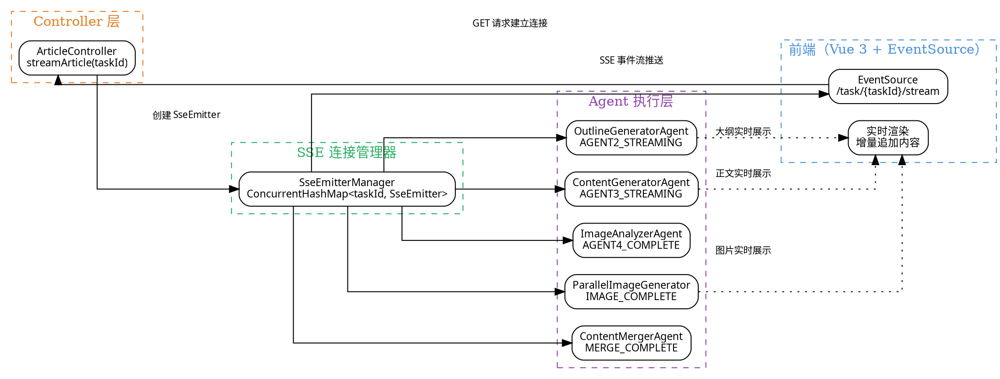

# 04 · SSE 流式输出：10 种事件类型 + 实时推送架构

> AI 生成一篇文章需要 10-30 秒——如果等全部生成完再返回，用户早就离开了。ai-passage-creator 采用 **SSE（Server-Sent Events）** 流式架构，将 5 个 Agent 的生成过程实时推送到前端，让用户"边看边等"，体验从"等待进度条"升级为"观看创作过程"。
>
> **对应项目：** `ai-passage-creator/ai-passage-creator-java` 模块 `sse` 包

---

## 一、你必须知道的 3 个核心概念

### 1.1 SSE（Server-Sent Events）

SSE 是 HTML5 标准中**服务端向客户端单向推送数据**的技术。与 WebSocket 不同，SSE 基于标准 HTTP 协议，浏览器原生支持，无需引入第三方库。

**SSE 的核心特点：**

| 特性 | 说明 |
|------|------|
| 通信方向 | 单向：服务端 → 客户端 |
| 传输协议 | HTTP（标准 HTTP/1.1 长连接或 HTTP/2） |
| 数据格式 | `text/event-stream`（纯文本，UTF-8 编码） |
| 浏览器 API | `EventSource`（原生支持，零依赖） |
| 自动重连 | **内置**：连接断开后浏览器自动重试（Last-Event-ID） |
| 跨域 | 支持 CORS 头 |

**典型 SSE 数据流格式：**

```
event: AGENT3_STREAMING
data: {"type":"text","content":"Spring Boot 的核心思想是"}

event: AGENT3_STREAMING
data: {"type":"text","content":"约定优于配置"}

event: AGENT3_COMPLETE
data: {"type":"complete","content":"..."}

event: IMAGE_COMPLETE
data: {"type":"image","url":"https://cos.example.com/xxx.jpg"}
```

**SSE 协议规范（每个事件由以下字段组成）：**

| 字段 | 说明 | 是否必需 |
|------|------|----------|
| `event` | 事件类型，前端用 `addEventListener` 监听 | 可选 |
| `data` | 事件数据，可以是任意文本（JSON 字符串） | 必需 |
| `id` | 事件 ID，用于断线重连时的 Last-Event-ID | 可选 |
| `retry` | 重连间隔（毫秒），浏览器断开后重试等待时间 | 可选 |

### 1.2 事件流（Event Stream）

事件流是**一系列有序的 SSE 事件序列**，贯穿整个文章生成过程。每个事件代表一个 Agent 的执行状态变化，前端通过监听不同事件类型来更新 UI。

**事件流生命周期：**

```
用户发起生成请求
    │
    ▼  ┌──────────────────────────────────────────┐
    ├──│ AGENT1_COMPLETE  │ 标题生成完成            │ ← 阶段 1 结束
    │   └──────────────────────────────────────────┘
    │
    ▼  ┌──────────────────────────────────────────┐
    ├──│ AGENT2_STREAMING  │ 大纲流式输出中...      │
    ├──│ AGENT2_STREAMING  │ 大纲流式输出中...      │
    ├──│ AGENT2_COMPLETE   │ 大纲生成完成           │ ← 阶段 2 结束
    │   └──────────────────────────────────────────┘
    │
    ▼  ┌──────────────────────────────────────────┐
    ├──│ AGENT3_STREAMING  │ 正文流式输出中...      │
    ├──│ AGENT3_STREAMING  │ 正文流式输出中...      │
    ├──│ AGENT3_COMPLETE   │ 正文生成完成           │
    ├──│ AGENT4_COMPLETE   │ 配图分析完成           │
    ├──│ IMAGE_COMPLETE    │ 第 1 张配图完成        │
    ├──│ IMAGE_COMPLETE    │ 第 2 张配图完成        │
    ├──│ AGENT5_COMPLETE   │ 全部配图就绪           │
    ├──│ MERGE_COMPLETE    │ 图文合并完成           │ ← 完成
    │   └──────────────────────────────────────────┘
    │
    ▼
  前端关闭 EventSource 连接
```

### 1.3 线程模型（Threading Model）

SSE 的线程模型是理解其高性能的关键。Spring 的 `SseEmitter` 基于**异步 Servlet**（`DeferredResult`）机制，请求线程不阻塞，由业务线程池执行实际工作。

**传统请求线程模型（阻塞）：**

```
HTTP 请求线程 → 等待业务执行 → 返回响应 → 释放线程
                ↑ 线程被占住，无法处理其他请求
```

**SseEmitter 异步线程模型（非阻塞）：**

```
HTTP 请求线程 → 创建 SseEmitter → 返回（释放线程）
    ↑ 线程立即释放，可以处理其他请求

业务线程池（独立） → 持续写入 SseEmitter → 事件推送到前端
    ↑ 业务线程独立执行，不占 Tomcat 线程
```

**三种线程的角色：**

| 线程类型 | 职责 | 线程池 | 关键点 |
|----------|------|--------|--------|
| **Tomcat 请求线程** | 接收 HTTP 请求，创建 SseEmitter | Tomcat 内置（默认 200） | 创建后立即释放 |
| **业务线程池** | 执行 Agent 逻辑，写入 SseEmitter | `@Async` 线程池 | 自定义大小，隔离 Agent 执行 |
| **NIO 工作线程** | 底层网络写入 | Tomcat NIO | 自动管理，无需关心 |

---

## 二、项目中的实战应用

### 2.1 解决了什么问题

**问题场景：** AI 文章生成过程包含 5 个 Agent 的流水线执行，每个 Agent 都需要几秒到十几秒。用户需要实时看到生成进度，而不是等待一个"未知时长"的请求。

| 痛点 | 解决方案 |
|------|----------|
| 大模型生成慢，用户等待焦虑 | SSE 流式输出，Agent 生成内容逐段推送，首字延迟 < 1s |
| 5 个 Agent 执行进度不可见 | 10 种事件类型，前端实时渲染每个阶段 |
| 配图生成过程不可见 | `IMAGE_COMPLETE` 事件，每张图完成立即展示 |
| 断网后丢失中间结果 | SSE 内置自动重连 + `retry` 字段控制重试间隔 |

### 2.2 设计结构图



### 2.3 10 种事件类型详解

| 事件名 | 触发时机 | 发送方 | 数据内容 | 前端处理 |
|--------|----------|--------|----------|----------|
| `AGENT1_COMPLETE` | 标题生成完成 | TitleGeneratorAgent | 标题列表（JSON 数组） | 展示标题选项，用户选择 |
| `AGENT2_STREAMING` | 大纲流式输出中 | OutlineGeneratorAgent | 当前生成片段（文本） | 增量追加到大纲编辑区 |
| `AGENT2_COMPLETE` | 大纲生成完成 | OutlineGeneratorAgent | 完整大纲（Markdown） | 启用编辑功能 |
| `AGENT3_STREAMING` | 正文流式输出中 | ContentGeneratorAgent | 当前生成片段（文本） | 增量追加到正文预览区 |
| `AGENT3_COMPLETE` | 正文生成完成 | ContentGeneratorAgent | 完整正文（Markdown） | 启用确认按钮 |
| `AGENT4_COMPLETE` | 配图分析完成 | ImageAnalyzerAgent | 配图需求列表（JSON） | 显示配图计划 |
| `IMAGE_COMPLETE` | 单张配图完成 | ParallelImageGenerator | 图片 URL + 位置信息 | 实时展示配图 |
| `AGENT5_COMPLETE` | 全部配图就绪 | ParallelImageGenerator | 完整图片 URL 列表 | 标记配图阶段完成 |
| `MERGE_COMPLETE` | 图文合并完成 | ContentMergerAgent | 最终文章（完整 HTML） | 展示最终文章，关闭连接 |
| `ERROR` | 发生错误 | 任意 Agent | 错误信息 + 错误码 | 展示错误提示，提供重试 |

### 2.4 核心代码

#### SseEmitter 连接管理器

```java
/**
 * SSE 连接管理器 —— 管理所有 SSE 连接的生命周期
 * 
 * 核心职责：
 * 1. 创建 SseEmitter 连接
 * 2. 向指定连接推送事件
 * 3. 在连接完成或超时时清理资源
 */
@Component
public class SseEmitterManager {

    /**
     * 存储所有活跃的 SSE 连接
     * key = taskId（文章生成任务的唯一标识）
     * value = SseEmitter（SSE 连接）
     * 使用 ConcurrentHashMap 保证线程安全
     */
    private final Map<String, SseEmitter> emitterMap = new ConcurrentHashMap<>();

    /**
     * 创建 SSE 连接
     *
     * @param taskId 任务 ID
     * @param timeout 超时时间（毫秒），0 表示永不超时
     * @return SseEmitter 实例
     */
    public SseEmitter createEmitter(String taskId, long timeout) {
        // 创建 SseEmitter，设置超时时间
        // 传 0 表示永不超时（由业务逻辑控制连接关闭）
        SseEmitter emitter = new SseEmitter(timeout);

        // 注册到管理器
        emitterMap.put(taskId, emitter);

        // 注册回调：连接完成时自动清理资源
        emitter.onCompletion(() -> {
            // 客户端关闭连接或服务端主动关闭时触发
            log.info("SSE 连接完成，清理资源。taskId={}", taskId);
            emitterMap.remove(taskId);
        });

        // 注册回调：连接超时时自动清理资源
        emitter.onTimeout(() -> {
            // 超时时间到达时触发
            log.warn("SSE 连接超时。taskId={}", taskId);
            emitterMap.remove(taskId);
        });

        // 注册回调：发生错误时自动清理资源
        emitter.onError(throwable -> {
            // 网络异常或客户端断开时触发
            log.error("SSE 连接异常。taskId={}, error={}", taskId, throwable.getMessage());
            emitterMap.remove(taskId);
        });

        return emitter;
    }

    /**
     * 发送 SSE 事件
     *
     * @param taskId    任务 ID
     * @param eventName 事件名称（如 "AGENT3_STREAMING"）
     * @param data      事件数据（自动序列化为 JSON）
     */
    public void sendEvent(String taskId, String eventName, Object data) {
        SseEmitter emitter = emitterMap.get(taskId);
        if (emitter == null) {
            // 连接不存在（可能客户端已断开），静默忽略
            log.warn("SSE 连接不存在，跳过事件发送。taskId={}, event={}", taskId, eventName);
            return;
        }

        try {
            // 构建 SSE 事件并发送
            // SseEmitter.event() 创建一个事件构建器
            // .name() 设置事件名称（对应前端 addEventListener 的第一个参数）
            // .data() 设置事件数据，SseEmitter 会自动序列化为 JSON
            emitter.send(SseEmitter.event()
                .name(eventName)
                .data(data));
        } catch (IOException e) {
            // 发送失败（客户端已断开），清理连接
            log.error("SSE 事件发送失败。taskId={}, event={}", taskId, eventName, e);
            emitterMap.remove(taskId);
        }
    }

    /**
     * 完成 SSE 连接（正常结束）
     */
    public void complete(String taskId) {
        SseEmitter emitter = emitterMap.get(taskId);
        if (emitter != null) {
            emitter.complete(); // 发送完成信号，触发 onCompletion 回调
        }
    }

    /**
     * 异常结束 SSE 连接（发送错误后关闭）
     */
    public void completeWithError(String taskId, Throwable error) {
        SseEmitter emitter = emitterMap.get(taskId);
        if (emitter != null) {
            emitter.completeWithError(error); // 触发 onError 回调
        }
    }

    /**
     * 获取当前活跃连接数（监控用）
     */
    public int getActiveConnectionCount() {
        return emitterMap.size();
    }
}
```

#### Controller 层 —— 建立 SSE 连接

```java
/**
 * 文章生成 Controller —— 通过 SSE 流式返回生成结果
 * 
 * 核心接口：GET /api/article/generate/{taskId}/stream
 * 前端通过 EventSource 连接此接口，建立 SSE 长连接
 */
@RestController
@RequestMapping("/api/article")
public class ArticleController {

    @Autowired
    private SseEmitterManager sseEmitterManager;

    @Autowired
    private ArticleGenerationService generationService;

    /**
     * 建立 SSE 流式连接，开始文章生成
     *
     * 返回类型是 SseEmitter，Spring MVC 会自动处理：
     * 1. 设置 Content-Type: text/event-stream
     * 2. 使用异步 Servlet 机制，不阻塞 Tomcat 线程
     * 3. 返回 SseEmitter 实例，后续通过它写入数据
     * 
     * @param taskId 文章生成任务 ID
     * @return SseEmitter SSE 连接实例
     */
    @GetMapping("/generate/{taskId}/stream")
    public SseEmitter streamArticle(@PathVariable String taskId) {
        // 1. 创建 SSE 连接（永不超时，由业务逻辑控制结束）
        // 0L 表示永不超时，因为文章生成可能耗时较长
        SseEmitter emitter = sseEmitterManager.createEmitter(taskId, 0L);

        // 2. 异步启动文章生成流程
        // 不能阻塞当前线程——当前线程是 Tomcat 请求线程
        // 使用 @Async 让 Spring 线程池执行，立即返回 emitter
        generationService.startGeneration(taskId);

        // 3. 返回 SseEmitter，Spring 会自动保持连接
        // 当前线程立即释放，返回 Tomcat 线程池
        return emitter;
    }
}
```

#### 在 Agent 中发送 SSE 事件

```java
/**
 * 正文生成 Agent —— 流式输出正文内容到 SSE
 * 
 * 演示 Agent 如何实时推送生成内容到前端
 * 每秒生成的内容通过 SSE 事件推送，用户可实时看到文章"写出来"
 */
@Component
public class ContentGeneratorAgent {

    @Autowired
    private SseEmitterManager sseEmitterManager;

    /**
     * 生成正文，流式输出到 SSE
     *
     * @param taskId 任务 ID
     * @param outline 大纲（Markdown 格式）
     */
    public void generate(String taskId, String outline) {
        try {
            // 调用 AI 大模型（Spring AI Alibaba DashScope）
            // 设置流式参数 stream = true
            // 模型会逐个 Token 返回生成内容
            Flux<ChatMessage> stream = chatClient.prompt()
                .user(u -> u.text("根据以下大纲生成一篇技术文章：\n\n" + outline))
                .stream()
                .chatResponse();

            // 订阅流式响应，每个 Token 到达时发送 SSE 事件
            stream.subscribe(
                // onNext：每个 Token 到达时调用
                response -> {
                    String content = response.getResult().getOutput().getContent();
                    // 发送 AGENT3_STREAMING 事件，前端增量追加
                    sseEmitterManager.sendEvent(taskId, "AGENT3_STREAMING",
                        Map.of("type", "text", "content", content));
                },
                // onError：发生错误时调用
                error -> {
                    sseEmitterManager.sendEvent(taskId, "ERROR",
                        Map.of("message", "正文生成失败", "code", "AGENT3_ERROR"));
                    sseEmitterManager.completeWithError(taskId, error);
                },
                // onComplete：所有 Token 都生成完毕
                () -> {
                    // 发送 AGENT3_COMPLETE 事件，通知前端正文生成完毕
                    sseEmitterManager.sendEvent(taskId, "AGENT3_COMPLETE",
                        Map.of("type", "complete", "content", fullContent));
                }
            );
        } catch (Exception e) {
            // 异常处理
            sseEmitterManager.sendEvent(taskId, "ERROR",
                Map.of("message", "正文生成异常", "code", "AGENT3_ERROR"));
            sseEmitterManager.completeWithError(taskId, e);
        }
    }
}
```

#### 前端 EventSource 监听

```javascript
/**
 * 前端 SSE 事件监听 —— 使用 EventSource 接收服务端推送
 * 
 * EventSource 是浏览器原生 API，零依赖
 * 自动处理重连（使用 Last-Event-ID）
 */
export function connectArticleStream(taskId) {
    // 建立 SSE 连接
    // EventSource 会自动发送 GET 请求到指定 URL
    // 服务端返回 Content-Type: text/event-stream 后建立长连接
    const eventSource = new EventSource(`/api/article/generate/${taskId}/stream`);

    // ====== 监听 AGENT2_STREAMING：大纲增量输出 ======
    eventSource.addEventListener('AGENT2_STREAMING', (event) => {
        const data = JSON.parse(event.data);
        // 增量追加到大纲编辑器
        outline.value += data.content;
        // 自动滚动到最新内容
        scrollToBottom('outline-editor');
    });

    // ====== 监听 AGENT2_COMPLETE：大纲生成完成 ======
    eventSource.addEventListener('AGENT2_COMPLETE', (event) => {
        // 大纲生成完成，启用编辑按钮
        outlineComplete.value = true;
        showNotification('大纲已生成，您可以编辑或确认');
    });

    // ====== 监听 AGENT3_STREAMING：正文增量输出 ======
    eventSource.addEventListener('AGENT3_STREAMING', (event) => {
        const data = JSON.parse(event.data);
        // 增量追加到正文预览区
        content.value += data.content;
    });

    // ====== 监听 AGENT3_COMPLETE：正文生成完成 ======
    eventSource.addEventListener('AGENT3_COMPLETE', (event) => {
        contentComplete.value = true;
    });

    // ====== 监听 AGENT4_COMPLETE：配图分析完成 ======
    eventSource.addEventListener('AGENT4_COMPLETE', (event) => {
        const data = JSON.parse(event.data);
        // 显示配图计划
        imagePlan.value = data.requirements;
        showNotification(`计划插入 ${data.requirements.length} 张配图`);
    });

    // ====== 监听 IMAGE_COMPLETE：单张配图完成 ======
    eventSource.addEventListener('IMAGE_COMPLETE', (event) => {
        const data = JSON.parse(event.data);
        // 实时显示配图
        images.value.push({
            url: data.url,
            paragraphIndex: data.paragraphIndex,
            method: data.method
        });
        // 更新进度
        imageProgress.value = `${images.value.length} / ${imagePlan.value.length}`;
    });

    // ====== 监听 MERGE_COMPLETE：图文合并完成 ======
    eventSource.addEventListener('MERGE_COMPLETE', (event) => {
        const data = JSON.parse(event.data);
        // 展示最终文章
        article.value = data.article;
        // 关闭 SSE 连接
        eventSource.close();
        showNotification('文章已生成完成');
    });

    // ====== 监听 ERROR：错误处理 ======
    eventSource.addEventListener('ERROR', (event) => {
        const data = JSON.parse(event.data);
        // 展示错误信息
        showError(data.message);
        // 提供重试按钮
        showRetryButton(taskId);
    });

    // ====== 通用错误处理（EventSource 连接错误） ======
    eventSource.onerror = (error) => {
        console.error('SSE 连接错误', error);
        // EventSource 会自动重连，无需手动处理
        // 如果重连多次失败，提示用户
        showNotification('连接异常，正在重连...');
    };

    // 返回 eventSource 实例，用于手动关闭
    return eventSource;
}
```

---

## 三、面试题

### Q1: SSE 和 WebSocket 的区别？怎么选型？

**核心区别对比：**

| 维度 | SSE | WebSocket |
|------|-----|-----------|
| 通信方向 | 服务端 → 客户端（单向） | 客户端 ↔ 服务端（全双工） |
| 协议基础 | HTTP（标准 HTTP 协议） | 独立协议（ws:// / wss://） |
| 浏览器支持 | 原生 `EventSource` API | 原生 `WebSocket` API |
| 自动重连 | **内置**：浏览器自动重试，支持 Last-Event-ID | 无内置，需手动实现重连逻辑 |
| 流式数据 | 天然支持（`text/event-stream` 格式） | 需自定义消息协议 |
| 传输效率 | 较低（HTTP 头部开销） | 高（二进制帧，头部开销小） |
| 跨域 | 支持 CORS | 支持 |
| 服务端实现 | 简单（Spring SseEmitter） | 较复杂（WebSocketHandler / STOMP） |

**选型指南：**

| 场景 | 推荐方案 | 原因 |
|------|----------|------|
| AI 流式输出（大模型 Token 逐字推送） | **SSE** | 单向推送，天然支持流式，自动重连 |
| 实时聊天 / 即时通讯 | **WebSocket** | 需要双向通信，发送方和接收方都需主动推送 |
| 任务进度推送 | **SSE** | 服务端单向推送，简单可靠 |
| 实时协作编辑 | **WebSocket** | 需要双向同步，低延迟 |
| 股票行情 / 实时数据 | **SSE** | 数据量大，服务端单向推送 |
| 游戏 / 实时白板 | **WebSocket** | 低延迟，双向通信，二进制帧支持 |

**项目中的选择理由：** ai-passage-creator 的场景是"服务端生成 → 前端展示"，纯单向推送，不需要前端主动发消息。SSE 的自动重连特性在 AI 生成场景中尤其重要——用户网络不稳定时，断线后自动恢复，继续接收生成内容。

### Q2: SseEmitter 的连接管理方案？

**连接生命周期管理：**

```java
/**
 * SSE 连接管理的最佳实践 —— 以 ai-passage-creator 为例
 */
@Component
public class SseConnectionManager {

    // 1. 连接存储：使用 ConcurrentHashMap
    private final ConcurrentHashMap<String, SseEmitter> emitters = new ConcurrentHashMap<>();

    // 2. 定期清理过期连接（定时任务）
    @Scheduled(fixedRate = 60000) // 每分钟执行一次
    public void cleanStaleConnections() {
        emitters.forEach((taskId, emitter) -> {
            try {
                // 发送心跳检测连接是否存活
                emitter.send(SseEmitter.event().name("heartbeat").data("ping"));
            } catch (IOException e) {
                // 发送失败，连接已断开，清理
                log.warn("清理过期连接。taskId={}", taskId);
                emitters.remove(taskId);
            }
        });
    }

    // 3. 连接数限制（防止资源耗尽）
    private static final int MAX_CONNECTIONS = 1000;

    public SseEmitter createWithLimit(String taskId, long timeout) {
        if (emitters.size() >= MAX_CONNECTIONS) {
            throw new ServiceException("SSE 连接数已达上限，请稍后重试");
        }
        return createEmitter(taskId, timeout);
    }

    // 4. 监控端点（暴露给运维）
    @GetMapping("/internal/sse/stats")
    public Map<String, Object> getStats() {
        return Map.of(
            "activeConnections", emitters.size(),
            "maxConnections", MAX_CONNECTIONS,
            "usagePercent", String.format("%.1f%%", emitters.size() * 100.0 / MAX_CONNECTIONS)
        );
    }
}
```

**关键管理要点：**

| 管理维度 | 做法 | 原因 |
|----------|------|------|
| 存储结构 | `ConcurrentHashMap<taskId, SseEmitter>` | 线程安全，O(1) 查找 |
| 超时设置 | 业务场景决定（0 = 永不超时） | AI 生成时间不确定，短超时会导致连接意外断开 |
| 资源清理 | `onCompletion` / `onTimeout` / `onError` 回调 | 确保连接释放时不残留 |
| 连接数限制 | 设置上限（如 1000），超限拒绝 | 防止 OOM 或 Tomcat 线程耗尽 |
| 心跳检测 | 定时发送心跳事件 | 检测"假死"连接（客户端已关闭但服务端未感知） |

### Q3: 断线重连如何实现？

**SSE 内置重连机制：**

SSE 协议本身内置了自动重连能力，浏览器 EventSource 在连接断开后会自动重试：

```javascript
// 1. 浏览器 EventSource 自动重连（默认行为）
// 断开后自动重试，默认重试间隔取决于浏览器（通常 2-3 秒）
const eventSource = new EventSource('/api/article/generate/task-123/stream');

// 2. 服务端控制重连间隔（通过 retry 字段）
// 服务端可以在事件中发送 retry 字段，控制浏览器重连等待时间
// 发送 retry: 3000 表示：断开后等待 3 秒再重试
emitter.send(SseEmitter.event()
    .name("")       // 空事件名
    .data("retry")  // 数据内容
    .comment("retry: 3000") // 重连间隔 3 秒
    // 或者直接使用 retry 字段
);
```

**服务端断线恢复逻辑：**

```java
/**
 * 断线重连支持 —— 通过 Last-Event-ID 恢复上下文
 * 
 * 当客户端断线重连时，浏览器会自动发送 Last-Event-ID 头
 * 服务端根据此 ID 判断从哪个位置继续推送
 */
@Component
public class ReconnectionManager {

    // 存储每个任务的事件历史（用于断线重连）
    // 使用 Redis List 存储，设置 TTL 30 分钟
    private final StringRedisTemplate redisTemplate;

    /**
     * 发送事件时同时记录到事件历史
     */
    public void sendEventWithHistory(String taskId, String eventName, Object data, String eventId) {
        // 1. 发送到 SSE
        sseEmitterManager.sendEvent(taskId, eventName, data);

        // 2. 记录到 Redis（带事件 ID，用于断线重查）
        String eventJson = String.format("{\"id\":\"%s\",\"event\":\"%s\",\"data\":%s}",
            eventId, eventName, JsonUtils.toJson(data));
        redisTemplate.opsForList().rightPush("sse:history:" + taskId, eventJson);
        redisTemplate.expire("sse:history:" + taskId, Duration.ofMinutes(30));
    }

    /**
     * 处理断线重连请求
     *
     * @param taskId 任务 ID
     * @param lastEventId 客户端最后收到的事件 ID
     * @return 新的 SseEmitter
     */
    public SseEmitter handleReconnection(String taskId, String lastEventId) {
        // 1. 创建新的 SSE 连接
        SseEmitter emitter = sseEmitterManager.createEmitter(taskId, 0L);

        // 2. 查询历史事件，从 lastEventId 之后开始重放
        List<String> history = redisTemplate.opsForList()
            .range("sse:history:" + taskId, 0, -1);

        // 跳过 lastEventId 之前的事件
        boolean skip = (lastEventId != null);
        for (String eventJson : history) {
            // 解析事件 JSON
            // 如果事件 ID > lastEventId，发送到新的 emitter
            // ...
        }

        // 3. 继续推送后续事件（从当前状态继续）
        // ...

        return emitter;
    }
}
```

**前端重连状态处理：**

```javascript
// 断线重连的完整前端处理
export function connectWithReconnect(taskId) {
    let lastEventId = null;
    let retryCount = 0;
    const maxRetries = 5;

    function connect() {
        // 构建 URL：如果已有 lastEventId，带上参数
        const url = lastEventId
            ? `/api/article/generate/${taskId}/stream?lastEventId=${lastEventId}`
            : `/api/article/generate/${taskId}/stream`;

        const eventSource = new EventSource(url);

        // 所有事件监听器都记录 lastEventId
        eventSource.addEventListener('AGENT3_STREAMING', (event) => {
            lastEventId = event.lastEventId; // 更新最后事件 ID
            // 处理数据...
        });

        // 错误处理
        eventSource.onerror = (error) => {
            eventSource.close();
            retryCount++;

            if (retryCount <= maxRetries) {
                // 指数退避重试
                const delay = Math.min(1000 * Math.pow(2, retryCount), 30000);
                console.log(`将在 ${delay}ms 后重连 (第 ${retryCount}/${maxRetries} 次)`);
                setTimeout(connect, delay);
            } else {
                // 超过最大重试次数，提示用户手动刷新
                showError('连接已断开，请刷新页面重试');
            }
        };

        // 成功连接后重置重试计数
        eventSource.onopen = () => {
            retryCount = 0;
        };
    }

    connect();
}
```

---

## 四、避坑指南

### 4.1 超时设置：SseEmitter 默认超时 30 秒

```java
// ❌ 错误：使用默认超时
SseEmitter emitter = new SseEmitter(); // 默认 30 秒超时！
// 30 秒后如果没有发送任何事件，连接自动关闭，文章生成会中断

// ✅ 正确：根据业务场景设置超时
// 文章生成可能耗时 30-60 秒，设置永不超时
SseEmitter emitter = new SseEmitter(0L); // 0 = 永不超时

// 或者设置一个合理的超时时间
SseEmitter emitter = new SseEmitter(120_000L); // 2 分钟超时
```

### 4.2 资源泄漏：确保连接被正确清理

```java
// ❌ 错误：创建了 SseEmitter 但没有注册清理回调
SseEmitter emitter = new SseEmitter(0L);
emitterMap.put(taskId, emitter);
// 如果客户端断开连接，emitterMap 中的 entry 永远不会被移除！
// 长期运行会导致内存泄漏

// ✅ 正确：注册 onCompletion / onTimeout / onError 回调
SseEmitter emitter = new SseEmitter(0L);
emitter.onCompletion(() -> emitterMap.remove(taskId));
emitter.onTimeout(() -> emitterMap.remove(taskId));
emitter.onError(e -> emitterMap.remove(taskId));
emitterMap.put(taskId, emitter);
```

### 4.3 线程安全：ConcurrentHashMap 的迭代问题

```java
// ❌ 错误：在遍历时修改 Map
for (String taskId : emitterMap.keySet()) {
    if (isExpired(taskId)) {
        emitterMap.remove(taskId); // ConcurrentModificationException！
    }
}

// ✅ 正确：使用迭代器或 removeIf
emitterMap.keySet().removeIf(this::isExpired);

// ✅ 或者使用 ConcurrentHashMap 的 forEach
emitterMap.forEach((taskId, emitter) -> {
    if (isExpired(taskId)) {
        emitterMap.remove(taskId); // ConcurrentHashMap 允许在遍历时删除
    }
});
```

### 4.4 数据序列化：SseEmitter 自动调用 toString

```java
// ❌ 错误：直接发送对象，SseEmitter 会调用 toString()
// 结果：前端收到 "[object Object]"
emitter.send(SseEmitter.event().name("IMAGE_COMPLETE").data(imageResult));

// ✅ 正确：先序列化为 JSON 字符串
// 方案 1：手动序列化
emitter.send(SseEmitter.event()
    .name("IMAGE_COMPLETE")
    .data(JsonUtils.toJson(imageResult)));

// 方案 2：使用 Jackson 的 ObjectMapper（SseEmitter 支持）
// SseEmitter 默认会使用 Spring 的 HttpMessageConverter 序列化
// 但为了确保格式正确，建议显式序列化
```

### 4.5 浏览器兼容性：EventSource 不支持自定义请求头

```javascript
// ❌ 错误：EventSource 无法添加自定义请求头
const eventSource = new EventSource(url, {
    headers: { 'Authorization': 'Bearer ' + token } // ❌ 不支持！
});

// ✅ 正确做法：
// 方案 1：在 URL 中带 token 参数
const eventSource = new EventSource(`/api/article/generate/${taskId}/stream?token=${token}`);

// 方案 2：使用 Cookie（推荐）
// 将 token 放在 Cookie 中，SSE 请求会自动携带 Cookie

// 方案 3：使用 fetch + ReadableStream 替代 EventSource（复杂场景）
const response = await fetch(url, {
    headers: { 'Authorization': 'Bearer ' + token }
});
const reader = response.body.getReader();
// 手动解析 SSE 数据流...
```

### 4.6 配置参考

```yaml
# application.yml —— SSE 相关配置
spring:
  # Tomcat 异步请求配置
  mvc:
    async:
      request-timeout: 120000  # 异步请求超时时间（毫秒），默认 30 秒
  servlet:
    multipart:
      max-request-size: 10MB

# 自定义 SSE 配置
sse:
  # 连接池配置
  connection:
    max-per-user: 5           # 每个用户最大连接数
    max-total: 1000           # 全局最大连接数
    timeout: 0                # 连接超时，0 表示永不超时
  # 心跳配置
  heartbeat:
    enabled: true             # 是否启用心跳
    interval: 30000           # 心跳间隔（毫秒）
  # 重连配置
  reconnect:
    retry-interval: 3000      # 浏览器重连间隔（毫秒）
    max-retries: 5            # 最大重试次数
```