# 05 · 人机协作：三阶段创作流程 + 状态机 + 断点续作

> AI 生成内容最大的问题是"失控"——生成结果可能不符合预期，用户却没有干预的机会。ai-passage-creator 采用 **Human-in-the-loop（人机回环）** 设计，将创作流程划分为"选题 → 大纲 → 正文配图"三个阶段，每个阶段都允许用户介入编辑、优化或重新生成，在 AI 效率和人类质量之间找到平衡。
>
> **对应项目：** `ai-passage-creator/ai-passage-creator-java` 模块 `article` 包

---

## 一、你必须知道的 3 个核心概念

### 1.1 人机协作（Human-in-the-loop, HITL）

人机协作（HITL）是一种**在 AI 自动化流程中插入人工审核节点**的设计模式。AI 负责生成内容，人类负责把关质量，两者交替协作完成最终产物。

**HITL 的核心循环：**

```
AI 生成初稿 → 人类审核/编辑 → AI 根据反馈优化 → 人类确认定稿
     ↑                                            ↓
     └────────────── 循环直到满意 ──────────────┘
```

**为什么必须"人机协作"而不用"全自动"？**

| 维度 | 全自动（No Human） | 人机协作（HITL） |
|------|-------------------|------------------|
| 效率 | 高（一气呵成） | 中（需要人类介入） |
| 质量 | 不可控，可能跑偏 | 可控，每阶段把关 |
| 用户参与感 | 无，纯黑盒 | 强，用户主导方向 |
| 适用场景 | 内部自动化流水线 | 面向用户的创作类产品 |

**项目中的 HITL 体现：**

| 阶段 | AI 做什么 | 人类做什么 | 交互方式 |
|------|-----------|-----------|----------|
| 选题 | 生成 3-5 个标题方案 | 选择其中一个 | 点选 |
| 大纲 | 基于标题生成结构化大纲 | 编辑、优化、重新生成 | 文本编辑 + 指令 |
| 正文配图 | 生成正文 + 并行配图 | 实时观察进度，最终确认 | 实时观察 + 确认 |

### 1.2 状态机（State Machine）

状态机是**描述系统在不同状态之间如何流转的模型**。在文章创作中，每条文章记录都维护一个 `phase` 字段，表示当前处于哪个创作阶段，状态机定义了合法的状态流转路径。

**文章创作状态机：**

```
┌────────────────────────────────────────────────────────────┐
│                                                             │
│  TITLE_SELECTION ──→ OUTLINE_EDITING ──→ CONTENT_GENERATION ──→ COMPLETED
│  （选题选择中）       （大纲编辑中）        （正文生成中）          （完成）
│       ↑                   ↑                     ↑
│       │                   │                     │
│       └── 重新生成 ────────┴── 重新生成 ──────────┘
│       （用户不满意，回到上一阶段）
│                                                             │
└────────────────────────────────────────────────────────────┘
```

**状态流转规则：**

| 当前状态 | 合法动作 | 下一状态 |
|----------|----------|----------|
| `TITLE_SELECTION` | 用户选择标题 | `OUTLINE_EDITING` |
| `TITLE_SELECTION` | 用户要求重新生成标题 | 保持 `TITLE_SELECTION`（重新生成） |
| `OUTLINE_EDITING` | 用户确认大纲 | `CONTENT_GENERATION` |
| `OUTLINE_EDITING` | 用户编辑/优化大纲 | 保持 `OUTLINE_EDITING` |
| `CONTENT_GENERATION` | 生成完成 | `COMPLETED` |
| `COMPLETED` | 用户要求重新生成 | 回到对应阶段 |

### 1.3 断点续作（Resume / Checkpoint）

断点续作是指**系统在任意阶段中断后，用户可以从中断点继续创作**的能力。这是 HITL 流程落地的数据基础——如果用户中途刷新页面或关闭浏览器，创作进度不能丢失。

**断点续作的三层保障：**

```
第 1 层：状态持久化 —— article 表的 phase 字段记录当前阶段
第 2 层：中间结果持久化 —— titleOptions / outline / content 实时保存
第 3 层：上下文恢复 —— 前端通过 articleId 恢复整个创作现场
```

**断点续作的关键：中间结果必须"实时保存"，而不是"完成才保存"。**

```
❌ 错误：只在最终完成时保存
用户刷新 → 所有中间内容丢失 → 必须重新创作

✅ 正确：每个阶段完成立即保存
用户刷新 → 从 phase 对应的阶段恢复 → 中间结果都在
```

---

## 二、项目中的实战应用

### 2.1 解决了什么问题

**问题场景：** 用户输入一个选题，系统自动生成完整图文文章。但 AI 生成的内容可能不符合预期——标题不满意、大纲方向不对、正文跑偏。如果没有人工介入机制，用户只能"接受或放弃"。

| 痛点 | 解决方案 |
|------|----------|
| AI 生成的标题不符合预期 | 提供 3-5 个标题供用户选择，支持重新生成 |
| 大纲结构不满意 | 提供大纲在线编辑 + AI 优化指令 |
| 正文方向跑偏 | 用户在生成过程中实时观察，可在任意阶段干预 |
| 中途刷新页面丢失进度 | 三阶段状态持久化到数据库，支持断点续作 |
| 多个用户同时操作同一篇文章 | 状态机 + 乐观锁控制并发冲突 |

### 2.2 设计结构图

```dot
digraph HumanInLoop {
    rankdir = LR;
    splines = ortho;
    node [fontname = "Microsoft YaHei", fontsize = 11, shape = box, style = rounded];
    edge [fontname = "Microsoft YaHei", fontsize = 10];

    subgraph cluster_stage1 {
        label = "阶段 1：选题";
        style = dashed;
        color = "#4A90D9";
        fontcolor = "#4A90D9";
        title_ai [label = "TitleGeneratorAgent\n生成 3-5 个标题方案"];
        title_user [label = "用户\n选择标题 / 要求重新生成"];
    }

    subgraph cluster_stage2 {
        label = "阶段 2：大纲";
        style = dashed;
        color = "#27AE60";
        fontcolor = "#27AE60";
        outline_ai [label = "OutlineGeneratorAgent\n基于标题流式生成大纲"];
        outline_user [label = "用户\n编辑 / 优化 / 确认"];
    }

    subgraph cluster_stage3 {
        label = "阶段 3：正文 + 配图（StateGraph）";
        style = dashed;
        color = "#E67E22";
        fontcolor = "#E67E22";
        content_ai [label = "ContentGen Agent\n生成正文 + 并行配图"];
        merge [label = "ContentMerger\n图文合并"];
        content_user [label = "用户\n实时观察 + 最终确认"];
    }

    user [label = "用户输入选题"];
    done [label = "COMPLETED\n（断点可回退）"];

    user -> title_ai;
    title_ai -> title_user;
    title_user -> outline_ai [label = "选中标题"];
    title_user -> title_ai [label = "重新生成", style = dotted, color = "#E74C3C"];

    outline_ai -> outline_user;
    outline_user -> content_ai [label = "确认大纲"];
    outline_user -> outline_ai [label = "编辑/优化", style = dotted, color = "#E74C3C"];

    content_ai -> merge;
    merge -> content_user;
    content_user -> done [label = "确认发布"];

    done -> title_ai [label = "重新创作", style = dotted, color = "#E74C3C"];
}
```



### 2.3 三阶段创作流程详解

#### 阶段 1：选题（Title Selection）

```
用户输入选题 "Spring Boot 微服务最佳实践"
    │
    ▼
TitleGeneratorAgent 调用 LLM 生成 3-5 个标题方案：
  ├─ 方案 1: "Spring Boot 微服务架构实战：从零到生产"
  ├─ 方案 2: "为什么说 Spring Boot 是微服务开发的首选框架？"
  ├─ 方案 3: "2026 年 Spring Boot 微服务最佳实践指南"
  └─ 方案 4: "Spring Boot 3.x 微服务：模块化架构与性能调优"
    │
    ├── 用户选择方案 2 → 进入阶段 2
    ├── 用户不满意 → 点击"换一批" → LLM 重新生成
    └── 用户自定义标题 → 手动输入 → 进入阶段 2
```

**数据库支撑：** `article.title_options` 字段（JSON 数组）保存所有标题方案，供用户随时回来重新选择。

#### 阶段 2：大纲（Outline Editing）

```
基于选定的标题，OutlineGeneratorAgent 流式生成大纲：
  ├─ 一、微服务架构的核心概念
  ├─ 二、Spring Boot 微服务项目初始化
  ├─ 三、服务注册与发现（Nacos）
  ├─ 四、服务网关（Gateway）
  ├─ 五、分布式事务（Seata）
  └─ 六、总结与展望
    │
    ├── 用户确认 → 进入阶段 3
    ├── 用户编辑 → 直接修改 Markdown 大纲
    ├── 用户优化 → 发送指令 "把第三章写得更详细" → AI 重新生成
    └── 用户重来 → 返回阶段 1 重新选题
```

**前端交互：** 大纲生成过程中实时通过 SSE（`AGENT2_STREAMING`）展示，生成完成后进入可编辑状态（Markdown 编辑器）。

#### 阶段 3：正文 + 配图（Content Generation）

```
确认大纲后，StateGraph 自动执行：
  ├── ContentGeneratorAgent → 流式生成 Markdown 正文（AGENT3_STREAMING）
  ├── ImageAnalyzerAgent → 分析正文确定配图需求（AGENT4_COMPLETE）
  ├── ParallelImageGenerator → 并行获取配图（IMAGE_COMPLETE）
  └── ContentMergerAgent → 图文合并成最终文章（MERGE_COMPLETE）

用户全程实时观察：
  - 正文流式展示（一边生成一边看）
  - 配图实时出现（图片就位立即展示）
  - 完成前可点击"停止生成"中断流程
```

### 2.4 核心代码

#### 文章阶段状态机定义

```java
/**
 * 文章创作阶段枚举 —— 状态机的状态定义
 * 
 * 对应 article 表的 phase 字段
 * 每个枚举值代表创作流程中的一个合法状态
 */
public enum ArticlePhase {

    TITLE_SELECTION(0, "选题选择中"),     // 阶段 1：用户选择标题
    OUTLINE_EDITING(1, "大纲编辑中"),     // 阶段 2：用户编辑/确认大纲
    CONTENT_GENERATION(2, "正文生成中"),  // 阶段 3：正文 + 配图生成
    COMPLETED(3, "已完成");               // 终态：文章定稿

    private final int order;        // 状态顺序（用于校验）
    private final String label;     // 中文描述（用于前端展示）

    ArticlePhase(int order, String label) {
        this.order = order;
        this.label = label;
    }

    public int getOrder() {
        return order;
    }

    public String getLabel() {
        return label;
    }

    /**
     * 校验状态流转是否合法
     * 状态机核心：任何不合法的流转都会被拒绝
     *
     * @param current 当前状态（或 null 表示新建）
     * @param target 目标状态
     * @return true 表示流转合法
     */
    public static boolean isValidTransition(ArticlePhase current, ArticlePhase target) {
        if (current == null) {
            // 新建文章只能进入阶段 1
            return target == TITLE_SELECTION;
        }
        return switch (current) {
            // 阶段 1：可以选择标题进入阶段 2，也可以重新生成保持阶段 1
            case TITLE_SELECTION -> target == OUTLINE_EDITING
                || target == TITLE_SELECTION;
            // 阶段 2：确认大纲进入阶段 3，编辑优化保持阶段 2
            case OUTLINE_EDITING -> target == CONTENT_GENERATION
                || target == OUTLINE_EDITING;
            // 阶段 3：生成完成进入终态
            case CONTENT_GENERATION -> target == COMPLETED;
            // 终态：不可流转（除非用户要求重新创作，走特殊处理）
            case COMPLETED -> target == TITLE_SELECTION; // 重新创作
        };
    }
}
```

#### 文章实体

```java
/**
 * 文章实体 —— 三阶段状态的持久化载体
 * 
 * 使用 MyBatis-Flex 的 @Table 注解映射数据库表
 */
@Table(value = "article")
public class Article {

    @Id(keyType = KeyType.Auto)
    private Long id;                    // 主键

    private Long userId;                // 创建用户 ID

    // ====== 状态机核心字段 ======
    @Column(value = "phase")
    private ArticlePhase phase;         // 当前阶段（状态机的"当前状态"）

    // ====== 阶段 1 数据：选题 ======
    @Column(value = "title_options", jdbcType = JDBCType.VARCHAR, typeHandler = JacksonTypeHandler.class)
    private List<String> titleOptions;  // 标题方案列表（JSON）

    @Column(value = "selected_title")
    private String selectedTitle;       // 用户选定的标题

    // ====== 阶段 2 数据：大纲 ======
    @Column(value = "outline")
    private String outline;             // 大纲内容（Markdown）

    // ====== 阶段 3 数据：正文 + 配图 ======
    @Column(value = "content")
    private String content;             // 正文内容（Markdown）

    @Column(value = "images", jdbcType = JDBCType.VARCHAR, typeHandler = JacksonTypeHandler.class)
    private List<ImageInfo> images;     // 配图信息列表（JSON）

    // ====== 版本控制（乐观锁，防并发冲突） ======
    @Column(version = true)
    private Integer version;            // MyBatis-Flex 乐观锁版本号

    @Column(value = "create_time")
    private LocalDateTime createTime;   // 创建时间

    @Column(value = "update_time")
    private LocalDateTime updateTime;   // 更新时间

    // getter / setter 略
}
```

#### 状态机服务（核心业务逻辑）

```java
/**
 * 文章状态机服务 —— 管理文章在各阶段之间的流转
 * 
 * 核心职责：
 * 1. 校验状态流转合法性（isValidTransition）
 * 2. 持久化中间结果（断点续作的基础）
 * 3. 锁定文章防止并发冲突（乐观锁）
 */
@Service
public class ArticleStateMachineService {

    @Autowired
    private ArticleMapper articleMapper; // MyBatis-Flex Mapper

    /**
     * 切换文章阶段 —— 状态机核心操作
     * 所有阶段流转都必须经过此方法，保证一致性
     *
     * @param articleId 文章 ID
     * @param targetPhase 目标阶段
     * @param userId 操作人（校验归属）
     */
    @Transactional // 事务保证状态更新的原子性
    public void transition(Long articleId, ArticlePhase targetPhase, Long userId) {
        // 1. 读取当前文章（带乐观锁版本号）
        Article article = articleMapper.selectOneById(articleId);

        // 2. 校验文章归属
        if (!article.getUserId().equals(userId)) {
            throw new ServiceException(ErrorCode.NO_PERMISSION, "无权操作他人的文章");
        }

        // 3. 状态机校验：非法流转直接拒绝
        if (!ArticlePhase.isValidTransition(article.getPhase(), targetPhase)) {
            throw new ServiceException(ErrorCode.INVALID_STATE,
                String.format("非法状态流转：%s → %s",
                    article.getPhase().getLabel(), targetPhase.getLabel()));
        }

        // 4. 更新状态（MyBatis-Flex 自动拼接 WHERE version = 当前版本）
        article.setPhase(targetPhase);
        // update 时乐观锁校验：如果 version 已被其他线程修改，更新失败
        int affected = articleMapper.update(article);
        if (affected == 0) {
            // 乐观锁冲突：version 已被他人更新，本次修改无效
            throw new ServiceException(ErrorCode.CONFLICT, "文章已被其他操作修改，请刷新后重试");
        }

        // 5. 记录操作日志
        log.info("文章状态流转：articleId={}, {} → {}", 
            articleId, phaseBefore, targetPhase.getLabel());
    }

    /**
     * 保存中间结果 —— 断点续作的核心
     * 每个阶段生成的内容都实时保存，用户随时可恢复
     *
     * @param articleId 文章 ID
     * @param updater 更新器（Lambda，灵活更新任意字段）
     */
    @Transactional
    public void saveCheckpoint(Long articleId, Consumer<Article> updater) {
        Article article = articleMapper.selectOneById(articleId);

        // 应用更新逻辑（如保存大纲、保存正文）
        updater.accept(article);

        // 乐观锁更新（防并发覆盖）
        int affected = articleMapper.update(article);
        if (affected == 0) {
            throw new ServiceException(ErrorCode.CONFLICT, "保存失败，文章已被修改");
        }
    }

    /**
     * 恢复创作现场 —— 断点续作的入口
     * 用户重新打开文章时调用，返回当前状态和所有中间结果
     *
     * @param articleId 文章 ID
     * @return 恢复上下文
     */
    public ResumeContext resume(Long articleId) {
        Article article = articleMapper.selectOneById(articleId);

        // 根据当前阶段返回对应的恢复上下文
        return switch (article.getPhase()) {
            case TITLE_SELECTION -> new ResumeContext(
                article.getPhase(), article.getTitleOptions(), null, null);
            case OUTLINE_EDITING -> new ResumeContext(
                article.getPhase(), null, article.getOutline(), null);
            case CONTENT_GENERATION -> new ResumeContext(
                article.getPhase(), null, article.getOutline(), article.getContent());
            case COMPLETED -> new ResumeContext(
                article.getPhase(), null, article.getOutline(), article.getContent());
        };
    }
}
```

#### Controller —— 各阶段的介入接口

```java
/**
 * 文章创作 Controller —— 三阶段 HITL 的用户介入接口
 */
@RestController
@RequestMapping("/api/article")
public class ArticleController {

    @Autowired
    private ArticleStateMachineService stateMachineService;

    @Autowired
    private GenerationService generationService;

    // ========== 阶段 1：选题 ==========

    /**
     * 创建文章并生成标题方案
     * POST /api/article
     * 参数：topic（用户输入的选题）
     */
    @PostMapping
    public ApiResponse<ArticleDTO> createArticle(@RequestBody CreateArticleRequest request) {
        // 1. 创建文章记录（phase = TITLE_SELECTION）
        // 2. 调用 TitleGeneratorAgent 生成 3-5 个标题
        // 3. 保存 titleOptions 到数据库
        // 4. 返回文章 ID + 标题列表
        return ApiResponse.success(articleDTO);
    }

    /**
     * 用户选择标题 → 进入阶段 2
     * PUT /api/article/{id}/title
     */
    @PutMapping("/{id}/title")
    public ApiResponse<Void> selectTitle(@PathVariable Long id, @RequestBody SelectTitleRequest request) {
        // 1. 保存用户选定的标题
        stateMachineService.saveCheckpoint(id, article -> {
            article.setSelectedTitle(request.getTitle());
        });

        // 2. 状态流转：TITLE_SELECTION → OUTLINE_EDITING
        stateMachineService.transition(id, ArticlePhase.OUTLINE_EDITING, getCurrentUserId());

        // 3. 异步启动大纲生成（SSE 流式推送）
        generationService.startOutlineGeneration(id, request.getTitle());

        return ApiResponse.success();
    }

    /**
     * 用户要求重新生成标题
     * POST /api/article/{id}/title/regenerate
     * 状态保持不变（TITLE_SELECTION），重新调用 LLM
     */
    @PostMapping("/{id}/title/regenerate")
    public ApiResponse<List<String>> regenerateTitle(@PathVariable Long id) {
        // 1. 校验当前状态必须是 TITLE_SELECTION
        // 2. 调用 TitleGeneratorAgent 重新生成
        // 3. 覆盖保存 titleOptions
        // 4. 返回新的标题列表
        return ApiResponse.success(newTitles);
    }

    // ========== 阶段 2：大纲 ==========

    /**
     * 用户确认大纲 → 进入阶段 3
     * POST /api/article/{id}/outline/confirm
     */
    @PostMapping("/{id}/outline/confirm")
    public ApiResponse<Void> confirmOutline(@PathVariable Long id) {
        // 1. 校验状态必须是 OUTLINE_EDITING
        // 2. 状态流转：OUTLINE_EDITING → CONTENT_GENERATION
        stateMachineService.transition(id, ArticlePhase.CONTENT_GENERATION, getCurrentUserId());
        // 3. 异步启动正文 + 配图生成（StateGraph 自动编排）
        generationService.startContentGeneration(id);
        return ApiResponse.success();
    }

    /**
     * 用户手动编辑大纲
     * PUT /api/article/{id}/outline
     */
    @PutMapping("/{id}/outline")
    public ApiResponse<Void> editOutline(@PathVariable Long id, @RequestBody EditOutlineRequest request) {
        // 保存用户编辑后的大纲（断点续作的关键：实时保存）
        stateMachineService.saveCheckpoint(id, article ->
            article.setOutline(request.getOutline()));
        return ApiResponse.success();
    }

    /**
     * 用户要求 AI 优化大纲
     * POST /api/article/{id}/outline/optimize
     * 携带优化指令，AI 基于指令重新生成大纲
     */
    @PostMapping("/{id}/outline/optimize")
    public ApiResponse<Void> optimizeOutline(@PathVariable Long id, @RequestBody OptimizeRequest request) {
        // 1. 读取当前大纲
        // 2. 调用 LLM：Prompt = 当前大纲 + 用户优化指令
        // 3. SSE 流式返回优化结果（AGENT2_STREAMING）
        // 4. 完成后保存新大纲（仍处于 OUTLINE_EDITING 状态）
        return ApiResponse.success();
    }
}
```

#### 前端 —— 会话管理与断点续作

```javascript
/**
 * 前端 Pinia Store —— 创作会话管理
 * 管理文章创作的三阶段状态，支持断点续作
 */
import { defineStore } from 'pinia';

export const useArticleStore = defineStore('article', {
    state: () => ({
        articleId: null,       // 当前文章 ID
        phase: null,           // 当前阶段（TITLE_SELECTION / OUTLINE_EDITING / ...）
        titleOptions: [],      // 标题方案列表
        selectedTitle: null,   // 用户选定的标题
        outline: '',           // 大纲内容
        content: '',           // 正文内容
        images: [],            // 配图列表
        eventSource: null,     // SSE 连接实例
    }),

    actions: {
        /**
         * 断点续作：根据文章 ID 恢复创作现场
         * 页面刷新 / 重新打开时调用
         */
        async resumeSession(articleId) {
            // 1. 调用恢复接口，获取当前状态和所有中间结果
            const data = await api.get(`/api/article/${articleId}/resume`);

            // 2. 恢复本地状态
            this.articleId = data.id;
            this.phase = data.phase;
            this.titleOptions = data.titleOptions || [];
            this.outline = data.outline || '';
            this.content = data.content || '';

            // 3. 根据阶段恢复 SSE 连接
            // 如果处于生成中（CONTENT_GENERATION），重新建立连接
            // 服务端会从断点继续推送（Last-Event-ID 重放）
            if (this.phase === 'CONTENT_GENERATION') {
                this.connectStream();
            }

            // 4. 前端路由跳转到对应阶段的视图
            return this.getCurrentView();
        },

        /**
         * 根据阶段路由到对应的编辑视图
         * 每个阶段有独立的 UI 组件
         */
        getCurrentView() {
            switch (this.phase) {
                case 'TITLE_SELECTION': return 'title-select';
                case 'OUTLINE_EDITING': return 'outline-editor';
                case 'CONTENT_GENERATION': return 'content-preview';
                case 'COMPLETED': return 'article-final';
                default: return 'title-select';
            }
        },

        /**
         * 停止生成（阶段 3 的中断操作）
         * 用户对生成结果不满意时，可随时中断
         */
        async stopGeneration() {
            // 1. 关闭 SSE 连接
            if (this.eventSource) {
                this.eventSource.close();
                this.eventSource = null;
            }
            // 2. 调用后端中断接口
            // 后端：将 phase 回退到 OUTLINE_EDITING，保存已生成的内容
            await api.post(`/api/article/${this.articleId}/stop`);
            // 3. 更新本地状态
            this.phase = 'OUTLINE_EDITING';
        },
    },
});
```

---

## 三、面试题

### Q1: 人机协作（HITL）设计模式的核心是什么？有哪些实现方式？

**核心思想：** 在 AI 自动化流程中插入人类审核节点，让人的判断力参与 AI 生成过程。本质是"AI 提效 + 人工把关"的双引擎模式。

**四种实现方式：**

| 实现方式 | 说明 | 适用场景 |
|----------|------|----------|
| **生成后审核（Human Review）** | AI 生成 → 人工审核 → 通过/驳回 | 文章审核、代码审查 |
| **生成前确认（Human Confirmation）** | AI 提出方案 → 人工选择 → 继续执行 | ai-passage-creator 的选题、大纲阶段 |
| **过程干预（Human Intervention）** | 生成过程中人工随时介入调整 | 流式生成中停止、指令优化 |
| **反馈循环（Feedback Loop）** | 人工反馈 → AI 优化 → 再反馈 | 大纲优化、二次生成 |

**项目中的组合：** ai-passage-creator 将四种方式结合：
- "生成后审核"体现为每个阶段完成后的确认环节
- "生成前确认"体现为标题选择和 AI 优化指令
- "过程干预"体现为生成中可停止、可回到上一阶段
- "反馈循环"体现为优化大纲 → 重新生成的多轮交互

**HITL 的设计要点：**

| 要点 | 说明 |
|------|------|
| 介入粒度 | 粒度太小（每字确认）效率低；粒度太大（全程黑盒）失去意义。项目选择"阶段级"介入 |
| 介入成本 | 用户介入的成本必须足够低（点选、编辑），否则用户选择全自动 |
| 默认路径 | 提供"全自动直通"选项（用户跳过所有介入直接完成） |
| 回退能力 | 任何阶段都能回到上一阶段，用户不会"卡死"在某一步 |

### Q2: 三阶段流程的状态一致性如何保证？

**状态一致性的五个维度：**

| 维度 | 风险 | 解决方案 |
|------|------|----------|
| **内存一致性** | 前端展示状态与后端实际状态不一致 | 状态以数据库 `phase` 字段为唯一事实源（Single Source of Truth） |
| **持久化一致性** | 中途崩溃丢失进度 | 每个阶段完成立即持久化，生成中定期保存（断点续作） |
| **事务一致性** | 状态流转与数据更新不同步 | `transition()` 使用 `@Transactional`，状态 + 数据在同一事务提交 |
| **并发一致性** | 多个请求同时修改同一文章 | MyBatis-Flex 乐观锁（version 字段），冲突时拒绝并提示刷新 |
| **环境一致性** | 单机状态在多实例部署下失效 | 状态只存数据库，不存 JVM 内存，天然支持水平扩展 |

**并发一致性核心代码：**

```java
/**
 * 乐观锁防并发 —— MyBatis-Flex 内置支持
 * article 表的 version 字段，每次 UPDATE 自动 +1
 */
@Transactional
public void transition(Long articleId, ArticlePhase targetPhase, Long userId) {
    // 1. 读取当前文章
    Article article = articleMapper.selectOneById(articleId);

    // 2. 校验状态流转合法性
    if (!ArticlePhase.isValidTransition(article.getPhase(), targetPhase)) {
        throw new ServiceException(ErrorCode.INVALID_STATE);
    }

    // 3. 更新状态
    article.setPhase(targetPhase);

    // MyBatis-Flex 自动生成：
    // UPDATE article SET phase = ?, version = version + 1
    // WHERE id = ? AND version = ?（当前版本号）
    int affected = articleMapper.update(article);

    // 4. 影响行数为 0：说明 version 已被其他线程修改
    if (affected == 0) {
        // 乐观锁冲突！其他操作（如其他设备）已修改此文章
        throw new ServiceException(ErrorCode.CONFLICT, "文章已被修改，请刷新后重试");
    }
}
```

**为什么用乐观锁而不是悲观锁？**

| 维度 | 乐观锁（version） | 悲观锁（SELECT FOR UPDATE） |
|------|-------------------|------------------------------|
| 思想 | 假设冲突少，更新时校验 | 假设冲突多，读取时锁定 |
| 实现 | 版本号字段 + WHERE 校验 | 数据库行锁 |
| 性能 | 高（无锁开销） | 低（持有锁期间阻塞） |
| 适用场景 | 读多写少（用户创作以读为主） | 写多读少、强一致场景 |
| 失败处理 | 更新返回 0，重试或报错 | 等待锁释放 |

### Q3: 并发冲突如何处理？

**并发冲突的典型场景：**

```
场景 1：多设备操作
  用户手机和电脑同时打开同一篇文章，手机修改大纲，电脑也修改大纲
  → 后提交的覆盖先提交的内容 → 数据丢失

场景 2：重复提交
  用户双击"确认大纲"按钮，两个请求同时到达
  → 产生两次状态流转，可能出现非法状态

场景 3：生成中干预
  阶段 3 生成中，用户同时点击"停止生成"和"确认发布"
  → 两个动作竞争同一状态
```

**三层防护机制：**

```java
/**
 * 并发冲突的三层防护
 */
// 第 1 层：乐观锁（数据库层面）—— 防止数据覆盖
// Article 实体中：
@Column(version = true)
private Integer version; // 每次 UPDATE 自动 +1，WHERE 条件带版本号

// 第 2 层：状态机校验（业务层面）—— 防止非法流转
// ArticlePhase.isValidTransition() 拒绝：
// - 用户想从 OUTLINE_EDITING 直接跳到 COMPLETED
// - 已完成文章再次触发生成

// 第 3 层：前端按钮防抖（UI 层面）—— 防止重复提交
```

```javascript
// 第 3 层：前端按钮防抖
function debounceSubmit(fn, delay = 500) {
    let timer = null;
    return function (...args) {
        if (timer) return; // 500ms 内的重复点击忽略
        timer = setTimeout(() => { timer = null; }, delay);
        return fn.apply(this, args);
    };
}

// 使用：确认大纲按钮
const confirmOutline = debounceSubmit(async () => {
    try {
        await api.post(`/api/article/${articleId}/outline/confirm`);
        showSuccess('已进入正文生成阶段');
    } catch (error) {
        if (error.code === 'CONFLICT') {
            // 乐观锁冲突：刷新最新状态
            await store.resumeSession(articleId);
            showError('文章已被其他操作修改，已刷新最新状态');
        }
    }
}, 1000);
```

**乐观锁冲突的三种处理策略：**

| 策略 | 做法 | 适用场景 |
|------|------|----------|
| **提示刷新** | 冲突时返回 409，提示用户刷新最新状态 | 简单直接，推荐默认 |
| **自动重试** | 读取最新 version，重新提交 | 表单提交类操作 |
| **合并策略** | 服务端对比新旧数据，尽量合并 | 复杂场景，实现成本高 |

**Redis 分布式锁（可选增强）**：如果同一用户快速重复点击导致乐观锁频繁冲突，可对"状态流转 + 异步任务启动"这种复合操作加分布式锁：

```java
// 状态流转 + 启动异步生成，用 Redisson 分布式锁串行化
public void confirmOutline(Long articleId, Long userId) {
    // 锁 key：按文章维度加锁，保证同一篇文章的操作串行
    RLock lock = redissonClient.getLock("article:transition:" + articleId);
    try {
        if (lock.tryLock(3, 10, TimeUnit.SECONDS)) {
            stateMachineService.transition(articleId, CONTENT_GENERATION, userId);
            generationService.startContentGeneration(articleId);
        }
    } finally {
        if (lock.isHeldByCurrentThread()) {
            lock.unlock();
        }
    }
}
```

---

## 四、避坑指南

### 4.1 不要将状态放在 JVM 内存中

```java
// ❌ 错误：把阶段状态放在内存 Map 中
// 问题 1：应用重启后状态全部丢失，用户无法断点续作
// 问题 2：多实例部署时，每个实例的内存状态不一致
private Map<Long, ArticlePhase> phaseCache = new ConcurrentHashMap<>();

// ✅ 正确：状态持久化到数据库，只把内存当缓存
// article 表的 phase 字段是唯一事实源
// 内存缓存只做读加速，写操作直接落库
```

### 4.2 中途刷新/Tab 关闭的恢复

```java
// ❌ 错误：只在最终完成后保存
// 用户生成 20 秒后刷新页面 → 大纲、正文全部丢失

// ✅ 正确：每个阶段完成立即保存 + 生成过程定期保存
// 大纲生成完成 → 立即保存 outline 字段
// 正文流式生成 → 每收到 N 个 Token 保存一次（节流）
private static final int SAVE_EVERY_TOKENS = 100; // 每 100 个 Token 保存一次

// 前端：beforeunload 事件时主动保存当前内容
window.addEventListener('beforeunload', () => {
    // 保存当前大纲/正文到草稿
    navigator.sendBeacon('/api/article/draft', JSON.stringify({
        articleId: store.articleId,
        outline: store.outline,
        content: store.content
    }));
});
```

### 4.3 HITL 介入的"可选性"设计

```java
// ❌ 错误：强制用户在每个阶段都介入
// 用户体验差，简单文章生成也要等用户点确认

// ✅ 正确：提供"全自动直通"模式
// 用户可以选择：
// 模式 1：全自动（默认）—— 每个阶段 AI 完成后自动进入下一阶段
// 模式 2：半自动 —— 每个阶段完成后暂停，等用户确认
// 模式 3：人工编辑 —— 侧重人工干预

// 服务端判断：
public boolean shouldWaitForUser(Article article, User user) {
    if (user.getPreference() == InteractionMode.AUTO) {
        return false; // 全自动模式，不等待
    }
    return true; // 其他模式等待用户确认
}
```

### 4.4 状态流转校验的时机

```java
// ❌ 错误：只在 Controller 层做状态校验
// 校验逻辑分散在多个 Controller 中，容易遗漏
// 异步任务、定时任务、Webhook 回调都可能绕过校验直接改状态

// ✅ 正确：把校验收敛到 StateMachineService 的唯一入口
// 所有状态修改都必须调用 transition() 方法
// 校验逻辑集中在 isValidTransition() 一个地方，天然防守
// 单测也只测这一个入口，测试成本低
```

### 4.5 配置参考

```yaml
# application.yml —— 人机协作与创作流程配置
article:
  generation:
    # 交互模式（auto=全自动 / confirm=每阶段确认 / manual=人工编辑）
    default-mode: confirm
    # 断点续作相关
    checkpoint:
      auto-save-interval-ms: 5000   # 生成过程自动保存间隔（毫秒）
      resume-history-days: 30       # 草稿保留天数
    # 乐观锁相关
    optimistic-lock:
      enabled: true                 # 是否启用乐观锁
      max-retries: 3                # 冲突自动重试次数（0 表示不重试，直接报错）
    # 重新生成相关
    regenerate:
      max-times: 5                  # 单篇最多重新生成次数（防滥用）
      cool-down-ms: 30000           # 重新生成冷却时间（防止刷接口）
```