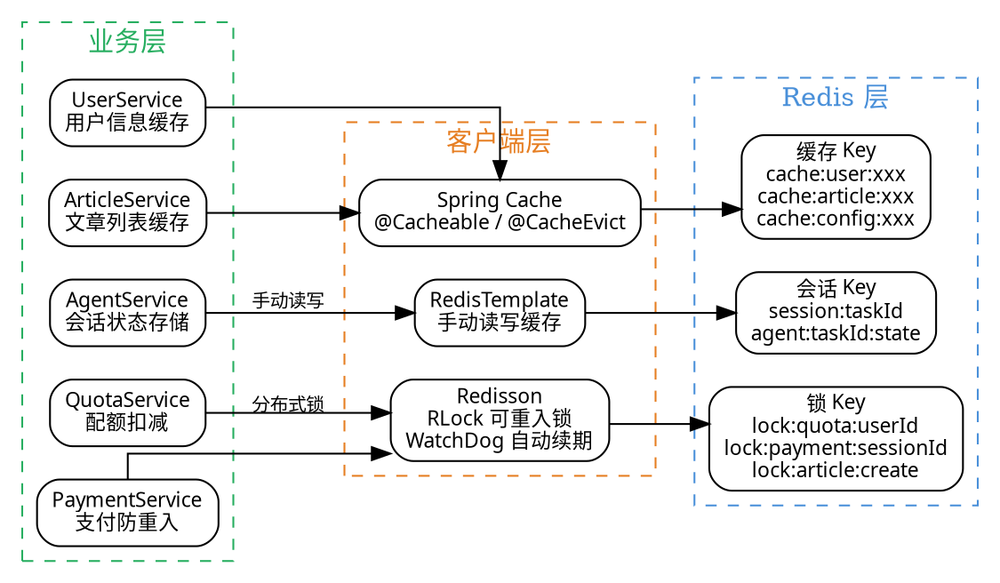

# 08 · Redis + Redisson：缓存策略、分布式锁与 Redisson 实战

> AI 应用的高并发底座：Redis 承担"热点数据缓存 + 会话/上下文存储"，Redisson 提供"可重入分布式锁 + 自动续期看门狗"，配合 Spring Cache 注解化封装，解决缓存三大难题（穿透/击穿/雪崩）与并发安全（重复提交、幂等、配额扣减）。
>
> **对应项目模块：** `ai-passage-creator-server` 缓存与分布式锁模块

---

## 一、你必须知道的 3 个核心概念

### 1.1 缓存策略

缓存策略是"什么时候写缓存、什么时候读缓存、缓存失效了怎么办"的一整套约定。项目中常见的缓存策略：

| 策略 | 说明 | 适用场景 |
|------|------|----------|
| **Cache-Aside（旁路缓存）** | 先查缓存，未命中再查 DB，然后回填缓存；写操作直接更新 DB，再删除缓存 | 读多写少、对一致性要求一般的场景，**最主流** |
| **Read-Through（穿透读）** | 应用只和缓存交互，未命中由缓存组件回源 DB 并回填 | 追求代码整洁、缓存语义统一 |
| **延迟双删** | 更新 DB 后删除缓存，延迟一段时间再次删除 | 高并发读写、防止"先删缓存后写库"的旧值回填问题 |

**缓存三大难题：**

| 难题 | 现象 | 解决方案 |
|------|------|----------|
| **缓存穿透** | 查询一个不存在的数据，导致每次请求都穿透到 DB | 缓存空值（`null` 也缓存，TTL 短） |
| **缓存击穿** | 热点 key 过期瞬间，大量并发请求同时打到 DB | 互斥锁（分布式锁控制重建）、永不过期 + 异步更新 |
| **缓存雪崩** | 大量 key 在同一时间过期，导致 DB 压力暴增 | 过期时间加随机因子（`base + random`） |

### 1.2 分布式锁

分布式锁用于解决**多实例（多进程）之间的互斥问题**——单体应用里 JVM 自带 `synchronized` / `ReentrantLock` 就够了，但微服务是多节点部署，锁必须落在所有实例都能访问的第三方上。

分布式锁的三个核心诉求：

| 诉求 | 说明 |
|------|------|
| **互斥性** | 同一时刻只有一个节点能拿到锁 |
| **安全性** | 锁会自动释放（防死锁）、只能释放自己持有的锁（防误删） |
| **高可用** | 锁服务本身是高可用的，Redis 主从切换时锁不丢失 |

分布式锁的实现载体主要有三类：

| 载体 | 优点 | 缺点 | 生产推荐 |
|------|------|------|----------|
| **数据库唯一索引** | 简单，不依赖额外组件 | 性能差，有锁间隙 | 不推荐 |
| **Redis SETNX / Redisson** | 性能好，功能全，支持自动续期 | 依赖 Redis 高可用 | **推荐** |
| **ZooKeeper / etcd 临时节点** | 强一致，无过期时间问题 | 运维重，性能不如 Redis | 对一致性要求极高时 |

### 1.3 Redisson 可重入锁与看门狗

Redisson 是 Redis 官方推荐的 Java 客户端与分布式数据平台。它把分布式锁封装成了**纯 Java API（`RLock`），用法和 JVM 里的 `ReentrantLock` 几乎一样**——`lock()` 加锁、`unlock()` 解锁、支持 `tryLock(timeout)` 等待超时。

**可重入锁（Reentrant Lock）的核心特性：**

| 特性 | 说明 |
|------|------|
| **可重入** | 同一线程可重复获取同一把锁，内部计数器 +1；释放时 -1，减到 0 才真正释放 |
| **原子性** | 加锁/解锁用 **Lua 脚本**保证，Redis 单线程执行脚本天然原子 |
| **自动续期（看门狗）** | 默认锁有效期 30s，每 10s 检查一次，业务未结束自动续期 30s |
| **防误删** | Hash 结构存线程标识（field=线程ID，value=重入次数），只能释放自己持有的锁 |

**看门狗（Watchdog）原理：**

```
lock.lock()  // 默认锁过期时间 30 秒
    ↓
Redisson 启动一个后台定时任务（看门狗线程）
    ↓
每 10 秒检查一次：锁是否还被当前线程持有？
    ↓
    是 → 续期锁的过期时间到 30 秒
    否 → 停止续期，锁到期自动释放
    ↓
客户端宕机 → 看门狗线程停止 → 锁到期自动释放（防死锁）
```

---

## 二、项目中的实战应用

### 2.1 解决了什么问题

| 痛点 | 解决方案 |
|------|----------|
| 用户信息、文章列表等热点数据反复查库 | Redis 缓存热点数据，降低 DB 压力与响应时延 |
| AI Agent 的会话状态需要跨实例共享 | Redis 存会话历史与中间状态，多实例共享同一 Key |
| 配图资源重复上传、任务重复执行 | Redisson 分布式锁，保证同一资源只处理一次 |
| 高并发下缓存失效瞬间全部打到 DB（击穿/雪崩） | 互斥锁 + 过期时间加随机因子 |
| 配额扣减需要原子操作 | Redisson 锁 + Redis 原子自增 |
| 支付回调需要防重入 | Redisson 锁 + 幂等 key |

### 2.2 缓存 + 分布式锁整体结构图



### 2.3 核心代码实现（带逐行中文注释）

#### 2.3.1 Redis 与 Redisson 配置

```yaml
# application.yml —— Redis 与 Redisson 配置
# 使用 kebab-case 风格（连字符命名）
spring:
  # Spring Data Redis 配置
  data:
    redis:
      # Redis 连接地址（单机模式）
      host: localhost
      # Redis 端口（默认 6379）
      port: 6379
      # Redis 密码（没有密码则留空）
      password:
      # Redis 数据库索引（0-15，默认 0）
      database: 0
      # 连接超时时间（毫秒）
      connect-timeout: 5000
      # 读取超时时间（毫秒）
      timeout: 5000
      # Lettuce 连接池配置
      lettuce:
        pool:
          # 最大连接数
          max-active: 16
          # 最大空闲连接数
          max-idle: 8
          # 最小空闲连接数
          min-idle: 4
          # 获取连接的最大等待时间（毫秒）
          max-wait: 3000

# Redisson 独立配置（与 Spring Data Redis 共用同一个 Redis 实例）
redisson:
  # Redisson 连接地址（redis:// 前缀表示非加密连接）
  address: redis://localhost:6379
  # 密码（与 Spring Data Redis 一致）
  password:
  # 连接池配置
  pool:
    min-idle: 4
    max-idle: 8
    max-active: 16
```

```java
/**
 * Redisson 配置类 —— 构建 RedissonClient 实例
 * 
 * RedissonClient 是 Redisson 的入口：
 * - getLock()：获取分布式锁
 * - getBucket()：读写分布式对象
 * - getRateLimiter()：获取限流器
 * 
 * 与 Spring Data Redis 共用同一个 Redis 实例
 * Redisson 负责分布式锁，RedisTemplate 负责缓存读写
 */
@Configuration
public class RedissonConfig {

    /**
     * 创建 RedissonClient Bean
     * 
     * 配置项说明：
     * - singleServerConfig：单机模式配置
     * - codec：编解码器，使用 JSON 序列化，方便跨语言调试
     * - watchdogTimeout：看门狗超时时间，默认 30 秒
     */
    @Bean
    @ConditionalOnMissingBean(RedissonClient.class)
    public RedissonClient redissonClient() {
        // 构建 Redisson 配置
        Config config = new Config();

        // 单机模式配置
        config.useSingleServer()
                .setAddress("redis://localhost:6379")  // Redis 连接地址
                .setPassword(null)                      // Redis 密码
                .setConnectionPoolSize(16)              // 连接池大小
                .setConnectionMinimumIdleSize(4)        // 最小空闲连接数
                .setIdleConnectionTimeout(10000)        // 空闲连接超时（毫秒）
                .setConnectTimeout(5000)                // 连接超时（毫秒）
                .setTimeout(5000);                      // 响应超时（毫秒）

        // 设置编解码器：使用 JSON 序列化
        // 方便在 Redis 中直接查看数据（String 格式）
        config.setCodec(new JsonJacksonCodec());

        // 设置看门狗超时时间：默认 30 秒
        // 每 10 秒检查一次，业务未完成自动续期
        config.setLockWatchdogTimeout(30_000); // 30 秒

        // 创建 RedissonClient 实例
        return Redisson.create(config);
    }
}
```

#### 2.3.2 Spring Cache 注解配置

```java
/**
 * 缓存配置类 —— 配置 Spring Cache 的 Redis 实现
 * 
 * 使用 Spring Cache 注解（@Cacheable、@CacheEvict、@CachePut）
 * 实现 Cache-Aside 旁路缓存模式
 * 
 * 缓存策略：
 * - 读：先查缓存，命中直接返回，未命中查 DB 并回填缓存
 * - 写：更新 DB 后删除缓存（下次读时再回填）
 * - 过期时间：基础值 + 随机因子，防止缓存雪崩
 */
@Configuration
@EnableCaching // 启用 Spring Cache 注解
public class CacheConfig {

    /**
     * 配置 RedisCacheManager
     * 
     * 为不同的缓存区域设置不同的 TTL（过期时间）
     * 避免所有缓存使用相同的过期时间，降低缓存雪崩风险
     */
    @Bean
    public RedisCacheManager cacheManager(RedisConnectionFactory factory) {
        // 构建 RedisCacheConfiguration
        RedisCacheConfiguration config = RedisCacheConfiguration.defaultCacheConfig()
                // 序列化 key：使用 String 序列化
                .serializeKeysWith(
                        RedisSerializationContext.SerializationPair.fromSerializer(
                                new StringRedisSerializer()))
                // 序列化 value：使用 JSON 序列化
                .serializeValuesWith(
                        RedisSerializationContext.SerializationPair.fromSerializer(
                                new GenericJackson2JsonRedisSerializer()))
                // 缓存 null 值：防止缓存穿透
                .allowCachingNullValues(true)
                // 默认过期时间：1 小时
                .entryTtl(Duration.ofHours(1));

        // 为不同缓存区域设置不同的 TTL
        Map<String, RedisCacheConfiguration> configMap = new HashMap<>();
        // 用户信息缓存：30 分钟
        configMap.put("users", config.entryTtl(Duration.ofMinutes(30)));
        // 文章列表缓存：10 分钟
        configMap.put("articles", config.entryTtl(Duration.ofMinutes(10)));
        // 系统配置缓存：2 小时（变化频率低）
        configMap.put("configs", config.entryTtl(Duration.ofHours(2)));

        return RedisCacheManager.builder(factory)
                .cacheDefaults(config)           // 默认配置
                .withInitialCacheConfigurations(configMap) // 各缓存区域自定义配置
                .build();
    }
}
```

#### 2.3.3 Spring Cache 注解使用

```java
/**
 * 用户服务 —— 演示 Spring Cache 注解的使用
 * 
 * Cache-Aside 模式：
 * - @Cacheable：先查缓存，未命中再查 DB，结果自动回填缓存
 * - @CacheEvict：更新 DB 后删除缓存，下次查询时重新回填
 * - @CachePut：更新 DB 后同时更新缓存（不常用，因为写操作频繁时反而浪费）
 */
@Service
@RequiredArgsConstructor
public class UserService {

    private final UserMapper userMapper; // MyBatis-Flex Mapper

    /**
     * 根据 ID 查询用户信息 —— @Cacheable 注解
     * 
     * 执行流程：
     * 1. 检查缓存（key = "users::" + userId）
     * 2. 命中 → 直接返回缓存数据
     * 3. 未命中 → 执行方法体（查数据库）
     * 4. 将方法返回值存入缓存（key = "users::" + userId）
     * 5. 返回结果
     * 
     * @param userId 用户 ID
     * @return 用户信息
     */
    @Cacheable(value = "users", key = "#userId")
    public User getUserById(Long userId) {
        // 缓存未命中时执行：查询数据库
        // 结果会自动回填到 Redis 缓存中
        return userMapper.selectById(userId);
    }

    /**
     * 更新用户信息 —— @CacheEvict 注解
     * 
     * 执行流程：
     * 1. 执行方法体（更新数据库）
     * 2. 删除缓存（key = "users::" + userId）
     * 3. 下次查询时，@Cacheable 发现缓存未命中，重新查库并回填
     * 
     * 为什么是删除缓存而不是更新缓存？
     * - 删除简单，不会产生数据不一致
     * - 更新缓存在并发写场景下容易出现脏数据
     * - 下次读时再回填，保证缓存数据与数据库一致
     */
    @CacheEvict(value = "users", key = "#user.id")
    public void updateUser(User user) {
        // 更新数据库
        userMapper.updateById(user);
        // 缓存由 @CacheEvict 自动删除
    }

    /**
     * 删除用户 —— 同时删除多个缓存
     * 
     * @CacheEvict 的 allEntries = true 表示删除该缓存区域下的所有缓存
     * 适用于"批量操作"场景，但粒度较粗
     */
    @CacheEvict(value = "users", allEntries = true)
    public void deleteUser(Long userId) {
        userMapper.deleteById(userId);
    }
}
```

#### 2.3.4 Redisson 分布式锁使用

```java
/**
 * 配额服务 —— 演示 Redisson 分布式锁的使用
 * 
 * 业务场景：每天用户生成文章的配额是有限的
 * 多个实例同时扣减配额时，需要保证原子性，防止超发
 * 
 * 使用 Redisson 分布式锁保证配额扣减的互斥性
 */
@Service
@RequiredArgsConstructor
@Slf4j
public class QuotaService {

    private final RedissonClient redissonClient; // Redisson 客户端
    private final UserMapper userMapper;         // 用户 Mapper

    /**
     * 扣减用户每日配额 —— 使用 tryLock 非阻塞获取锁
     * 
     * 锁 key 设计：lock:quota:{userId}
     * - 粒度：每个用户一把锁，不同用户互不影响
     * - 业务标识：quota 表示配额扣减业务
     * - 资源 ID：userId 标识具体用户
     * 
     * tryLock 与 lock 的区别：
     * - tryLock：尝试获取锁，等待指定时间后返回 boolean
     * - lock：阻塞等待，直到获取锁
     * 
     * @param userId 用户 ID
     * @return true 扣减成功，false 扣减失败（配额不足或获取锁超时）
     */
    public boolean deductQuota(Long userId) {
        // 构建锁 key：粒度精确到每个用户
        // 格式：lock:业务名:资源ID
        String lockKey = "lock:quota:" + userId;

        // 获取分布式锁（RLock = Redis Lock）
        RLock lock = redissonClient.getLock(lockKey);

        try {
            // ========== 尝试获取锁 ==========
            // tryLock(等待时间, 租约时间, 时间单位)
            // 等待时间：最多等待 3 秒获取锁
            // 租约时间：获取锁后自动释放时间（30 秒，看门狗会自动续期）
            // 如果 waitTime = 0，则立即返回，不等待
            boolean isLocked = lock.tryLock(3, 30, TimeUnit.SECONDS);

            if (!isLocked) {
                // 获取锁超时：其他线程正在处理该用户的配额
                log.warn("获取配额锁超时: userId={}", userId);
                return false;
            }

            // ========== 获取锁成功，执行配额扣减逻辑 ==========
            // 查询用户当前配额
            User user = userMapper.selectById(userId);
            if (user == null) {
                log.warn("用户不存在: userId={}", userId);
                return false;
            }

            // 检查配额是否充足
            if (user.getUsedQuota() >= user.getDailyQuota()) {
                log.warn("用户配额已用完: userId={}, used={}, daily={}",
                        userId, user.getUsedQuota(), user.getDailyQuota());
                return false;
            }

            // 原子扣减配额：usedQuota + 1
            // 在锁的保护下，不存在并发覆盖问题
            user.setUsedQuota(user.getUsedQuota() + 1);
            userMapper.updateById(user);

            log.info("配额扣减成功: userId={}, 当前已用={}, 每日上限={}",
                    userId, user.getUsedQuota(), user.getDailyQuota());

            return true;

        } catch (InterruptedException e) {
            // 线程被中断：恢复中断状态
            Thread.currentThread().interrupt();
            log.error("配额扣减被中断: userId={}", userId, e);
            return false;
        } finally {
            // ========== 释放锁 ==========
            // 重要：确保在 finally 中释放锁
            // 使用 isHeldByCurrentThread 判断，防止释放他人的锁
            if (lock.isHeldByCurrentThread()) {
                lock.unlock();
            }
        }
    }

    /**
     * 获取用户当前配额信息
     * 
     * @param userId 用户 ID
     * @return 配额信息字符串
     */
    public String getQuotaInfo(Long userId) {
        User user = userMapper.selectById(userId);
        if (user == null) {
            return "用户不存在";
        }
        return String.format("已用: %d / 每日上限: %d",
                user.getUsedQuota(), user.getDailyQuota());
    }
}
```

#### 2.3.5 Redisson 看门狗（Watchdog）自动续期

```java
/**
 * AI Agent 会话服务 —— 演示 Redisson 看门狗自动续期
 * 
 * 业务场景：AI Agent 生成文章是一个耗时操作（可能 30 秒到几分钟）
 * 在生成过程中，需要保证同一用户的 Agent 任务不被重复创建
 * 使用分布式锁控制并发，看门狗保证锁不会在任务执行期间过期
 */
@Service
@RequiredArgsConstructor
@Slf4j
public class AgentSessionService {

    private final RedissonClient redissonClient;

    /**
     * 执行 AI Agent 任务 —— 使用 lock() 阻塞等待锁
     * 
     * lock() 与 tryLock() 的区别：
     * - lock()：阻塞等待，直到获取锁；看门狗自动续期
     * - tryLock()：尝试获取锁，等待指定时间后返回 boolean
     * 
     * 看门狗机制：
     * - 调用 lock() 时，默认锁过期时间 30 秒
     * - 看门狗线程每 10 秒检查一次锁是否还在持有
     * - 如果还在持有，将锁的过期时间续期到 30 秒
     * - 业务执行完毕，显式调用 unlock() 释放锁
     * - 客户端宕机，看门狗线程停止，锁到期自动释放
     * 
     * @param userId 用户 ID
     * @param taskId 任务 ID
     */
    public void executeAgentTask(Long userId, String taskId) {
        // 锁 key：lock:agent:{userId}
        // 一个用户同时只能有一个 Agent 任务在执行
        String lockKey = "lock:agent:" + userId;

        // 获取分布式锁
        RLock lock = redissonClient.getLock(lockKey);

        try {
            // ========== 获取锁（阻塞等待，看门狗自动续期） ==========
            // lock() 会阻塞直到获取锁
            // 默认锁过期时间 30 秒，看门狗每 10 秒续期一次
            // 如果业务执行超过 30 秒，看门狗会自动续期，不会自动释放
            lock.lock();

            log.info("获取 Agent 锁成功: userId={}, taskId={}", userId, taskId);

            // ========== 执行业务逻辑（可能耗时较长） ==========
            // 模拟 AI Agent 执行的三个阶段
            // 1. 选题阶段
            log.info("阶段1: 选题生成中...");
            Thread.sleep(5000); // 模拟耗时操作

            // 2. 大纲阶段
            log.info("阶段2: 大纲生成中...");
            Thread.sleep(10000); // 模拟耗时操作

            // 3. 正文+配图阶段
            log.info("阶段3: 正文+配图生成中...");
            Thread.sleep(15000); // 模拟耗时操作

            // 在整个执行过程中，看门狗每 10 秒续期一次
            // 锁不会过期，即使业务执行超过 30 秒
            log.info("Agent 任务执行完成: userId={}, taskId={}", userId, taskId);

        } catch (InterruptedException e) {
            Thread.currentThread().interrupt();
            log.error("Agent 任务被中断: userId={}", userId, e);
        } finally {
            // ========== 释放锁 ==========
            // 业务执行完毕，手动释放锁
            // 看门狗收到锁释放后，停止续期
            if (lock.isHeldByCurrentThread()) {
                lock.unlock();
                log.info("Agent 锁已释放: userId={}", userId);
            }
        }
    }

    /**
     * 使用 lock(leaseTime) 指定租约时间（不使用看门狗）
     * 
     * 当明确知道业务执行时间时，可以指定租约时间
     * 此时看门狗不会启动，锁到期自动释放
     * 
     * 适用场景：业务执行时间稳定且可预测
     * 
     * @param userId 用户 ID
     */
    public void executeWithLeaseTime(Long userId) {
        // 锁 key
        RLock lock = redissonClient.getLock("lock:fixed:" + userId);

        try {
            // 获取锁，指定租约时间 10 秒
            // 10 秒后锁自动释放，看门狗不启动
            // 适合"明确知道 10 秒内一定能完成"的业务
            lock.lock(10, TimeUnit.SECONDS);

            // 执行业务逻辑（必须在 10 秒内完成）
            doBusinessLogic();

        } finally {
            // 即使锁已自动释放，调用 unlock() 也是安全的
            // Redisson 会检查锁是否还被当前线程持有
            if (lock.isHeldByCurrentThread()) {
                lock.unlock();
            }
        }
    }

    private void doBusinessLogic() {
        // 业务逻辑实现
    }
}
```

#### 2.3.6 缓存穿透防护 —— 缓存空值

```java
/**
 * 文章缓存服务 —— 演示缓存穿透防护
 * 
 * 缓存穿透：查询一个不存在的数据（如不存在的文章 ID）
 * 导致每次请求都穿透到数据库，大量请求可能打垮 DB
 * 
 * 解决方案：缓存空值（null 也缓存，TTL 较短）
 * 第一次查询不存在的数据时，将 null 写入缓存
 * 后续请求直接返回 null，不再穿透到 DB
 */
@Service
@RequiredArgsConstructor
public class ArticleCacheService {

    private final ArticleMapper articleMapper;       // 文章 Mapper
    private final RedisTemplate<String, Object> redisTemplate; // Redis 操作

    // 文章缓存前缀
    private static final String CACHE_KEY_PREFIX = "cache:article:";
    // 空值缓存过期时间（5 分钟）
    private static final long NULL_VALUE_TTL = 5; // 分钟
    // 正常数据缓存过期时间（30 分钟 + 随机因子）
    private static final long NORMAL_TTL_BASE = 30; // 分钟

    /**
     * 获取文章（带缓存穿透防护）
     * 
     * 执行流程：
     * 1. 查缓存
     * 2. 命中 → 判断是否是空值标记 → 返回结果
     * 3. 未命中 → 查数据库
     * 4. 数据库有结果 → 写入缓存（正常 TTL）
     * 5. 数据库无结果 → 写入空值缓存（短 TTL）
     * 6. 返回结果
     */
    public Article getArticleWithProtection(Long articleId) {
        String cacheKey = CACHE_KEY_PREFIX + articleId;

        // 第一步：查缓存
        Object cached = redisTemplate.opsForValue().get(cacheKey);

        if (cached != null) {
            // 缓存命中
            if (cached instanceof NullValue) {
                // 缓存的是空值标记：数据不存在
                // 直接返回 null，避免穿透到 DB
                return null;
            }
            // 正常数据：直接返回
            return (Article) cached;
        }

        // 第二步：缓存未命中，查数据库
        Article article = articleMapper.selectById(articleId);

        if (article != null) {
            // 数据库有数据：写入缓存，正常 TTL + 随机因子
            long ttl = NORMAL_TTL_BASE + randomOffset(); // 30 + 随机 0-5 分钟
            redisTemplate.opsForValue().set(cacheKey, article, ttl, TimeUnit.MINUTES);
        } else {
            // 数据库无数据：写入空值缓存，短 TTL
            // 防止缓存穿透：后续相同请求直接返回 null
            redisTemplate.opsForValue().set(
                    cacheKey,
                    NullValue.INSTANCE,  // 空值标记对象
                    NULL_VALUE_TTL,      // 5 分钟过期
                    TimeUnit.MINUTES);
        }

        return article;
    }

    /**
     * 生成随机偏移量，防止缓存雪崩
     * 使同一批缓存的过期时间分散，避免集中过期
     */
    private long randomOffset() {
        // 返回 0-5 分钟的随机偏移量
        return ThreadLocalRandom.current().nextLong(0, 5);
    }
}
```

### 2.4 设计亮点

**亮点一：Cache-Aside + 延迟双删，缓存一致性有保障**

项目采用最经典的 Cache-Aside 旁路缓存模式，写操作时先更新数据库，再删除缓存。同时配合延迟双删策略——在第一次删除后，延迟几百毫秒再次删除，规避"先删缓存后写库"导致的旧值回填问题。**虽然无法做到强一致性，但能满足绝大多数业务场景。**

**亮点二：Redisson 看门狗，长任务不担心锁过期**

AI Agent 任务执行时间不确定（取决于 LLM 响应速度），如果使用 Redis 原生的 SETNX 加锁，锁过期时间很难设置——设短了业务没执行完锁就释放了，设长了客户端宕机后锁要很久才能自动释放。Redisson 的看门狗机制完美解决了这个问题：**锁过期时间默认 30 秒，看门狗每 10 秒续期一次，业务执行多久锁就活多久，客户端宕机锁自动释放。**

**亮点三：缓存空值 + 随机 TTL，抵御缓存三大难题**

| 难题 | 防护措施 | 效果 |
|------|----------|------|
| 缓存穿透 | 缓存空值（`NullValue.INSTANCE`，TTL 5 分钟） | 不存在的数据只查一次 DB |
| 缓存击穿 | 分布式锁控制重建（只允许一个请求查 DB） | 热点 key 过期时 DB 压力可控 |
| 缓存雪崩 | 过期时间加随机因子（`base + random`） | 同一批 key 分散过期，避免集中冲击 DB |

**亮点四：锁粒度精确到资源，不互相阻塞**

锁 key 设计遵循"粒度精确"原则：`lock:业务名:资源ID`。每个用户的配额扣减互不影响（`lock:quota:user1` 和 `lock:quota:user2` 是两把锁），每个文章的 Agent 任务互不影响。**避免使用大锁（如 `lock:quota:all`），防止不相关的请求互相阻塞。**

---

## 三、面试高频题

### Q1: 项目中 Redis 缓存有哪些使用场景？为什么用 Redis 而不是本地缓存？

**参考答案：**

**项目中的 Redis 缓存使用场景：**

| 场景 | 缓存内容 | 用途 | 缓存策略 |
|------|----------|------|----------|
| 用户信息 | 用户基本信息、VIP 状态 | 每次请求都要校验用户权限，避免反复查库 | Cache-Aside，30 分钟 TTL |
| 文章列表 | 用户文章列表、文章详情 | 列表页和详情页高频读取 | Cache-Aside，10 分钟 TTL |
| 系统配置 | 配图策略配置、定价配置 | 变化频率低，但读取频率高 | Cache-Aside，2 小时 TTL |
| Agent 会话 | 当前 Agent 执行状态、中间结果 | 多实例共享 Agent 状态，支持断点续作 | 手动读写，随任务生命周期 |
| 配额计数 | 用户每日已用配额 | 实时扣减，需要原子操作 | Redis 自增 + 分布式锁保护 |

**为什么用 Redis 而不是本地缓存（Caffeine / Guava Cache）：**

| 维度 | Redis（分布式缓存） | Caffeine（本地缓存） |
|------|-------------------|---------------------|
| **数据共享** | 所有实例共享同一份缓存 | 每个实例各自缓存，数据不一致 |
| **一致性** | 删除缓存后所有实例都感知 | 需要广播通知其他实例删除 |
| **容量** | 独立服务器，容量大 | 受限于 JVM 堆内存 |
| **持久化** | 支持 RDB/AOF 持久化 | 重启后缓存丢失 |
| **分布式锁** | 原生支持（Redisson） | 不支持 |
| **延迟** | 网络 IO（1-5ms） | 内存访问（纳秒级） |
| **适用场景** | 多实例共享数据、分布式锁、会话存储 | 单实例、不共享、对延迟极高要求 |

**项目选型结论：** AI 项目是多实例部署的，用户会话、Agent 状态、配额计数都需要跨实例共享，本地缓存无法满足需求。**Redis 虽然比本地缓存多一次网络 IO，但换来了数据共享和一致性，在 AI 应用场景下是值得的。**

**追问应对：** "如果 Redis 宕机了怎么办？" 答：Redis 宕机时，缓存层面降级为"跳过缓存，直接查数据库"，业务不受影响（只是变慢了一些）。Redisson 分布式锁降级为"不锁定"，在配额扣减等高并发场景可能出现超发，但概率极低。生产环境应部署 Redis 主从 + 哨兵集群，保证 Redis 高可用。

### Q2: 分布式锁的选型依据是什么？Redis 分布式锁和 ZooKeeper 分布式锁如何选择？

**参考答案：**

**分布式锁选型需要评估三个维度：**

| 维度 | 说明 | 重要性 |
|------|------|--------|
| **性能** | 获取锁的延迟和吞吐量 | 高（核心业务） |
| **一致性** | 锁的互斥性保证强度 | 高（不容有失） |
| **运维成本** | 额外组件的部署和维护 | 中（决定落地难度） |

**Redis 分布式锁 vs ZooKeeper 分布式锁：**

| 对比维度 | Redis（Redisson） | ZooKeeper / etcd |
|----------|------------------|-----------------|
| **一致性模型** | AP（最终一致） | CP（强一致） |
| **性能** | 高（1-5ms 延迟） | 中（10-50ms 延迟） |
| **吞吐量** | 10万+ QPS | 1万+ QPS |
| **自动释放** | 过期时间 | 会话断开自动删除临时节点 |
| **可重入** | 原生支持 | 需自行实现 |
| **续期机制** | 看门狗自动续期 | 心跳检测 |
| **脑裂问题** | 可能同时持有锁 | 无脑裂 |
| **运维复杂度** | 低（已有 Redis 则零成本） | 高（需额外部署 ZooKeeper 集群） |
| **适用场景** | 性能敏感、可接受短暂不一致 | 一致性敏感、不容忍任何并发冲突 |

**选型决策树：**

```
是否需要分布式锁？
    ├── 不需要 → 单机锁（synchronized / ReentrantLock）
    └── 需要 →
        ├── 已有 Redis？ → 用 Redisson（零成本，高性能）
        ├── 对一致性要求极高（金融级）？ → ZooKeeper（强一致）
        └── 一般业务场景 → Redisson（性能好，功能全）
```

**项目选型依据：** 项目已经使用了 Redis（缓存 + 会话存储），零额外成本引入 Redisson 分布式锁。配额扣减虽然需要互斥，但偶尔的"超发"（配额从 100 变成 101）在业务上是可以接受的——不是金融交易，不需要强一致性保证。**"用 Redis 的 AP 模型，换 10 倍性能，代价是千分之一的概率出现问题，业务上可以接受。"**

**追问应对：** "RedLock 红锁是什么？" 答：RedLock 是 Redis 官方提出的多节点分布式锁算法，要求锁在大多数 Redis 节点（N/2+1）上同时成功才算获取锁，解决了单点 Redis 的脑裂问题。但 RedLock 也存在争议（Martin Kleppmann 曾发文批评其不是真正的强一致），且需要 5 个 Redis 节点，运维成本高。**生产实践中，大多数场景使用单机 Redisson + 主从哨兵已经足够，不需要 RedLock。**

### Q3: Redisson 看门狗（Watchdog）的原理是什么？如果业务执行时间超过锁过期时间会怎样？

**参考答案：**

**看门狗原理：**

```
lock.lock()  // 默认可过期时间 30 秒
    ↓
Redisson 内部启动一个 Netty 定时任务（TimeoutTask）
    ↓
定时任务每 10 秒执行一次：
    1. 检查锁是否还被当前线程持有（通过 Hash 结构中的 field 判断）
    2. 如果持有，执行 Lua 脚本续期：
       "if redis.call('hexists', KEYS[1], ARGV[1]) == 1 then
            redis.call('pexpire', KEYS[1], ARGV[2])
            return 1
        end
        return 0"
    3. 续期成功：锁的过期时间重置为 30 秒
    4. 续期失败（锁已被释放）：停止定时任务
    ↓
业务执行完毕 → lock.unlock() → 删除锁 → 看门狗停止
客户端宕机 → 看门狗线程停止 → 锁到期自动释放（防死锁）
```

**看门狗超时时间配置：**

```java
// 默认看门狗超时时间：30 秒
config.setLockWatchdogTimeout(30_000); // 30 秒

// 如果业务执行时间普遍较长，可以调大
config.setLockWatchdogTimeout(60_000); // 60 秒
```

**看门狗续期时间间隔：** 续期间隔 = `lockWatchdogTimeout / 3`，默认 30 秒 / 3 = 10 秒。

**业务执行时间超过锁过期时间：**

不会出现业务没执行完锁就过期的情况，因为**看门狗会在锁过期前 10 秒自动续期**。具体来说：

```
时间线：
t=0s:    lock.lock() 获取锁，锁过期时间 = 30s
t=10s:   看门狗检查 → 锁还在持有 → 续期到 30s（从 t=10s 算起，过期时间 = t=40s）
t=20s:   看门狗检查 → 锁还在持有 → 续期到 30s（从 t=20s 算起，过期时间 = t=50s）
t=30s:   看门狗检查 → 锁还在持有 → 续期到 30s（从 t=30s 算起，过期时间 = t=60s）
...
t=N个10s: 业务执行完毕 → unlock() → 看门狗停止
```

**看门狗不启动的场景：**

```java
// 场景一：指定了租约时间（leaseTime），看门狗不启动
lock.lock(10, TimeUnit.SECONDS); // 10 秒后自动释放，看门狗不工作

// 场景二：tryLock 指定了租约时间
lock.tryLock(3, 10, TimeUnit.SECONDS); // 等待 3 秒，租约 10 秒，看门狗不工作
```

**追问应对：** "看门狗续期失败（Redis 宕机或网络超时）会怎样？" 答：续期失败时，锁的过期时间不会延长，锁会在剩余的过期时间后自动释放。此时如果有其他线程/实例在等待锁，会正常获取到锁。但原来的业务线程并不知道锁已经释放，会继续执行——这就出现了"两个线程同时持有锁"的短暂不一致。**解决方案：** 业务代码中定期检查锁的状态（如每 5 秒检查一次 `lock.isHeldByCurrentThread()`），发现锁丢失后主动停止业务执行。

---

## 四、参考资料与扩展阅读

### 项目源码
- [ai-passage-creator-demo GitHub 仓库](https://github.com/1byteone/ai-passage-creator-demo) — 缓存与分布式锁模块

### Redis 官方
- [Redis 官方文档](https://redis.io/documentation) — 数据类型、持久化、集群
- [Redis 缓存策略最佳实践](https://redis.io/docs/manual/patterns/) — 缓存穿透、击穿、雪崩防护

### Redisson 官方
- [Redisson 官方文档](https://redisson.org/docs/) — 分布式锁、看门狗、分布式对象完整使用指南
- [Redisson GitHub 仓库](https://github.com/redisson/redisson) — 源码与示例

### 分布式锁
- [Redis 分布式锁 RedLock 算法](https://redis.io/docs/manual/patterns/distributed-locks/) — 官方分布式锁实现方案
- [Martin Kleppmann 对 RedLock 的批评](https://martin.kleppmann.com/2016/02/08/how-to-do-distributed-locking.html) — 分布式锁的深层讨论

### Spring Cache
- [Spring Cache 官方文档](https://docs.spring.io/spring-framework/reference/integration/cache.html) — 注解化缓存配置
- [Spring Data Redis 文档](https://docs.spring.io/spring-data/redis/docs/current/reference/html/) — RedisTemplate 和 RedisCacheManager 配置