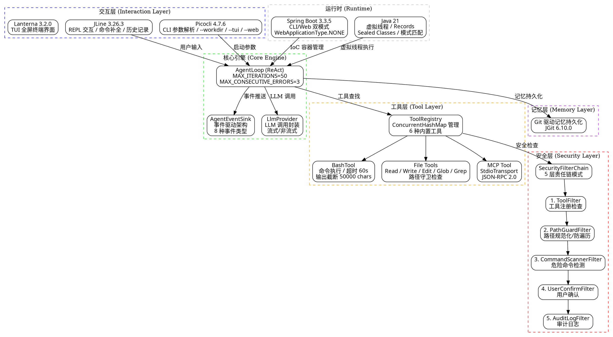

# 全景导读：mewpaw-code 技术栈深度剖析

> 从一次 CLI 启动命令出发，穿透 8 个技术模块，理解 Java 21 CLI Coding Agent 的完整实现。
>
> **适用读者：** Java 后端工程师转型 AI Agent 开发
> **对照体系：** Spring Boot 非 Web 应用 / LangChain4j Agent 生态
> **项目源码：** `mewpaw-code` (GitHub: 1byteone/mewpaw-code)

---

## 一、项目定位

**mewpaw-code** 是一个基于 **Java 21 + Spring Boot 3.3.5 + LangChain4j 1.0.0** 构建的 **CLI 编码 Agent**。它通过 ReAct 循环驱动 LLM 自主决策，调用 6 种内置工具（Bash、Read、Write、Edit、Glob、Grep）完成代码编写任务，并通过 5 层安全链保障操作安全。

**一句话定义：** Java 生态的"编码助手 CLI"，让 LLM 在终端中自主完成代码编写、文件操作、项目搜索等开发任务。

---

## 二、架构全景图



**架构分层说明：**

| 层级 | 技术 | 职责 |
|------|------|------|
| 交互层 | JLine + Picocli + Lanterna | 接收用户输入，解析 CLI 参数，提供 TUI 界面 |
| 核心引擎 | AgentLoop + LangChain4j | ReAct 循环决策，LLM 调用，事件驱动 |
| 工具层 | ToolRegistry + 6 内置工具 + MCP | 执行具体操作（命令行、文件操作、搜索） |
| 安全层 | 5 层 SecurityFilterChain | 保障工具调用安全，防止恶意操作 |
| 记忆层 | JGit 驱动的 Git 持久化 | 跨会话记忆保持 |
| 运行时 | Spring Boot 3.3.5 + Java 21 | IoC 容器、虚拟线程、CLI 模式 |

---

## 三、技术栈总表

| 类别 | 技术 | 版本 | 用途 |
|------|------|------|------|
| 语言 | Java | 21 | 虚拟线程、Records、Sealed Classes、模式匹配 |
| 框架 | Spring Boot | 3.3.5 | IoC 容器、CLI 双模式、BOM 管理 |
| AI Agent | LangChain4j | 1.0.0 | 工具调用、LLM 统一接口 |
| CLI 参数 | Picocli | 4.7.6 | 命令行参数解析（picocli-spring-boot-starter） |
| REPL | JLine | 3.26.3 | 终端交互、命令补全、历史记录 |
| TUI | Lanterna | 3.2.0-alpha1 | 全屏终端界面 |
| Git | JGit | 6.10.0 | 记忆持久化 |
| JSON | Jackson | 2.17.2 | 序列化/反序列化 |
| 构建 | Maven | - | 多模块项目管理 |

---

## 四、核心模块详解

### 4.1 AgentLoop — ReAct 循环引擎

**包路径：** `com.mewcode.core.engine`

项目核心，实现 ReAct（Reasoning + Acting）循环：

- **迭代上限：** `MAX_ITERATIONS = 50`，防止无限循环
- **错误容错：** `MAX_CONSECUTIVE_ERRORS = 3`，连续错误超限终止
- **输出截断：** 成功输出截断 5000 chars，错误输出截断 500 chars
- **事件驱动：** 通过 `AgentEventSink` 推送 8 种事件类型，支持流式输出

### 4.2 SecurityFilterChain — 5 层安全沙箱

**包路径：** `com.mewcode.security`

采用责任链模式，5 层过滤器串联执行：

```
ToolFilter → PathGuardFilter → CommandScannerFilter → UserConfirmFilter → AuditLogFilter
```

- **ToolFilter：** 检查工具是否注册，防止 LLM 幻觉调用不存在的工具
- **PathGuardFilter：** 路径规范化，防止路径遍历攻击
- **CommandScannerFilter：** 危险命令/危险前缀双重检测
- **UserConfirmFilter：** 高危操作暂停等待用户确认
- **AuditLogFilter：** 全量操作日志审计

### 4.3 BashTool — Shell 命令执行

**包路径：** `com.mewcode.tools`

- 跨平台支持：Windows `cmd /c`，Linux `/bin/bash -c`
- 超时控制：60s 超时，超时后 `destroyForcibly()`
- 输出截断：最大 50000 chars
- 虚拟线程执行：`Executors.newVirtualThreadPerTaskExecutor()`

### 4.4 EnhancedRepl — REPL 交互

**包路径：** `com.mewcode.interaction`

- 基于 JLine 3 构建的交互式 REPL
- 自定义 `/slash` 命令补全
- 历史记录持久化到 `~/.mewcode_history`（最大 1000 条）
- 终端检测：`TuiState.hasConsole()` 检查真实终端，否则回退 `BufferedReader`

### 4.5 McpClient — MCP 协议支持

**包路径：** `com.mewcode.mcp`

- 传输层：StdioTransport（子进程标准输入/输出）
- 协议版本：`2024-11-05`
- 消息格式：JSON-RPC 2.0
- 支持工具列表获取和工具调用

---

## 五、请求生命周期

以用户输入 `"帮我创建一个 Spring Boot 项目"` 为例：

```
Step 1: Picocli 解析 CLI 参数，启动 Spring Boot 应用
        ↓
Step 2: CommandLineRunner 触发 AgentLoop.main()
        ↓
Step 3: AgentLoop 构建 SystemMessage + UserMessage
        ↓
Step 4: 调用 LLM → LLM 返回 Thought(需要创建项目) + Action(bash)
        ↓
Step 5: SecurityFilterChain 安全检查
        ├─ ToolFilter: 检查 bash 是否注册 ✓
        ├─ PathGuardFilter: 不涉及文件路径 ✓
        ├─ CommandScannerFilter: 检查命令是否危险 ✓
        ├─ UserConfirmFilter: 高危命令需确认 ✓
        └─ AuditLogFilter: 记录日志 ✓
        ↓
Step 6: BashTool 执行命令 → 收集结果
        ↓
Step 7: 结果回填 → 再次调用 LLM → 继续循环或终止
        ↓
Step 8: 输出最终回复 → AgentLoop 退出
```

---

## 六、面试介绍话术

### 3 分钟版本（技术深度展示）

> "mewpaw-code 是一个基于 Java 21 的 CLI 编码 Agent，核心是一个自定义的 ReAct Agent Loop。它使用 LangChain4j 1.0.0 进行 LLM 工具调用，实现了 Thought → Action → Observation 的循环决策模式。
>
> 项目有 8 个模块，最核心的是 AgentLoop 和 SecurityFilterChain。AgentLoop 控制迭代上限 50 次、连续错误容忍 3 次，并通过事件驱动架构推送 8 种 Agent 事件。SecurityFilterChain 采用责任链模式，5 层过滤器从工具注册检查到路径守卫到命令扫描到用户确认到审计日志，层层递进保障安全。
>
> 技术选型上，我们用了 Java 21 的虚拟线程执行 Bash 命令，Records 定义不可变数据传输对象，Sealed Classes 约束事件类型。Spring Boot 3.3.5 以 CLI 模式运行（WebApplicationType.NONE），通过 Picocli 解析命令行参数。JLine 3 提供 REPL 交互和命令补全，Lanterna 支持全屏 TUI 模式。
>
> 值得一提的是，项目还支持 MCP 协议，可以通过 StdioTransport 调用外部 MCP 服务器的工具，扩展了 Agent 的能力边界。"

### 1 分钟版本（快速亮点）

> "mewpaw-code 是一个 Java 21 CLI 编码 Agent，核心是 ReAct 循环 + 5 层安全沙箱。它通过 LangChain4j 驱动 LLM 自主决策，调用 Bash、文件操作等 6 种内置工具完成开发任务。安全方面，5 层责任链从工具注册到审计日志全覆盖。技术栈涵盖 Java 21 虚拟线程、Spring Boot 3.3.5 CLI 模式、JLine REPL、Picocli 参数解析。项目还支持 MCP 协议扩展第三方工具能力。"

---

## 七、学习路径建议

| 顺序 | 文档 | 适合人群 |
|------|------|---------|
| 1 | [01-java21-springboot.md](01-java21-springboot.md) | 想了解 Java 21 新特性和 Spring Boot CLI 模式的读者 |
| 2 | [02-react-agent-loop.md](02-react-agent-loop.md) | 想理解 ReAct Agent 实现原理的读者 |
| 3 | [03-langchain4j-tools.md](03-langchain4j-tools.md) | 想学习 LangChain4j 工具调用机制的读者 |
| 4 | [04-security-sandbox.md](04-security-sandbox.md) | 关注 Agent 安全的读者 |
| 5 | [05-tui-repl.md](05-tui-repl.md) | 对 CLI/TUI 交互设计感兴趣的读者 |
| 6 | [06-interview-questions.md](06-interview-questions.md) | 准备面试的读者 |
| 7 | [07-star-highlights.md](07-star-highlights.md) | 想了解项目亮点的读者 |

---

## 参考资料

- 项目源码：https://github.com/1byteone/mewpaw-code
- ReAct 论文：Yao et al., "ReAct: Synergizing Reasoning and Acting in Language Models", 2022
- LangChain4j 官方文档：https://docs.langchain4j.dev/
- Spring Boot 非 Web 应用：https://docs.spring.io/spring-boot/reference/using/command-line-runner.html
- MCP 规范：https://spec.modelcontextprotocol.io/