# ruoyi-ai 项目全景概览

> 本文档是 ruoyi-ai 项目技术栈深度剖析系列的总入口，面向 Java 后端面试场景，帮助读者从架构层面理解该项目。

---

## 一、项目定位

**ruoyi-ai 是一个面向企业级市场的一站式 AI 应用开发框架。**

它以 **RuoYi-Vue-Plus** 为业务底座，深度融合 **LangChain4j** 与 **langgraph4j** 构建 AI 能力层，定位为生产级平台，帮助企业与开发者零门槛快速构建安全、高效、可落地的 AI 智能体应用。项目源码托管于 [github.com/1byteone/ruoyi-ai](https://github.com/1byteone/ruoyi-ai)。

---

## 二、架构全景图

```dot
digraph ruoyi_ai_architecture {
    rankdir=TB;
    bgcolor="#FFFFFF";
    fontname="Microsoft YaHei";
    node [fontname="Microsoft YaHei", fontsize=12, shape=box, style="rounded,filled"];
    edge [fontname="Microsoft YaHei", fontsize=10, arrowsize=0.8];

    // ========== 展现层 ==========
    subgraph cluster_presentation {
        label="展现层 (Presentation Layer)";
        labelloc="t";
        fontsize=14;
        fontname="Microsoft YaHei";
        style="dashed";
        color="#4A90D9";
        bgcolor="#E8F0FE";

        vue3 [label="Vue 3 用户端", fillcolor="#4A90D9", fontcolor="white"];
        vben [label="Vben 管理端", fillcolor="#4A90D9", fontcolor="white"];
    }

    // ========== 应用层 ==========
    subgraph cluster_application {
        label="应用层 (Application Layer)";
        labelloc="t";
        fontsize=14;
        fontname="Microsoft YaHei";
        style="dashed";
        color="#E67E22";
        bgcolor="#FEF5E7";

        admin [label="ruoyi-admin\nREST / SSE / WebSocket", fillcolor="#E67E22", fontcolor="white"];
        chat [label="ruoyi-chat\nAI 对话 · Agent · RAG", fillcolor="#E67E22", fontcolor="white"];
        aiflow [label="ruoyi-aiflow\nLLM 流程编排引擎", fillcolor="#E67E22", fontcolor="white"];
        workflow [label="ruoyi-workflow\nBPM 审批引擎", fillcolor="#E67E22", fontcolor="white"];
        system [label="ruoyi-system\nRBAC · 租户 · OSS", fillcolor="#E67E22", fontcolor="white"];
    }

    // ========== AI 层 ==========
    subgraph cluster_ai {
        label="AI 层 (AI Engine Layer)";
        labelloc="t";
        fontsize=14;
        fontname="Microsoft YaHei";
        style="dashed";
        color="#27AE60";
        bgcolor="#E8F8F0";

        langchain4j [label="LangChain4j 1.13.0\n统一 LLM API · AiServices · @Tool", fillcolor="#27AE60", fontcolor="white"];
        supervisor [label="Supervisor Agent\n多智能体调度中枢", fillcolor="#27AE60", fontcolor="white"];
        skills [label="Skills Agent\n本地文档技能", fillcolor="#2ECC71", fontcolor="white"];
        websearch [label="WebSearch Agent\n联网搜索", fillcolor="#2ECC71", fontcolor="white"];
        sql_agent [label="SQL Agent\n自然语言查库", fillcolor="#2ECC71", fontcolor="white"];
        chart [label="Chart Agent\n数据可视化", fillcolor="#2ECC71", fontcolor="white"];
        mcp [label="MCP 协议集成\nSSE MCP Clients", fillcolor="#27AE60", fontcolor="white"];
        rag [label="RAG 管线\n文档解析 · 向量化 · 检索 · 重排序", fillcolor="#27AE60", fontcolor="white"];
        langgraph4j [label="langgraph4j 1.5.3\n11 种节点 · 状态图编排", fillcolor="#27AE60", fontcolor="white"];
    }

    // ========== 基础设施层 ==========
    subgraph cluster_infra {
        label="基础设施层 (Infrastructure Layer)";
        labelloc="t";
        fontsize=14;
        fontname="Microsoft YaHei";
        style="dashed";
        color="#8E44AD";
        bgcolor="#F4ECF7";

        mysql [label="MySQL 8.0\n主从 + 多数据源", fillcolor="#8E44AD", fontcolor="white"];
        redis [label="Redis + Redisson\n缓存 · 分布式锁", fillcolor="#8E44AD", fontcolor="white"];
        vector [label="Milvus / Weaviate / Qdrant\n向量数据库（工厂策略）", fillcolor="#8E44AD", fontcolor="white"];
        neo4j [label="Neo4j\nGraphRAG 知识图谱", fillcolor="#8E44AD", fontcolor="white"];
        docker [label="Docker Compose\n一键部署", fillcolor="#8E44AD", fontcolor="white"];
        llm [label="多厂商 LLM\nOpenAI · DeepSeek · 通义千问\n智谱 · glm-5.2 · Ollama", fillcolor="#8E44AD", fontcolor="white"];
    }

    // ========== 连接关系 ==========
    vue3 -> admin [label="HTTP/SSE", color="#4A90D9"];
    vben -> admin [label="HTTP/SSE", color="#4A90D9"];

    admin -> chat [label="REST 调用", color="#E67E22"];
    admin -> aiflow [label="REST 调用", color="#E67E22"];
    admin -> workflow [label="REST 调用", color="#E67E22"];
    admin -> system [label="REST 调用", color="#E67E22"];

    chat -> langchain4j [label="AiServices", color="#27AE60"];
    chat -> supervisor [label="Agent 调度", color="#27AE60"];
    chat -> rag [label="RAG 检索", color="#27AE60"];
    aiflow -> langgraph4j [label="状态图编排", color="#27AE60"];

    supervisor -> skills [label="子智能体调度", color="#2ECC71", style="dashed"];
    supervisor -> websearch [label="子智能体调度", color="#2ECC71", style="dashed"];
    supervisor -> sql_agent [label="子智能体调度", color="#2ECC71", style="dashed"];
    supervisor -> chart [label="子智能体调度", color="#2ECC71", style="dashed"];

    langchain4j -> llm [label="多厂商模型调用", color="#8E44AD"];
    langchain4j -> mcp [label="工具发现与调用", color="#8E44AD"];
    rag -> vector [label="向量存储与检索", color="#8E44AD"];
    rag -> neo4j [label="图谱增强检索", color="#8E44AD"];
    rag -> mysql [label="知识库元数据", color="#8E44AD", style="dashed"];
    system -> mysql [label="业务数据持久化", color="#8E44AD"];
    system -> redis [label="缓存 · 会话 · 锁", color="#8E44AD"];
    docker -> {mysql, redis, vector, neo4j} [label="容器编排", color="#8E44AD", style="dotted", arrowhead="none"];
}
```



---

## 三、四层架构详解

### 3.1 展现层

提供双端访问入口：

- **Vue 3 用户端**：面向终端用户的 AI 对话界面，支持 SSE 流式输出、WebSocket 实时通信，提供对话管理、知识库问答、AI 流程编排可视化等交互能力。
- **Vben 管理端**：基于 Vben Admin 框架的后台管理系统，提供 RBAC 权限管理、AI 模型配置、知识库管理、流程定义、数据看板等管理功能。

### 3.2 应用层

基于 Spring Boot 3.5.8 构建的业务模块集合，统一通过 `ruoyi-admin` 模块暴露 REST/SSE/WebSocket 接口：

| 模块 | 职责 |
|------|------|
| ruoyi-admin | 应用启动入口，统一 REST 控制器、全局异常处理、CORS 配置、鉴权拦截器 |
| ruoyi-chat | AI 核心业务模块，包含对话管理、Agent 调度、RAG 检索、MCP 工具集成 |
| ruoyi-aiflow | LLM 流程编排引擎，基于 langgraph4j 提供 11 种节点的可视化 AI 工作流 |
| ruoyi-workflow | BPM 审批引擎，基于 Warm-Flow 实现审批流（通过、退回、转办等） |
| ruoyi-system | 基础业务模块，RBAC 权限、多租户、OSS 文件存储、字典管理、通知管理 |
| ruoyi-common | 25 个公共 starter，封装 SSE/WebSocket/Redis/OSS/SMS/日志等通用能力 |
| ruoyi-extend | 运维组件，集成 Spring Boot Admin 监控 + SnailJob 分布式任务调度 |

### 3.3 AI 层

AI 层是项目的核心创新所在，分为四个子系统：

**1. LangChain4j 统一 LLM 接入**

通过 LangChain4j 1.13.0 的 AiServices 和统一 API 屏蔽多厂商差异。核心设计采用工厂模式，一行配置即可切换 LLM 提供商（OpenAI、DeepSeek、通义千问、智谱、glm-5.2、Ollama 等），无需修改业务代码。支持同步/流式双模式输出。

**2. Supervisor 多智能体协同**

Supervisor Agent 作为调度中枢，将用户请求路由到合适的子智能体：

| 子智能体 | 职责 | 技术实现 |
|----------|------|----------|
| Skills Agent | 执行本地文档技能 | docx/pdf/xlsx 解析 + Python 脚本 + 文件系统 MCP Server |
| WebSearch Agent | 联网搜索获取实时信息 | 对接搜索引擎 API，实时抓取并解析结果 |
| SQL Agent | 自然语言查询数据库 | 自动感知数据库 Schema，生成 SQL 并执行 |
| Chart Agent | 数据可视化图表生成 | 将数据转化为 ECharts 配置，降维呈现 |

**3. RAG 管线**

企业级知识库 RAG 管线，覆盖从文档上传到高精度问答的全流程：

文档上传 → 多格式解析（PDF/Word/Markdown/Excel）→ 智能切分（Token/Character/Markdown 策略）→ Embedding 向量化（OpenAI/glm-5.2/通义/SiliconFlow 多 provider）→ 向量存储（Milvus/Weaviate/Qdrant，工厂策略模式可切换）→ 向量检索 + Neo4j GraphRAG 知识图谱增强 → Rerank 重排序（AliBaiLian/SiliconFlow/ZhipuAI）→ 注入 LLM 上下文 → 高精度问答输出。

**4. langgraph4j 流程编排**

基于 langgraph4j 1.5.3 的状态图引擎，提供 11 种节点类型构建 AI 工作流：

| 节点类型 | 功能 |
|----------|------|
| Start / End | 流程开始与结束 |
| LLMAnswer | LLM 对话节点，调用大模型生成回答 |
| Classifier | 文本分类节点，根据内容路由到不同分支 |
| KeywordExtractor | 关键词提取节点 |
| KnowledgeRetrieval | 知识库检索节点，触发 RAG 管线 |
| Switcher | 条件路由节点，支持多分支选择 |
| HttpRequest | HTTP 请求节点，调用外部 API |
| Image | 图片生成节点 |
| MailSend | 邮件发送节点 |
| HumanFeedback | 人工审核节点，支持人机协作断点 |

支持条件边路由、SSE 流式执行实时查看运行状态，以及 InterruptedFlow 断点等待 + HumanFeedbackNode 人工审核的人机协作机制。

### 3.4 基础设施层

| 组件 | 用途 | 选型理由 |
|------|------|----------|
| MySQL 8.0 | 关系型数据库主存储 | 成熟稳定，Dynamic-Datasource 多数据源支持主从分离 |
| Redis + Redisson | 缓存、分布式锁、会话管理 | Redisson 提供 WatchDog 自动续期、可重入锁等高级特性 |
| Milvus / Weaviate / Qdrant | 向量数据库 | 工厂策略模式封装，可根据业务场景切换；Milvus 适合大规模，Weaviate 适合内置向量化，Qdrant 适合强过滤场景 |
| Neo4j | 知识图谱 GraphRAG | 与向量检索互补，提供实体关系维度的知识增强 |
| Docker Compose | 一键部署 | docker-compose-all.yaml 编排所有中间件，开发者可快速启动 |
| SnailJob | 分布式任务调度 | 替代传统 Quartz，支持分布式调度、失败重试、任务编排 |
| Spring Boot Admin | 服务监控 | 实时查看各模块运行状态、JVM 指标、日志级别动态调整 |

---

## 四、技术栈总表

| 层级 | 技术 | 版本 | 说明 |
|------|------|------|------|
| 运行时 | Java | 17 | 支持 Record、Sealed Class、虚拟线程 |
| 运行时 | Spring Boot | 3.5.8 | 最新稳定版，虚拟线程原生支持 |
| 运行时 | Spring Cloud | 适配版 | 微服务治理（注册发现、配置中心） |
| AI 框架 | LangChain4j | 1.13.0 | 统一 LLM API、Agentic API、RAG 管线 |
| AI 框架 | langgraph4j | 1.5.3 | 状态图编排引擎，11 种节点类型 |
| 认证鉴权 | Sa-Token | 1.45.0 | 轻量级 RBAC + JWT 无状态认证 |
| ORM | MyBatis-Plus | 最新版 | 增强 CRUD + 多数据源（Dynamic-Datasource） |
| 数据库 | MySQL | 8.0 | 主从架构，多数据源配置 |
| 缓存 | Redis | 7.x | 缓存 + Redisson 分布式锁 + Lock4j |
| 向量数据库 | Milvus / Weaviate / Qdrant | 最新版 | 工厂策略模式，可切换 |
| 图数据库 | Neo4j | 最新版 | GraphRAG 知识图谱增强 |
| 实时通信 | SSE / WebSocket | — | 流式输出 + 双向通信 |
| 任务调度 | SnailJob | 最新版 | 分布式定时任务调度 |
| 监控 | Spring Boot Admin | 最新版 | 服务健康、JVM 指标监控 |
| 流程引擎 | Warm-Flow | 最新版 | 7 张表的轻量级 BPM 引擎 |
| 前端 | Vue 3 | 3.x | 用户端对话界面 |
| 前端 | Vben Admin | 2.x | 管理端后台框架 |
| 部署 | Docker Compose | — | 一键启动所有中间件 |
| 代码规范 | 阿里巴巴 Java 开发手册 | 最新版 | 统一编码规范 |

---

## 五、模块划分与职责

```
ruoyi-ai/
├── ruoyi-admin/                # 启动入口 + REST 控制器 + 全局配置
│   ├── controller/             # REST 控制器（对话、Agent、流程、系统）
│   ├── config/                 # 全局配置（CORS、Jackson、线程池、虚拟线程）
│   └── RuoYiApplication.java  # Spring Boot 启动类
│
├── ruoyi-modules/
│   ├── ruoyi-chat/             # AI 核心模块
│   │   ├── controller/         # AI 对话、Agent 交互、RAG 检索 API
│   │   ├── service/            # LangChain4j AiServices 封装
│   │   ├── agent/              # Supervisor Agent + 4 个子智能体
│   │   ├── rag/                # RAG 管线（文档解析、切分、向量化、检索、重排序）
│   │   ├── mcp/                # MCP 协议集成（SSE Clients）
│   │   └── vector/             # 向量数据库工厂（Milvus/Weaviate/Qdrant）
│   │
│   ├── ruoyi-aiflow/           # LLM 流程编排引擎
│   │   ├── engine/             # langgraph4j 状态图引擎
│   │   ├── node/               # 11 种节点类型实现
│   │   └── flow/               # 流程定义与执行管理
│   │
│   ├── ruoyi-workflow/         # BPM 审批引擎
│   │   ├── core/               # Warm-Flow 核心集成
│   │   └── service/            # 审批业务服务
│   │
│   ├── ruoyi-system/           # 基础业务模块
│   │   ├── system/             # RBAC 权限管理
│   │   ├── tenant/             # 多租户支持
│   │   ├── oss/                # 文件存储（OSS/MinIO/本地）
│   │   ├── dict/               # 字典管理
│   │   └── notice/             # 通知管理
│   │
│   └── ruoyi-generator/        # 代码生成器
│       └── template/           # 模板引擎（MyBatis-Plus 风格代码生成）
│
├── ruoyi-common/               # 公共模块（25 个 starter）
│   ├── sse/                    # SSE 长连接管理
│   ├── websocket/              # WebSocket 通信
│   ├── redis/                  # Redis 缓存 + Redisson 锁
│   ├── oss/                    # 对象存储封装
│   ├── sms/                    # 短信发送
│   ├── log/                    # 操作日志
│   └── ...                     # 其他公共组件
│
├── ruoyi-extend/               # 运维扩展模块
│   ├── monitor/                # Spring Boot Admin 监控
│   └── job/                    # SnailJob 分布式调度
│
└── docker-compose-all.yaml     # 一键部署编排文件
```

---

## 六、核心业务流程

### 6.1 用户请求完整链路

```
用户请求
    │
    ▼
[Vue 3 / Vben 前端] ──HTTP/SSE──→ [ruoyi-admin 控制器]
    │
    ▼
[Sa-Token 鉴权拦截器] ──JWT 校验──→ 通过/拒绝
    │
    ▼
[请求路由]
    ├── 普通对话 ──→ ruoyi-chat AI 对话服务
    ├── AI 流程执行 ──→ ruoyi-aiflow 流程引擎
    ├── 数据查询 ──→ ruoyi-system 业务服务
    └── 审批操作 ──→ ruoyi-workflow 审批引擎
```

### 6.2 AI 对话核心流程

```
用户消息
    │
    ▼
[多模型路由] ──工厂模式──→ 选择 LLM Provider（OpenAI/DeepSeek/通义千问/...）
    │
    ▼
[Supervisor Agent 调度]
    ├── 需要本地知识 ──→ Skills Agent（文件系统 MCP）
    ├── 需要实时信息 ──→ WebSearch Agent（联网搜索）
    ├── 需要查数据库 ──→ SQL Agent（NL2SQL + 执行）
    └── 需要可视化 ──→ Chart Agent（ECharts 图表）
    │
    ▼
[RAG 检索增强]
    ├── 向量检索（Milvus/Weaviate/Qdrant）
    ├── 图谱检索（Neo4j GraphRAG）
    └── Rerank 重排序
    │
    ▼
[LLM 生成]
    ├── 同步模式 ──→ ResponseEntity 返回
    └── 流式模式 ──→ SSE 推送 TokenStream
    │
    ▼
用户收到响应
```

### 6.3 AI 流程编排执行流程

```
用户定义流程（前端拖拽 11 种节点）
    │
    ▼
[langgraph4j 状态图编译]
    │
    ▼
[SSE 流式执行]
    ├── Start → LLMAnswer → 知识检索 → Switcher 判断
    │   ├── 条件 A → HttpRequest 调用外部 API → End
    │   └── 条件 B → HumanFeedback 人工审核 → MailSend → End
    └── 所有节点状态实时推送到前端
```

---

## 七、面试中如何介绍这个项目

### 7.1 三分钟版本（适合：项目介绍环节）

> "我参与过的一个有代表性的项目是 **ruoyi-ai**，一个面向企业级的一站式 AI 应用开发框架。它基于 **RuoYi-Vue-Plus** 业务底座，融合 **LangChain4j** 和 **langgraph4j** 构建 AI 能力层。
>
> 从架构上看，我们分为四层：**展现层**是 Vue 3 用户端和 Vben 管理端双端；**应用层**基于 Spring Boot 3.5.8 构建，包含 ruoyi-admin 统一入口，以及 chat、aiflow、workflow、system 等业务模块；**AI 层**是核心创新点，包括 LangChain4j 统一 LLM 接入、Supervisor 多智能体协同、RAG 企业知识库管线，以及基于 langgraph4j 的 11 种节点 AI 流程编排引擎；**基础设施层**采用 MySQL 8.0、Redis、Neo4j 和三种向量数据库（Milvus/Weaviate/Qdrant）。
>
> 我主要负责 AI 层的设计与实现，其中几个关键设计包括：
> 第一，**多厂商 LLM 统一接入**，采用工厂模式封装，一行配置即可切换 OpenAI、DeepSeek、通义千问等模型，无需修改业务代码。
> 第二，**Supervisor 多智能体架构**，由调度中枢将用户请求路由到 Skills Agent、WebSearch Agent、SQL Agent、Chart Agent 四个子智能体，实现复杂任务的自动分解与协同执行。
> 第三，**RAG 管线**覆盖从文档上传、多格式解析、向量化存储到检索重排序的全流程，并支持 Neo4j GraphRAG 知识图谱增强检索。
> 第四，**AI 流程编排**基于 langgraph4j 的状态图引擎，提供 LLMAnswer、Classifier、KnowledgeRetrieval、HumanFeedback 等 11 种节点，可拖拽构建复杂的 AI 工作流，并支持人机协作断点。
>
> 技术上我们还使用了 Sa-Token + JWT 鉴权、MyBatis-Plus 多数据源、Redisson 分布式锁、SnailJob 任务调度等，确保系统安全可靠。项目特点是从业务底座到 AI 能力的全链路闭环，企业可以直接基于它快速构建 AI 应用。"

### 7.2 一分钟版本（适合：自我介绍、简历项目简述）

> "我参与过 **ruoyi-ai** 企业级 AI 应用开发框架的设计与开发。项目基于 Spring Boot 3.5.8 + LangChain4j 1.13.0 + langgraph4j 1.5.3 构建，定位为帮助企业和开发者零门槛搭建 AI 智能体应用。
>
> 我主要负责 **AI 层的设计与实现**，包括三个核心子系统：
> 一是 **多厂商 LLM 统一接入**，采用工厂模式封装 OpenAI、DeepSeek、通义千问等模型，一行配置切换；
> 二是 **Supervisor 多智能体协同**，调度中枢管理四个子智能体（Skills/WebSearch/SQL/Chart），自动分解复杂任务；
> 三是 **RAG 企业知识库管线**，从文档解析、向量化存储到检索重排序全链路，支持 Milvus、Weaviate、Qdrant 三种向量数据库工厂切换，以及 Neo4j GraphRAG 知识图谱增强。
>
> 此外我还参与了 **AI 流程编排引擎** 的设计，基于 langgraph4j 提供 11 种节点类型，支持人机协作断点，可以拖拽构建复杂的 AI 工作流。"

---

## 八、同类项目对比

| 维度 | ruoyi-ai | Spring AI | LangChain4j 原生 |
|------|----------|-----------|------------------|
| 定位 | 企业级 AI 应用框架，开箱即用 | Spring 生态 AI 集成库 | Java AI 开发框架 |
| 包含前后端 | 是（Vue 3 + Vben） | 否 | 否 |
| 包含 RBAC 权限 | 是（Sa-Token） | 否 | 否 |
| 多模型接入 | 工厂模式，一行切换 | 通过 Spring 注入 | 统一 API 设计 |
| 流程编排 | langgraph4j 可视化编排 | 无 | langgraph4j |
| 知识库 RAG | 完整管线 + Neo4j GraphRAG | 基础 RAG 支持 | 完整 RAG 管线 |
| 部署方式 | Docker Compose 一键部署 | 需自行集成 | 需自行集成 |
| License | MIT | Apache 2.0 | Apache 2.0 |

---

## 九、快速启动

```bash
# 克隆项目
git clone https://github.com/1byteone/ruoyi-ai.git

# 一键启动所有中间件
docker-compose -f docker-compose-all.yaml up -d

# 启动后端（Spring Boot）
cd ruoyi-ai
mvn clean install -DskipTests
java -jar ruoyi-admin/target/ruoyi-admin.jar

# 访问地址
# 管理端：http://localhost:25666（admin/admin123）
# 用户端：http://localhost:25137
# API 文档：http://localhost:26039/api/doc.html
```

---

> **下一篇文档预告**：[ruoyi-ai 技术栈深度剖析 01：LangChain4j 集成与多模型接入](./01-spring-boot-langchain4j.md)