# 03 · RAG 全链路：从文档解析到知识增强检索

> 企业知识库 RAG 管线，覆盖"文档上传 → 解析 → 切分 → Embedding → 存储 → 检索 → Rerank → 注入 LLM"的完整链路，并融合 Neo4j GraphRAG 知识图谱增强，解决传统 RAG 缺乏结构化知识关联的问题。
>
> **对应项目：** `ruoyi-ai/ruoyi-chat` 模块

---

## 一、你必须知道的 3 个核心概念

### 1.1 Chunking 策略

Chunking（文档切分）是将长文档切割为适合 Embedding 和检索的短文本片段。切分粒度直接影响检索质量：

- **切分太粗**：一个片段包含多个主题，检索时命中噪音信息，降低准确率
- **切分太细**：语义上下文断裂，丢失关键信息，召回率下降
- **最优策略**：保持语义完整性 + 保留上下文重叠（Overlap）

项目支持三种切分策略，可根据文档类型灵活选择。

### 1.2 Embedding 模型选择

Embedding 模型将文本转为高维向量，语义相近的文本在向量空间中距离更近。选择 Embedding 模型的核心考量：

| 维度 | 说明 |
|------|------|
| 向量维度 | 维度越高信息越丰富，但存储和计算成本也越高 |
| 支持语言 | 中文场景需选择中文优化模型 |
| 最大输入长度 | 影响单次能处理的文本长度，决定切分粒度上限 |
| 性能与成本 | API 调用费用 vs 自部署成本 |

项目集成 4 家 Embedding 服务商，按需切换。

### 1.3 检索 + Rerank 双阶段

这是 RAG 管线中决定回答质量的关键设计：

- **第一阶段（检索）**：用向量相似度从海量文档中快速召回 Top-K 候选（如 50 条），追求"高召回"
- **第二阶段（Rerank）**：用 Cross-Encoder 模型对候选文档与 Query 进行精确相关性打分，重新排序后取 Top-N（如 5 条），追求"高精度"

> 为什么检索后还要 Rerank？向量检索是"近似"的——HNSW 索引为了速度牺牲了精度。Rerank 用更精确（但更慢）的模型对少量候选做二次过滤，两者互补。

---

## 二、项目中的实战应用

### 2.1 解决了什么问题

**问题场景：** 企业知识库中大量文档（PDF 合同、Word 报告、Markdown 技术文档、Excel 数据表）需要被 AI 理解并用于问答，但 LLM 上下文窗口有限，无法直接"读完"整个知识库。

**RAG 管线解决的核心痛点：**

| 痛点 | 解决方案 |
|------|----------|
| 文档格式多样，无法统一处理 | 多格式解析器（PDF/Word/Markdown/Excel）统一转为文本 |
| 长文档超出 LLM 上下文窗口 | 智能切分 + 重叠窗口，保证信息不丢失 |
| 通用 LLM 不了解企业内部知识 | 检索增强，将知识库内容注入 LLM 上下文 |
| 纯向量检索缺乏结构化关联 | Neo4j GraphRAG 知识图谱补充实体关系维度 |
| 检索结果不够精确 | Rerank 二次过滤，精排 Top-N |

### 2.2 RAG 完整链路图

```dot
digraph RAGPipeline {
    rankdir = LR;
    splines = ortho;
    node [fontname = "Microsoft YaHei", fontsize = 11, shape = box, style = rounded];
    edge [fontname = "Microsoft YaHei", fontsize = 10];

    subgraph cluster_offline {
        label = "离线索引阶段";
        style = dashed;
        color = "#4A90D9";
        fontcolor = "#4A90D9";

        upload [label = "用户上传文档", shape = folder];
        parse [label = "多格式文档解析\nPDF / Word / Markdown / Excel"];
        chunk [label = "智能切分\nToken / Character / Markdown"];
        embed [label = "Embedding 向量化\nOpenAI / ZhipuAI / 通义 / SiliconFlow"];
        store [label = "向量库存储\nMilvus / Weaviate / Qdrant"];
        graph_store [label = "知识图谱存储\nNeo4j GraphRAG"];

        upload -> parse -> chunk -> embed -> store;
        chunk -> graph_store [label = "实体抽取", style = dotted];
    }

    subgraph cluster_online {
        label = "在线检索阶段";
        style = dashed;
        color = "#E67E22";
        fontcolor = "#E67E22";

        query [label = "用户提问", shape = folder];
        query_embed [label = "Query Embedding"];
        vector_search [label = "向量检索\nANN Top-K 召回"];
        kg_search [label = "知识图谱检索\n实体 & 关系查询"];
        fusion [label = "多路融合\n向量 + 图谱"];
        rerank [label = "Rerank 重排序\nAliBaiLian / SiliconFlow / ZhipuAI"];
        inject [label = "注入 LLM 上下文"];
        llm [label = "LLM 生成回答", shape = ellipse, style = filled, fillcolor = "#E8F5E9"];

        query -> query_embed -> vector_search;
        query -> kg_search;
        vector_search -> fusion;
        kg_search -> fusion;
        fusion -> rerank -> inject -> llm;
    }

    store -> vector_search [label = "检索", style = dashed, color = "#E67E22"];
    graph_store -> kg_search [label = "检索", style = dashed, color = "#E67E22"];
}
```



### 2.3 核心实现

#### 2.3.1 多格式文档解析器

```java
/**
 * 文档解析器工厂 —— 根据文件后缀自动选择解析策略
 * 支持 PDF、Word、Markdown、Excel 四种格式
 */
@Component
public class DocumentParserFactory {

    @Resource
    private PdfDocumentParser pdfParser;
    @Resource
    private WordDocumentParser wordParser;
    @Resource
    private MarkdownDocumentParser markdownParser;
    @Resource
    private ExcelDocumentParser excelParser;

    /**
     * 根据文档类型获取对应的解析器
     */
    public DocumentParser getParser(String fileName) {
        String suffix = fileName.substring(fileName.lastIndexOf(".")).toLowerCase();
        return switch (suffix) {
            case ".pdf" -> pdfParser;
            case ".docx", ".doc" -> wordParser;
            case ".md", ".markdown" -> markdownParser;
            case ".xlsx", ".xls" -> excelParser;
            default -> throw new UnsupportedDocumentTypeException("不支持的文件格式: " + suffix);
        };
    }

    /**
     * 解析文档，返回统一文本内容
     */
    public List<DocumentSegment> parse(String fileName, InputStream inputStream) {
        DocumentParser parser = getParser(fileName);
        return parser.parse(inputStream);
    }
}

/**
 * PDF 解析器 —— 使用 Apache PDFBox 提取文本
 */
@Component
public class PdfDocumentParser implements DocumentParser {

    @Override
    public List<DocumentSegment> parse(InputStream inputStream) {
        List<DocumentSegment> segments = new ArrayList<>();
        try (PDDocument document = Loader.loadPDF(inputStream.readAllBytes())) {
            for (int i = 0; i < document.getNumberOfPages(); i++) {
                PDFRenderer renderer = new PDFRenderer(document);
                String pageText = renderer.getText(i); // 提取单页文本
                // 每页作为一个独立段落，保留页码信息便于溯源
                segments.add(new DocumentSegment(pageText, i + 1));
            }
        } catch (IOException e) {
            throw new DocumentParseException("PDF 解析失败", e);
        }
        return segments;
    }
}

/**
 * Excel 解析器 —— 将每行数据转成结构化文本
 */
@Component
public class ExcelDocumentParser implements DocumentParser {

    @Override
    public List<DocumentSegment> parse(InputStream inputStream) {
        List<DocumentSegment> segments = new ArrayList<>();
        try (Workbook workbook = WorkbookFactory.create(inputStream)) {
            Sheet sheet = workbook.getSheetAt(0); // 默认读取第一个 Sheet
            // 读取表头行
            Row headerRow = sheet.getRow(0);
            List<String> headers = new ArrayList<>();
            for (Cell cell : headerRow) {
                headers.add(cell.getStringCellValue());
            }
            // 逐行解析，将每行转为 "列名: 值" 的文本
            for (int i = 1; i <= sheet.getLastRowNum(); i++) {
                Row row = sheet.getRow(i);
                StringBuilder lineText = new StringBuilder();
                for (int j = 0; j < headers.size(); j++) {
                    lineText.append(headers.get(j)).append(": ")
                            .append(getCellValue(row.getCell(j))).append("; ");
                }
                segments.add(new DocumentSegment(lineText.toString(), i + 1));
            }
        } catch (Exception e) {
            throw new DocumentParseException("Excel 解析失败", e);
        }
        return segments;
    }

    /** 兼容处理不同类型单元格的值 */
    private String getCellValue(Cell cell) {
        if (cell == null) return "";
        return switch (cell.getCellType()) {
            case STRING -> cell.getStringCellValue();
            case NUMERIC -> String.valueOf(cell.getNumericCellValue());
            case BOOLEAN -> String.valueOf(cell.getBooleanCellValue());
            default -> "";
        };
    }
}
```

#### 2.3.2 三种切分策略

```java
/**
 * 文档切分器 —— 支持三种策略：Token / Character / Markdown
 * 策略模式，运行时根据配置选择切分方式
 */
@Component
public class DocumentSplitter {

    /**
     * 策略 1：按 Token 切分 —— 基于 LangChain4j 的 TokenCountEstimator
     * 适合精确控制 LLM 上下文窗口，推荐用于通用文本
     */
    public List<TextSegment> splitByToken(String text, int maxTokens, int overlapTokens) {
        // 使用 OpenAI 兼容的 Token 估算器
        TokenCountEstimator tokenEstimator = new OpenAiTokenCountEstimator();
        Document doc = Document.from(text);
        // LangChain4j 内置的 DocumentSplitter 按 Token 切分，支持重叠窗口
        DocumentSplitter splitter = new DocumentByParagraphSplitter(maxTokens, overlapTokens);
        return splitter.split(doc);
    }

    /**
     * 策略 2：按字符数切分 —— 简单高效，适合英文等单字节文本
     * 设定固定字符数 + 重叠字符数，保证边界不丢失关键信息
     */
    public List<TextSegment> splitByCharacter(String text, int maxChars, int overlapChars) {
        List<TextSegment> segments = new ArrayList<>();
        int start = 0;
        while (start < text.length()) {
            int end = Math.min(start + maxChars, text.length());
            // 优先在句号/换行处截断，避免切断语义完整的句子
            if (end < text.length()) {
                int lastPeriod = text.lastIndexOf("。", end);
                if (lastPeriod > start + maxChars / 2) {
                    end = lastPeriod + 1; // 在句号处截断
                }
            }
            segments.add(new TextSegment(text.substring(start, end)));
            // 重叠窗口：下一次切分的起点向后移动时保留 overlap 部分
            start = end - overlapChars;
        }
        return segments;
    }

    /**
     * 策略 3：按 Markdown 标题层级切分 —— 适合 Markdown 格式文档
     * 以 # / ## / ### 为边界，保持标题和内容的语义完整性
     */
    public List<TextSegment> splitByMarkdown(String markdownText) {
        List<TextSegment> segments = new ArrayList<>();
        // 按一级标题（#）分割，保留标题作为上下文
        Pattern pattern = Pattern.compile("^(#+ .+)$", Pattern.MULTILINE);
        String[] parts = pattern.split(markdownText);
        // 提取标题行
        Matcher matcher = pattern.matcher(markdownText);
        List<String> titles = new ArrayList<>();
        while (matcher.find()) {
            titles.add(matcher.group(1));
        }
        // 将每个标题及其内容组合为一个切片
        for (int i = 0; i < Math.min(titles.size(), parts.length - 1); i++) {
            String segment = titles.get(i) + "\n" + parts[i + 1].trim();
            segments.add(new TextSegment(segment));
        }
        return segments;
    }
}
```

#### 2.3.3 Embedding 调用封装

```java
/**
 * Embedding 模型工厂 —— 统一封装 4 家 Embedding 服务商调用
 * 通过配置 switch 切换，业务代码无需感知底层差异
 */
@Component
public class EmbeddingModelFactory {

    /**
     * 根据配置创建对应的 Embedding 模型实例
     * 支持 OpenAI / ZhipuAI / 通义千问 / SiliconFlow
     */
    public EmbeddingModel createEmbeddingModel(String provider) {
        return switch (provider) {
            case "openai" -> createOpenAIEmbedding();
            case "zhipu" -> createZhipuAIEmbedding();
            case "tongyi" -> createTongyiEmbedding();
            case "siliconflow" -> createSiliconFlowEmbedding();
            default -> throw new IllegalArgumentException("不支持的 Embedding 服务商: " + provider);
        };
    }

    /** OpenAI Embedding —— text-embedding-3-small，1536维，性价比最优 */
    private EmbeddingModel createOpenAIEmbedding() {
        return OpenAiEmbeddingModel.builder()
                .apiKey(System.getenv("OPENAI_API_KEY"))
                .modelName("text-embedding-3-small")
                .dimensions(1536) // 可调：256/512/1536，维度越低越省钱
                .build();
    }

    /** 智谱 AI Embedding —— embedding-3，中文场景效果优秀 */
    private EmbeddingModel createZhipuAIEmbedding() {
        return ZhipuAiEmbeddingModel.builder()
                .apiKey(System.getenv("ZHIPUAI_API_KEY"))
                .model("embedding-3")
                .build();
    }

    /** 通义千问 Embedding —— text-embedding-v3，中文语义理解强 */
    private EmbeddingModel createTongyiEmbedding() {
        return TongYiEmbeddingModel.builder()
                .apiKey(System.getenv("DASHSCOPE_API_KEY"))
                .modelName("text-embedding-v3")
                .build();
    }

    /** SiliconFlow Embedding —— 支持 BAAI/bge-m3，可通过 API 调用开源模型 */
    private EmbeddingModel createSiliconFlowEmbedding() {
        // SiliconFlow 使用 OpenAI 兼容接口，直接复用 OpenAI Embedding Model
        return OpenAiEmbeddingModel.builder()
                .baseUrl("https://api.siliconflow.cn/v1")
                .apiKey(System.getenv("SILICONFLOW_API_KEY"))
                .modelName("BAAI/bge-m3") // 中文 Embedding 标杆模型
                .build();
    }
}

/**
 * 向量化并存储文档切片的服务
 */
@Service
public class EmbeddingService {

    @Resource
    private EmbeddingModelFactory embeddingFactory;

    /**
     * 将文档切片批量向量化并存入向量库
     *
     * @param segments 文档切片列表
     * @param provider Embedding 服务商
     * @param store    向量库实现（Milvus/Weaviate/Qdrant）
     */
    public void embedAndStore(List<TextSegment> segments, String provider, EmbeddingStore store) {
        EmbeddingModel embeddingModel = embeddingFactory.createEmbeddingModel(provider);

        // 批量 Embedding，减少 API 调用次数
        List<Embedding> embeddings = embeddingModel.embedAll(segments).content();

        // 为每个切片和向量分配 ID，存入向量库
        for (int i = 0; i < segments.size(); i++) {
            String segmentId = UUID.randomUUID().toString();
            store.add(segmentId, embeddings.get(i), segments.get(i));
        }

        log.info("成功向量化 {} 个文档切片，存入 {}", segments.size(), store.getClass().getSimpleName());
    }
}
```

#### 2.3.4 检索 + Rerank 双阶段实现

```java
/**
 * RAG 检索服务 —— 向量检索 + GraphRAG 知识图谱增强 + Rerank 重排序
 */
@Service
public class RagRetrievalService {

    @Resource
    private EmbeddingModelFactory embeddingFactory;
    @Resource
    private Neo4jGraphRagService graphRagService;

    // 三家 Rerank 服务商
    @Resource
    private RerankService alibaiLianRerank;
    @Resource
    private RerankService siliconFlowRerank;
    @Resource
    private RerankService zhipuAIRerank;

    /**
     * 执行 RAG 检索主流程：
     * 1. Query Embedding 向量化
     * 2. 向量库 ANN 检索 (Top-50)
     * 3. Neo4j GraphRAG 知识图谱增强检索
     * 4. 多路融合
     * 5. Rerank 重排序 (Top-5)
     * 6. 注入 LLM 上下文
     */
    public RagContext retrieve(String query, String embedProvider, String rerankProvider) {
        // 1. Query Embedding
        EmbeddingModel embeddingModel = embeddingFactory.createEmbeddingModel(embedProvider);
        Embedding queryEmbedding = embeddingModel.embed(query).content();

        // 2. 向量检索：从 Milvus/Weaviate/Qdrant 召回 Top-50
        List<ScoredDocument> vectorResults = embeddingStore.search(
                EmbeddingSearchRequest.builder()
                        .queryEmbedding(queryEmbedding)
                        .maxResults(50)       // 召回 Top-50，保证高召回率
                        .minScore(0.5)        // 最低相似度阈值
                        .build()
        ).results();

        // 3. Neo4j GraphRAG 知识图谱增强检索
        //    从查询中提取实体，在图谱中查找关联知识
        List<GraphDocument> graphResults = graphRagService.searchByQuery(query);
        //    将图谱结果转为统一文档格式，与向量结果融合
        List<ScoredDocument> fusedResults = fuseResults(vectorResults, graphResults);

        // 4. Rerank 重排序：对融合后的候选集做精确打分
        RerankService reranker = getRerankService(rerankProvider);
        List<ScoredDocument> rerankedResults = reranker.rerank(query, fusedResults, 5);

        // 5. 构建上下文，注入 LLM
        String context = buildContext(rerankedResults);
        return RagContext.builder()
                .documents(rerankedResults)
                .context(context)
                .build();
    }

    /** 获取 Rerank 服务实现 */
    private RerankService getRerankService(String provider) {
        return switch (provider) {
            case "alibailian" -> alibaiLianRerank;
            case "siliconflow" -> siliconFlowRerank;
            case "zhipu" -> zhipuAIRerank;
            default -> throw new IllegalArgumentException("不支持的 Rerank 服务商: " + provider);
        };
    }

    /** 向量结果 + 图谱结果融合 */
    private List<ScoredDocument> fuseResults(List<ScoredDocument> vectorDocs,
                                              List<GraphDocument> graphDocs) {
        // 简单融合：给图谱结果赋予较高权重，优先保留
        List<ScoredDocument> fused = new ArrayList<>(vectorDocs);
        for (GraphDocument gd : graphDocs) {
            fused.add(ScoredDocument.from(gd, 0.95)); // 图谱结果高置信度
        }
        // 按分数降序排列
        fused.sort((a, b) -> Double.compare(b.getScore(), a.getScore()));
        return fused;
    }

    /** 构建 LLM 上下文 */
    private String buildContext(List<ScoredDocument> docs) {
        StringBuilder context = new StringBuilder();
        context.append("请基于以下参考资料回答用户问题：\n\n");
        for (int i = 0; i < docs.size(); i++) {
            ScoredDocument doc = docs.get(i);
            context.append("【参考").append(i + 1).append("】")
                    .append("（相关性：").append(String.format("%.2f", doc.getScore())).append("）\n")
                    .append(doc.getText()).append("\n\n");
        }
        return context.toString();
    }
}

/**
 * Rerank 服务接口 —— 三家服务商统一抽象
 */
public interface RerankService {

    /**
     * 对候选文档进行重排序，返回精排后的 Top-N 结果
     *
     * @param query    原始查询
     * @param candidates 候选文档列表（来自向量检索 + 图谱检索）
     * @param topN     返回的精排结果数量
     * @return 精排后的文档列表
     */
    List<ScoredDocument> rerank(String query, List<ScoredDocument> candidates, int topN);
}

/**
 * SiliconFlow Rerank 实现 —— 使用 BAAI/bge-reranker-v2-m3
 */
@Component
public class SiliconFlowRerankService implements RerankService {

    @Override
    public List<ScoredDocument> rerank(String query, List<ScoredDocument> candidates, int topN) {
        // SiliconFlow 提供兼容 OpenAI 的 Rerank API
        // 内部使用 Cross-Encoder 架构，对 (query, candidate) 对逐条打分
        // 比向量检索的余弦相似度更精确，但计算量更大
        RestTemplate restTemplate = new RestTemplate();
        String url = "https://api.siliconflow.cn/v1/rerank";

        // 构建请求体：传入 query 和候选文档列表
        RerankRequest request = new RerankRequest();
        request.setModel("BAAI/bge-reranker-v2-m3");
        request.setQuery(query);
        request.setDocuments(candidates.stream().map(ScoredDocument::getText).toList());

        // 调用 Rerank API，返回按相关性降序排列的结果
        RerankResponse response = restTemplate.postForObject(url, request, RerankResponse.class);

        // 取 Top-N 返回
        return response.getResults().stream()
                .limit(topN)
                .map(r -> new ScoredDocument(r.getText(), r.getRelevanceScore()))
                .toList();
    }
}
```

### 2.4 设计亮点

**亮点一：策略模式封装多服务商**

Embedding 和 Rerank 都采用策略模式 + 工厂模式，通过 `provider` 配置切换底层实现。业务代码只面向 `EmbeddingModel` 和 `RerankService` 接口编程，新增服务商只需添加一个实现类，不修改检索主流程。

**亮点二：向量检索 + 知识图谱双路增强**

不依赖单一检索方式。向量检索擅长语义相似度匹配，GraphRAG 擅长实体关系推理。融合检索后，既能回答"XX 文档中有哪些内容"，也能回答"XX 和 YY 是什么关系"这类结构化问题。

**亮点三：Rerank 作为质量兜底**

向量检索召回 Top-50 后，Rerank 做二次精排取 Top-5。Rerank 使用 Cross-Encoder 架构，对 `(query, doc)` 对做精确打分，比向量检索的余弦相似度（近似计算）更准确，避免了"检索到但排不上去"的问题。

**亮点四：多格式解析的扩展性**

`DocumentParserFactory` 基于文件后缀路由到不同解析器，新增格式（如 CSV、TXT）只需添加一个 Parser 实现类，注册到工厂即可，符合开闭原则。

---

## 三、面试高频题

### Q1: 如何选择和优化 Chunking 策略？项目中用了哪几种？

**参考答案：**

Chunking 策略的选择取决于文档类型和下游检索需求：

| 策略 | 原理 | 适用场景 | 缺点 |
|------|------|----------|------|
| Token 切分 | 按 Token 数精确切分，支持重叠窗口 | 通用文本，需要精确控制 LLM 上下文窗口 | 可能切断语义完整句子 |
| Character 切分 | 按固定字符数切分，在句号处智能截断 | 英文等单字节文本，简单高效 | 中文场景可能切分不当 |
| Markdown 切分 | 按标题层级分割，保持章节完整性 | Markdown 技术文档、博客 | 依赖标题格式，无标题文档不适用 |

**优化经验：**

- **重叠窗口（Overlap）**：相邻切片之间保留 10-20% 的重叠内容，防止切断的关键信息丢失
- **智能截断**：优先在句号、换行、段落边界处截断，而不是硬切
- **文档类型感知**：Markdown 文档用 Markdown 切分，Excel 表格按行切分，各取所长
- **动态调整**：根据检索结果的召回率，动态调整切片大小。召回率低时缩小切片，精度低时增大切片

**追问应对：** "如果切片后检索结果不理想怎么办？" 答：先检查切片是否打断了语义完整性，然后尝试调整切片大小和重叠比例，最后考虑引入语义切分（检测语义边界后切分）。

### Q2: Embedding 模型的选择依据？为什么用多个？

**参考答案：**

**选择依据：**

1. **向量维度**：维度越高信息越丰富，但计算和存储成本也越高。OpenAI text-embedding-3-small 支持 256/512/1536 三档维度，可以按需选择
2. **中文能力**：中文场景优先选择中文优化模型（如 BGE-M3、通义 text-embedding-v3、智谱 embedding-3）
3. **最大输入长度**：越长单次能处理的文本越多，切分可以更粗。BGE-M3 支持 8192 token
4. **成本与性能**：API 调用按 Token 计费，自部署需要 GPU 资源

**为什么用多个：**

- **成本优化**：日常使用便宜模型（如 SiliconFlow 的 BGE-M3），关键场景切换高精度模型
- **容灾备份**：某家服务商不可用时自动切换，提高系统可用性
- **效果对比**：在评测集上对比不同模型的召回率，选择最优配置
- **多维度互补**：不同模型的向量空间分布不同，融合多个 Embedding 可以提高召回率

**追问应对：** "不同 Embedding 模型产生的向量维度不同，如何统一？" 答：方案一：统一使用同一维度（如 OpenAI 可调维度）；方案二：使用向量库的同时支持多个索引字段，不同模型存入不同索引；方案三：在检索时分别查询后融合结果。

### Q3: Rerank 的作用是什么？为什么检索后还要 Rerank？

**参考答案：**

**Rerank 的核心作用：** 在向量检索召回 Top-K 候选文档后，用更精确的模型对文档与 Query 的相关性进行二次打分，重新排序后取 Top-N。

**为什么需要 Rerank：**

| 对比维度 | 向量检索（第一阶段） | Rerank（第二阶段） |
|----------|---------------------|-------------------|
| 模型架构 | Bi-Encoder（双塔） | Cross-Encoder（交互式） |
| 计算方式 | 文档离线计算向量，Query 在线向量化后做余弦相似度 | Query 和每个候选文档拼接后输入模型，逐条打分 |
| 精度 | 中等（近似匹配） | 高（精确匹配） |
| 速度 | 快（毫秒级，HNSW 索引） | 慢（候选越多越慢） |
| 处理量 | 可处理百万级文档 | 通常只处理 Top-50 到 Top-100 |

**协同工作方式：** 向量检索先用 HNSW 索引从海量文档中快速召回 Top-50（保证高召回），Rerank 再对这 50 条做精确排序取 Top-5（保证高精度）。两者结合，既有速度又有精度。

**追问应对：** "Rerank 一定比向量检索更准确吗？" 答：从模型架构上看，Cross-Encoder 让 Query 和文档的每个 Token 可以直接交互注意力，比 Bi-Encoder 的"各自编码后算余弦"更精细。但 Rerank 的计算成本高，候选集越大越慢，所以不能替代第一阶段的向量检索。

### Q4: GraphRAG 和传统向量检索有什么区别？项目中怎么结合的？

**参考答案：**

**核心区别：**

| 维度 | 传统向量检索 | GraphRAG 知识图谱增强 |
|------|-------------|---------------------|
| 数据模型 | 向量空间（高维浮点数） | 图结构（节点 + 关系） |
| 检索方式 | 语义相似度（最近邻搜索） | 图遍历（实体关系查询） |
| 擅长问题 | "XX 文档中关于 YY 的内容" | "XX 和 YY 是什么关系 / 有哪些关联" |
| 结构化程度 | 无结构，纯文本语义 | 结构化，实体和关系明确 |
| 推理能力 | 弱（无法理解关系链） | 强（支持多跳关系推理） |

**项目中的结合方式：**

1. **双路并行检索**：用户提问后，同时进行向量检索和知识图谱检索
2. **结果融合**：向量检索结果和知识图谱结果按相关性分数合并排序
3. **互补增强**：
   - 向量检索处理"语义相似"的问题（如"关于数据库优化的文档有哪些"）
   - 知识图谱处理"关系推理"的问题（如"张三负责的哪些项目用到了 Redis"）
4. **图谱构建流程**：文档切分后，通过 NLP 实体抽取工具从切片中提取实体和关系，存入 Neo4j 图数据库

**追问应对：** "GraphRAG 有没有什么缺点？" 答：主要缺点：1) 构建图谱需要额外的人工标注或 NLP 抽取，成本较高；2) 实体抽取的准确率直接影响图谱质量；3) 对于非结构化知识（如纯文本描述），图谱难以表达，仍需依赖向量检索。所以项目采用"向量 + 图谱"双路互补的方案，而不是替代。

---

## 四、面试避坑指南

### 坑 1：Chunking 切分不考虑语义边界

**错误做法：** 按固定字符数硬切，切到一半的句子语义断裂，检索时命中不完整的片段。

**正确做法：** 优先在句号、换行、段落边界处截断；使用重叠窗口（Overlap）保留上下文；不同类型的文档选择不同的切分策略。

### 坑 2：只用一个 Embedding 模型

**错误做法：** 只依赖一个 Embedding 模型，服务商故障时整个 RAG 管线不可用。

**正确做法：** 集成多个 Embedding 服务商，通过配置切换；日常使用性价比高的模型，关键场景切换高精度模型。

### 坑 3：Rerank 候选集太大或太小

**错误做法：** 向量检索只召回 5 条就交给 Rerank（Rerank 没有筛选空间），或者召回 1000 条让 Rerank 处理（Rerank 计算量太大，响应时间过长）。

**正确做法：** 召回 Top-50 左右给 Rerank，Rerank 精排取 Top-5。这个比例经过实践验证，在效率和精度之间取得平衡。

### 坑 4：忽略 Rerank 和 Embedding 的"模型一致性"

**错误做法：** Rerank 使用的模型训练数据与 Embedding 模型完全不同，两个模型的"相关性判断标准"不一致，导致 Rerank 把向量检索认为相关的结果排到后面。

**正确做法：** 尽量选择同一系列或同一厂商的 Embedding 和 Rerank 模型（如 BGE-M3 做 Embedding + BGE-Reranker 做 Rerank），保证判断标准一致性。

### 坑 5：知识图谱质量未验证

**错误做法：** 构建了知识图谱但未验证实体抽取准确率，错误的实体关系导致检索结果偏差。

**正确做法：** 定期评估实体抽取的准确率和召回率，建立人工审核机制修正明显错误的实体关系。对于置信度低的实体，不强制入库。

### 坑 6：RAG 检索结果不做质量评估

**错误做法：** 上线后不监控检索质量，不知道切分策略是否合理、Embedding 模型是否够好。

**正确做法：** 使用 RAGAS 等评估框架，定期评估忠实度（Faithfulness）、答案相关性（Answer Relevance）、上下文召回率（Context Recall）、上下文精确率（Context Precision）等指标，用数据驱动优化。

---

## 五、参考资料与扩展阅读

- [LangChain4j RAG 文档](https://docs.langchain4j.dev/tutorials/rag) — LangChain4j 官方 RAG 教程
- [LangChain4j Easy RAG](https://docs.langchain4j.dev/tutorials/easy-rag) — 简化 RAG 实现
- [Neo4j GraphRAG for Java](https://neo4j.com/docs/cypher-manual/current/) — Neo4j 图数据库与 Cypher 查询语言
- [BGE-M3 模型介绍](https://huggingface.co/BAAI/bge-m3) — 北京智源 BGE-M3 多语言 Embedding 模型
- [RAGAS 评估框架](https://docs.ragas.io/) — RAG 系统质量评估
- [Milvus 向量数据库](https://milvus.io/docs/overview.md) — Milvus 官方文档
- [Qdrant 向量数据库](https://qdrant.tech/documentation/) — Qdrant 官方文档