# 04 · 向量存储策略：Milvus / Weaviate / Qdrant 工厂化接入

> 企业知识库向量层：通过「工厂 + 策略」模式统一封装 Milvus、Weaviate、Qdrant 三种向量数据库，一行配置即可切换底层存储，业务代码只面向统一接口编程，同时保证索引、批量入库、检索召回的可控性。
>
> **对应项目：** `ruoyi-ai/ruoyi-chat` 模块 `vector` 包

---

## 一、你必须知道的 3 个核心概念

### 1.1 向量数据库

向量数据库（Vector Database）是专门为**高维向量相似度检索**设计的存储引擎。与关系型数据库的"精确匹配"不同，它解决的是"找最相似"的问题：

- **数据组织**：以向量（如 1536 维浮点数组）为基本单位，配合标量字段（元数据）共同存储
- **核心能力**：ANN（Approximate Nearest Neighbor，近似最近邻）搜索，在海量向量中毫秒级返回 Top-K 最相似结果
- **典型应用**：RAG 知识库检索、语义搜索、推荐系统、去重检测

在 RAG 链路中，向量数据库处于"Embedding 向量化"和"检索召回"之间——它是知识库的存储底座，也是检索阶段的第一道闸门。

### 1.2 HNSW 索引

HNSW（Hierarchical Navigable Small World，分层可导航小世界图）是当前最主流的 ANN 索引算法，Milvus、Weaviate、Qdrant 三家默认都支持：

- **结构**：多层图。上层节点少、连接稀疏（"快速通道"），下层节点密、连接密集（"精细搜索"）
- **搜索过程**：从最上层入口点出发，每层用贪心算法找最近邻居，逐层向下，最终在底层精确搜索
- **关键参数**：
  - `M`：每个节点的最大连接数，越大索引质量越高，内存占用越大
  - `efConstruction`：建索引时的搜索广度，越大索引越精确
  - `efSearch` / `ef`：查询时的搜索广度，越大召回越准、延迟越高

> 一句话理解：HNSW 是"先用粗粒度的大网快速定位，再用细粒度的小网精确定位"，用内存换速度，用"近似"换"毫秒级响应"。

### 1.3 工厂策略模式

项目支撑三种向量库的关键设计模式组合：

- **策略模式（Strategy）**：定义统一接口 `VectorStore`，Milvus/Weaviate/Qdrant 各自实现，算法可替换
- **工厂模式（Factory）**：通过 `VectorStoreFactory` 根据配置的 `type` 返回对应实现，屏蔽创建细节
- **Spring 的 Map 注入**：容器自动把所有 `VectorStore` 类型 Bean 按 Bean 名称注入 `Map<String, VectorStore>`，天然形成"名称 → 实现"的注册表，新增一种向量库只需加一个 `@Component("xxx")` 实现类

> 两种模式的分工：策略解决"怎么替换"，工厂解决"怎么创建"。在 Spring 中二者常常合体——Map 注入即策略注册表，工厂只做查询与兜底。

---

## 二、项目中的实战应用

### 2.1 解决了什么问题

**问题场景：** 企业知识库的向量存储选型不确定——Milvus 适合超大规模、Qdrant 适合强过滤检索、Weaviate 适合开箱即用。项目需要同时满足三类诉求：**支持多种向量库、可配置切换、业务代码零改动**。

| 痛点 | 解决方案 |
|------|----------|
| 三家向量库 SDK API 各不相同，业务代码耦合 | 统一 `VectorStore` 接口，屏蔽 SDK 差异 |
| 无法预测客户的部署规模与存储偏好 | 工厂 + 配置切换，`type: milvus/qdrant/weaviate` 一行切换 |
| 上线后想迁移向量库，改动成本高 | 策略模式，新增实现类即可平滑迁移 |
| 索引参数（维度、距离度量）与 Embedding 模型不匹配 | 配置类统一管理，创建时强校验维度 |

### 2.2 设计结构图

```dot
digraph VectorStoreStrategy {
    rankdir = LR;
    splines = ortho;
    node [fontname = "Microsoft YaHei", fontsize = 11, shape = box, style = rounded];
    edge [fontname = "Microsoft YaHei", fontsize = 10];

    subgraph cluster_config {
        label = "配置层";
        style = dashed;
        color = "#4A90D9";
        fontcolor = "#4A90D9";
        yml [label = "application.yml\nai.vector-store.type: milvus"];
        props [label = "VectorStoreProperties\n@ConfigurationProperties"];
    }

    subgraph cluster_factory {
        label = "工厂层（策略模式）";
        style = dashed;
        color = "#E67E22";
        fontcolor = "#E67E22";
        factory [label = "VectorStoreFactory\ngetStore(type) 查 Map"];
        store [label = "VectorStore 接口\nadd() / search()"];
    }

    subgraph cluster_impl {
        label = "实现层（@Component 注册）";
        style = dashed;
        color = "#27AE60";
        fontcolor = "#27AE60";
        milvus [label = "@Component(\"milvus\")\nMilvusVectorStore"];
        weaviate [label = "@Component(\"weaviate\")\nWeaviateVectorStore"];
        qdrant [label = "@Component(\"qdrant\")\nQdrantVectorStore"];
    }

    subgraph cluster_biz {
        label = "业务层";
        style = dashed;
        color = "#8E44AD";
        fontcolor = "#8E44AD";
        biz [label = "KnowledgeBaseService\n（只面向 VectorStore 编程）"];
    }

    yml -> props;
    props -> factory [label = "注入 properties"];
    factory -> store;
    store -> milvus;
    store -> weaviate;
    store -> qdrant;
    milvus -> biz [label = "Map 注入，按 key 路由", style = dashed, color = "#27AE60"];
    weaviate -> biz [style = dashed, color = "#27AE60"];
    qdrant -> biz [style = dashed, color = "#27AE60"];
}
```



### 2.3 核心实现（关键代码片段，带逐行中文注释）

#### 2.3.1 统一接口 `VectorStore`

```java
/**
 * 向量存储统一接口 —— 策略模式的核心抽象
 * Milvus / Weaviate / Qdrant 各自实现，业务层只依赖本接口
 */
public interface VectorStore {

    /**
     * 批量写入：文档切片 + 对应的 Embedding 向量
     *
     * @param segments  文档切片（保留原文，检索结果可直接溯源）
     * @param embeddings 与 segments 一一对应的向量（同一 Embedding 模型产出）
     */
    void add(List<TextSegment> segments, List<Embedding> embeddings);

    /**
     * 相似度检索：用查询向量召回 Top-K 最相似的文档切片
     *
     * @param query 查询向量（用户问题经同一 Embedding 模型向量化）
     * @param topK  召回数量
     * @return 带相似度分数的匹配结果列表
     */
    List<EmbeddingMatch<TextSegment>> search(Embedding query, int topK);
}
```

#### 2.3.2 配置类 `VectorStoreProperties`

```java
/**
 * 向量库配置类 —— 使用 @ConfigurationProperties 绑定 yml
 * Spring Boot 宽松绑定（relaxed binding）：
 * yml 中的 kebab-case（ai.vector-store.type）自动映射到 camelCase 字段（type）
 */
@Data
@ConfigurationProperties(prefix = "ai.vector-store")
public class VectorStoreProperties {

    /** 当前启用的向量库类型：milvus / weaviate / qdrant，yml 中 ai.vector-store.type */
    private String type = "milvus";

    /** Milvus 专属配置（前缀 ai.vector-store.milvus） */
    private Milvus milvus = new Milvus();

    /** Weaviate 专属配置（前缀 ai.vector-store.weaviate） */
    private Weaviate weaviate = new Weaviate();

    /** Qdrant 专属配置（前缀 ai.vector-store.qdrant） */
    private Qdrant qdrant = new Qdrant();

    /** Milvus 配置项：host / port / collection-name / dimension 均来自 yml */
    @Data
    public static class Milvus {
        private String host = "localhost";      // Milvus 服务地址
        private Integer port = 19530;           // Milvus gRPC 端口
        private String collectionName = "ruoyi_knowledge"; // 集合名
        private Integer dimension = 1536;       // 向量维度，需与 Embedding 模型一致
    }

    /** Weaviate 配置项 */
    @Data
    public static class Weaviate {
        private String host = "localhost";      // Weaviate 服务地址
        private Integer port = 8080;            // Weaviate HTTP 端口
        private String collectionName = "RuoyiKnowledge"; // 类名（Class）
    }

    /** Qdrant 配置项 */
    @Data
    public static class Qdrant {
        private String host = "localhost";      // Qdrant 服务地址
        private Integer port = 6334;            // Qdrant gRPC 端口
        private String collectionName = "ruoyi_knowledge"; // 集合名
        private Integer dimension = 1536;       // 向量维度
    }
}
```

对应 `application.yml`（注意：一律使用 kebab-case，配合 `@ConfigurationProperties` 自动绑定）：

```yaml
ai:
  vector-store:
    # 切换向量库只需改这一行：milvus / weaviate / qdrant
    type: milvus
    milvus:
      host: localhost
      port: 19530
      collection-name: ruoyi_knowledge
      dimension: 1536
    weaviate:
      host: localhost
      port: 8080
      collection-name: RuoyiKnowledge
    qdrant:
      host: localhost
      port: 6334
      collection-name: ruoyi_knowledge
      dimension: 1536
```

#### 2.3.3 三个策略实现类（以 Milvus / Qdrant 为例）

```java
/**
 * Milvus 向量库实现 —— 基于 LangChain4j 官方的 MilvusEmbeddingStore
 * @Component("milvus")：Bean 名称即策略 key，与 yml 的 type 值对应
 */
@Slf4j
@Component("milvus")
public class MilvusVectorStore implements VectorStore {

    /** LangChain4j 封装的 Milvus 客户端，真正与 Milvus gRPC 通信 */
    private final MilvusEmbeddingStore innerStore;

    /**
     * 构造时读取子配置，构建 LangChain4j 客户端
     * 依赖注入 VectorStoreProperties，Spring 自动完成 yml 绑定
     */
    public MilvusVectorStore(VectorStoreProperties properties) {
        VectorStoreProperties.Milvus cfg = properties.getMilvus(); // 取 milvus 子配置
        this.innerStore = MilvusEmbeddingStore.builder()
                .host(cfg.getHost())                          // Milvus 服务地址
                .port(cfg.getPort())                          // gRPC 端口 19530
                .collectionName(cfg.getCollectionName())      // 集合名，不存在会自动创建
                .dimension(cfg.getDimension())                // 向量维度，创建集合时锁定
                .build();
        log.info("初始化 MilvusVectorStore, collection={}, dimension={}",
                cfg.getCollectionName(), cfg.getDimension());
    }

    /** 批量入库：委托给 LangChain4j 客户端，内部按批次组装 Insert 请求 */
    @Override
    public void add(List<TextSegment> segments, List<Embedding> embeddings) {
        innerStore.addAll(embeddings, segments); // 两个列表按下标一一对应
    }

    /** 相似度检索：内部走 HNSW 索引，返回带相似度分数的匹配项 */
    @Override
    public List<EmbeddingMatch<TextSegment>> search(Embedding query, int topK) {
        return innerStore.search(EmbeddingSearchRequest.builder()
                .queryEmbedding(query)   // 查询向量
                .maxResults(topK)        // 召回 Top-K
                .minScore(0.5)           // 相似度下限，过滤低分噪音
                .build()).matches();     // matches() 即带分数的结果列表
    }
}
```

```java
/**
 * Qdrant 向量库实现 —— 基于 LangChain4j 官方的 QdrantEmbeddingStore
 * Bean 名称为 "qdrant"，通过 Map 注入成为策略之一
 */
@Slf4j
@Component("qdrant")
public class QdrantVectorStore implements VectorStore {

    /** LangChain4j 封装的 Qdrant 客户端（Rust 服务端，gRPC 通信） */
    private final QdrantEmbeddingStore innerStore;

    public QdrantVectorStore(VectorStoreProperties properties) {
        VectorStoreProperties.Qdrant cfg = properties.getQdrant();
        this.innerStore = QdrantEmbeddingStore.builder()
                .host(cfg.getHost())
                .port(cfg.getPort())                  // Qdrant gRPC 端口 6334
                .collectionName(cfg.getCollectionName())
                .dimension(cfg.getDimension())        // 与 Milvus 类似，维度锁死
                .build();
        log.info("初始化 QdrantVectorStore, collection={}", cfg.getCollectionName());
    }

    @Override
    public void add(List<TextSegment> segments, List<Embedding> embeddings) {
        innerStore.addAll(embeddings, segments);
    }

    @Override
    public List<EmbeddingMatch<TextSegment>> search(Embedding query, int topK) {
        return innerStore.search(EmbeddingSearchRequest.builder()
                .queryEmbedding(query)
                .maxResults(topK)
                .minScore(0.5)
                .build()).matches();
    }
}
```

> 解释口径（面试用）：**OpenAI**（Weaviate）实现与上面两个完全同构，只是换成了 `WeaviateEmbeddingStore.builder()`。真正差异化的是 SDK 底层协议——Milvus 走 gRPC、Qdrant 走 gRPC、Weaviate 走 REST，但到了 `VectorStore` 接口这一层，差异全部被屏蔽。这正是策略模式的价值：**三份实现，一个签名**。

#### 2.3.4 工厂类 `VectorStoreFactory`

```java
/**
 * 向量库工厂 —— 策略模式的"调度中枢"
 * 核心技巧：Spring 会把容器中所有 VectorStore 类型 Bean 按名称注入到 Map
 * key = Bean 名称（milvus/weaviate/qdrant），value = 具体策略实例
 */
@Component
public class VectorStoreFactory {

    /** 策略注册表：由 Spring 容器自动注入，无需手动维护 */
    private final Map<String, VectorStore> storeMap;

    /**
     * 构造器注入 Map —— Spring 按类型收集，按名称分组
     * 新增向量库：只需新增 @Component("xxx") 实现类，此 Map 自动多一个注册项
     */
    public VectorStoreFactory(Map<String, VectorStore> storeMap) {
        this.storeMap = storeMap;
    }

    /**
     * 按类型获取向量库实例（策略选择入口）
     *
     * @param type 与 yml 中 ai.vector-store.type 一致：milvus / weaviate / qdrant
     */
    public VectorStore getStore(String type) {
        VectorStore store = storeMap.get(type);          // 从注册表取实例
        if (store == null) {                             // 防御：非法类型直接报错
            throw new IllegalArgumentException(
                    "不支持的向量库类型: " + type + "，可选: " + storeMap.keySet());
        }
        return store;                                    // 返回统一接口，业务层无感知
    }

    /** 获取当前配置启用的默认向量库（yml 的 type 直接驱动） */
    public VectorStore getDefaultStore(VectorStoreProperties properties) {
        return getStore(properties.getType());           // 一行配置切换核心逻辑
    }
}
```

#### 2.3.5 业务层使用

```java
/**
 * 知识库服务 —— 业务层只依赖 VectorStore 接口 + 工厂
 * 无论底层是 Milvus 还是 Qdrant，这里的代码一行都不用改
 */
@Service
@RequiredArgsConstructor
public class KnowledgeBaseService {

    private final VectorStoreFactory vectorStoreFactory; // 注入工厂（策略路由）
    private final VectorStoreProperties vectorStoreProperties; // 注入配置

    /**
     * 向量化入库：文档切片 → Embedding → 写入当前配置的向量库
     */
    public void addDocuments(List<TextSegment> segments, EmbeddingModel embeddingModel) {
        // 1. 批量向量化（与 03 文档中的 EmbeddingModelFactory 配合）
        List<Embedding> embeddings = embeddingModel.embedAll(segments).content();

        // 2. 通过工厂拿到当前启用的向量库（type 从 yml 读取）
        VectorStore store = vectorStoreFactory.getDefaultStore(vectorStoreProperties);

        // 3. 写入，业务层完全不感知底层是哪种数据库
        store.add(segments, embeddings);
    }

    /**
     * 相似度检索：用户问题 → 向量化 → topK 召回
     */
    public List<EmbeddingMatch<TextSegment>> retrieve(String query, EmbeddingModel embeddingModel) {
        // 1. 用户问题用与入库时相同的 Embedding 模型向量化（保证向量空间一致）
        Embedding queryEmbedding = embeddingModel.embed(query).content();

        // 2. 工厂路由 + 统一接口检索
        VectorStore store = vectorStoreFactory.getDefaultStore(vectorStoreProperties);
        return store.search(queryEmbedding, 50); // 召回 Top-50，交给下游 Rerank 精排
    }
}
```

### 2.4 设计亮点

**亮点一：Map 注入 + 工厂 = 零注册成本的策略模式**

没有手写 `switch-case`、没有手维护 Map——Spring 容器在启动时就完成了策略注册。新增一种向量库（如 Elasticsearch 向量检索）只需要：加依赖 → 写一个 `@Component("es")` 实现类 → 在配置类里加一段子配置。工厂和业务层零改动，完全符合**开闭原则**。

**亮点二：双层抽象，各司其职**

- 底层：LangChain4j 的 `EmbeddingStore` 统一了三家 SDK 的存储差异（30+ 存储实现）
- 上层：项目自定义 `VectorStore` 接口二次收敛，可预留埋点、审计、多租户隔离等扩展点

面试时可以点出：**"我们其实站在 LangChain4j 的统一抽象之上再包一层，是为了挂业务能力（日志、指标、租户隔离），而不是重复造轮子。"**

**亮点三：配置驱动切换，运维无痛**

`type: milvus` → `type: qdrant` 一行切换，重启即生效。这在面向企业交付的场景非常实用——**同一套代码可以适配不同客户的现有基础设施**（有的客户已经部署了 Milvus，有的只有 Qdrant）。

**亮点四：维度与相似度度量在创建时锁定**

Milvus/Qdrant 集合在创建时 `dimension` 即锁定，后续写入维度不一致会直接报错。项目在实现类构造阶段就声明维度，**把"Embedding 模型与向量库维度不匹配"的问题在启动期暴露，而不是运行期崩在写入环节**。

---

## 三、面试高频题

### Q1: Milvus、Weaviate、Qdrant 的对比和选型依据？

**参考答案：**

先亮对比框架（面试官想看的是你有没有真正做过选型）：

| 维度 | Milvus | Weaviate | Qdrant |
|------|--------|----------|--------|
| 核心语言 | Go（引擎 C++） | Go | Rust |
| 架构哲学 | 云原生、存算分离（QueryNode/IndexNode/DataNode 独立扩展） | 单体 + 分片复制，Raft 共识 | 分片 + 复制，WAL 日志，性能优先 |
| 索引 | HNSW / DiskANN / IVF / GPU(CAGRA) | HNSW | HNSW + 内置量化（可省 97% RAM） |
| 向量类型 | Float / Binary / Sparse / 多种 Float16 | Float / Binary | Dense / Sparse / Multi-vector |
| 过滤能力 | 标量过滤 + ANN | 标量过滤 + ANN | 强过滤（Payload 索引，过滤型搜索最强） |
| 混合搜索 | 多向量字段 + 混合搜索 | Hybrid（BM25 + 向量） | Dense + Sparse 混合 |
| 内置向量化/RAG | 否 | 是（模块化集成） | 否 |
| 多租户 | 数据库/集合/分区/PartitionKey 四级 | 内置 | 集合级 |
| 部署形态 | 独立/分布式/K8s 原生 | 独立/分布式 | 独立/分布式/Edge |

**选型依据（项目中的决策逻辑）：**

1. **数据规模**：亿级以上向量、需要水平扩展 → **Milvus**（存算分离，K8s 原生）；千万级以内 → Weaviate / Qdrant 足够
2. **过滤型搜索场景**：检索时高频叠加标签/权限/时间等标量条件 → **Qdrant**（Payload 索引 + 过滤性能最强）
3. **开箱即用诉求**：不想额外接 Embedding 模型和 RAG 组件 → **Weaviate**（内置向量化与生成式搜索）
4. **资源受限**：边缘设备 → Qdrant Edge；GPU 加速 → Milvus（CAGRA）/ Qdrant 均支持
5. **运维成本**：小团队建议 Qdrant 或 Weaviate，Milvus 的存算分离架构对运维要求更高

**项目结论：** 正因为没有"绝对最优"，项目才采用**工厂策略模式把三者都纳入**——交给部署方按场景选择，代码层面零成本支撑任一选型。

**追问应对：** "你们项目最终生产环境用了哪个？" 建议如实回答：框架层全部支持，具体客户环境按规模与既有设施选择；自有演示环境默认 Milvus（功能最全、社区最活跃）。不要虚构一个"我们只用某一个"的答案。

### Q2: 项目中如何优雅地支持多种向量数据库？策略模式怎么实现的？

**参考答案：**

分四层讲（接口 → 实现 → 注册 → 路由）：

**第 1 层：定义统一接口** `VectorStore`，收敛所有向量操作到两个方法：`add(segments, embeddings)` 批量写入、`search(query, topK)` 相似度检索。业务层只依赖接口。

**第 2 层：三个策略实现类**，`@Component("milvus")` / `@Component("weaviate")` / `@Component("qdrant")`，内部各自封装 LangChain4j 的 `MilvusEmbeddingStore` / `WeaviateEmbeddingStore` / `QdrantEmbeddingStore`，把 SDK 差异隔离在实现类内部。

**第 3 层：Spring Map 注入自动注册**。构造器里写 `Map<String, VectorStore> storeMap`，Spring 在启动时把容器中所有 `VectorStore` 类型的 Bean **按 Bean 名称收集成 Map**——这就是策略注册表，新增策略零注册成本。

**第 4 层：工厂路由**。`VectorStoreFactory.getStore(type)` 从 Map 中取实例，找不到就抛异常并提示可选集合。业务层通过 `getDefaultStore(properties)` 一行拿到当前配置的实例。

**切换方式（两种主流方案对比）：**

| 方案 | 实现 | 适用场景 |
|------|------|----------|
| Map 注入 + 工厂路由（本项目） | 启动时全部注册，运行期按 `type` 查表 | 需要运行期动态切换、保留多种实现可用 |
| `@ConditionalOnProperty` + `@Bean` | 启动时按配置只装配一个 Bean | 明确只需一种实现时更省资源 |

```java
// 方案 B 示意：@ConditionalOnProperty 按配置装配，未选中的实现不会注册
@Bean
@ConditionalOnProperty(prefix = "ai.vector-store", name = "type", havingValue = "milvus")
public VectorStore milvusVectorStore(VectorStoreProperties p) {
    return new MilvusVectorStore(p);
}
```

**追问应对：** "为什么不用 switch-case 直接创建？" 答：switch-case 把创建逻辑写死在工厂里，新增一种向量库必须修改工厂类，违反开闭原则；Map 注入让 Spring 完成发现与注册，工厂只做查询，扩展时只增量、不修改。

### Q3: 向量检索的准确率和召回率如何保证？

**参考答案：**

先明确两个概念：**召回率（Recall）** 关注"该命中的有没有漏掉"，**准确率/精度（Precision）** 关注"命中的是不是真正相关"。项目从五个层面保证：

**1. 索引参数调优（HNSW 三参数）**

| 参数 | 作用 | 调优方向 |
|------|------|----------|
| `M` | 每节点连接数 | 越大图越精细、内存越大，一般 16~64 |
| `efConstruction` | 建索引广度 | 越大建索引越慢但索引质量越高，一般 100~500 |
| `efSearch` / `minScore` | 查询广度 / 相似度下限 | 越大召回越全、延迟越高；`minScore` 过滤低分噪音 |

原则：**先保业务可接受的延迟，再往上提 `efSearch` 换召回**。生产上建议按"延迟 P99 达标"反推参数。

**2. 混合检索（Hybrid Search）**：纯稠密向量丢关键词精确匹配（人名、编号、专有名词），Qdrant/Milvus 支持 Sparse + Dense 融合（如 BM25 + Embedding），两者加权合并，显著提升召回率。

**3. 多路召回 + Rerank 精排**（与 03 文档衔接）：向量检索召回 Top-50，Neo4j GraphRAG 图谱召回补充关系维度，融合后交给 Cross-Encoder Rerank 精排取 Top-5。**向量层只管"宽进"，精度由 Rerank 兜底。**

**4. 切分策略与 Embedding 一致性**：切分过粗/过细都伤召回（语义断裂或噪音混入）；入库与查询必须用**同一个 Embedding 模型**，维度与度量方式（cosine/L2）也要与向量库集合配置一致，否则向量空间错位、相似度失真。

**5. 质量评估闭环**：用 RAGAS 等框架定期评估上下文召回率（Context Recall）、上下文精确率（Context Precision）、忠实度等指标；再结合用户反馈对明细做标注，反哺参数与切分策略调整。

**追问应对：** "召回率和精确率指标怎么测？" 答：构造带标准答案的评测集（N 个问题 → 期望命中的文档 id），跑检索算 Recall@K 与 Precision@K；对比不同 `efSearch`、不同切分策略下的指标曲线，选 Pareto 最优配置。

---

## 四、面试避坑指南

### 坑 1：把 kebab-case 用在 `@Value` 上，导致配置读不到

**错误做法：** yml 里写 `ai.vector-store.type`，代码却用 `@Value("${ai.vectorStore.type}")` 读取——结果启动报错或读到 null。

**原理：** Spring Boot 的**宽松绑定（relaxed binding）只对 `@ConfigurationProperties` 生效**：yml 的 kebab-case 能自动映射到 camelCase 字段（`vector-store-type` → `vectorStoreType`）。**`@Value` 不做宽松绑定**，占位符必须与配置项**完全同名**。

**正确做法：** 结构化配置用 `@ConfigurationProperties`（kebab-case yml + camelCase 字段）；少量取值的 `@Value` 必须写精确名 `@Value("${ai.vector-store.type}")`。**项目统一用 `@ConfigurationProperties` + `@Data` 类收敛配置，从根上避免这个问题。**

### 坑 2：向量维度与 Embedding 模型不一致

**错误做法：** 用 text-embedding-3-small（1536 维）入库后，换用 bge-m3（1024 维）继续写入同一集合，写入直接报错（Milvus/Qdrant 集合维度创建时锁定）。

**正确做法：** 维度收敛到配置中心统一管理，一个 Embedding 模型对应一套集合；换模型时**重建集合 + 全量重索引**，而不是混着写。面试时主动提到"我们配置里显式声明 dimension 并启动期校验"会很加分。

### 坑 3：只追求召回率，把 HNSW 参数盲目调大

**错误做法：** 为了让召回率 100%，把 `efConstruction`、`efSearch`、`M` 全调到最大，结果：建索引内存飙到几十 G、查询延迟从 5ms 涨到 200ms，线上告警。

**正确做法：** 认识 HNSW 的"近似"本质——**ANN 算法本身就不承诺 100% 召回**。用数据说话：评测集上画"召回率-延迟"曲线，找到业务可接受的工作点；剩余精度缺口交给 Rerank 补，而不是在索引层硬顶。

### 坑 4：距离度量选错，相似度分数"看起来不对"

**错误做法：** Embedding 模型训练目标基于余弦相似度，向量库集合却建成 L2 欧氏距离；检索结果排序诡异，研发怀疑数据有问题。

**正确做法：** 创建集合时**显式声明距离度量（MetricType）**，与 Embedding 模型的训练目标保持一致：语义模型（OpenAI/通义/BGE）通常配 cosine；部分推荐场景用 dot product。面试常见追问："Cosine 和 L2 什么关系？" —— 对单位向量，欧氏距离与余弦相似度单调等价，但向量未必单位化，显式声明最稳。

### 坑 5：多租户数据混在一个集合，检索越权

**错误做法：** 所有租户的文档向量写进同一个集合，检索时不做租户过滤——A 租户用户搜到了 B 租户的资料，酿成数据泄露事故。

**正确做法：** 三层隔离任选：① 每个租户独立集合（隔离最彻底，成本高）；② Milvus 用 Partition 或 PartitionKey 按租户分区，检索时指定 partition；③ 向量库存 `tenantId` 标量字段，检索用 **filter 先过滤再 ANN**（`QueryFilter`），Qdrant 的 Payload 索引在这种场景优势明显。

### 坑 6：向量库是"黑盒"，没有可观测性

**错误做法：** 上线后不监控——不知道检索延迟 P99 是多少、海明率/命中率如何，客户反馈"搜索变慢了"才去排查，发现集合分片打满、内存持续膨胀。

**正确做法：** 面向运维面建设：① 检索耗时、`efSearch` 命中数、被 `minScore` 过滤率做成指标；② 定期巡检集合索引构建状态、分片均衡；③ 索引碎片化严重时重建索引（`Index Rebuild`）。面试提"我们在工厂层包了一层做统一埋点"正是亮点一的延伸价值。

---

## 五、参考资料与扩展阅读

- [LangChain4j Embedding Store 文档](https://docs.langchain4j.dev/tutorials/rag) — 统一 Abstraction：`EmbeddingStore` 接口与三种向量库实现
- [Milvus 官方文档](https://milvus.io/docs/overview.md) — 存算分离架构、HNSW/DiskANN 索引、PartitionKey 多租户
- [Qdrant 官方文档](https://qdrant.tech/documentation/) — Payload 过滤索引、Sparse-Dense 混合检索、内置量化
- [Weaviate 官方文档](https://weaviate.io/developers/weaviate) — 内置向量化与 Hybrid（BM25 + 向量）检索
- [HNSW 论文](https://arxiv.org/abs/1603.09320) —《Efficient and Robust Approximate Nearest Neighbor Search Using Hierarchical Navigable Small World Graphs》
- [RAGAS 评估框架](https://docs.ragas.io/) — 上下文召回率 / 精确率 / 忠实度等 RAG 质量指标
- [Spring Boot 外部化配置](https://docs.spring.io/spring-boot/reference/features/external-config.html) — 宽松绑定（Relaxed Binding）与 `@ConfigurationProperties` / `@Value` 差异