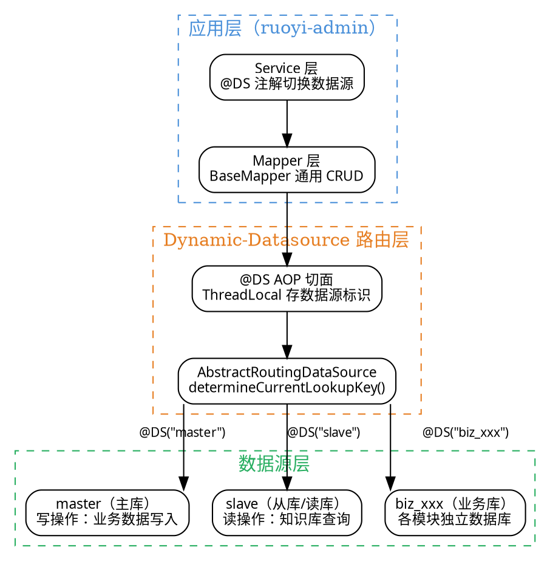

# 08 · MyBatis-Plus + MySQL：ORM 加速与多数据源实战

> MyBatis-Plus 是项目的数据访问层底座，基于 MyBatis 提供"零 SQL CRUD"能力。配合 Dynamic-Datasource 组件实现多数据源切换（主库 + 从库/业务库隔离），并通过 `@DSTransactional` 和 Seata 确保跨数据源事务一致性。
>
> **对应项目模块：** `ruoyi-common/mybatis` 公共 starter + 各业务模块

---

## 一、你必须知道的 3 个核心概念

### 1.1 MyBatis-Plus 自动映射

MyBatis-Plus 是 MyBatis 的增强工具，**只做增强不做改变**——它不会取代 MyBatis，而是在 MyBatis 之上提供一套通用 CRUD 能力。核心机制是**自动映射**：

| 机制 | 说明 |
|------|------|
| **BaseMapper** | 继承 `BaseMapper<T>` 后自动获得 `insert`、`deleteById`、`updateById`、`selectById`、`selectPage` 等 20+ 方法，无需写 XML |
| **LambdaQueryWrapper** | 类型安全的条件构造器，用 Lambda 表达式引用实体字段，编译期即可发现字段名拼写错误 |
| **自动代码生成** | AutoGenerator 根据数据库表结构自动生成 Entity、Mapper、Service、Controller 全套代码 |
| **分页插件** | `PaginationInnerInterceptor` 拦截器自动拦截分页查询，先执行 COUNT 再追加 LIMIT 子句 |
| **乐观锁插件** | `@Version` 注解标记版本字段，更新时自动 `SET version = version + 1 WHERE version = oldVersion` |
| **逻辑删除** | `@TableLogic` 注解标记删除字段，`deleteById` 自动转为 `UPDATE SET deleted=1` |

**核心思想：** 简单 CRUD 用内置方法零 SQL，复杂查询仍然手写 XML（MyBatis 原生能力不受影响）。项目选型时"Plus 兜底简单操作，XML 兜底复杂操作"，各取所长。

### 1.2 Dynamic-Datasource（动态数据源）

Dynamic-Datasource 是 baomidou 团队提供的多数据源切换组件，**基于 Spring 的 `AbstractRoutingDataSource` 实现**，核心原理：

1. **`@DS` 注解**：标注在 Service 方法或 Mapper 接口上，指定该方法使用哪个数据源
2. **AOP 切面**：方法执行前拦截 `@DS` 注解，将数据源标识存入 `ThreadLocal`
3. **动态路由**：`determineCurrentLookupKey()` 从 `ThreadLocal` 获取标识，路由到对应的 `DataSource`
4. **自动清理**：方法执行完毕后在 `finally` 中清除 `ThreadLocal`，防止数据源泄漏到下一请求

**通俗理解：** 就像是一个"数据源路由器"——每个请求进来时，`@DS` 注解告诉路由器"这次走哪个数据源"，路由器根据标识把 SQL 发到对应的数据库连接。

### 1.3 多数据源事务

多数据源场景下，一个业务方法可能同时操作主库和从库（或多个业务库），此时事务一致性面临挑战：

| 方案 | 说明 | 适用场景 |
|------|------|----------|
| **`@DSTransactional`** | baomidou 提供的本地多数据源事务注解，同时开启多个数据源的本地事务，任一失败则逐一回滚 | 单服务内多数据源，对一致性要求不极端 |
| **Seata AT 模式** | 分布式事务框架，通过 `@GlobalTransactional` + undo_log 表实现两阶段提交 | 跨服务、跨数据库，需要强一致性 |
| **TCC（Try-Confirm-Cancel）** | 业务层面的补偿事务，每个操作实现 try/confirm/cancel 三个阶段 | 对性能要求高、业务可补偿的场景 |
| **事务消息（RocketMQ）** | 本地事务 + 消息队列，先执行本地事务再发消息，下游消费 | 最终一致性场景，如订单创建 + 积分发放 |

项目中**单数据源内用 `@Transactional`，同服务多数据源用 `@DSTransactional`，跨服务用 Seata**。

---

## 二、项目中的实战应用

### 2.1 解决了什么问题

| 痛点 | 解决方案 |
|------|----------|
| 简单 CRUD 也要写大量重复的 XML 和 SQL | MyBatis-Plus BaseMapper 提供通用方法，零 XML 完成增删改查 |
| 条件查询拼接 SQL 容易出错 | LambdaQueryWrapper 类型安全，编译期就能发现字段名错误 |
| 业务库与配置库分离，需要读写不同数据库 | Dynamic-Datasource 多数据源配置，`@DS` 注解切换 |
| 知识库文档数据量大，需要读写分离 | 主库写 + 从库读，`@DS("slave")` 注解路由到读库 |
| AI 会话数据与业务数据需要隔离存储 | 不同业务模块配置不同数据源，物理隔离 |
| 多数据源操作需要事务一致性 | `@DSTransactional` 本地多数据源事务 + Seata 分布式事务 |

### 2.2 多数据源架构图



### 2.3 核心代码实现（带逐行中文注释）

#### 2.3.1 多数据源配置

```yaml
# application.yml —— 多数据源配置
# Dynamic-Datasource 的配置以 spring.datasource.dynamic 为前缀
spring:
  datasource:
    dynamic:
      primary: master                      # 默认数据源：未标注 @DS 时走 master
      strict: true                         # 严格模式：未找到数据源时抛异常，而非降级到 primary
      datasource:
        # ========== 主数据源（master）：业务数据写入 ==========
        master:
          url: jdbc:mysql://localhost:3306/ruoyi_ai?useUnicode=true&characterEncoding=utf8
          driver-class-name: com.mysql.cj.jdbc.Driver
          username: root
          password: root123

        # ========== 从数据源（slave）：知识库查询等只读操作 ==========
        slave:
          url: jdbc:mysql://localhost:3306/ruoyi_ai_slave?useUnicode=true&characterEncoding=utf8
          driver-class-name: com.mysql.cj.jdbc.Driver
          username: root
          password: root123

        # ========== 业务数据源示例：AI 对话数据独立库 ==========
        biz_chat:
          url: jdbc:mysql://localhost:3306/ruoyi_ai_chat?useUnicode=true&characterEncoding=utf8
          driver-class-name: com.mysql.cj.jdbc.Driver
          username: root
          password: root123

      # Druid 或 HikariCP 连接池配置（以 HikariCP 为例）
      hikari:
        max-lifetime: 600000                # 连接最大存活时间（ms），默认 30 分钟
        maximum-pool-size: 20               # 最大连接数
        minimum-idle: 5                     # 最小空闲连接数
        connection-timeout: 30000           # 获取连接超时时间（ms）
```

#### 2.3.2 MyBatis-Plus 配置类

```java
/**
 * MyBatis-Plus 配置类 —— 注册分页插件、乐观锁插件等
 * 项目启动时加载，全局生效
 */
@Configuration
@MapperScan("com.ruoyi.**.mapper") // 扫描所有模块的 Mapper 接口
public class MybatisPlusConfig {

    /**
     * 分页插件 —— 拦截 Page 类型参数的分页查询
     * 原理：拦截 Executor.query()，先执行 COUNT 查询，再追加 LIMIT 子句
     * 支持多种数据库方言：MySQL、PostgreSQL、Oracle 等
     */
    @Bean
    public MybatisPlusInterceptor mybatisPlusInterceptor() {
        MybatisPlusInterceptor interceptor = new MybatisPlusInterceptor();
        // 添加分页拦截器：指定数据库类型为 MySQL
        interceptor.addInnerInterceptor(new PaginationInnerInterceptor(DbType.MYSQL));
        // 添加乐观锁拦截器：@Version 注解标记的字段自动版本管理
        interceptor.addInnerInterceptor(new OptimisticLockerInnerInterceptor());
        return interceptor;
    }

    /**
     * 自动填充处理器 —— 自动填充创建时间、更新时间等公共字段
     * 配合 Entity 上的 @TableField(fill = FieldFill.INSERT) 使用
     * 插入时自动设置 createTime、updateTime，更新时自动设置 updateTime
     */
    @Bean
    public MetaObjectHandler metaObjectHandler() {
        return new MetaObjectHandler() {
            @Override
            public void insertFill(MetaObject metaObject) {
                // 插入时自动填充：创建时间、更新时间
                this.strictInsertFill(metaObject, "createTime", LocalDateTime::now, LocalDateTime.class);
                this.strictInsertFill(metaObject, "updateTime", LocalDateTime::now, LocalDateTime.class);
            }

            @Override
            public void updateFill(MetaObject metaObject) {
                // 更新时自动填充：更新时间
                this.strictUpdateFill(metaObject, "updateTime", LocalDateTime::now, LocalDateTime.class);
            }
        };
    }
}
```

#### 2.3.3 @DS 注解切换数据源

```java
/**
 * 知识库服务 —— 演示 @DS 注解在不同数据源之间切换
 * 
 * 场景：知识库文档数据存储在从库（slave）中，但写入操作需要走主库（master）
 * 通过 @DS 注解在方法级别切换数据源，无需手动管理 Connection
 */
@Service
@RequiredArgsConstructor
public class KnowledgeBaseService {

    private final KnowledgeBaseMapper knowledgeBaseMapper; // MyBatis-Plus Mapper
    private final KnowledgeDocMapper knowledgeDocMapper;

    // ==================== 查询操作：走从库（slave） ====================

    /**
     * 查询知识库列表 —— 读操作，走从库
     * @DS("slave")：指定此方法使用 slave 数据源
     * 未标注 @DS 的方法默认走 primary（master）
     */
    @DS("slave")
    public List<KnowledgeBase> listKnowledgeBases() {
        // 查询所有知识库，走 slave 从库，减轻主库查询压力
        return knowledgeBaseMapper.selectList(
                new LambdaQueryWrapper<KnowledgeBase>()
                        .eq(KnowledgeBase::getStatus, 1)  // 只查询启用的知识库
                        .orderByDesc(KnowledgeBase::getCreateTime)); // 按创建时间倒序
    }

    /**
     * 分页查询知识库文档 —— 读操作，走从库
     * 配合 MyBatis-Plus 分页插件，自动生成 COUNT + LIMIT 语句
     */
    @DS("slave")
    public Page<KnowledgeDoc> pageDocs(Page<KnowledgeDoc> page, Long kbId) {
        // Page 对象会被分页拦截器识别，自动处理 COUNT 和 LIMIT
        return knowledgeDocMapper.selectPage(page,
                new LambdaQueryWrapper<KnowledgeDoc>()
                        .eq(KnowledgeDoc::getKbId, kbId)      // 按知识库 ID 过滤
                        .eq(KnowledgeDoc::getDelFlag, "0"));  // 过滤已删除
    }

    // ==================== 写入操作：走主库（master） ====================

    /**
     * 创建知识库 —— 写操作，走主库
     * @DS 可省略，因为 primary = master，不标注时默认走主库
     * 但为了代码可读性，建议显式标注 @DS("master")
     */
    @DS("master")
    public void createKnowledgeBase(KnowledgeBase kb) {
        // BaseMapper 内置方法：insert，无需写 SQL
        knowledgeBaseMapper.insert(kb);
    }

    /**
     * 更新知识库 —— 写操作，走主库
     * 更新时自动填充 updateTime（由 MetaObjectHandler 处理）
     */
    @DS("master")
    public void updateKnowledgeBase(KnowledgeBase kb) {
        // BaseMapper 内置方法：updateById，根据主键更新非空字段
        knowledgeBaseMapper.updateById(kb);
    }

    // ==================== 跨数据源操作：多数据源事务 ====================

    /**
     * 导入文档到知识库 —— 同时操作主库和从库
     * 
     * 业务逻辑：
     * 1. 主库：写入文档元数据（knowledge_doc 表）
     * 2. 从库：更新知识库的文档计数（knowledge_base 表）
     * 
     * @DSTransactional：同时开启两个数据源的本地事务
     * 任一数据源操作失败，两个数据源都回滚
     */
    @DSTransactional // 多数据源事务注解，替代 @Transactional
    public void importDocument(KnowledgeDoc doc) {
        // 第一步：主库写入文档元数据（@DS("master") 可省略，默认走主库）
        knowledgeDocMapper.insert(doc);

        // 第二步：从库更新知识库文档计数（显式切换数据源）
        // 注意：@DS 在方法内部无法通过 AOP 切换，需要通过代理对象调用
        // 或用 KnowledgeBaseService 的另一个 @DS("slave") 方法
        updateDocCountOnSlave(doc.getKbId());
    }

    /**
     * 在从库上更新文档计数
     * 单独抽取为 @DS("slave") 方法，供 @DSTransactional 方法内部调用
     */
    @DS("slave")
    public void updateDocCountOnSlave(Long kbId) {
        knowledgeBaseMapper.updateDocCount(kbId);
    }
}

/**
 * 知识库文档 Mapper —— 演示 BaseMapper 和自定义 XML 共存
 * 
 * 继承 BaseMapper<KnowledgeDoc> 后自动获得：
 * insert、deleteById、updateById、selectById、selectList、selectPage 等
 * 复杂查询需在 XML 中手写 SQL
 */
@Mapper
public interface KnowledgeDocMapper extends BaseMapper<KnowledgeDoc> {

    /**
     * 自定义查询：统计知识库文档数量
     * 复杂查询仍需手写 SQL，在 XML 中定义
     */
    Long countDocsByKbId(@Param("kbId") Long kbId);
}

/**
 * 知识库实体类 —— 演示 MyBatis-Plus 注解
 */
@Data
@TableName("knowledge_base") // 指定数据库表名（默认驼峰转下划线）
public class KnowledgeBase {

    @TableId(type = IdType.ASSIGN_ID) // 主键策略：雪花算法生成唯一 ID
    private Long id;

    private String name;               // 知识库名称

    private String description;        // 知识库描述

    private Integer status;            // 状态：0-禁用 1-启用

    @TableField(fill = FieldFill.INSERT) // 插入时自动填充
    private LocalDateTime createTime;

    @TableField(fill = FieldFill.INSERT_UPDATE) // 插入和更新时自动填充
    private LocalDateTime updateTime;

    @TableLogic // 逻辑删除注解：deleteById 自动转为 update set del_flag = 1
    private String delFlag;

    @Version // 乐观锁注解：更新时自动 version + 1，防止并发覆盖
    private Integer version;
}
```

#### 2.3.4 多数据源事务 —— @DSTransactional 示例

```java
/**
 * AI 对话会话服务 —— 演示多数据源事务的完整用法
 * 
 * 场景：用户发起对话时，需要同时：
 * 1. 在主库创建会话记录（会话表）
 * 2. 在 AI 对话库保存对话上下文（消息表）
 * 两个操作分属不同数据源，需要事务一致性
 */
@Service
@RequiredArgsConstructor
public class ChatSessionService {

    private final ChatSessionMapper sessionMapper;   // 主库 Mapper
    private final ChatMessageMapper messageMapper;   // AI 对话库 Mapper

    /**
     * 创建对话会话 —— 跨数据源事务
     * 
     * @DSTransactional 注解说明：
     * - 同时开启多个数据源的本地事务
     * - 任一失败则逐一回滚所有已开启的事务
     * - 不支持事务传播行为（如 REQUIRES_NEW）
     * - 不支持 @Transactional 混用
     */
    @DSTransactional
    public void createChatSession(ChatSession session, ChatMessage firstMessage) {
        // 1. 主库写入会话记录（默认 primary = master）
        sessionMapper.insert(session);

        // 2. AI 对话库写入消息记录（通过 @DS 切换方法）
        // 注意：@DS 注解在方法内部直接调用不生效（AOP 代理问题）
        // 正确做法：通过注入的代理对象调用
        saveMessageToChatDb(firstMessage);
    }

    /**
     * 保存消息到 AI 对话库
     * 单独抽取为 public 方法，通过 AOP 代理拦截 @DS 注解
     */
    @DS("biz_chat")
    public void saveMessageToChatDb(ChatMessage message) {
        messageMapper.insert(message);
    }

    /**
     * 在同一方法内自调用的问题演示
     * 
     * 错误写法：直接在 @DSTransactional 方法内调用 this.xxxMethod()
     * 原因：this 是原始对象，不是 AOP 代理对象，@DS 和 @DSTransactional 都不生效
     * 解决：注入自身代理（@Lazy 注入）或拆分为两个独立方法
     */
    @DSTransactional
    public void wrongWay(ChatSession session, ChatMessage message) {
        sessionMapper.insert(session);
        // 错误：this.saveMessageToChatDb(message) —— @DS 不生效！
        // 正确：通过 @Lazy 注入的 self 代理调用
        saveMessageToChatDb(message); // 假设 saveMessageToChatDb 是 public 方法
    }
}
```

#### 2.3.5 Entity 与 LambdaQueryWrapper 最佳实践

```java
/**
 * 文档查询服务 —— 演示 LambdaQueryWrapper 的典型用法
 * LambdaQueryWrapper 是 MyBatis-Plus 的类型安全条件构造器
 * 字段引用使用 Lambda 表达式（KnowledgeDoc::getTitle），编译期可校验
 */
@Service
@RequiredArgsConstructor
public class DocQueryService {

    private final KnowledgeDocMapper docMapper;

    /**
     * 多条件组合查询 —— LambdaQueryWrapper 链式调用
     */
    @DS("slave")
    public List<KnowledgeDoc> searchDocs(String keyword, Long kbId, LocalDate startDate) {
        // 构建查询条件：LambdaQueryWrapper 链式调用，类型安全
        LambdaQueryWrapper<KnowledgeDoc> wrapper = new LambdaQueryWrapper<KnowledgeDoc>()
                // 模糊匹配：标题包含关键字
                .like(StringUtils.isNotBlank(keyword), KnowledgeDoc::getTitle, keyword)
                // 等值匹配：按知识库 ID 过滤
                .eq(kbId != null, KnowledgeDoc::getKbId, kbId)
                // 范围匹配：创建时间 >= 起始日期
                .ge(startDate != null, KnowledgeDoc::getCreateTime, startDate)
                // 逻辑删除过滤：只查未删除的
                .eq(KnowledgeDoc::getDelFlag, "0")
                // 排序：按创建时间倒序
                .orderByDesc(KnowledgeDoc::getCreateTime);

        // 执行查询：selectList 是 BaseMapper 内置方法，无需写 SQL
        return docMapper.selectList(wrapper);
    }

    /**
     * 分页 + 条件查询 —— 配合分页插件
     */
    @DS("slave")
    public Page<KnowledgeDoc> pageSearch(Page<KnowledgeDoc> page, String keyword) {
        // Page 对象传入后，分页拦截器自动处理 COUNT 和 LIMIT
        return docMapper.selectPage(page,
                new LambdaQueryWrapper<KnowledgeDoc>()
                        .like(KnowledgeDoc::getTitle, keyword)
                        // 只有第一个 like 匹配时，才应用第二个（and 条件）
                        .and(w -> w.like(KnowledgeDoc::getContent, keyword)
                                    .or().like(KnowledgeDoc::getTags, keyword)));
    }
}
```

### 2.4 设计亮点

**亮点一：BaseMapper 零 SQL 覆盖 80% CRUD**

项目 80% 的数据库操作是简单的单表增删改查，BaseMapper 内置的 20+ 方法直接覆盖，无需写一行 XML。剩下 20% 的复杂查询（多表 JOIN、聚合统计）再手写 XML——**"简单不写，复杂不拦"**，比纯 MyBatis 减少约 60% 的样板代码。

**亮点二：@DS 注解实现数据源切换零侵入**

业务代码只需要加一行 `@DS("slave")` 注解，就能把整个方法的数据库操作路由到从库。底层靠 AOP 切面 + ThreadLocal 实现，业务代码不需要感知 Connection 的管理、不需要手动获取/释放数据源——**切换数据源的复杂度被框架完全吸收**。

**亮点三：多数据源事务分层兜底**

| 场景 | 方案 | 一致性保证 |
|------|------|-----------|
| 单数据源 | `@Transactional` | 本地事务 ACID |
| 同服务多数据源 | `@DSTransactional` | 本地多数据源事务（逐一提交/回滚） |
| 跨服务 | Seata `@GlobalTransactional` | 分布式事务（AT 模式 + undo_log） |

不追求"一刀切"的分布式事务——单数据源用本地事务，同服务多数据源用 `@DSTransactional`，只有真正跨服务才上 Seata。**避免过度设计，按场景分层选型。**

**亮点四：LambdaQueryWrapper 类型安全**

传统 MyBatis 的条件查询用字符串拼字段名：`"title like '%keyword%'"`——字段名写错只有运行时才能发现。LambdaQueryWrapper 用 `KnowledgeDoc::getTitle` 引用字段，编译期就能检查字段是否存在、类型是否匹配，**把"运行时错误"提前到"编译期错误"**。

---

## 三、面试高频题

### Q1: MyBatis-Plus 和 MyBatis 的区别？项目为什么选 Plus？

**参考答案：**

**核心区别一句话：MyBatis-Plus 是 MyBatis 的增强工具，只做增强不做改变。**

| 维度 | MyBatis | MyBatis-Plus |
|------|---------|-------------|
| **CRUD** | 每个方法都要写 XML 或注解 | `BaseMapper<T>` 内置 20+ 通用方法，零 SQL |
| **条件构造** | 手写 SQL 拼接 WHERE，容易出错 | `LambdaQueryWrapper` 类型安全链式调用 |
| **分页** | 手写 `LIMIT #{offset}, #{size}` | `PaginationInnerInterceptor` 自动分页 |
| **代码生成** | 需自己实现或第三方工具 | `AutoGenerator` 一键生成全套代码 |
| **逻辑删除** | 手写 `UPDATE SET deleted = 1` | `@TableLogic` 一行注解搞定 |
| **乐观锁** | 手写 `version = version + 1` | `@Version` 自动版本管理 |
| **复杂查询** | 原生支持（手写 XML） | 同样支持（不限制 MyBatis 能力） |

**项目为什么选 Plus：**

1. **减少样板代码**：AI 项目实体类多（知识库文档、会话记录、模型配置、向量记录等），如果每个都写一套 XML CRUD，工作量翻倍。Plus 让简单 CRUD 零 SQL，开发效率提升 40% 以上。
2. **类型安全**：LambdaQueryWrapper 编译期校验字段名，避免"字段改名后运行时才报错"的尴尬——这在 AI 项目频繁迭代的场景下价值很大。
3. **生态兼容**：Plus 与 Dynamic-Datasource 同属 baomidou 生态，两者配合无需额外适配，开箱即用。
4. **不牺牲复杂查询能力**：复杂 JOIN 和聚合查询仍然手写 XML，Plus 不限制 MyBatis 的任何原生能力——**"简单不写，复杂不拦"**。

**追问应对：** "如果项目一开始就用 JPA 呢？" 答：JPA 的自动映射比 Plus 更"黑盒"，复杂查询 JPQL/HQL 调试困难；MyBatis-Plus 本质上还是 MyBatis，SQL 在手、心里有底。AI 项目对 SQL 可控性要求高（如向量检索后的 SQL 过滤），Plus 更合适。

### Q2: Dynamic-Datasource 多数据源的实现原理？@DS 注解的失效场景有哪些？

**参考答案：**

**实现原理分四层：**

```
@DS("slave") 标注在方法上
    ↓
AOP 切面拦截 @DS 注解，在方法执行前将 "slave" 存入 ThreadLocal
    ↓
AbstractRoutingDataSource.determineCurrentLookupKey()
    从 ThreadLocal 获取数据源标识，返回对应的 DataSource
    ↓
SQL 执行完毕后，finally 块中清除 ThreadLocal，防止内存泄漏
```

**核心源码逻辑（简化）：**

```java
/**
 * Dynamic-Datasource 核心拦截器（简化版）
 * 本质是一个 Spring AOP 切面
 */
@Around("@annotation(ds)") // 拦截所有 @DS 注解
public Object around(ProceedingJoinPoint point, DS ds) throws Throwable {
    // 1. 将注解指定的数据源标识存入 ThreadLocal
    DynamicDataSourceContextHolder.push(ds.value());
    try {
        // 2. 执行原方法（此时 Mapper 的 SQL 会路由到指定数据源）
        return point.proceed();
    } finally {
        // 3. 清理 ThreadLocal，防止数据源泄漏到下一个请求
        DynamicDataSourceContextHolder.poll();
    }
}
```

**Spring 的 AbstractRoutingDataSource 路由逻辑：**

```java
/**
 * AbstractRoutingDataSource 是 Spring 提供的抽象类
 * Dynamic-Datasource 通过继承它实现动态路由
 */
public class DynamicRoutingDataSource extends AbstractRoutingDataSource {

    @Override
    protected Object determineCurrentLookupKey() {
        // 从 ThreadLocal 获取当前线程要使用的数据源标识
        // 如果为 null，使用默认数据源（primary）
        return DynamicDataSourceContextHolder.peek();
    }
}
```

**@DS 注解的 5 大失效场景（面试高频）：**

| 失效场景 | 原因 | 解决方案 |
|---------|------|----------|
| **1. 同类方法内部调用** | `this.method()` 调用不走 AOP 代理，@DS 不被拦截 | 注入自身代理（`@Lazy` 或 `@Resource`）或拆分为不同类 |
| **2. 事务内切换** | `@Transactional` 开启事务后，Connection 已被绑定，@DS 切换无效 | 先切数据源再开事务，或将 `@DS` 写在 `@Transactional` 外层 |
| **3. 多线程环境** | ThreadLocal 无法跨线程传递，子线程拿不到父线程的数据源标识 | 使用 `InheritableThreadLocal` 或手动传递标识 |
| **4. 私有方法** | Spring AOP 默认只拦截 public 方法，private 方法的 @DS 不生效 | 改为 public 方法 |
| **5. @DSTransactional 内部** | 多数据源事务中，@DS 的切换时机与事务绑定冲突 | 将需要切换数据源的操作抽取为独立方法，通过代理调用 |

**追问应对：** "ThreadLocal 为什么会导致内存泄漏？" 答：Web 应用使用线程池，请求处理完线程归还池中。如果 `finally` 中没清理 ThreadLocal，下一个请求复用该线程时，ThreadLocal 中残留的上次数据源标识会导致路由错误。Dynamic-Datasource 在 `poll()` 中使用了 `remove()` 而非只 `set(null)`，彻底清除了 Entry，防止了内存泄漏。

### Q3: 多数据源场景下如何保证事务一致性？

**参考答案：**

多数据源事务一致性需要根据场景分层选型，没有银弹：

**方案一：@DSTransactional（同服务多数据源）**

```java
/**
 * @DSTransactional —— baomidou 提供的多数据源本地事务注解
 * 
 * 原理：
 * 1. 方法执行时，依次开启多个数据源的本地事务（Connection.setAutoCommit(false)）
 * 2. 所有操作成功后，逐一提交（Connection.commit()）
 * 3. 任一操作失败，逐一回滚所有已开启的事务（Connection.rollback()）
 * 
 * 局限：
 * - 不是真正的分布式事务，没有二阶段提交协议
 * - 提交阶段如果某个数据源提交失败，已提交的数据源无法回滚（"先成功再失败"问题）
 * - 不支持事务传播行为（REQUIRED、REQUIRES_NEW 等不生效）
 */
@DSTransactional
public void transferData() {
    // 数据源 A 写入
    dataSourceAMapper.insert(data);
    // 数据源 B 写入（如果 B 失败，A 的回滚）
    dataSourceBMapper.update(data);
}
```

**方案二：Seata AT 模式（跨服务分布式事务）**

Seata 是阿里巴巴开源的分布式事务框架，AT 模式（Automatic Transaction）是它的核心模式：

| 阶段 | 操作 | 说明 |
|------|------|------|
| **Phase 1（执行）** | TM 开启全局事务 → 生成 XID → RM 执行业务 SQL → 记录 before/after image → 写入 undo_log → 提交本地事务 | 业务 SQL 正常执行，同时记录回滚所需的数据快照 |
| **Phase 2-提交（正常）** | TC 收到所有 RM 提交成功 → 通知 RM 删除 undo_log | 清理回滚日志，全局事务完成 |
| **Phase 2-回滚（异常）** | TC 收到任一 RM 失败 → 通知所有 RM 回滚 → RM 用 undo_log 反向补偿恢复数据 | 根据 before image 生成反向 SQL 恢复数据 |

```java
/**
 * Seata 分布式事务 —— @GlobalTransactional 注解
 * 
 * 使用步骤：
 * 1. 引入 seata-spring-boot-starter 依赖
 * 2. 每个数据库中添加 undo_log 表
 * 3. 在全局事务入口方法标注 @GlobalTransactional
 * 4. XID 通过 RPC（Dubbo/Feign）自动传递到下游服务
 */
@Service
public class OrderService {

    /**
     * 创建订单 —— 跨服务分布式事务
     * 
     * 事务范围：
     * 1. 订单服务：创建订单记录（MySQL）
     * 2. 库存服务：扣减库存（MySQL）
     * 3. 积分服务：增加用户积分（MySQL）
     * 
     * @GlobalTransactional 开启全局事务，Seata 自动代理所有数据源
     */
    @GlobalTransactional(name = "create-order", rollbackFor = Exception.class)
    public void createOrder(Order order) {
        // 1. 保存订单（本地事务 + Seata 代理）
        orderMapper.insert(order);

        // 2. 远程调用库存服务扣减库存（Feign 调用，XID 自动传递）
        //    库存服务的方法无需 @GlobalTransactional，只需 Seata 代理数据源
        inventoryClient.deduct(order.getProductId(), order.getQuantity());

        // 3. 远程调用积分服务增加积分
        //    如果积分服务失败，Seata 自动回滚订单和库存操作
        pointClient.add(order.getUserId(), order.getTotalAmount());
    }
}
```

**方案三：事务消息（最终一致性）**

```java
/**
 * 事务消息 —— 基于 RocketMQ 的最终一致性方案
 * 
 * 适用场景：不需要强一致性，可以接受短暂不一致
 * 典型场景：订单创建 + 发送消息通知
 * 
 * 原理：
 * 1. 先执行本地事务（创建订单）
 * 2. 本地事务成功后发消息
 * 3. 消息消费方执行下游操作（发送通知）
 * 4. 如果本地事务回滚，消息不发
 */
// 订单创建后发消息，异步执行下游操作
// 即使通知发送失败，订单数据仍然是正确的
// 通过消息重试机制保证最终一致性
```

**方案选型指南：**

| 场景 | 推荐方案 | 原因 |
|------|---------|------|
| 单服务单数据源 | `@Transactional` | 最简单的本地事务，ACID 完全保证 |
| 单服务多数据源 | `@DSTransactional` | 轻量，无需额外组件，但存在"先成功再失败"风险 |
| 跨服务分布式 | Seata AT 模式 | 强一致性，对业务代码侵入小 |
| 高性能、可补偿 | TCC（Try-Confirm-Cancel） | 性能最好，但需业务实现三阶段接口 |
| 最终一致性 | 事务消息（RocketMQ） | 吞吐量高，适合异步解耦场景 |

**追问应对：** "Seata AT 模式的性能瓶颈在哪里？" 答：AT 模式在 Phase 1 需要额外记录 before/after image，写入 undo_log 表，SQL 执行时间增加约 10%-20%。Phase 2-提交阶段需要删除 undo_log，也有少量开销。性能敏感场景建议用 TCC 模式（无 undo_log，可以异步清理）。此外，Seata TC 服务器的单点压力也是瓶颈，生产环境需要 TC 集群部署。

---

## 四、面试避坑指南

### 坑 1：@DS 注解在同类内部调用不生效

**错误做法：** 在同一个 Service 类中，方法 A 调用方法 B，方法 B 标注了 `@DS("slave")`，期望 B 走从库——但实际没生效。

```java
// 错误示例：同类的内部方法调用，@DS AOP 切面不拦截
@Service
public class BadService {
    @DS("master")
    public void methodA() {
        // 这里调用 methodB，但 this.methodB() 不走 AOP 代理
        this.methodB(); // @DS("slave") 不生效！
    }

    @DS("slave")
    public void methodB() {
        // 本应走从库，但实际走了主库
    }
}
```

**原因：** Spring AOP 基于代理对象，`this.methodB()` 调用的是原始对象，不是代理对象，AOP 切面不会拦截。**@DS、@Transactional、@DSTransactional 都有这个问题。**

**正确做法：** 注入自身代理，通过代理对象调用。

```java
@Service
public class GoodService {
    @Lazy // 延迟注入，避免循环依赖
    @Autowired
    private GoodService self; // 注入自身代理

    @DS("master")
    public void methodA() {
        // 通过代理对象调用，@DS 切面生效
        self.methodB(); // 正确：走从库
    }

    @DS("slave")
    public void methodB() {
        // 数据源正确切换为 slave
    }
}
```

### 坑 2：@Transactional 与 @DS 混用导致事务内无法切换数据源

**错误做法：** 在 `@Transactional` 方法内标注 `@DS` 切换数据源，期望切换生效。

```java
// 错误示例：事务已开启后，@DS 切换无效
@Transactional // 先开启事务，此时已绑定主库的 Connection
@DS("slave")   // 期望切换到从库，但事务已开启，切换无效
public void queryWithTransaction() {
    // 即使 @DS 标注了 slave，实际仍然走主库
    // 因为 @Transactional 在 @DS 之前拦截，Connection 已被绑定
}
```

**原因：** `@Transactional` 在方法执行前就获取了 Connection 并绑定到事务上下文中。`@DS` 在方法执行时再切换数据源，但 Connection 已经拿好了，切换无效。

**正确做法：** 将 `@DS` 写在方法上，`@Transactional` 写在内部调用的方法上，或者用 `@DSTransactional` 替代。

```java
// 正确做法：先切数据源，再开启事务（如有需要）
@DS("slave")
@Transactional // 现在事务是在 slave 数据源上开启的
public void queryWithTransaction() {
    // 正确：事务在 slave 数据源上执行
}

// 更好的做法：读操作不需要事务，直接用 @DS 即可
@DS("slave")
public List<Doc> queryDocs() {
    // 读操作不需要 @Transactional，@DS 切换足够了
    return docMapper.selectList(null);
}
```

### 坑 3：@DSTransactional 不支持事务传播行为

**错误做法：** 在 `@DSTransactional` 方法中调用另一个 `@DSTransactional` 方法，期望 `REQUIRES_NEW` 等传播行为生效。

**原因：** `@DSTransactional` 是 baomidou 自己实现的事务管理器，不支持 Spring 的 `@Transactional` 传播行为（`REQUIRED`、`REQUIRES_NEW`、`NESTED` 等）。它只做简单的事——同时开启多个数据源事务，失败了全部回滚。

**正确做法：** 如果需要事务传播，用 `@Transactional` 单数据源事务；如果确实需要多数据源 + 传播行为，考虑用 Seata。

### 坑 4：分页查询时忘记传 Page 对象

**错误做法：** 直接调用 `selectList` 做分页，或者手动计算 offset 传给 `selectPage` 但传的是普通对象。

```java
// 错误示例：分页插件只对 Page 类型参数生效
List<Doc> docs = docMapper.selectList( // 这里返回所有数据，不是分页
        new LambdaQueryWrapper<Doc>().last("LIMIT 10")); // 手写 LIMIT 不优雅
```

**正确做法：** 使用 MyBatis-Plus 的 `Page` 对象，分页插件自动处理。

```java
// 正确做法：分页插件自动生成 COUNT + LIMIT
Page<Doc> page = new Page<>(1, 10); // 第 1 页，每页 10 条
Page<Doc> result = docMapper.selectPage(page,
        new LambdaQueryWrapper<Doc>()
                .eq(Doc::getStatus, 1)
                .orderByDesc(Doc::getCreateTime));

// result 包含：records（当前页数据）、total（总条数）、pages（总页数）
long total = result.getTotal();
List<Doc> records = result.getRecords();
```

### 坑 5：多数据源连接池配置不一致

**错误做法：** 主库和从库使用不同的连接池配置，主库 `max-pool-size=20`，从库 `max-pool-size=5`——但业务上从库的查询量比主库大得多，导致从库连接池被打满，查询超时。

**正确做法：** 根据实际流量比例配置连接池大小，不要一刀切。从库通常是读多写少的场景，查询并发大，连接池应该比主库更大。

```yaml
spring:
  datasource:
    dynamic:
      datasource:
        master:
          # 写库：写入并发相对较小
          hikari:
            maximum-pool-size: 10
        slave:
          # 读库：查询并发大，连接池要更大
          hikari:
            maximum-pool-size: 30
        biz_chat:
          # AI 对话库：读写均衡
          hikari:
            maximum-pool-size: 20
```

### 坑 6：逻辑删除与唯一索引冲突

**错误做法：** 表中对某个字段设置了唯一索引（如 `name` 唯一），同时启用了 MyBatis-Plus 的逻辑删除（`@TableLogic`）。当删除一条记录后，再次插入同名的记录时，由于唯一索引的存在，插入失败。

**原因：** 逻辑删除只是将 `del_flag` 置为 1，记录仍然在表中。唯一索引会阻止相同 `name` 的插入，即使旧记录已被"逻辑删除"。

**解决方案：**
1. 唯一索引将 `del_flag` 纳入索引范围（联合唯一索引：`(name, del_flag)`），但只对 `del_flag=0` 生效
2. 或者使用 MySQL 的虚拟列 + 部分索引（MySQL 5.7+ 支持 `INDEX ... WHERE del_flag = 0`）
3. 或者在业务层做去重判断，先查逻辑删除的记录再决定是否允许插入

---

## 五、参考资料与扩展阅读

### 项目源码
- [ruoyi-ai GitHub 仓库](https://github.com/1byteone/ruoyi-ai) — `ruoyi-common/mybatis` 模块

### MyBatis-Plus 官方
- [MyBatis-Plus 官方文档](https://baomidou.com/) — 自动映射、分页插件、代码生成器完整使用指南
- [MyBatis-Plus GitHub 仓库](https://github.com/baomidou/mybatis-plus) — 源码与 Issue

### Dynamic-Datasource
- [dynamic-datasource 官方文档](https://dynamic-datasource.com/) — 多数据源配置、`@DS` 注解、`@DSTransactional` 完整用法
- [dynamic-datasource GitHub 仓库](https://github.com/baomidou/dynamic-datasource) — 源码与示例

### 分布式事务
- [Seata 官方文档](https://seata.io/) — AT 模式、TCC 模式、Saga 模式详解
- [Seata GitHub 仓库](https://github.com/seata/seata) — 源码与部署指南
- [RocketMQ 事务消息](https://rocketmq.apache.org/) — 最终一致性方案

### MySQL 相关
- [MySQL 8.0 官方文档](https://dev.mysql.com/doc/refman/8.0/en/) — 索引优化、事务隔离级别
- [MySQL 读写分离架构](https://dev.mysql.com/doc/refman/8.0/en/replication.html) — 主从复制配置