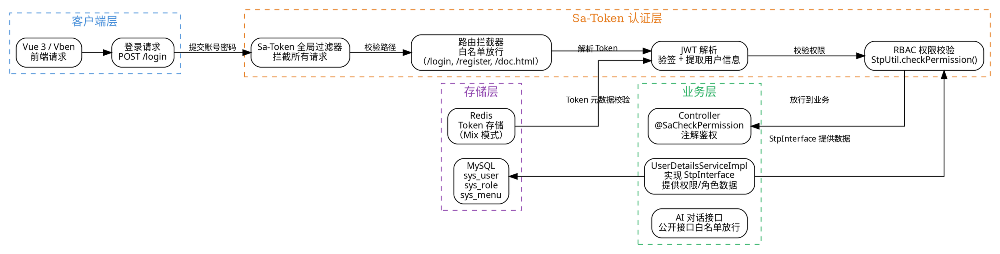

# 10 · Sa-Token + JWT 认证鉴权：轻量级 RBAC 权限体系

> 认证鉴权是 AI 应用的"安全大门"——ruoyi-ai 选择 Sa-Token（而非 Spring Security）作为权限框架，采用 **Sa-Token 核心 + JWT 无状态 Token + RBAC 权限模型** 三层架构，实现登录认证、权限校验、路由拦截的全链路安全管控。
>
> **对应项目模块：** `ruoyi-system/system/`（RBAC 权限管理） + `ruoyi-admin/config/`（Sa-Token 拦截器配置）

---

## 一、你必须知道的 3 个核心概念

### 1.1 Sa-Token

Sa-Token 是一个轻量级 Java 认证授权框架，对标 Spring Security 但设计理念截然不同——**"简单、易用、开箱即用"**。当前版本 v1.45.0。

| 特性 | Sa-Token | Spring Security |
|------|----------|----------------|
| **学习曲线** | 低，5 分钟上手 | 高，众多 Filter/Provider/Manager 概念 |
| **API 风格** | 静态工具类 `StpUtil` 一行搞定 | 配置式 + 链式 Builder |
| **Token 管理** | 内置 Token 生成/校验/刷新/踢人 | 需自行实现或集成 JWT |
| **OAuth2/SSO** | 内置插件支持 | 需额外配置 |
| **权限注解** | `@SaCheckPermission` / `@SaCheckRole` | `@PreAuthorize` |
| **Redis 集成** | 自动适配，一行配置 | 需手动配置 SessionRepository |
| **社区生态** | 国产，中文文档友好 | 全球主流，生态丰富 |

**为什么 ruoyi-ai 选 Sa-Token 而非 Spring Security？**

- 项目基于 RuoYi-Vue-Plus，该底座一直使用 Sa-Token，生态兼容
- Sa-Token 的 `StpUtil` 静态 API 在业务代码中极为简洁——`StpUtil.login(id)` 即可完成登录，无需理解复杂的 SecurityContext 机制
- 内置 JWT 集成（`sa-token-jwt` 插件），一行配置切换无状态模式
- 支持"同端互斥登录"（同一用户同一设备只能一个在线），适合管理后台场景

### 1.2 JWT（JSON Web Token）

JWT 是一种**无状态认证协议**，将用户身份信息编码到 Token 自身，服务端无需存储会话即可完成认证。

**JWT 的结构：**

```
Header.Payload.Signature
```

| 部分 | 内容 | 说明 |
|------|------|------|
| **Header** | `{"alg":"HS256","typ":"JWT"}` | 签名算法 + Token 类型 |
| **Payload** | `{"sub":"1001","name":"admin","iat":1700000000}` | 用户信息 + 签发时间等声明 |
| **Signature** | `HMACSHA256(base64(Header)+"."+base64(Payload), secret)` | 防篡改签名 |

**JWT 与 Session 认证的核心区别：**

| 维度 | Session 认证 | JWT 认证 |
|------|-------------|----------|
| **状态** | 有状态，服务端存储 Session | 无状态，Token 自包含用户信息 |
| **存储** | Redis / 内存 | 客户端保存，服务端只验证签名 |
| **扩展性** | 需共享 Session 存储（Redis） | 天然支持水平扩展 |
| **踢人下线** | 直接删除 Session | 需维护黑名单 / 短 TTL + 刷新 |
| **Token 失效** | 服务端控制 | 只能等过期或维护黑名单 |
| **性能** | 每次请求查 Redis | 只需本地验签，更快 |

**为什么项目用"Sa-Token + JWT 双重认证"？**

项目采用 Sa-Token 的 **Mix 模式**（混合模式），结合两者优势：

- **JWT 编码用户信息**：Token 自带用户身份，减少每次请求查 Redis 的开销
- **Redis 存储 Token 元数据**：保留踢人下线、主动失效等能力 —— 解决纯 JWT "无法踢人"的痛点
- 简单说：**JWT 做"验签快"，Redis 做"可控强"**，两者互补

### 1.3 RBAC 权限模型

RBAC（Role-Based Access Control，基于角色的访问控制）是业界最主流的权限模型。核心思想：**用户 → 角色 → 权限** 三层映射，而非"用户 → 权限"直接关联。

**RBAC 核心要素：**

```
用户 (User) ──→ 角色 (Role) ──→ 权限 (Permission)
   │                │                │
   │ 所属角色        │ 拥有的权限      │ 菜单/按钮/API
   ▼                ▼                ▼
  张三 ──→ 管理员角色 ──→ 用户管理:add,del,edit
  李四 ──→ 普通用户角色 ──→ 仅查看权限
```

**为什么需要角色这一层？**

假设系统有 1000 个用户、200 个权限按钮。如果没有角色层，要给一个用户分配权限就得勾选 200 个复选框。有了角色层，只需定义"管理员""编辑""访客"几个角色，给用户分配角色即可。**角色是"权限的集合"**，一个角色下有多个权限，一个用户可以有多个角色。

**ruoyi-ai 中的 RBAC 表结构：**

| 表名 | 说明 | 核心字段 |
|------|------|----------|
| `sys_user` | 用户表 | user_id, role_ids |
| `sys_role` | 角色表 | role_id, role_key, role_name |
| `sys_menu` | 菜单/权限表 | menu_id, permission（如 `system:user:add`）, parent_id |
| `sys_role_menu` | 角色-权限关联 | role_id, menu_id |
| `sys_user_role` | 用户-角色关联 | user_id, role_id |

---

## 二、项目中的实战应用

### 2.1 解决了什么问题

| 痛点 | Sa-Token 的解决方案 |
|------|-------------------|
| 每次请求都需要校验用户身份 | Sa-Token 拦截器自动解析 Token，无需业务代码关心 |
| 管理后台需要细粒度权限控制 | RBAC 模型 + `@SaCheckPermission` 注解，按钮级权限 |
| 微服务多实例下认证状态共享 | Redis 共享 Token 存储 + JWT 无状态双重保障 |
| 需要"踢人下线"功能 | `StpUtil.kickout()` 直接踢掉指定用户 |
| 同一用户多处登录需要互斥 | 同端互斥登录，旧 Token 自动失效 |
| API 接口需要防未授权访问 | Sa-Token 路由拦截器统一拦截，白名单放行公开接口 |

### 2.2 认证鉴权整体结构图



### 2.3 核心实现（关键代码片段，带逐行中文注释）

#### 2.3.1 登录认证 —— StpUtil.login()

登录认证是权限体系的入口。用户提交账号密码，校验通过后 Sa-Token 生成 Token 并返回前端。

```java
/**
 * 登录服务 —— 演示 Sa-Token 最核心的登录认证流程
 *
 * 流程：
 * 1. 验证账号密码（支持验证码校验）
 * 2. 调用 StpUtil.login() 生成 Token
 * 3. 组装 LoginUser 对象存入 Redis（含用户信息 + 权限列表）
 * 4. 返回 Token 给前端
 */
@Service
public class SysLoginService {

    /** 认证管理器 —— Spring Security 遗留，仅用于密码校验 */
    @Autowired
    private AuthenticationManager authenticationManager;

    /** 用户信息查询服务 —— 从数据库查用户详情 */
    @Autowired
    private SysUserService userService;

    /**
     * 登录方法 —— 整个认证流程的入口
     *
     * @param username 用户名
     * @param password 密码（已加密的前端传参）
     * @param code     验证码（可空，取决于配置）
     * @return 登录成功后的 Token 字符串
     */
    public String login(String username, String password, String code) {
        // 1. 校验验证码（可选，管理后台通常开启）
        // validateCaptcha(username, code);  // 验证码校验逻辑（略）

        // 2. 通过 AuthenticationManager 校验账号密码
        //    内部调用 UserDetailsService.loadUserByUsername() 加载用户
        //    密码匹配失败会抛出 BadCredentialsException
        Authentication authentication = authenticationManager.authenticate(
                new UsernamePasswordAuthenticationToken(username, password));

        // 3. 认证通过后，获取登录用户信息
        LoginUser loginUser = (LoginUser) authentication.getPrincipal();

        // 4. 记录登录日志（业务需求，非 Sa-Token 强制）
        recordLoginLog(loginUser.getUserId(), username);

        // 5. 调用 Sa-Token 核心 API 登录 —— 这行就是整个 Sa-Token 认证的精髓
        //    StpUtil.login() 做了三件事：
        //    a) 生成一个唯一的 Token（UUID 或 JWT）
        //    b) 将 loginId（这里是用户ID）与 Token 绑定
        //    c) 将绑定关系存入 Redis（或内存，取决于配置）
        //    参数：loginId（用户ID），设备类型（可选，用于同端互斥）
        StpUtil.login(loginUser.getUserId());

        // 6. 获取刚刚生成的 Token 值
        //    StpUtil.getTokenInfo() 返回完整的 Token 信息对象
        //    包含 tokenName（请求头名称）、tokenValue（Token 字符串）等
        SaTokenInfo tokenInfo = StpUtil.getTokenInfo();

        // 7. 将用户信息存入 Token 的额外数据（可选）
        //    Sa-Token 的 Token 可以携带额外数据，登录后可通过 StpUtil.getExtra() 获取
        StpUtil.getSession().set("loginUser", loginUser);

        // 8. 返回 Token 给前端 —— 前端后续请求在 Header 中携带此 Token
        return tokenInfo.getTokenValue();
    }

    /** 记录登录日志（简化实现，仅占位） */
    private void recordLoginLog(Long userId, String username) {
        // 插入 sys_login_log 表，记录用户ID、IP、登录时间、成功/失败状态
    }
}
```

**前端配合（登录后存储 Token）：**

```javascript
// 登录成功后，前端将 Token 存入 localStorage
// 后续每次请求在请求头中携带
axios.post('/login', { username, password }).then(res => {
    const token = res.data.token;
    localStorage.setItem('token', token);            // 持久化存储
    axios.defaults.headers['Authorization'] = token;  // 默认请求头
});
```

#### 2.3.2 权限数据源 —— StpInterface 实现

Sa-Token 的权限数据完全由 `StpInterface` 接口提供。项目中必须实现此接口，告诉 Sa-Token "某个用户有哪些角色、哪些权限"。

```java
/**
 * Sa-Token 权限数据源接口实现 —— 提供用户权限和角色数据
 *
 * 这是 Sa-Token 权限体系的核心扩展点：
 * Sa-Token 本身不感知数据库，所有权限/角色数据都通过此接口从外部获取
 * 每次调用 StpUtil.checkPermission() 时，都会触发此接口的 getPermissionList() 方法
 *
 * 注意：项目通常使用 Redis 缓存权限数据，避免每次校验都查数据库
 */
@Component  // 注册为 Spring Bean，Sa-Token 自动发现
public class UserDetailsServiceImpl implements StpInterface {

    @Autowired
    private SysMenuService menuService;   // 菜单/权限服务

    @Autowired
    private SysRoleService roleService;   // 角色服务

    /**
     * 获取当前用户的权限列表（按钮级权限标识）
     *
     * 返回格式：["system:user:list", "system:user:add", "system:user:edit", ...]
     * 这些权限标识来自 sys_menu 表的 permission 字段
     *
     * @param loginId   用户ID（StpUtil.getLoginId() 获取的当前登录用户ID）
     * @param loginType 登录类型（默认 "login"，可忽略）
     * @return 权限标识列表
     */
    @Override
    public List<String> getPermissionList(Object loginId, String loginType) {
        // 将 loginId 转为 Long 类型（Sa-Token 的 loginId 是 Object 泛型）
        Long userId = Convert.toLong(loginId);
        // 从数据库查询用户的菜单/权限标识列表
        // 内部实现：根据 userId 查 sys_user_role → sys_role_menu → sys_menu
        // 过滤出 type 为按钮（F）或菜单（C）且 status 为正常的权限
        // 结果可能是 ["*"] 表示超级管理员拥有所有权限
        return menuService.selectMenuPermsByUserId(userId);
    }

    /**
     * 获取当前用户的角色列表
     *
     * 返回格式：["admin", "common", "vip"] 等
     * 这些角色标识来自 sys_role 表的 role_key 字段
     *
     * @param loginId   用户ID
     * @param loginType 登录类型
     * @return 角色标识列表
     */
    @Override
    public List<String> getRoleList(Object loginId, String loginType) {
        Long userId = Convert.toLong(loginId);
        // 从数据库查询用户的角色标识列表
        // 内部实现：根据 userId 查 sys_user_role → sys_role
        // 过滤出 status 为正常的角色
        return roleService.selectRoleKeysByUserId(userId);
    }
}
```

#### 2.3.3 权限校验 —— @SaCheckPermission 注解

在 Controller 方法上添加 `@SaCheckPermission` 注解，即可实现声明式权限校验。

```java
/**
 * 用户管理控制器 —— 演示 Sa-Token 注解式权限校验
 *
 * 注解说明：
 * @SaCheckPermission("system:user:list")       → 要求用户拥有该权限
 * @SaCheckRole("admin")                         → 要求用户拥有该角色
 * @SaCheckPermission(value = "xxx", or = true)  → 多个权限有其一即可
 *
 * 权限校验失败时，Sa-Token 会自动抛出 NotPermissionException
 * 由全局异常处理器捕获并返回 403 响应
 */
@RestController
@RequestMapping("/system/user")
public class SysUserController {

    @Autowired
    private ISysUserService userService;

    /**
     * 查询用户列表
     *
     * @SaCheckPermission 注解拦截：当前用户必须拥有 "system:user:list" 权限
     * 权限标识来自 sys_menu 表的 permission 字段
     * 超级管理员（默认拥有 "*" 权限）不受限制
     */
    @SaCheckPermission("system:user:list")
    @GetMapping("/list")
    public Result<TableDataInfo> list(SysUser user) {
        // 只有拥有 "system:user:list" 权限的用户才能执行此方法
        startPage();
        List<SysUser> list = userService.selectUserList(user);
        return success(getDataTable(list));
    }

    /**
     * 新增用户
     *
     * 要求用户拥有 "system:user:add" 权限
     * 如果用户没有此权限，Sa-Token 抛出异常 → 全局异常处理器 → 返回 403
     */
    @SaCheckPermission("system:user:add")
    @PostMapping
    public Result<Void> add(@Validated @RequestBody SysUser user) {
        // 只有拥有新增权限的用户才能执行
        userService.insertUser(user);
        return success();
    }

    /**
     * 修改用户
     */
    @SaCheckPermission("system:user:edit")
    @PutMapping
    public Result<Void> edit(@Validated @RequestBody SysUser user) {
        userService.updateUser(user);
        return success();
    }

    /**
     * 删除用户
     */
    @SaCheckPermission("system:user:remove")
    @DeleteMapping("/{userIds}")
    public Result<Void> remove(@PathVariable Long[] userIds) {
        userService.deleteUserByIds(userIds);
        return success();
    }

    /**
     * 多权限 OR 条件示例：有 "system:user:query" 或 "system:user:export" 任一权限即可
     *
     * @SaCheckPermission 的 or=true 表示多个权限满足其一即可
     * 默认是 AND 逻辑（必须全部满足）
     */
    @SaCheckPermission(value = {"system:user:query", "system:user:export"}, or = true)
    @GetMapping("/export")
    public Result<Void> export(SysUser user) {
        // 拥有任一权限即可导出
        return success();
    }
}
```

#### 2.3.4 路由拦截 —— Sa-Token 拦截器配置

除了注解式权限校验，Sa-Token 还提供路由拦截器，用于全局的路径级别权限控制。

```java
/**
 * Sa-Token 拦截器配置 —— 定义全局路由拦截规则
 *
 * 职责：
 * 1. 拦截所有请求，校验 Token 有效性
 * 2. 定义白名单路径（公开接口，无需登录）
 * 3. 配置权限校验规则（路径与权限的映射）
 *
 * 注意：路由拦截器与 @SaCheckPermission 注解是"双层防护"：
 * 拦截器负责"请求是否已登录"，注解负责"请求是否有权限"
 */
@Configuration
public class SaTokenConfig implements WebMvcConfigurer {

    /**
     * 注册 Sa-Token 拦截器
     *
     * 拦截器对所有请求生效，但通过 excludePathPatterns 可以放行白名单
     * 白名单中的路径不需要 Token 即可访问
     */
    @Override
    public void addInterceptors(InterceptorRegistry registry) {
        // 注册 Sa-Token 的路由拦截器 —— 所有请求都会被拦截
        registry.addInterceptor(new SaInterceptor(handle -> {
            // Sa-Token 的拦截器逻辑在 handle 中定义
            // 这里可以自定义路由拦截逻辑

            // ===== 1. 校验是否已登录 =====
            // 对任意请求，检查当前请求是否携带了有效的 Token
            // 如果未登录或 Token 已过期，抛出 NotLoginException
            // 注意：白名单路径在 excludePathPatterns 中配置，不会进入此逻辑
            StpUtil.checkLogin();

            // ===== 2. 路由级别的权限校验（可选） =====
            // 可以根据请求路径动态校验权限
            // 例如：/system/user/** 需要 system:user:list 权限
            // 但更推荐用 @SaCheckPermission 注解，更清晰
            // 此处仅做登录校验，权限校验交给注解
        }))
        // 定义白名单 —— 这些路径不需要登录即可访问
        .addPathPatterns("/**")                          // 拦截所有路径
        .excludePathPatterns(                            // 排除以下路径（白名单）
                "/login",                                // 登录接口
                "/register",                             // 注册接口
                "/captchaImage",                         // 验证码图片
                "/doc.html",                             // 接口文档（Knife4j）
                "/webjars/**",                           // Swagger 静态资源
                "/swagger-resources",                    // Swagger 资源
                "/v3/api-docs/**",                       // OpenAPI 文档
                "/favicon.ico",                          // 网站图标
                "/error",                                // 错误页面
                "/ai/chat/**",                           // AI 对话接口（公开或通过 API Key 认证）
                "/ai/sse/**"                             // AI SSE 流式接口
        );
    }
}
```

#### 2.3.5 JWT 集成配置

```java
/**
 * Sa-Token JWT 集成配置 —— 启用 Mix 模式
 *
 * 三种模式对比：
 * 1. 普通模式（默认）：UUID Token，Redis 存储，可踢人下线
 * 2. Simple JWT 模式：JWT Token，无状态，无法踢人
 * 3. Mix 模式（推荐）：JWT 编码 + Redis 存储，兼具两者优势
 *
 * Mix 模式的工作方式：
 * - Token 字符串是 JWT 格式（包含用户信息）
 * - 但同时将 Token 存入 Redis（保留主动失效能力）
 * - 校验时：先验签（JWT）→ 再查 Redis 看是否有效（可踢人）
 */
@Configuration
public class SaTokenJwtConfig {

    /**
     * 配置 Sa-Token 的 JWT 集成
     *
     * 启用 Mix 模式后，Sa-Token 生成的 Token 格式变为 JWT
     * Token 中会编码 loginId、过期时间等信息
     * 同时 Token 仍会同步到 Redis，支持主动踢人下线
     */
    @Bean
    public SaTokenConfig getSaTokenConfig() {
        SaTokenConfig config = new SaTokenConfig();

        // ===== Token 相关配置 =====
        config.setTokenName("Authorization");            // Token 的请求头名称（前端放在 Header 中）
        config.setTimeout(24 * 60 * 60);                 // Token 有效期：24 小时（单位：秒）
        config.setActiveTimeout(4 * 60 * 60);            // Token 活跃有效期：4 小时无操作则过期
        config.setIsConcurrent(true);                    // 是否允许同一账号同时登录（多端在线）
        config.setIsShare(true);                         // 是否共享登录（同端登录互踢，不同端可共存）
        config.setMaxLoginCount(10);                     // 同一账号最大登录数量，-1 为不限制

        // ===== Token 风格配置 =====
        config.setTokenStyle("jwt");                     // Token 风格：uuid / simple-uuid / random-32 / random-64 / tik / jwt
        // 当设置为 "jwt" 时，Sa-Token 会使用 JWT 格式生成 Token
        // Token 格式示例：eyJ0eXAiOiJKV1QiLCJhbGciOiJIUzI1NiJ9.eyJsb2dpbklkIjoiMTAwMSJ9.xxx

        // ===== JWT 密钥配置 =====
        // Sa-Token 使用此密钥对 JWT 进行签名和验签
        // 生产环境必须修改此密钥，不要使用默认值
        // 密钥泄露 = 任何人可以伪造 Token
        config.setJwtSecretKey("ruoyi-ai-jwt-secret-key-2026");

        // ===== 其他配置 =====
        config.setIsReadBody(true);                      // 是否尝试从请求体中读取 Token
        config.setIsReadHeader(true);                    // 是否从请求头中读取 Token
        config.setIsPrint(false);                        // 是否打印 Sa-Token 的 banner 日志

        return config;
    }
}
```

对应 `application.yml` 配置：

```yaml
# Sa-Token 配置
sa-token:
  # Token 名称（同时也是请求头名称）
  token-name: Authorization
  # Token 有效期（秒），24 小时
  timeout: 86400
  # Token 活跃有效期（秒），4 小时无操作需重新登录
  active-timeout: 14400
  # 是否允许同一账号同时在线
  is-concurrent: true
  # 是否共享登录
  is-share: true
  # 同一账号最大登录数量
  max-login-count: 10
  # Token 风格：jwt
  token-style: jwt
  # JWT 签名密钥
  jwt-secret-key: ruoyi-ai-jwt-secret-key-2026
  # 是否从请求体读取 Token
  is-read-body: true
  # 是否从请求头读取 Token
  is-read-header: true
```

#### 2.3.6 全局异常处理 —— 捕获 Sa-Token 异常

```java
/**
 * 全局异常处理器 —— 统一处理 Sa-Token 认证异常
 *
 * 当 Sa-Token 校验失败时抛出各种异常，这里统一捕获并返回标准 JSON 响应
 * 前端根据状态码决定跳转登录页或提示无权限
 */
@RestControllerAdvice
public class GlobalExceptionHandler {

    /**
     * 未登录异常 —— Token 缺失或已过期
     *
     * 触发场景：
     * - 请求头未携带 Token
     * - Token 已过期
     * - Token 已被踢下线
     * - Token 无效（伪造 Token）
     */
    @ExceptionHandler(NotLoginException.class)
    public Result<Void> handleNotLoginException(NotLoginException e) {
        // 根据不同的未登录原因返回不同的提示
        String message;
        switch (e.getType()) {
            case NotLoginException.TOKEN_TIMEOUT:
                message = "Token 已过期，请重新登录";
                break;
            case NotLoginException.BE_REPLACED:
                message = "账号已在其他设备登录，您已被踢下线";
                break;
            case NotLoginException.KICK_OUT:
                message = "账号已被管理员强制下线";
                break;
            default:
                message = "未登录，请先登录";
        }
        // 返回 401 状态码，前端检测到 401 跳转登录页
        return Result.fail(HttpStatus.UNAUTHORIZED, message);
    }

    /**
     * 无权限异常 —— 用户没有访问该接口的权限
     *
     * 触发场景：
     * - @SaCheckPermission 校验失败
     * - @SaCheckRole 校验失败
     * - 路由拦截器权限校验失败
     */
    @ExceptionHandler(NotPermissionException.class)
    public Result<Void> handleNotPermissionException(NotPermissionException e) {
        // 返回 403 状态码，提示用户无权限
        return Result.fail(HttpStatus.FORBIDDEN, "没有操作权限，请联系管理员");
    }

    /**
     * 无角色异常 —— 用户没有要求的角色
     */
    @ExceptionHandler(NotRoleException.class)
    public Result<Void> handleNotRoleException(NotRoleException e) {
        return Result.fail(HttpStatus.FORBIDDEN, "没有该角色权限，请联系管理员");
    }
}
```

### 2.4 设计亮点

**亮点一：Mix 模式 —— 融合 JWT 的无状态与 Redis 的可控性**

纯 JWT 的最大痛点是"无法踢人"——Token 一旦签发，在过期前永远有效。纯 Redis 模式的痛点是每次请求都要查 Redis，且 Token 自身不包含用户信息。Mix 模式让 Token 体是 JWT 格式（可本地验签快速获取用户信息），同时将 Token 存入 Redis（保留踢人能力）。两者结合，**既有 JWT 的性能优势，又有 Redis 的管理灵活性**。

**亮点二：双层权限校验体系**

| 层次 | 机制 | 职责 | 粒度 |
|------|------|------|------|
| 第一层 | 路由拦截器（`SaInterceptor`） | 校验是否登录，白名单放行 | 路径级别 |
| 第二层 | 注解校验（`@SaCheckPermission`） | 校验具体权限，精细控制 | 方法级别 |

路由拦截器挡住"未登录请求"，注解校验控制"已登录但无权限"。**双层防护，缺一不可**。

**亮点三：StpInterface 与数据库解耦**

Sa-Token 通过 `StpInterface` 接口从外部获取权限数据，开发者只需实现该接口，Sa-Token 不关心数据来自数据库、Redis 还是远程 RPC 调用。这种设计使权限数据源可以灵活切换，也方便扩展——比如可以给不同租户返回不同的权限列表。

**亮点四：权限数据缓存优化**

每次调用 `StpUtil.checkPermission()` 都会触发 `StpInterface.getPermissionList()`，如果每次都查数据库，性能堪忧。项目通常将权限数据缓存到 Redis（登录时加载，变更时清除），在 `StpInterface` 实现中优先查缓存、未命中再查库。Sa-Token 本身也提供了 Token Session 可存储用户上下文，避免重复查询。

---

## 三、面试高频题

### Q1: Sa-Token 和 Spring Security 的对比？项目为什么选 Sa-Token？

**参考答案：**

**核心差异：**

| 维度 | Sa-Token | Spring Security |
|------|----------|----------------|
| **设计哲学** | 简单、易用，静态工具类 API | 强大、灵活，配置式 Filter Chain |
| **上手速度** | 5 分钟，`StpUtil.login(id)` 一行搞定 | 1-2 天，需理解 SecurityContext、AuthenticationManager、UserDetailsService 等概念 |
| **Token 管理** | 内置完整的 Token 生成/校验/刷新/踢人 | 不内置，需自行实现或集成 JWT |
| **权限注解** | `@SaCheckPermission`, `@SaCheckRole` | `@PreAuthorize`, `@Secured`, `@RolesAllowed` |
| **OAuth2/SSO** | 插件支持，开箱即用 | 需额外模块 `spring-security-oauth2` |
| **Redis 集成** | 内置，自动适配 | 需手动配置 `HttpSession` 或 `RedisSessionRepository` |
| **社区生态** | 国内使用较多，中文文档 | 全球主流，Spring 官方生态 |
| **扩展性** | 通过 `StpInterface` 接口扩展 | 通过 Filter/Provider/Manager 链式扩展 |
| **适合项目** | 单体/微服务，快速集成 | 大型复杂系统，需要精细的 Filter 链控制 |

**项目选型原因（三点）：**

1. **项目底座继承**：ruoyi-ai 基于 RuoYi-Vue-Plus，该框架一直使用 Sa-Token，生态和代码风格完全兼容。如果强换 Spring Security，大量与 Sa-Token 耦合的代码（如 `StpUtil` 调用、`@SaCheckPermission` 注解）需要全部重写，投入产出比太低。

2. **轻量恰好够用**：项目的权限需求是"标准的 RBAC 模型 + 按按钮级权限控制 + 同端互斥登录"，这些都是 Sa-Token 的"舒适区"。Sa-Token 的 `StpUtil` 静态 API 在业务代码中极为简洁，不需要引入 Spring Security 那一套复杂的 Filter 链配置。

3. **AI 场景的特殊需求**：AI 对话接口需要公开访问（或通过 API Key 认证），Sa-Token 的路由拦截器配置白名单非常直观，一行 `excludePathPatterns("/ai/chat/**")` 即可。Spring Security 中配置多个路径规则需要考虑 Filter 链的顺序，心智负担更重。

**追问应对：** "Spring Security 的 Filter Chain 比 Sa-Token 的拦截器更灵活，你怎么看？" 答：确实，Spring Security 的 Filter Chain 在复杂场景下（如多认证源、多 OAuth2 客户端）更有优势。但项目权限模型是标准 RBAC，没有特殊需求——Sa-Token 足够。如果未来需要集成 OAuth2 或 SAML，Sa-Token 也提供了 OAuth2 插件，可以平滑升级。

---

### Q2: JWT 和 Session 认证的区别？项目中为什么用双重认证？

**参考答案：**

**JWT 与 Session 认证的核心区别：**

| 维度 | Session 认证 | JWT 认证 |
|------|-------------|----------|
| **状态存储** | 服务端存储 Session（Redis/内存） | 客户端存储 Token，服务端不存储 |
| **扩展性** | 多实例需共享 Session（Redis） | 无状态，天然支持水平扩展 |
| **踢人下线** | 直接删除 Redis 中的 Session | 必须维护黑名单或等 Token 过期 |
| **Token 失效** | 服务端主动控制 | 被动等待过期（除非维护黑名单） |
| **性能开销** | 每次请求查 Redis O(1) | 本地验签 O(1) + 无网络开销 |
| **安全性** | 不可伪造（查不到 Session） | 依赖密钥保护，密钥泄露即可伪造 |
| **Token 大小** | 短（Session ID 通常 32 字节） | 较长（包含用户信息、签名，几百字节） |
| **适用场景** | 传统 Web 应用、管理后台 | 微服务、移动端、跨域认证 |

**项目双重认证（Mix 模式）的设计思路：**

项目采用 Sa-Token 的 **Mix 模式**，不是"二选一"，而是"两者都要"：

1. **Token 体是 JWT 格式**：Token 中编码了 `loginId`、过期时间等用户信息。服务端收到请求后，可以先本地验签，快速获取用户身份，不需要每次都查 Redis。这对于 AI 场景的高频请求（如 SSE 流式对话的多次回调）有明显性能优势。

2. **Token 元数据同步到 Redis**：JWT 签发后，同时将 Token 的元数据（如是否有效、登录设备、登录 IP）存入 Redis。当管理员踢人下线时，修改 Redis 中的状态即可——即使 JWT 本身未过期，Redis 中的状态标记为"无效"，校验时判为未登录。

3. **校验流程**：收到请求 → 解析 JWT 验签（获取用户ID）→ 查 Redis 校验 Token 是否有效 → 有效则放行，无效则拒绝。**JWT 负责"验身份"，Redis 负责"验状态"**。

**一句话总结：** Mix 模式 = JWT 的性能 + Redis 的可控性。纯 JWT 无法踢人，纯 Redis 每次请求都要查库。Mix 模式让两者互补——JWT 验签快，Redis 保留踢人能力。

**追问应对：** "Mix 模式是不是每次请求还是要查 Redis？那和纯 Redis 模式比性能优势在哪？" 答：Mix 模式下，JWT 验签是第一步，如果 JWT 验签失败（过期或伪造），直接拒绝，不需要查 Redis。只有 JWT 验签通过后才查 Redis 校验状态。这比纯 Redis 模式多了一层"前置过滤"——大量无效 Token 请求在 JWT 验签阶段就被挡住，不会打到 Redis。此外，JWT 的 Payload 中可以直接获取用户ID，某些场景下（如只需用户ID的日志记录）可以跳过 Redis 查询。

---

### Q3: RBAC 权限模型怎么设计的？数据权限如何控制？

**参考答案：**

**RBAC 模型设计（标准五表设计）：**

```
sys_user（用户表）
  ├── user_id (PK)
  ├── username
  └── ...

sys_user_role（用户-角色关联表）
  ├── user_id
  ├── role_id
  └── (user_id, role_id) 联合主键

sys_role（角色表）
  ├── role_id (PK)
  ├── role_key（角色标识，如 "admin"）
  ├── role_name（角色名称，如 "管理员"）
  └── ...

sys_role_menu（角色-菜单关联表）
  ├── role_id
  ├── menu_id
  └── (role_id, menu_id) 联合主键

sys_menu（菜单/权限表）
  ├── menu_id (PK)
  ├── parent_id（父菜单ID，树形结构）
  ├── name（菜单名称）
  ├── permission（权限标识，如 "system:user:list"）
  ├── menu_type（M=目录, C=菜单, F=按钮）
  └── ...
```

**权限校验流程：**

```
用户请求访问 /system/user/list
    │
    ▼
① Sa-Token 拦截器校验 Token 是否有效（是否登录）
    │
    ▼
② @SaCheckPermission("system:user:list") 触发校验
    │
    ▼
③ Sa-Token 调用 StpInterface.getPermissionList(loginId)
    │
    ▼
④ 内部执行 SQL：
   SELECT DISTINCT m.permission
   FROM sys_user_role ur
   JOIN sys_role_menu rm ON ur.role_id = rm.role_id
   JOIN sys_menu m ON rm.menu_id = m.menu_id
   WHERE ur.user_id = #{userId}
     AND m.status = 0           -- 菜单状态正常
     AND m.permission IS NOT NULL
     AND m.permission != ''
    │
    ▼
⑤ 结果列表包含 "system:user:list" → 校验通过 → 执行业务逻辑
   结果列表不包含 → 抛出 NotPermissionException → 返回 403
```

**数据权限控制（超越 RBAC 基础模型的进阶能力）：**

RBAC 基础模型只能控制"能不能访问这个接口"，但无法控制"能看哪些数据"。比如：两个销售都能访问"订单列表"接口，但销售 A 只能看自己的订单，销售经理能看所有订单。这就是**数据权限**要解决的问题。

ruoyi-ai 的数据权限方案通过 `@DataScope` 注解实现：

```java
/**
 * 数据权限注解 —— 在 RBAC 基础上增加数据行级别的过滤
 *
 * 基础 RBAC 只控制"能不能访问这个接口"（接口级权限）
 * 数据权限控制"能看哪些数据行"（数据级权限）
 *
 * @DataScope 注解会在执行 SQL 时自动拼接数据权限过滤条件
 * 通过 MyBatis-Plus 拦截器在 SQL 末尾追加 WHERE 子句
 */
@Target(ElementType.METHOD)
@Retention(RetentionPolicy.RUNTIME)
public @interface DataScope {

    /**
     * 部门表的别名，用于 SQL 拼接
     * 例如：@DataScope(deptAlias = "d") → WHERE d.dept_id IN (...)
     */
    String deptAlias() default "";

    /**
     * 用户表的别名，用于 SQL 拼接
     * 例如：@DataScope(userAlias = "u") → WHERE u.user_id = 当前用户ID
     */
    String userAlias() default "";

    /**
     * 权限字符（用于数据权限中的角色判断）
     */
    String permission() default "";
}
```

**数据权限的五个级别：**

| 级别 | 说明 | 适用角色 | SQL 拼接效果 |
|------|------|----------|-------------|
| 1. 仅本人数据 | 只能看自己创建的数据 | 普通员工 | `WHERE u.user_id = #{currentUserId}` |
| 2. 本部门数据 | 只能看自己部门的数据 | 部门成员 | `WHERE d.dept_id = #{userDeptId}` |
| 3. 本部门及子部门 | 看本部门及下属部门的数据 | 部门主管 | `WHERE d.dept_id IN (本部门, 子部门1, 子部门2)` |
| 4. 全部数据 | 可看所有数据 | 管理员 | 不拼接过滤条件 |
| 5. 自定义 | 指定部门列表 | 特定角色 | `WHERE d.dept_id IN (指定部门列表)` |

**数据权限的完整工作流程：**

```java
/**
 * 订单查询服务 —— 演示数据权限的完整工作流程
 *
 * 流程：
 * 1. @SaCheckPermission 校验接口级权限（能否访问）
 * 2. @DataScope 在 SQL 执行时追加数据过滤条件（能看哪些数据）
 * 3. 两步拦截："进不进得来" + "能看多少数据"
 */
@Service
public class OrderService {

    @Autowired
    private OrderMapper orderMapper;

    /**
     * 查询订单列表
     *
     * @SaCheckPermission：用户必须有 "order:list" 权限才能进入此方法
     * @DataScope：在 SQL 执行时自动拼接部门过滤条件
     *   deptAlias = "o" 表示订单表的别名
     *   permission = "order:list:all" 表示拥有此权限的角色可以看到全部订单
     *
     * 最终执行的 SQL 会变成：
     * SELECT * FROM sys_order o
     * WHERE o.deleted = 0              -- 原始查询条件
     *   AND o.dept_id IN (             -- 数据权限自动拼接
     *     SELECT dept_id FROM sys_role_dept
     *     WHERE role_id IN (当前用户角色)
     *   )
     */
    @SaCheckPermission("order:list")
    @DataScope(deptAlias = "o", permission = "order:list:all")
    public List<Order> selectOrderList(Order order) {
        return orderMapper.selectList(order);
    }
}
```

**追问应对：** "数据权限的实现原理是什么？" 答：底层通过 MyBatis 拦截器实现。在 `@DataScope` 注解的方法执行 SQL 前，拦截器获取当前登录用户的角色和数据权限级别，根据不同的级别在 SQL 末尾动态拼接 `WHERE` 条件。比如"仅本人数据"级别，会追加 `AND user_id = #{currentUserId}`；"本部门数据"级别，追加 `AND dept_id = #{userDeptId}`。具体的权限级别和部门范围在 `sys_role` 表的 `data_scope` 字段中配置。这种方案的好处是数据权限逻辑集中在切面层，业务代码完全不需要感知数据过滤的存在。

---

## 四、面试避坑指南

### 坑 1：混淆"认证"和"授权"

**常见错误：** 面试时把"认证（Authentication）"和"授权（Authorization）"混为一谈，说"Sa-Token 做权限控制"但讲的内容全是登录流程。

**正确理解：**

- **认证（Authentication）**：你是谁？→ `StpUtil.login()` 登录，`StpUtil.checkLogin()` 校验登录态
- **授权（Authorization）**：你能做什么？→ `StpUtil.checkPermission()` 校验权限，`@SaCheckPermission` 注解

**面试话术：** "Sa-Token 的认证和授权是两套独立的机制。认证由 `StpUtil.login()` 负责，生成 Token 标识用户身份；授权由 `StpInterface` + `@SaCheckPermission` 负责，在认证的基础上判断用户是否有操作权限。两者缺一不可——认证通过不等于授权通过，用户可能已登录但没有某个接口的权限。"

### 坑 2：忽略 JWT 的安全风险

**常见错误：** 只讲 JWT 的好处（无状态、高性能），不提 JWT 的安全风险。

**关键点：**

1. **JWT 密钥泄露 = 全盘崩溃**：一旦密钥泄露，攻击者可以伪造任意用户的 Token。生产环境必须使用复杂的密钥（至少 256 位随机字符串），并定期轮换。密钥存储在配置中心或环境变量中，不要硬编码在代码里。

2. **JWT Payload 是 Base64 编码，不是加密**：Payload 是 Base64 编码的 JSON，任何人都可以解码查看。不要在 Payload 中存放密码、手机号等敏感信息。Sa-Token 的 JWT 聚合模式默认只编码 `loginId` 等必要信息，用户详情通过 `StpUtil.getSession()` 获取（存储在 Redis 中）。

3. **JWT 无法主动失效**：纯 JWT 模式下，Token 签发后无法主动失效。如果发生安全事件，只能等 Token 自然过期。Mix 模式通过 Redis 保留了主动失效能力，但如果 Redis 挂了，Token 仍然有效。**兜底方案是缩短 JWT 的过期时间（如 15 分钟）+ Refresh Token 机制**。

### 坑 3：权限标识设计不合理

**常见错误：** 权限标识随意命名，没有统一规范，导致权限管理混乱。

**正确做法：** 采用"模块:功能:操作"三段式命名规范：

```
system:user:list     系统模块 → 用户管理 → 查询列表
system:user:add      系统模块 → 用户管理 → 新增
system:user:edit     系统模块 → 用户管理 → 修改
system:user:remove   系统模块 → 用户管理 → 删除
ai:model:config      AI 模块 → 模型管理 → 配置
ai:knowledge:upload  AI 模块 → 知识库 → 上传文档
```

**规范要点：**
- 三段式：`模块名:功能名:操作名`
- 操作名用英文动词：`list`（查询）, `add`（新增）, `edit`（修改）, `remove`（删除）, `export`（导出）, `import`（导入）
- 超级管理员权限标识为 `*`，表示拥有所有权限
- 权限标识存储在 `sys_menu.permission` 字段，与菜单树形结构一一对应

### 坑 4：Token 存储位置和传输方式不严谨

**常见错误：** Token 用 Cookie 存储（CSRF 风险）或放在 URL 参数中（日志泄露风险）。

**正确做法：**
- 前端 Token 存储在 `localStorage` 或 `sessionStorage` 中（而非 Cookie）
- 每次请求通过 `Authorization: Bearer <token>` 请求头发送
- 后端配置 `config.setIsReadHeader(true)` 从请求头读取 Token
- 生产环境必须启用 HTTPS，防止 Token 在传输过程中被截获
- 如果使用 Cookie 存储，必须设置 `HttpOnly` + `Secure` + `SameSite=Strict` 属性

### 坑 5：数据权限与 RBAC 混为一谈

**常见错误：** 面试时把"RBAC 权限模型"和"数据权限"混着说，以为 RBAC 就包含了数据权限控制。

**正确理解：**

| 维度 | 接口权限（RBAC） | 数据权限 |
|------|-----------------|---------|
| **控制什么** | 能不能访问这个接口 | 能看哪些数据行 |
| **实现方式** | `@SaCheckPermission` 注解 | `@DataScope` 注解 + MyBatis 拦截器 |
| **判断依据** | 用户的角色和权限列表 | 用户的部门、岗位、数据范围级别 |
| **粒度** | 粗粒度（接口级） | 细粒度（数据行级） |
| **配置位置** | `sys_menu.permission` 字段 | `sys_role.data_scope` 字段 |

**面试话术：** "RBAC 控制的是'能不能进这个门'（接口权限），数据权限控制的是'进门后能看哪些东西'（数据范围）。两者是两层独立机制：RBAC 由 Sa-Token 的 `@SaCheckPermission` 实现，数据权限由 `@DataScope` 注解 + MyBatis 拦截器在 SQL 层面动态拼接过滤条件实现。一个用户可能同时有'查看订单'的接口权限（RBAC 允许），但只能看到自己部门的订单（数据权限限制）。"

### 坑 6：忘记考虑 Token 刷新和续期策略

**常见错误：** Token 过期时间设置得很长（如 7 天），或者不实现 Token 刷新机制，用户体验差。

**正确做法：**

生产中推荐采用 **双 Token 模式**：

| Token 类型 | 有效期 | 用途 | 存储位置 |
|-----------|--------|------|----------|
| **Access Token** | 15-30 分钟 | 携带在请求头中，用于接口鉴权 | 前端内存 / localStorage |
| **Refresh Token** | 7-30 天 | 用于获取新的 Access Token | 前端 localStorage（HttpOnly Cookie 更安全） |

**工作流程：**

```
① 用户登录 → 服务端返回 access_token + refresh_token
② 前端将 access_token 存在内存，refresh_token 存在 localStorage
③ 正常请求：携带 access_token 在请求头
④ access_token 过期 → 请求返回 401 → 前端自动用 refresh_token 换取新 access_token
⑤ refresh_token 也过期 → 跳转登录页
```

**Sa-Token 的实现方式：** 配置 `activeTimeout`（活跃有效期）配合 `timeout`（总有效期）。`activeTimeout` 比 `timeout` 短，用户在活跃期内持续操作，Token 自动续期；超过 `activeTimeout` 未操作，Token 过期，需要重新登录。这比双 Token 模式更简单，适合管理后台场景。

---

## 五、参考资料与扩展阅读

### 项目源码
- [ruoyi-ai GitHub 仓库](https://github.com/1byteone/ruoyi-ai) — `ruoyi-system/system/` 模块（RBAC 权限管理）和 `ruoyi-admin/config/`（Sa-Token 配置）

### Sa-Token 官方
- [Sa-Token 官方文档](https://sa-token.cc/doc.html) — 完整的使用指南、API 参考、最佳实践
- [Sa-Token GitHub 仓库](https://github.com/dromara/sa-token) — 源码、Issues、社区讨论

### JWT 相关
- [JWT 官方文档](https://jwt.io/introduction) — JWT 协议规范详解
- [JWT 调试工具](https://jwt.io/) — 在线解码/编码 JWT 验证

### RBAC 权限模型
- [RBAC 论文](https://profsandhu.com/journals/tissec/p114-sandhu.pdf) — "Role-Based Access Control Models" 经典论文
- [阿里巴巴数据权限设计](https://developer.aliyun.com/article/775020) — 企业级数据权限设计方案参考

### 安全实践
- [OWASP 认证指南](https://cheatsheetseries.owasp.org/cheatsheets/Authentication_Cheat_Sheet.html) — Token 安全存储和传输的最佳实践
- [JWT 安全最佳实践](https://auth0.com/blog/a-look-at-the-latest-draft-for-jwt-bcp/) — JWT 密钥管理、算法选择、过期策略