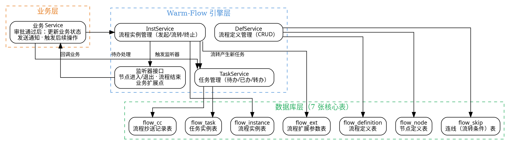

# 11 · BPM 审批引擎：Warm-Flow 工作流

> 企业级应用绕不开"审批"——报销单走流程、合同需要会签、工单流转、请假审批……ruoyi-ai 的 **ruoyi-workflow** 模块基于 **Warm-Flow**（国产轻量级 BPM 引擎）实现审批流引擎，支持通过、退回、转办、会签/或签等完整流程。
>
> **对应项目：** `ruoyi-ai/ruoyi-workflow` 模块 + `ruoyi-common/warm-flow` 公共 starter

---

## 一、你必须知道的 3 个核心概念

### 1.1 BPM（Business Process Management 业务流程管理）

BPM 不是某个具体的框架，而是"用流程驱动业务"的一套方法论。它的核心思想是：**把业务流程从硬编码中抽离出来，变成可动态配置、可流转、可监控的"流程定义"**。

传统硬编码的问题：

```java
// 硬编码的审批 —— 每次改流程都要改代码、重启、部署
if (amount > 5000 && level == "MANAGER") {
    // 经理审批
} else if (amount > 50000 && level == "DIRECTOR") {
    // 总监审批
}
// 改一下审批规则就要改代码、重新部署……
```

BPM 引擎的做法：将"谁下一步审批"存到数据库的流程定义表里，运行时动态加载、动态流转——**流程定义和业务代码解耦**。

### 1.2 流程定义与流程实例

| 概念 | 类比 | 说明 |
|------|------|------|
| **流程定义（ProcessDefinition）** | 类 | 流程的"模板"，描述节点、连线、条件，类似 Java 的 Class |
| **流程实例（ProcessInstance）** | 对象 | 根据模板发起的一次具体审批，类似 Java 的 Object |
| **任务节点（TaskNode）** | 方法 | 流程中的每一步操作，如"经理审批" |
| **连线（Flow）** | 调用链 | 节点之间的流转路径，可带条件 |

```
流程定义 (请假审批模板)
    │
    ├── 发起申请 ──→ 部门经理审批 ──→ HR 审批 ──→ 结束
    │                  │                  │
    │               [金额>5000]       [金额>50000]
    │                  ↓                  ↓
    │              总监会签             总经理审批
    │
    ▼
流程实例 (张三2024年8月请假申请)
    ├── 发起人: 张三
    ├── 当前节点: HR 审批
    ├── 状态: 进行中
    └── 历史: 发起→部门经理审批(通过)→总监会签(通过)→HR审批(待审批)
```

### 1.3 会签与或签

**会签（Countersign）**：多个审批人**都要**同意才算通过，有人反对则流程退回。

- 场景：采购合同审批——法务、财务、部门主管全部通过才能签
- 规则：`N 人中全部通过 → 通过；任一反对 → 退回`

**或签（Or-sign/OA 术语称为"竞争签"）**：多个审批人**只要一人**同意即通过，一人处理其他人自动跳过。

- 场景：紧急工单——值班人员 A/B/C 任一处理即可
- 规则：`N 人中第一人通过 → 通过；全部反对 → 退回`

Warm-Flow 对会签/或签的支持通过**流程定义中的节点策略配置**实现，无需硬编码。

---

## 二、项目中的实战应用

### 2.1 解决了什么问题

**问题场景：** AI 智能体管理平台中，涉及大量需要审批流转的业务：知识库发布需要审核、AI 模型接入需要审批、敏感操作（如删除知识库）需要确认、系统配置变更需要走流程。

| 痛点 | 解决方案 |
|------|----------|
| 审批逻辑硬编码，修改流程需要改代码重启 | Warm-Flow 流程定义存储在数据库，动态加载 |
| 多审批节点串行/并行流转复杂 | 引擎自动驱动节点流转，支持条件判断 |
| 需要会签/或签等多人审批策略 | 节点策略配置，引擎内置多实例处理 |
| 流程流转状态跟踪困难 | 流程实例 + 任务历史表，完整记录每一步 |
| 与业务代码耦合 | 引擎通过监听器 + 扩展接口解耦，业务只关心"审批通过后做什么" |

### 2.2 Warm-Flow 整体架构图



### 2.3 核心实现（关键代码片段，带逐行中文注释）

#### 2.3.1 流程定义（Warm-Flow 引擎初始化）

Warm-Flow 采用**配置式接入**，Spring Boot 项目中通过 `@Bean` 注入引擎配置即可：

```java
/**
 * Warm-Flow 引擎配置类 —— 初始化工作流引擎
 * Warm-Flow 是国产轻量级 BPM 引擎，仅需 7 张表，支持会签/或签/转办/退回等
 * 无需像 Activiti/Flowable 那样依赖庞大的 XML Schema 和复杂的部署流程
 */
@Configuration
public class WarmFlowConfig {

    /**
     * 初始化 WarmFlow 引擎 —— 只需传入 DataSource，引擎自动建表
     * 引擎启动时会检查 flow_definition 等 7 张表是否存在，不存在则自动建表
     */
    @Bean
    public FlowEngine flowEngine(DataSource dataSource) {
        // Warm-Flow 使用 Lombok Builder 模式构建配置
        FlowEngine flowEngine = new FlowEngine();
        // 配置数据源 —— 引擎通过 DataSource 操作流程定义/实例/任务表
        // 无需手动建表，引擎启动时自动检查并初始化
        flowEngine.setDataSource(dataSource);
        return flowEngine;
    }
}
```

#### 2.3.2 发起流程（创建流程实例）

```java
/**
 * 审批流程发起服务 —— 创建一个新的流程实例
 * 场景：用户提交请假申请、知识库发布审核等
 */
@Service
@RequiredArgsConstructor
public class WorkflowStartService {

    /** Warm-Flow 流程引擎入口 */
    private final FlowEngine flowEngine;

    /**
     * 发起审批流程
     *
     * @param flowDefCode 流程定义编码（如 "leave" = 请假, "kb_publish" = 知识库发布）
     * @param businessId  业务主键 ID（关联具体业务记录）
     * @param startUser   发起人用户 ID
     * @param variables   流程变量（如请假天数、金额等，用于条件判断）
     * @return 流程实例 ID
     */
    public String startProcess(String flowDefCode, String businessId,
                               String startUser, Map<String, Object> variables) {
        // 1. 构建流程发起参数
        InsStartParams params = InsStartParams.newBuilder()
                // 流程定义编码 —— 从 flow_definition 表匹配
                .flowCode(flowDefCode)
                // 发起人
                .startUserId(startUser)
                // 业务 ID —— 关联业务表（如 leave_apply.id）
                .businessId(businessId)
                // 流程变量 —— 引擎根据变量值判断连线条件（如 amount > 5000 走不同分支）
                .variables(variables)
                .build();

        // 2. 发起流程 —— 引擎自动创建流程实例 + 第一个任务节点
        //    返回值包含流程实例 ID、当前任务节点信息
        InsStartResult result = flowEngine.startIns(params);

        // 3. 记录业务与流程的关联（业务方自行维护）
        saveBusinessProcess(businessId, result.getInsId());

        return result.getInsId();
    }

    private void saveBusinessProcess(String businessId, String insId) {
        // 业务关联表：business_id -> process_instance_id
        // 用于从业务记录反查流程状态
    }
}
```

#### 2.3.3 审批流转（通过/退回）

```java
/**
 * 审批任务处理服务 —— 核心流转操作
 * 场景：审批人办理待办任务，选择"通过"或"退回"
 */
@Service
@RequiredArgsConstructor
public class WorkflowTaskService {

    /** Warm-Flow 流程引擎 */
    private final FlowEngine flowEngine;

    /**
     * 审批通过 —— 当前节点完成任务，引擎自动驱动到下一节点
     *
     * @param taskId   当前任务 ID
     * @param userId   审批人用户 ID
     * @param comment  审批意见
     * @param variables 流程变量（可用于动态条件判断）
     */
    public void approve(String taskId, String userId,
                        String comment, Map<String, Object> variables) {
        // 1. 构建审批参数
        InsJumpParams params = InsJumpParams.newBuilder()
                .taskId(taskId)               // 当前任务 ID
                .userId(userId)               // 审批人
                .message(comment)             // 审批意见（引擎记录到 flow_task 表）
                .type(FlowJumpType.PASS.getKey()) // 跳转类型：PASS = 通过
                .variables(variables)         // 传递变量，引擎用其判断连线条件
                .build();

        // 2. 执行流转 —— 引擎内部：
        //    a. 结束当前任务（状态变更为"已完成"）
        //    b. 根据连线条件计算下一节点
        //    c. 创建新的任务实例（待办）
        //    d. 触发监听器（节点进入/退出事件）
        List<InsJumpResult> result = flowEngine.jump(params);

        // 3. 处理审批结果（如获取下一节点审批人）
        handleAfterJump(result);
    }

    /**
     * 审批退回 —— 流程回退到指定节点
     * 场景：审批人认为资料不完整，退回给发起人重新修改
     *
     * @param taskId      当前任务 ID
     * @param userId      审批人
     * @param comment     退回意见
     * @param targetNode  退回目标节点（通常退回上一节点或发起节点）
     */
    public void reject(String taskId, String userId,
                       String comment, String targetNode) {
        InsJumpParams params = InsJumpParams.newBuilder()
                .taskId(taskId)
                .userId(userId)
                .message(comment)
                .type(FlowJumpType.REJECT.getKey())  // REJECT = 退回
                .nodeCode(targetNode)                 // 指定退回的目标节点
                .build();

        flowEngine.jump(params);
    }

    /**
     * 转办 —— 将当前任务转给他人处理
     * 场景：审批人请假/出差，把待办转给同事
     */
    public void transfer(String taskId, String currentUserId, String targetUserId) {
        // Warm-Flow 的 TaskService 提供转办方法
        flowEngine.taskService().transfer(taskId, currentUserId, targetUserId);
    }

    private void handleAfterJump(List<InsJumpResult> result) {
        // 处理流转后的业务逻辑，如发送通知
    }
}
```

#### 2.3.4 会签/或签配置

```java
/**
 * 会签/或签 —— 节点策略配置（通过流程定义 JSON 配置）
 * 以下 JSON 展示 flow_node 表中会签/或签节点的配置方式
 * 
 * 会签示例：采购合同审批 —— 法务、财务、主管全部通过才通过
 * 或签示例：紧急工单处理 —— 值班人员任一人处理即可
 */
// 流程定义 JSON 中节点配置片段（存储在 flow_node 表的 nodeJson 字段）：
// {
//     "type": "countersign",               // 节点类型：countersign=会签
//     "nodeCode": "legal_finance_approval",
//     "nodeName": "法务财务会签",
//     "strategy": {
//         "mode": "all",                    // all=全部通过（会签）, any=任一通过（或签）
//         "assignee": ["legal_user", "finance_user", "dept_head"],
//         "completionCondition": "allPass", // 完成条件：allPass=全通过, anyPass=任一通过
//         "rejectOnFirst": true             // 有人反对立即退回，不等其他人
//     }
// }

// 或签示例：
// {
//     "type": "countersign",
//     "nodeCode": "duty_approval",
//     "nodeName": "值班审批",
//     "strategy": {
//         "mode": "any",                    // 或签模式
//         "assignee": ["duty_a", "duty_b", "duty_c"],
//         "completionCondition": "anyPass", // 任一通过即完成
//         "rejectOnFirst": false            // 有人反对不立即退回，等其他人
//     }
// }
```

#### 2.3.5 查询待办/已办任务

```java
/**
 * 待办任务查询服务 —— 用户查看自己的审批任务列表
 */
@Service
@RequiredArgsConstructor
public class TaskQueryService {

    /** Warm-Flow 任务服务 */
    private final TaskService taskService;

    /**
     * 查询用户的待办任务列表
     *
     * @param userId 用户 ID
     * @return 待办任务列表
     */
    public List<FlowTask> listPendingTasks(String userId) {
        // 查询条件：任务处理人 = 当前用户，且任务状态 = 待办（0）
        LambdaQuery<FlowTask> query = FlowTask.lambdaQuery()
                .eq(FlowTask::getAssigneeId, userId)   // 指定处理人
                .eq(FlowTask::getTaskStatus, 0);        // 0=待办, 1=已完成, 2=已退回
        return taskService.listByQuery(query);
    }

    /**
     * 查询用户的已办任务列表（历史审批记录）
     */
    public List<FlowTask> listCompletedTasks(String userId) {
        LambdaQuery<FlowTask> query = FlowTask.lambdaQuery()
                .eq(FlowTask::getAssigneeId, userId)
                .eq(FlowTask::getTaskStatus, 1);        // 1=已完成
        return taskService.listByQuery(query);
    }

    /**
     * 查询指定流程实例的完整流转记录
     * 用于展示"审批进度"页面，按时间排序展示每一步
     */
    public List<FlowTask> listProcessHistory(String insId) {
        LambdaQuery<FlowTask> query = FlowTask.lambdaQuery()
                .eq(FlowTask::getInsId, insId)          // 同一流程实例
                .orderByAsc(FlowTask::getCreateTime);   // 按创建时间升序
        return taskService.listByQuery(query);
    }
}
```

#### 2.3.6 流程监听器（业务解耦的关键）

```java
/**
 * 流程监听器 —— 当流程到达/离开某个节点时触发
 * 业务扩展点：审批通过后自动执行后续操作（如更新状态、发送通知）
 * 实现了 Warm-Flow 的 Listener 接口，引擎自动回调
 */
@Component
public class WorkflowListener implements Listener {

    /** 日志记录 */
    private static final Logger log = LoggerFactory.getLogger(WorkflowListener.class);

    // 注入业务服务
    @Resource
    private KnowledgeBaseService knowledgeBaseService;
    @Resource
    private NotificationService notificationService;

    /**
     * 节点进入事件 —— 流程到达某个节点时触发
     * 场景：通知新的审批人处理待办
     */
    @Override
    public void nodeEnter(ListenerData listenerData) {
        // listenerData 包含：流程实例 ID、节点编码、节点名称、任务 ID 等
        String nodeName = listenerData.getNodeName();
        String assigneeId = listenerData.getAssignee(); // 当前审批人

        log.info("流程 [{}] 进入节点 [{}], 审批人: {}",
                listenerData.getInsId(), nodeName, assigneeId);

        // TODO: 发送待办通知给审批人（站内信/邮件/短信）
        notificationService.sendTodoNotice(assigneeId, "您有新的审批待办：" + nodeName);
    }

    /**
     * 节点退出事件 —— 流程离开某个节点时触发
     * 场景：记录审批结果、业务数据更新
     */
    @Override
    public void nodeExit(ListenerData listenerData) {
        String nodeName = listenerData.getNodeName();
        String taskStatus = listenerData.getTaskStatus(); // 审批结果

        log.info("流程 [{}] 离开节点 [{}], 审批结果: {}",
                listenerData.getInsId(), nodeName, taskStatus);

        // TODO: 记录审批日志
    }

    /**
     * 流程结束事件 —— 整个流程实例结束时触发
     * 场景：根据最终审批结果执行业务操作（如发布知识库、执行工单）
     */
    @Override
    public void processEnd(ListenerData listenerData) {
        String insId = listenerData.getInsId();
        String businessId = listenerData.getBusinessId();

        // 判断最终结果：通过/拒绝
        if ("PASS".equals(listenerData.getFlowStatus())) {
            // 审批通过：执行业务操作（如发布知识库）
            knowledgeBaseService.publish(businessId);
            log.info("业务 [{}] 审批通过，已发布", businessId);
        } else {
            // 审批拒绝：更新业务状态为"已拒绝"
            knowledgeBaseService.reject(businessId);
            log.info("业务 [{}] 审批拒绝", businessId);
        }

        // 通知发起人审批结果
        notificationService.sendProcessEndNotice(insId, listenerData.getFlowStatus());
    }

    /**
     * 流程创建事件 —— 流程发起时触发
     */
    @Override
    public void processCreate(ListenerData listenerData) {
        log.info("流程 [{}] 已发起, 业务ID: {}",
                listenerData.getInsId(), listenerData.getBusinessId());
    }
}
```

### 2.4 设计亮点

**亮点一：7 张表轻量级设计，零 XML 部署**

相比 Activiti（23+ 张表）和 Flowable（30+ 张表），Warm-Flow 仅需 7 张核心表，无需 XML 流程定义文件，流程定义通过 JSON 配置存储在数据库。启动即用，不存在 Activiti/Flowable 那种"部署 → 校验 → 发布"的复杂流程，对于中小型项目审批场景极其实用。

**亮点二：引擎与业务完全解耦**

引擎不持有任何业务引用，通过**监听器接口**和**流程变量**实现从"流程流转"到"业务动作"的桥接：

- 引擎只负责：节点流转、任务分配、条件判断、抄送
- 业务只负责：监听器回调中处理业务逻辑
- 流程变量充当"桥梁"：引擎根据变量判断流转方向，业务通过变量传递业务数据

**亮点三：会签/或签策略灵活配置**

通过节点配置的 `mode` 和 `completionCondition` 字段，无需写代码即可实现多种多人审批策略：

| 策略 | mode | completionCondition | 行为 |
|------|------|---------------------|------|
| 全部会签 | all | allPass | 所有人通过才通过 |
| 任一或签 | any | anyPass | 第一人通过即通过 |
| 比例会签 | all | percent:80 | 80% 以上通过即通过 |
| 顺序会签 | all | allPass | 按顺序依次审批（非并行） |

**亮点四：完整的事务保证**

`flowEngine.jump()` 方法内部保证：结束当前任务 + 创建下一任务 + 触发监听器在同一个事务中。如果监听器抛出异常，整个流转回滚，不会出现"任务已完成但下一节点未创建"的数据不一致。

---

## 三、面试高频题

### Q1: BPM 引擎的核心数据结构是怎样的？Warm-Flow 的 7 张表如何设计？

**参考答案：**

BPM 引擎的核心数据结构围绕"流程定义"和"流程实例"两条线展开：

**流程定义线（静态模板）：**

1. **flow_definition（流程定义表）**：流程的元信息，包括编码、名称、版本号、状态（启用/停用）。每次修改流程定义后版本号 +1，旧版本流程实例继续使用旧定义，新实例使用新版本——实现"热更新"。
2. **flow_node（节点定义表）**：流程中的每个节点，包括节点编码、名称、类型（开始/审批/会签/结束）、审批人策略、会签/或签配置。节点之间通过 `node_code` 关联。
3. **flow_skip（连线/流转条件表）**：定义节点之间的流转路径，包括源节点、目标节点、条件表达式（SpEL/JSON 表达式）。引擎根据条件表达式和流程变量判断走哪条连线。

**流程实例线（运行时状态）：**

4. **flow_instance（流程实例表）**：一次流程发起的运行实例，记录流程定义 ID、发起人、业务 ID、当前状态（进行中/已完成/已退回/已撤销）。
5. **flow_task（任务实例表）**：流程中的每个审批任务，记录任务所属节点、处理人、任务状态（待办/已完成/已退回/已转办）、审批意见。这是最核心的运行时表，待办查询主要查它。
6. **flow_ext（流程扩展参数表）**：流程变量的持久化存储，键值对结构，存储各节点流转时传入的变量，用于条件判断和业务数据传递。
7. **flow_cc（流程抄送记录表）**：抄送记录，当流程经过某个节点时，将任务信息抄送给相关人员（仅通知，不参与审批）。

**核心流转逻辑：**

```
发起流程 → insert flow_instance（状态=进行中）
         → insert flow_task（节点=第一个节点，状态=待办）

审批通过 → update flow_task（状态=已完成）
         → 读取 flow_skip，根据条件表达式匹配下一节点
         → insert flow_task（下一节点，状态=待办）
         → 如果下一节点是结束节点 → update flow_instance（状态=已完成）

审批退回 → update flow_task（状态=已退回）
         → 读取 flow_skip 的回退路径
         → insert flow_task（退回目标节点，状态=待办）
```

**追问应对：** "Warm-Flow 比 Activiti 轻量在哪里？" 答：① 表数量：7 张 vs 23+ 张；② 部署方式：JSON 配置 vs XML 部署包；③ 无 BPMN 2.0 规范约束，不需要图形化建模工具；④ 依赖极少，核心就是一个 DataSource + 几个 Service。代价是 Warm-Flow 不支持复杂的子流程、边界事件、多实例等高级 BPMN 2.0 特性，适合审批 OA 场景，不适合复杂业务流程编排。

### Q2: 流程流转的算法是怎样的？如何保证"一步一节点"的正确性？

**参考答案：**

Warm-Flow 的流程流转算法本质上是一个**有向图的节点遍历**，核心步骤如下：

**流转算法（以 `jump()` 方法为例）：**

```
1. 校验当前任务状态：必须是"待办"状态，已被处理的任务不能再次流转
2. 获取当前节点：根据任务 ID 找到所属的节点定义
3. 获取出口连线：从 flow_skip 表中查询当前节点的所有流出连线
4. 条件匹配：遍历所有连线，逐一计算条件表达式
   - 无条件连线：直接匹配（默认路径）
   - 有条件连线：用流程变量计算 SpEL 表达式，true 则匹配
   - 多条匹配：取第一条匹配的连线（优先级顺序定义）
   - 无匹配：异常（流程定义不完整，需配置默认路径）
5. 目标节点计算：
   - 连线指向普通节点 → 创建新任务
   - 连线指向结束节点 → 终止流程实例
   - 连线指向会签/或签节点 → 创建多实例任务
6. 事务提交：所有操作在同一个事务中，失败则全部回滚
```

**关键设计保证：**

| 保证 | 实现方式 |
|------|----------|
| 幂等性 | 每次 jump 前校验任务状态，已完成的 task 不可重复流转 |
| 事务性 | 流转 + 下一节点创建 + 监听器回调在同一个 @Transactional 中 |
| 原子性 | 条件判断 + 节点创建使用数据库锁（乐观锁版本号） |
| 可追溯 | 每个 task 记录 parent_task_id，形成完整的审批链 |

**代码层面的核心逻辑（简化示意）：**

```java
// 流转算法的核心逻辑（简化示意）
public List<InsJumpResult> jump(InsJumpParams params) {
    // 1. 校验任务状态
    FlowTask task = checkTaskStatus(params.getTaskId());

    // 2. 获取当前节点
    FlowNode currentNode = getCurrentNode(task);

    // 3. 获取出口连线列表
    List<FlowSkip> skips = getOutgoingSkips(currentNode.getNodeCode());

    // 4. 匹配条件，找到目标节点
    FlowSkip matchedSkip = matchCondition(skips, params.getVariables());
    if (matchedSkip == null) {
        throw new FlowException("未找到匹配的流转条件");
    }

    // 5. 结束当前任务
    completeCurrentTask(task, params);

    // 6. 创建下一节点任务
    createNextTask(task, matchedSkip, params);

    // 7. 触发监听器
    triggerListener(task, matchedSkip);

    // 8. 返回结果
    return buildResult();
}
```

**追问应对：** "并行网关如何实现？" 答：Warm-Flow 不支持 BPMN 2.0 的并行网关（Parallel Gateway），但会签本质上就是并行——会签节点创建 N 个并行任务，各自独立审批，全部完成才进入下一节点。如果需要更复杂的并行分支，需要结合 Activiti/Flowable 或通过 langgraph4j 的并行节点实现。

### Q3: 项目中会签/或签怎么实现的？多人审批如何保证一致性？

**参考答案：**

**实现方式：**

Warm-Flow 的会签/或签通过**节点配置 + 多实例任务**实现，不是代码硬编码：

1. **节点配置阶段**：在 flow_node 表的 JSON 字段中配置 `mode`（all/any）和 `completionCondition`（allPass/anyPass/percent:N）
2. **发起阶段**：流程到达会签节点时，引擎根据 `assignee` 列表为每个审批人创建一个独立的待办任务（多实例，共用一个 parent_task_id）
3. **流转阶段**：每个审批人独立处理自己的任务，引擎每收到一个完成信号，检查是否满足 `completionCondition`
   - 会签：已有 N 个完成，全部通过 = 通过；有人反对 = 退回
   - 或签：第一个通过 = 通过，其他任务自动取消；全部反对 = 退回
4. **完成阶段**：满足条件后，其余未审批的任务自动取消（状态变更为"已取消"），流程进入下一节点

**一致性保证：**

| 问题 | 解决方案 |
|------|----------|
| 并发审批：两人同时通过/反对 | 数据库乐观锁（version 字段），第二个提交时校验版本号，版本冲突则重试 |
| 或签：一人通过后他人正在审批 | 原子性判断：完成任务时先检查是否已满足完成条件，满足则同时取消其他任务 |
| 事务：监听器抛异常 | 流转与监听器在同一事务，异常回滚，任务恢复为"待办"状态 |
| 幂等：重复提交审批 | 任务状态校验，已完成的任务再次提交直接返回错误 |

**追问应对：** "并行会签和顺序会签有什么区别？" 答：并行会签是所有审批人同时收到待办，各自独立审批，互不影响；顺序会签是按顺序依次审批——A 审批完 B 才能看到待办。Warm-Flow 的会签默认并行，通过配置 `parallel=false` 可切换为顺序。并行会签更快（人多的场景），顺序会签适合有依赖关系的审批（如"部门主管先审，HR 再审"）。

---

## 四、面试避坑指南

### 坑 1：把 BPM 引擎和业务代码耦合

**错误做法：** 在审批流转的监听器里直接写业务逻辑——"审批通过就更新数据库状态，顺便发送通知，再调用远程服务"，导致监听器越来越重，业务逻辑和流程逻辑混在一起。

**正确做法：** 监听器只做"桥接"——收到事件后通过消息队列或事件总线发布领域事件，业务服务监听事件后处理自己的逻辑。做到"流程引擎只关心流转，业务服务只关心业务"。

### 坑 2：流程定义修改后老的流程实例受到影响

**错误做法：** 修改流程定义后，正在运行的老流程实例突然多了个节点——或者少了个节点，导致审批走到一半中断。

**正确做法：** 流程定义版本化：每个流程定义有 version 字段，新发起的流程实例使用最新版本，正在运行的实例继续使用发起时的版本（版本快照）。Warm-Flow 的 `flow_definition` 表支持版本号，在 `InsStartParams` 中指定版本或默认使用最新版本。

### 坑 3：忽略事务边界导致数据不一致

**错误做法：** 审批通过后，在监听器里调用远程 API（如消息推送），远程 API 调用失败时监听器抛出异常，导致整个流转回滚——但用户已经看到了"审批通过"的页面反馈。

**正确做法：** 监听器里的远程调用使用"最大努力通知"模式——本地表记录待发送消息，监听器只负责写入，后续异步任务发送；或者用 MQ 解耦，监听器发布事件，消费者处理发送。保证流转事务的边界只覆盖数据库操作。

### 坑 4：不理解"待办"和"已办"的查询优化

**错误做法：** 待办列表直接 `SELECT * FROM flow_task WHERE assignee_id = ? AND task_status = 0`，几百条数据时没问题，但生产环境单一用户可能有几千条待办（大量历史数据），查询越来越慢。

**正确做法：** ① 待办任务建联合索引：`(assignee_id, task_status, create_time)`；② 已办任务分页查询，默认只查近 3 个月，历史数据通过归档表查询；③ 待办数量用 Redis 缓存计数，减少数据库 COUNT 查询。面试时提到索引优化，面试官会认为你有真实的大数据量经验。

### 坑 5：会签/或签的"取消任务"处理不当

**错误做法：** 或签模式下，A 审批通过后 B 的任务还在待办列表里，B 还能继续审批，导致同一个流程被通过两次。

**正确做法：** 或签通过时，引擎必须原子性地：① 完成当前任务 → ② 取消其他待办任务（状态变更为"已取消"）→ ③ 创建下一节点任务。这三个操作必须在一个事务中。B 再去审批时，校验任务状态为"已取消"，直接返回"任务已失效"。

---

## 五、参考资料与扩展阅读

- [Warm-Flow 官方文档](https://github.com/dromara/warm-flow) — 国产轻量级 BPM 引擎，7 张表，支持会签/或签/转办/退回
- [Activiti 官方文档](https://www.activiti.org/) — 最主流的开源 BPM 引擎，BPMN 2.0 规范
- [Flowable 官方文档](https://www.flowable.com/) — Activiti 分支，功能更丰富
- [BPMN 2.0 规范](https://www.omg.org/spec/BPMN/2.0/) — 业务流程建模符号标准
- [Workflow 模式](https://www.workflowpatterns.com/) — 工作流设计模式大全