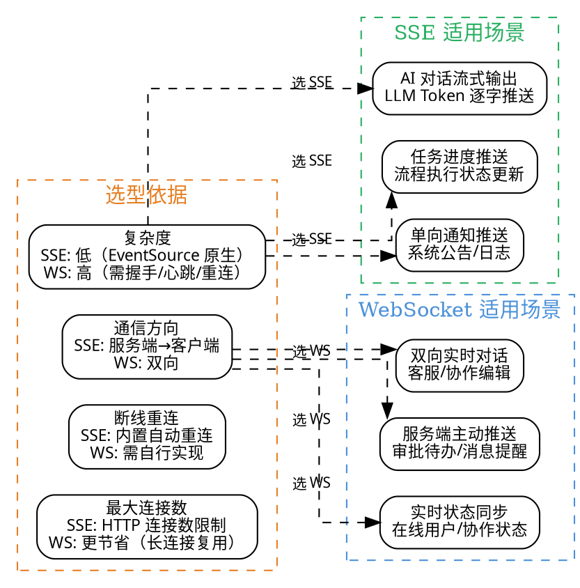

# 12 · SSE / WebSocket 实时通信

> AI 对话最大的痛点就是"慢"——大模型生成回答需要几秒甚至几十秒，如果等全部生成完再返回，用户体验极差。ruoyi-ai 采用 **SSE（Server-Sent Events）** 实现流式输出，让用户"边看边等"；同时提供 **WebSocket** 支持双向实时通信，覆盖消息推送、状态同步等场景。
>
> **对应项目：** `ruoyi-ai/ruoyi-common/sse` 公共 starter + `ruoyi-common/websocket` 公共 starter

---

## 一、你必须知道的 3 个核心概念

### 1.1 SSE（Server-Sent Events）

SSE 是 HTML5 标准中**服务端向客户端单向推送数据**的技术，基于 HTTP 长连接。客户端通过 `EventSource` API 发起连接，服务端持续写入 `text/event-stream` 格式的数据流。

**SSE 核心特点：**

| 特性 | 说明 |
|------|------|
| 通信方向 | 单向：服务端 → 客户端 |
| 传输协议 | HTTP（标准 HTTP/1.1 或 HTTP/2） |
| 数据格式 | `text/event-stream`（纯文本，UTF-8） |
| 浏览器 API | `EventSource`（原生支持，无需第三方库） |
| 自动重连 | 内置：连接断开后浏览器自动重试 |
| 跨域 | 支持 CORS 头 |

**典型 SSE 数据流格式：**

```
data: {"content": "你好"}

data: {"content": "，我是"}

data: {"content": "AI助手"}

data: [DONE]    ← 流结束标志
```

### 1.2 WebSocket

WebSocket 是**全双工通信协议**，客户端和服务端可以互相主动发送消息。基于 TCP，通过 HTTP 升级握手建立连接。

**WebSocket 核心特点：**

| 特性 | 说明 |
|------|------|
| 通信方向 | 双向：客户端 ↔ 服务端 |
| 传输协议 | WS / WSS（基于 TCP，HTTP 升级握手） |
| 数据格式 | 二进制或文本帧 |
| 浏览器 API | `WebSocket`（原生支持） |
| 自动重连 | 无内置，需自行实现 |
| 跨域 | 支持 |

### 1.3 流式输出（Streaming）

流式输出是 AI 对话场景中**最关键的用户体验优化**。大模型生成回答时是逐个 Token 产生的（类似"逐字输出"），SSE 流式输出将这些 Token 实时推送到前端，用户不需要等待全部生成完成即可看到内容。

```
传统模式（非流式）：
用户发送消息 → 等待 5-10 秒 → 一次性看到完整回答 ❌

流式输出（SSE）：
用户发送消息 → 0.5 秒后看到第一个字 → 持续追加内容 → 实时展示 ✅
```

---

## 二、项目中的实战应用

### 2.1 解决了什么问题

**问题场景：** AI 对话 + 知识库问答 + AI 流程编排都需要实时推送内容，同时管理端需要实时消息通知。

| 痛点 | 解决方案 |
|------|----------|
| 大模型生成慢，用户等待焦虑 | SSE 流式输出，逐 Token 推送，首字延迟 < 1s |
| 多个对话 Session 并发 | SSE 连接管理器，按用户/会话维度隔离 |
| 管理端需要实时通知（审批待办、任务完成） | WebSocket 双向推送，服务端主动下发 |
| AI 流程编排需要实时查看执行状态 | SSE 推送节点执行进度，前端实时渲染 |
| 连接断开后恢复 | SSE 内置重连 + 心跳保活机制 |

### 2.2 SSE vs WebSocket 选型对比



**项目选型结论：**

| 技术 | 项目中用在哪 | 选型理由 |
|------|-------------|----------|
| **SSE** | AI 对话流式输出、AI 流程编排执行状态推送 | 单向推送，浏览器原生 EventSource，自动重连，实现简单 |
| **WebSocket** | 管理端消息通知、在线状态同步 | 双向通信，需要服务端主动推送消息给客户端 |
| **双方案** | 同一项目中并存 | 各取所长，SSE 专攻流式输出，WebSocket 专攻双向通信 |

### 2.3 核心实现（关键代码片段，带逐行中文注释）

#### 2.3.1 SSE 连接管理器

```java
/**
 * SSE 连接管理器 —— 管理所有 SSE 客户端连接
 * 核心职责：建立连接、发送消息、断开清理
 * 每个用户/会话对应一个独立的 SseEmitter 实例
 */
@Component
@Slf4j
public class SseSessionManager {

    /**
     * 存储所有活跃的 SSE 连接
     * Key: sessionId（用户ID:会话ID），Value: SseEmitter（Spring 封装的 SSE 连接）
     * 使用 ConcurrentHashMap 保证并发安全
     */
    private final Map<String, SseEmitter> sessions = new ConcurrentHashMap<>();

    /**
     * 创建新的 SSE 连接
     *
     * @param sessionId 会话标识（如 "user123:session456"）
     * @param timeout   超时时间（毫秒），默认 30 分钟，-1 表示永不超时
     * @return SseEmitter 实例
     */
    public SseEmitter createSession(String sessionId, long timeout) {
        // 1. 创建 SseEmitter —— Spring 封装 SSE 的核心类
        //    超时时间设为 0 表示永不超时（由心跳保活），或设为具体值（如 30 分钟）
        SseEmitter emitter = new SseEmitter(timeout > 0 ? timeout : 0L);

        // 2. 注册回调：连接完成、超时、异常时的清理逻辑
        emitter.onCompletion(() -> {
            // 连接正常完成时清理
            log.info("SSE 连接完成: {}", sessionId);
            sessions.remove(sessionId);
        });
        emitter.onTimeout(() -> {
            // 连接超时清理
            log.warn("SSE 连接超时: {}", sessionId);
            sessions.remove(sessionId);
        });
        emitter.onError(throwable -> {
            // 连接异常清理
            log.error("SSE 连接异常: {}, error: {}", sessionId, throwable.getMessage());
            sessions.remove(sessionId);
        });

        // 3. 存储连接
        sessions.put(sessionId, emitter);

        // 4. 发送初始连接确认消息
        sendMessage(sessionId, SseEvent.builder()
                .event("connected")
                .data("连接建立成功")
                .build());

        log.info("SSE 连接建立: {}, 当前连接数: {}", sessionId, sessions.size());
        return emitter;
    }

    /**
     * 向指定 Session 发送 SSE 消息
     *
     * @param sessionId 会话标识
     * @param event     SSE 事件对象
     */
    public void sendMessage(String sessionId, SseEvent event) {
        SseEmitter emitter = sessions.get(sessionId);
        if (emitter == null) {
            log.warn("SSE 连接不存在: {}", sessionId);
            return;
        }
        try {
            // SseEmitter.SseEventBuilder 构建 SSE 事件
            emitter.send(SseEmitter.event()
                    .id(event.getId())           // 事件 ID（用于断线重连时的 Last-Event-ID）
                    .name(event.getEvent())       // 事件名称（前端监听不同事件）
                    .data(event.getData()));      // 事件数据
        } catch (IOException e) {
            // 发送失败说明连接已断开，清理
            log.error("SSE 发送失败: {}, error: {}", sessionId, e.getMessage());
            sessions.remove(sessionId);
        }
    }

    /**
     * 关闭指定 Session
     */
    public void closeSession(String sessionId) {
        SseEmitter emitter = sessions.remove(sessionId);
        if (emitter != null) {
            emitter.complete();
            log.info("SSE 连接关闭: {}", sessionId);
        }
    }

    /**
     * 获取当前活跃连接数
     */
    public int getActiveSessionCount() {
        return sessions.size();
    }
}
```

#### 2.3.2 SSE 流式输出（AI 对话核心）

```java
/**
 * AI 对话服务 —— 使用 SSE 流式输出 LLM 回答
 * 核心流程：接收用户消息 → 调用 LLM 流式生成 → 逐 Token SSE 推送
 */
@Service
@RequiredArgsConstructor
public class ChatStreamService {

    private final SseSessionManager sseSessionManager;

    // 假设的 LangChain4j 流式聊天模型
    private final StreamingChatLanguageModel streamingModel;

    /**
     * 流式对话 —— 核心方法
     *
     * @param sessionId  会话标识
     * @param userMessage 用户输入
     */
    public void streamChat(String sessionId, String userMessage) {
        // 1. 构建用户消息
        UserMessage msg = UserMessage.from(userMessage);

        // 2. 调用 LLM 流式生成 —— 模型逐 Token 调用 onNext 回调
        streamingModel.generate(msg, new StreamingResponseHandler<AiMessage>() {

            /**
             * 每个 Token 生成时回调 —— 通过 SSE 实时推送给前端
             */
            @Override
            public void onNext(String token) {
                // 构建 SSE 事件：事件名称为 "token"，数据为当前生成的文本片段
                SseEvent event = SseEvent.builder()
                        .event("token")                              // 事件名：token
                        .data(token)                                 // 当前 Token 文本
                        .id(String.valueOf(System.currentTimeMillis())) // 事件 ID
                        .build();
                sseSessionManager.sendMessage(sessionId, event);
            }

            /**
             * LLM 完整生成完成时回调
             */
            @Override
            public void onComplete(AiMessage response) {
                // 发送流式结束标志
                SseEvent endEvent = SseEvent.builder()
                        .event("done")
                        .data("[DONE]")
                        .build();
                sseSessionManager.sendMessage(sessionId, endEvent);

                // 可选：可选关闭连接（或保持连接，等待下一次对话）
                // sseSessionManager.closeSession(sessionId);
            }

            /**
             * LLM 生成异常时回调
             */
            @Override
            public void onError(Throwable error) {
                log.error("LLM 流式生成异常: {}", error.getMessage());
                SseEvent errorEvent = SseEvent.builder()
                        .event("error")
                        .data("生成失败: " + error.getMessage())
                        .build();
                sseSessionManager.sendMessage(sessionId, errorEvent);
            }
        });
    }
}
```

#### 2.3.3 SSE 控制器（REST 接口）

```java
/**
 * AI 对话控制器 —— 提供 SSE 流式对话的 REST 接口
 * 前端通过 EventSource 或 fetch + ReadableStream 调用
 */
@RestController
@RequestMapping("/api/ai/chat")
@RequiredArgsConstructor
public class ChatController {

    private final SseSessionManager sseSessionManager;
    private final ChatStreamService chatStreamService;

    /**
     * 建立 SSE 连接 —— 返回 SseEmitter，Spring 自动保持 HTTP 长连接
     * 前端调用：new EventSource('/api/ai/chat/stream?sessionId=xxx')
     *
     * 注意：返回类型必须是 SseEmitter，Spring 才会以 text/event-stream 格式响应
     */
    @GetMapping(value = "/stream", produces = MediaType.TEXT_EVENT_STREAM_VALUE)
    public SseEmitter streamChat(
            @RequestParam String sessionId,
            @RequestParam String message) {

        // 1. 创建 SSE 连接（超时 30 分钟）
        SseEmitter emitter = sseSessionManager.createSession(sessionId, 30 * 60 * 1000L);

        // 2. 异步执行流式对话 —— 不阻塞 HTTP 请求线程
        //    使用虚拟线程或异步线程池，避免占用 Tomcat 线程池
        CompletableFuture.runAsync(() -> {
            chatStreamService.streamChat(sessionId, message);
        });

        // 3. 返回 SseEmitter —— Spring 通过此对象持续推送数据
        return emitter;
    }

    /**
     * 关闭 SSE 连接
     */
    @PostMapping("/stream/close")
    public Result<Void> closeStream(@RequestParam String sessionId) {
        sseSessionManager.closeSession(sessionId);
        return Result.ok();
    }
}
```

#### 2.3.4 WebSocket 配置（Spring Boot 原生）

```java
/**
 * WebSocket 配置类 —— 基于 Spring Boot 原生 WebSocket（非 STOMP）
 * 使用 @ServerEndpoint 注解声明 WebSocket 端点
 * 场景：管理端消息通知推送、在线状态同步
 */
@Configuration
@EnableWebSocket  // 启用 Spring WebSocket 支持
public class WebSocketConfig {

    /**
     * 注册 WebSocket 处理器
     * 将自定义的 WebSocketHandler 注册到指定路径
     */
    @Bean
    public WebSocketHandler webSocketHandler() {
        return new NotificationWebSocketHandler();
    }

    /**
     * 注册 WebSocket 端点
     * addHandler：注册处理器
     * setAllowedOrigins：允许跨域（生产环境应限定具体域名）
     * withSockJS：可选，SockJS 回退支持（浏览器不支持 WebSocket 时降级）
     */
    @Bean
    public ServletServerContainerFactoryBean createWebSocketContainer() {
        // 配置 WebSocket 容器参数
        ServletServerContainerFactoryBean container = new ServletServerContainerFactoryBean();
        container.setMaxTextMessageBufferSize(8192);   // 最大文本消息缓冲区 (8KB)
        container.setMaxBinaryMessageBufferSize(8192); // 最大二进制消息缓冲区
        container.setMaxSessionIdleTimeout(600000L);   // Session 空闲超时 (10分钟)
        return container;
    }
}
```

#### 2.3.5 WebSocket 处理器（消息处理核心）

```java
/**
 * WebSocket 消息处理器 —— 处理 WebSocket 连接、消息、关闭事件
 * 核心能力：维护连接池、发送消息、处理接收
 */
@Component
@Slf4j
public class NotificationWebSocketHandler extends TextWebSocketHandler {

    /**
     * 维护所有 WebSocket 连接
     * Key: 用户 ID，Value: WebSocket Session
     */
    private final Map<String, WebSocketSession> sessions = new ConcurrentHashMap<>();

    /**
     * 连接建立后 —— 保存 Session
     */
    @Override
    public void afterConnectionEstablished(WebSocketSession session) {
        // 从 URI 查询参数中获取用户 ID（如 ws://host/ws/notify?userId=123）
        String userId = extractUserId(session);
        sessions.put(userId, session);
        log.info("WebSocket 连接建立: userId={}, sessionId={}", userId, session.getId());

        // 发送连接成功消息
        sendMessage(userId, "连接建立成功");
    }

    /**
     * 收到客户端消息
     * 场景：客户端发送心跳包、确认消息等
     */
    @Override
    protected void handleTextMessage(WebSocketSession session, TextMessage message) {
        String payload = message.getPayload();
        String userId = extractUserId(session);

        // 解析消息类型
        // 心跳包：{"type": "PING"} → 回复 PONG
        // 业务消息：{"type": "MESSAGE", "data": {...}}
        JSONObject json = JSON.parseObject(payload);
        String type = json.getString("type");

        if ("PING".equals(type)) {
            // 心跳响应
            sendMessage(userId, "{\"type\": \"PONG\"}");
        } else {
            // 处理业务消息（如消息已读确认）
            log.info("收到用户消息: userId={}, content={}", userId, payload);
            // TODO: 处理业务消息
        }
    }

    /**
     * 连接关闭后 —— 清理 Session
     */
    @Override
    public void afterConnectionClosed(WebSocketSession session, CloseStatus status) {
        String userId = extractUserId(session);
        sessions.remove(userId);
        log.info("WebSocket 连接关闭: userId={}, status={}", userId, status);
    }

    /**
     * 传输异常处理
     */
    @Override
    public void handleTransportError(WebSocketSession session, Throwable exception) {
        String userId = extractUserId(session);
        log.error("WebSocket 传输异常: userId={}, error={}", userId, exception.getMessage());
        sessions.remove(userId);
    }

    /**
     * 服务端主动向指定用户推送消息 —— 核心方法
     * 场景：审批待办通知、系统公告、任务完成提醒
     */
    public void sendMessage(String userId, String message) {
        WebSocketSession session = sessions.get(userId);
        if (session == null || !session.isOpen()) {
            log.warn("WebSocket 连接不存在或已关闭: userId={}", userId);
            return;
        }
        try {
            session.sendMessage(new TextMessage(message));
        } catch (IOException e) {
            log.error("WebSocket 发送失败: userId={}, error={}", userId, e.getMessage());
            sessions.remove(userId);
        }
    }

    /**
     * 广播消息 —— 向所有在线用户发送消息
     */
    public void broadcastMessage(String message) {
        sessions.forEach((userId, session) -> {
            sendMessage(userId, message);
        });
    }

    /**
     * 获取在线用户数
     */
    public int getOnlineCount() {
        return sessions.size();
    }

    private String extractUserId(WebSocketSession session) {
        // 从 URI 查询参数中提取 userId
        // 实际项目中可改为从 JWT Token 中解析
        String query = session.getUri().getQuery();
        if (query != null && query.contains("userId=")) {
            return query.split("userId=")[1].split("&")[0];
        }
        return "unknown";
    }
}
```

#### 2.3.6 WebSocket 拦截器（鉴权）

```java
/**
 * WebSocket 握手拦截器 —— 在连接建立前进行鉴权
 * 场景：验证 JWT Token，防止未授权用户建立 WebSocket 连接
 */
@Component
public class WebSocketAuthInterceptor implements HandshakeInterceptor {

    /**
     * 握手前 —— 鉴权逻辑
     * 返回 true 表示允许建立连接，false 则拒绝
     */
    @Override
    public boolean beforeHandshake(ServerHttpRequest request, ServerHttpResponse response,
                                   WebSocketHandler wsHandler, Map<String, Object> attributes) {
        // 1. 从 Header 或 Query 参数中获取 Token
        String token = null;
        if (request instanceof ServletServerHttpRequest) {
            ServletServerHttpRequest servletRequest = (ServletServerHttpRequest) request;
            token = servletRequest.getServletRequest().getParameter("token");
            if (token == null) {
                token = servletRequest.getServletRequest().getHeader("Authorization");
            }
        }

        // 2. 校验 Token（实际项目中调用 Sa-Token / JWT 校验）
        if (token == null || !validateToken(token)) {
            log.warn("WebSocket 握手鉴权失败: token={}", token);
            return false; // 拒绝连接
        }

        // 3. 将用户信息存入 attributes，后续可在 WebSocketHandler 中获取
        attributes.put("userId", extractUserIdFromToken(token));
        return true;
    }

    @Override
    public void afterHandshake(ServerHttpRequest request, ServerHttpResponse response,
                               WebSocketHandler wsHandler, Exception exception) {
        // 握手后的处理（可选）
    }

    private boolean validateToken(String token) {
        // JWT 校验逻辑（此处省略）
        return true;
    }

    private String extractUserIdFromToken(String token) {
        // 从 JWT 中解析用户 ID
        return "user123";
    }
}
```

### 2.4 设计亮点

**亮点一：SSE + WebSocket 双通道各取所长**

项目中 SSE 和 WebSocket 并存，但用途完全分开：

- **SSE 通道**：专用于 AI 对话流式输出和流程编排状态推送——单向大数据量推送，SSE 的自动重连优势明显
- **WebSocket 通道**：专用于管理端消息通知和在线状态同步——双向通信，服务端需要主动推送
- 两者互不干扰，各自独立管理连接池，前端分别建立连接

**亮点二：SSE 连接管理器 + 心跳保活**

SSE 虽然浏览器支持自动重连，但服务端需要主动维持连接活跃：

- 连接池使用 `ConcurrentHashMap`，Key 为 `userId:sessionId` 确保唯一
- 注册 `onCompletion` / `onTimeout` / `onError` 回调，确保连接异常时及时清理
- 心跳机制：定时发送 `event: heartbeat` 事件，防止负载均衡器/Nginx 断开空闲连接

**亮点三：异步非阻塞的流式输出**

SSE 流式输出的关键设计是"不阻塞 Tomcat 线程"：

```
用户请求 → 控制器返回 SseEmitter → Tomcat 线程释放（非阻塞）
         → 异步线程池/虚拟线程执行 LLM 流式调用
         → 逐 Token 通过 SseEmitter 推送到客户端
```

Spring 的 `SseEmitter` 内部使用 `DeferredResult` 机制，控制器返回后 Tomcat 线程立即释放，不占用工作线程池——这是支撑高并发 SSE 连接的基础。

**亮点四：WebSocket 鉴权拦截器**

WebSocket 连接建立前需要通过 `HandshakeInterceptor` 进行鉴权，防止未授权用户建立连接。项目中通过 JWT Token 校验，校验通过后把用户信息存入 `attributes`，后续处理器可直接使用，无需重复鉴权。

---

## 三、面试高频题

### Q1: SSE 和 WebSocket 选型依据是什么？什么场景选哪个？

**参考答案：**

**选型核心维度：**

| 维度 | SSE | WebSocket |
|------|-----|-----------|
| 通信方向 | 单向（服务端→客户端） | 双向（客户端↔服务端） |
| 协议 | HTTP（标准协议） | WS/WSS（独立协议） |
| 实现复杂度 | 低（浏览器 EventSource 原生） | 高（需握手/心跳/重连） |
| 自动重连 | 内置 | 需自行实现 |
| 断线续传 | 支持（Last-Event-ID） | 需自行实现 |
| 连接数限制 | 浏览器限制（同域 6 个） | 无限制 |
| 二进制数据 | 不支持（需 Base64 编码） | 原生支持 |
| 适用场景 | 服务端推送（流式输出/通知/进度） | 双向实时通信（聊天/协作/游戏） |

**选型决策树：**

```
是否需要双向通信？
  ├── 是 → WebSocket（聊天、协作编辑、实时游戏）
  └── 否 → 是否只需要服务端推送？
       ├── 是 → SSE（AI 流式输出、进度推送、通知）
       └── 否 → 短轮询 / Long Polling（兼容性要求极高）
```

**项目选型结论：** 项目中 AI 对话流式输出选择 SSE，因为：① 只需要服务端→客户端单向推送；② 浏览器原生 EventSource，无需引入第三方库；③ 自动重连简化前端代码；④ 基于 HTTP 协议，无需额外升级 WS 协议，与现有 REST API 兼容。管理端消息通知选择 WebSocket，因为需要双向通信（服务端推送 + 客户端确认回执）。

**追问应对：** "SSE 和 WebSocket 可以同时用吗？" 答：可以，而且很多项目就是这么做的——各取所长。前端建立两个连接，SSE 收流式数据，WebSocket 收消息通知。服务端各自维护连接池，互不干扰。Spring Boot 中两者可以共存，SSE 走 `SseEmitter`，WebSocket 走 `WebSocketHandler`。

### Q2: SSE 流式输出怎么实现？首字延迟怎么优化？

**参考答案：**

**实现原理：**

SSE 流式输出的本质是**异步非阻塞的 HTTP 长连接**：

1. 客户端发起 GET 请求，Accept 头为 `text/event-stream`
2. 服务端返回 `SseEmitter`，设置 Content-Type 为 `text/event-stream`
3. 服务端不关闭连接，持续写入 `data: xxx\n\n` 格式的数据
4. 客户端通过 `EventSource.onmessage` 逐条接收
5. 服务端写入 `data: [DONE]\n\n` 表示流结束

**Spring 实现步骤：**

```java
// 1. 控制器返回 SseEmitter
@GetMapping(value = "/stream", produces = "text/event-stream")
public SseEmitter stream() {
    SseEmitter emitter = new SseEmitter(0L); // 0 = 永不超时
    // 异步执行
    CompletableFuture.runAsync(() -> {
        for (String token : tokens) {
            emitter.send(SseEmitter.event().name("token").data(token));
        }
        emitter.complete();
    });
    return emitter;
}

// 2. Spring 内部自动将 SseEmitter 转换为 text/event-stream 响应
// 3. 客户端通过 EventSource API 接收
```

**首字延迟优化（重点关注）：**

| 优化手段 | 说明 | 效果 |
|----------|------|------|
| 禁用缓冲区 | 服务端 response 设置 `flush` 立即刷新 | 避免数据积压在缓冲区 |
| 虚拟线程 | 使用虚拟线程执行 LLM 调用，避免线程阻塞 | 提升并发 |
| 连接预建 | 用户在输入时提前建立 SSE 连接 | 减少建连耗时 |
| 流式 HTTP | 确保 Tomcat/Nginx 不缓冲 SSE 响应 | 关键 |
| 轻量 Token | 首条 Token 尽可能短（如"好的"、"正在思考"） | 让用户感知到响应 |

**Nginx 配置：** 如果前端通过 Nginx 代理，必须关闭 SSE 缓冲：

```nginx
# SSE 流式输出必须关闭缓冲，否则数据会积压到缓冲区满才推送
location /api/ai/chat/stream {
    proxy_pass http://backend;
    proxy_buffering off;          # 关闭代理缓冲
    proxy_cache off;              # 关闭缓存
    chunked_transfer_encoding on; # 启用分块传输
    proxy_read_timeout 86400s;    # 超时设为 24 小时
}
```

**追问应对：** "如果 SSE 连接中断了怎么恢复？" 答：SSE 的 `EventSource` 会自动重连，并携带 `Last-Event-ID` 头部。服务端可以记录已发送的事件 ID，重连时从断点继续推送（跳过已发送的内容）。但 AI 流式输出场景下，重连后通常重新生成完整回答——因为已输出的 Token 已经在前端显示了，续推可能导致内容重复或语义断裂。更实用的做法是重连时重新发起流式请求。

### Q3: WebSocket 心跳机制怎么设计？连接管理要注意什么？

**参考答案：**

**心跳机制设计：**

WebSocket 没有内置心跳，需要应用层实现保活和检测：

```java
// 客户端心跳（30 秒一次）
// setInterval(() => {
//     ws.send(JSON.stringify({type: "PING"}));
// }, 30000);

// 服务端心跳检测（60 秒无消息判定断开）
// 方案一：客户端发 PING，服务端回 PONG
// 方案二：服务端定时发 PING，客户端回 PONG
```

**生产级心跳方案：**

| 角色 | 动作 | 间隔 | 超时判定 |
|------|------|------|----------|
| 客户端 | 发送 PING 消息 | 30 秒 | — |
| 服务端 | 回复 PONG 消息 | 收到 PING 即回 | 60 秒未收到任何消息 → 判定断开 |
| 服务端 | 定时清理过期连接 | 60 秒扫描一次 | 遍历 Session，检查 lastHeartbeat |

**连接管理关键点：**

1. **连接池管理**：`ConcurrentHashMap<userId, WebSocketSession>` 维护在线用户，但要注意：
   - 同一用户多端登录：一个用户可能在多个浏览器/设备登录，需要支持多 Session
   - 示例：`Map<String, Set<WebSocketSession>>` 或 `Map<String, List<WebSocketSession>>`

2. **心跳超时清理**：定期扫描 Session，长时间未收到心跳则主动关闭

3. **断线重连**（客户端实现）：
   ```javascript
   function connectWebSocket() {
       const ws = new WebSocket("ws://host/ws/notify");
       ws.onclose = () => {
           // 指数退避重连：1s, 2s, 4s, 8s, ... 最大 30s
           setTimeout(connectWebSocket, Math.min(1000 * 2 ** retryCount, 30000));
           retryCount++;
       };
       ws.onopen = () => { retryCount = 0; };
   }
   ```

4. **优雅关闭**：应用关闭时，遍历所有 Session 发送关闭通知，等待客户端确认后关闭

**追问应对：** "WebSocket 怎么保证消息可靠到达？" 答：WebSocket 本身只保证 TCP 级别的传输，不保证应用层消息的可靠到达。实现方案：① 每条消息带唯一 ID（UUID）；② 客户端收到后发送 ACK 确认；③ 服务端未收到 ACK 则重试（最多 3 次）；④ 最终一致性：消息持久化到数据库，客户端下次连接时拉取未读消息。核心原则：**WebSocket 只做"实时推送"的通道，消息的可靠性由数据库和业务逻辑保证**。

---

## 四、面试避坑指南

### 坑 1：SSE 连接数过多导致 Tomcat 线程耗尽

**错误做法：** SSE 流式输出直接在控制器方法里同步调用 LLM，LLM 调用阻塞了 Tomcat 工作线程：

```java
// 错误示例：同步调用阻塞 Tomcat 线程
@GetMapping("/stream")
public SseEmitter stream(String msg) {
    SseEmitter emitter = new SseEmitter();
    // LLM 同步调用，阻塞当前 Tomcat 线程！
    String result = llmService.syncCall(msg);
    emitter.send(result);
    emitter.complete();
    return emitter;
}
```

**正确做法：** 使用 `CompletableFuture.runAsync()` 或虚拟线程将 LLM 调用异步化，控制器方法立即返回，Tomcat 线程立即释放：

```java
@GetMapping("/stream")
public SseEmitter stream(String msg) {
    SseEmitter emitter = new SseEmitter();
    // 异步执行，不阻塞 Tomcat 线程
    taskExecutor.execute(() -> {
        llmService.streamCall(msg, token -> emitter.send(token));
        emitter.complete();
    });
    return emitter;
}
```

### 坑 2：SSE 数据被 Nginx 缓冲，前端收到"突增"数据

**错误做法：** 前端 SSE 收到数据不是连续的，而是每隔几秒突然收到一大段——因为 Nginx 默认开启了 `proxy_buffering`，数据积压到缓冲区满才一次性转发。

**正确做法：** 确保代理层关闭缓冲（见上文的 Nginx 配置）。同时 Spring 服务端也要设置 `response.setHeader("Cache-Control", "no-cache")` 和 `response.setHeader("X-Accel-Buffering", "no")`。

### 坑 3：WebSocket 鉴权遗漏

**错误做法：** WebSocket 没有做鉴权，任何人知道连接地址就能建立连接，接收/发送消息。

**正确做法：** 通过 `HandshakeInterceptor` 在握手阶段校验 JWT Token，鉴权失败直接拒绝连接。不要在 WebSocketHandler 中鉴权——因为握手成功后连接已建立，再关闭就晚了。

### 坑 4：WebSocket 的 Session 非线程安全

**错误做法：** 多个线程同时向同一个 WebSocket Session 发送消息，导致 `IllegalStateException: The remote endpoint was in state [OPEN] but current state [CLOSED]`：

```java
// 错误示例：多线程并发发送
public void sendMessage(String userId, String msg) {
    WebSocketSession session = sessions.get(userId);
    // 多个线程同时走到这里，session 可能已被关闭！
    session.sendMessage(new TextMessage(msg));
}
```

**正确做法：** 发送前检查 `session.isOpen()`，并使用 `synchronized` 或 `ConcurrentHashMap` 的原子操作保证并发安全。同时不要依赖"发送时检查"——可以在发送队列中做异步串行化。

### 坑 5：忽略连接数限制和资源清理

**错误做法：** 用户刷新页面时旧的 SSE/WebSocket 连接没有关闭，导致同一个用户有多个僵尸连接，最终达到服务器最大连接数上限，新用户无法建立连接。

**正确做法：** ① 前端在页面卸载时主动关闭连接（`beforeunload` 事件）；② 服务端设置超时时间，超时未活动的连接自动清理；③ 定期心跳检测，僵尸连接及时移除；④ 监控连接数，超过阈值时告警或拒绝新连接。

---

## 五、参考资料与扩展阅读

- [MDN: Server-Sent Events](https://developer.mozilla.org/en-US/docs/Web/API/Server-sent_events) — SSE 标准 API 文档
- [MDN: WebSocket](https://developer.mozilla.org/en-US/docs/Web/API/WebSocket) — WebSocket 标准 API 文档
- [Spring 官方 SSE 指南](https://spring.io/guides/gs/messaging-reactive/) — Spring SseEmitter 使用指南
- [Spring WebSocket 文档](https://docs.spring.io/spring-framework/reference/web/websocket.html) — Spring WebSocket 完整文档
- [Nginx SSE 配置](https://nginx.org/en/docs/http/ngx_http_proxy_module.html#proxy_buffering) — Nginx 代理 SSE 的缓冲配置
- [WebSocket 心跳保活方案](https://datatracker.ietf.org/doc/html/rfc6455#section-5.5.2) — WebSocket Ping/Pong 帧规范