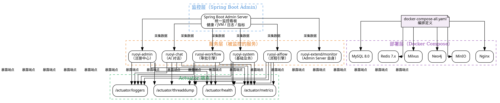

# 13 · 监控与部署：Spring Boot Admin + Docker Compose

> 系统上线后，**监控**和**部署**是运维的两大支柱。ruoyi-ai 采用 **Spring Boot Admin** 监控所有微服务模块的健康状态、JVM 指标、日志级别等；采用 **Docker Compose** 实现中间件的一键部署，降低本地开发与生产部署的环境搭建成本。
>
> **对应项目：** `ruoyi-ai/ruoyi-extend/monitor` 监控模块 + 项目根目录 `docker-compose-all.yaml`

---

## 一、你必须知道的 3 个核心概念

### 1.1 服务监控（Service Monitoring）

服务监控是"**查看系统运行状态，发现异常并及时处理**"的一整套机制。核心监控维度包括：

| 维度 | 指标 | 说明 |
|------|------|------|
| **健康检查** | UP / DOWN / UNKNOWN | 服务是否存活，依赖的 DB/Redis/MQ 是否可达 |
| **JVM 指标** | 堆内存 / GC 频率 / 线程数 / CPU 使用率 | Java 应用的核心运行指标 |
| **HTTP 指标** | 请求量 / 响应时间 / 错误率 | API 性能与可用性 |
| **系统指标** | 磁盘 / 网络 / 系统负载 | 服务器资源使用情况 |
| **日志级别** | DEBUG / INFO / WARN / ERROR | 动态调整日志级别，临时排查问题 |

Spring Boot Admin 是将这些指标**聚合展示**的监控平台——它把每个 Spring Boot 应用的 Actuator 端点数据统一采集并可视化。

### 1.2 Spring Boot Actuator

Spring Boot Actuator 是 Spring Boot 提供的内置监控组件，**每个 Spring Boot 应用天然具备**。它通过 HTTP 端点暴露应用运行信息：

| 端点 | 路径 | 说明 |
|------|------|------|
| 健康检查 | `/actuator/health` | 服务存活及依赖组件状态 |
| 指标 | `/actuator/metrics` | JVM、系统、业务指标 |
| 环境信息 | `/actuator/info` | 应用版本、构建信息 |
| 日志级别 | `/actuator/loggers` | 查看和修改日志级别 |
| 线程转储 | `/actuator/threaddump` | 当前线程快照 |
| 堆转储 | `/actuator/heapdump` | 堆内存快照（用于 OOM 分析） |
| 映射 | `/actuator/mappings` | 所有请求路径映射 |
| 配置项 | `/actuator/beans` | 所有 Spring Bean 信息 |

Actuator 是"数据源"，Spring Boot Admin 是"展示层"——两者配合实现完整的监控方案。

### 1.3 Docker Compose

Docker Compose 是 Docker 官方的**多容器编排工具**，通过一个 `docker-compose.yaml` 文件定义和运行多个容器。核心优势：

| 特性 | 说明 |
|------|------|
| **一键启动** | `docker-compose up -d` 启动所有中间件 |
| **依赖管理** | `depends_on` 控制启动顺序（如先启动 MySQL 再启动应用） |
| **网络隔离** | 默认创建独立网络，容器间通过服务名互相访问 |
| **持久化** | `volumes` 挂载宿主目录，容器重启数据不丢失 |
| **环境配置** | `environment` 注入配置，无需修改代码 |
| **扩展性** | `docker-compose scale` 扩缩容（Swarm 模式） |

---

## 二、项目中的实战应用

### 2.1 解决了什么问题

**问题场景：** 微服务架构下多个模块独立部署，运维人员需要统一查看所有服务的健康状态；开发人员需要快速搭建本地环境，避免繁琐的"安装 MySQL、Redis、向量数据库……"等手动配置。

| 痛点 | 解决方案 |
|------|----------|
| 多个微服务模块，逐个检查健康状态效率低 | Spring Boot Admin 聚合展示所有服务 |
| 排查问题需要看 JVM 堆栈、GC 情况 | Admin 页面直接查看 Actuator 指标 |
| 线上问题需要临时调整日志级别排查 | Admin 动态修改日志级别，无需重启 |
| 新同事加入需要搭建 6+ 个中间件环境 | Docker Compose 一键启动所有中间件 |
| 版本不一致导致"我本地可以"的问题 | Compose 文件锁定中间件版本，与生产一致 |
| 手动配置数据库连接参数繁琐 | Compose 统一管理环境变量，项目读取容器名直连 |

### 2.2 监控与部署架构图



### 2.3 核心实现（关键代码片段，带逐行中文注释）

#### 2.3.1 Spring Boot Admin Server

```java
/**
 * Spring Boot Admin Server —— 监控服务端
 * 负责收集所有注册服务的 Actuator 数据，提供统一看板
 * 对应项目：ruoyi-ai/ruoyi-extend/monitor 模块
 */
@Configuration
@EnableAdminServer  // 启用 Admin Server 功能
@SpringBootApplication
public class MonitorApplication {

    public static void main(String[] args) {
        SpringApplication.run(MonitorApplication.class, args);
    }
}
```

对应 `application.yml` 配置：

```yaml
# ruoyi-extend/monitor 的 application.yml
server:
  port: 9090  # Admin Server 端口，独立于其他业务模块

spring:
  application:
    name: ruoyi-monitor  # 注册到 Admin Server 自身的名称

  # Spring Boot Admin Server 配置
  boot:
    admin:
      ui:
        title: ruoyi-ai 监控中心  # 浏览器标签页标题
        brand:     # 品牌 Logo

# Admin Server 自身也需要暴露 Actuator 端点（用于自监控）
management:
  endpoints:
    web:
      exposure:
        include: "*"     # 暴露所有端点（生产环境按需配置）
  endpoint:
    health:
      show-details: always  # 健康检查显示详细信息
```

#### 2.3.2 被监控服务的 Actuator 配置

```yaml
# 每个业务模块（ruoyi-admin / ruoyi-chat / ruoyi-system 等）的 application.yml
# 通过 Actuator 暴露监控端点，并注册到 Admin Server

spring:
  application:
    name: ruoyi-admin  # 服务名，Admin Server 以此识别

  # 注册到 Admin Server
  boot:
    admin:
      client:
        url: http://localhost:9090  # Admin Server 地址
        # 如果开启了安全认证，需要配置用户名密码
        # username: admin
        # password: admin123
        instance:
          # 服务自身信息，Admin Server 通过这些信息访问 Actuator 端点
          service-host-type: ip          # 使用 IP 注册（默认 hostname）
          service-url: http://localhost:${server.port}

# 暴露 Actuator 端点
management:
  endpoints:
    web:
      exposure:
        include: "*"                     # 生产环境建议按需开放
        # include: health,info,metrics,loggers,env,threaddump,mappings
  endpoint:
    health:
      show-details: always               # 显示详细健康信息（含 DB/Redis 状态）
      # 健康检查组件
      # 默认检查：DiskSpace, Ping, DataSource, Redis, Mongo 等
      # 自定义健康检查实现 HealthIndicator 接口
  metrics:
    export:
      # 生产环境可配置 Prometheus 导出（配合 Grafana 展示）
      prometheus:
        enabled: true
```

#### 2.3.3 自定义健康检查

```java
/**
 * 自定义健康检查 —— 检查 AI 服务核心依赖的状态
 * 场景：Admin Server 的健康检查页面可以看到 AI 特有的依赖状态
 * 实现 HealthIndicator 接口，Spring Boot 自动将其纳入健康检查
 */
@Component
@RequiredArgsConstructor
public class AiServiceHealthIndicator implements HealthIndicator {

    private final VectorDbService vectorDbService;
    private final EmbeddingService embeddingService;

    /**
     * 自定义健康检查逻辑
     * 返回 Health 对象，Spring Boot Admin 展示在健康检查页面上
     */
    @Override
    public Health health() {
        try {
            // 1. 检查向量数据库连接状态
            boolean vectorDbHealthy = vectorDbService.ping();
            // 2. 检查 Embedding 服务可用性
            boolean embeddingHealthy = embeddingService.ping();

            if (vectorDbHealthy && embeddingHealthy) {
                // 所有依赖正常 → UP
                return Health.up()
                        .withDetail("vectorDb", "可用")
                        .withDetail("embeddingService", "可用")
                        .build();
            } else {
                // 部分依赖异常 → DOWN
                return Health.down()
                        .withDetail("vectorDb", vectorDbHealthy ? "可用" : "不可用")
                        .withDetail("embeddingService", embeddingHealthy ? "可用" : "不可用")
                        .build();
            }
        } catch (Exception e) {
            // 检查过程异常 → DOWN
            return Health.down(e)
                    .withDetail("error", e.getMessage())
                    .build();
        }
    }
}
```

#### 2.3.4 Docker Compose 一键部署

```yaml
# docker-compose-all.yaml —— 项目根目录
# 一键启动所有中间件：MySQL、Redis、Milvus、Neo4j、MinIO、Nginx
# 开发人员执行 docker-compose -f docker-compose-all.yaml up -d 即可

version: '3.8'

services:
  # ========== 关系型数据库 ==========
  mysql:
    image: mysql:8.0                          # 锁定 MySQL 8.0 版本
    container_name: ruoyi-mysql               # 容器名，项目配置直接引用
    environment:
      MYSQL_ROOT_PASSWORD: root123456         # 数据库 root 密码
      MYSQL_DATABASE: ruoyi_ai               # 自动创建业务数据库
      TZ: Asia/Shanghai                      # 时区
    ports:
      - "3306:3306"                          # 映射宿主机端口
    volumes:
      - ./data/mysql:/var/lib/mysql          # 持久化数据卷，容器重启不丢失
      - ./sql/init.sql:/docker-entrypoint-initdb.d/init.sql  # 初始化 SQL
    command:
      --default-authentication-plugin=mysql_native_password  # 兼容旧版认证
      --character-set-server=utf8mb4
      --collation-server=utf8mb4_unicode_ci
    healthcheck:
      test: ["CMD", "mysqladmin", "ping", "-h", "localhost"]
      interval: 30s
      timeout: 10s
      retries: 5
    networks:
      - ruoyi-network

  # ========== 缓存 ==========
  redis:
    image: redis:7-alpine                      # 轻量级 Redis 7 镜像
    container_name: ruoyi-redis
    ports:
      - "6379:6379"
    volumes:
      - ./data/redis:/data                     # Redis 持久化（RDB/AOF）
      - ./config/redis/redis.conf:/etc/redis/redis.conf  # 自定义配置
    command: redis-server /etc/redis/redis.conf
    healthcheck:
      test: ["CMD", "redis-cli", "ping"]
      interval: 30s
      timeout: 10s
      retries: 5
    networks:
      - ruoyi-network

  # ========== 向量数据库（Milvus） ==========
  milvus:
    image: milvusdb/milvus:latest
    container_name: ruoyi-milvus
    ports:
      - "19530:19530"   # gRPC 端口
      - "9091:9091"     # HTTP 端口
    environment:
      ETCD_ENDPOINTS: etcd:2379
      MINIO_ADDRESS: minio:9000
    volumes:
      - ./data/milvus:/var/lib/milvus
    depends_on:
      - etcd
      - minio
    networks:
      - ruoyi-network

  # ========== 图数据库 ==========
  neo4j:
    image: neo4j:5-community
    container_name: ruoyi-neo4j
    ports:
      - "7474:7474"   # HTTP 管理界面
      - "7687:7687"   # Bolt 协议端口
    environment:
      NEO4J_AUTH: neo4j/neo4j123              # 用户名/密码
      NEO4J_PLUGINS: '["apoc"]'               # 安装 APOC 插件
    volumes:
      - ./data/neo4j/data:/data
      - ./data/neo4j/logs:/logs
      - ./data/neo4j/import:/var/lib/neo4j/import
    networks:
      - ruoyi-network

  # ========== 对象存储（MinIO） ==========
  minio:
    image: minio/minio:latest
    container_name: ruoyi-minio
    ports:
      - "9000:9000"   # API 端口
      - "9001:9001"   # Console 管理界面
    environment:
      MINIO_ROOT_USER: minioadmin
      MINIO_ROOT_PASSWORD: minioadmin123
    volumes:
      - ./data/minio:/data
    command: server /data --console-address ":9001"
    networks:
      - ruoyi-network

  # ========== 分布式协调（Milvus 依赖） ==========
  etcd:
    image: quay.io/coreos/etcd:v3.5.5
    container_name: ruoyi-etcd
    environment:
      ETCD_AUTO_COMPACTION_MODE: revision
      ETCD_AUTO_COMPACTION_RETENTION: '1000'
      ETCD_QUOTA_BACKEND_BYTES: '4294967296'
    command: etcd --advertise-client-urls http://0.0.0.0:2379
                 --listen-client-urls http://0.0.0.0:2379
                 --data-dir /etcd
    volumes:
      - ./data/etcd:/etcd
    networks:
      - ruoyi-network

  # ========== 反向代理（Nginx） ==========
  nginx:
    image: nginx:alpine
    container_name: ruoyi-nginx
    ports:
      - "80:80"                               # HTTP
      - "443:443"                             # HTTPS（可选）
    volumes:
      - ./config/nginx/nginx.conf:/etc/nginx/nginx.conf
      - ./config/nginx/ssl:/etc/nginx/ssl     # SSL 证书
      - ./dist:/usr/share/nginx/html          # 前端静态文件
    depends_on:
      - mysql
      - redis
    networks:
      - ruoyi-network

# ========== 共享网络 ==========
networks:
  ruoyi-network:
    driver: bridge
    name: ruoyi-network
```

#### 2.3.5 项目配置引用 Docker 容器名

```yaml
# application.yml —— 开发环境配置
# 所有中间件地址引用 Docker Compose 中的容器名
# 容器之间通过 Docker 内部网络通信，无需暴露端口到宿主机
# 如果 IDE 本地启动，则使用 localhost；Docker 内启动使用容器名

spring:
  datasource:
    # Docker 环境：mysql 是容器名
    url: jdbc:mysql://ruoyi-mysql:3306/ruoyi_ai?useUnicode=true&characterEncoding=utf8
    # 本地环境：localhost:3306
    # url: jdbc:mysql://localhost:3306/ruoyi_ai?useUnicode=true&characterEncoding=utf8
    username: root
    password: root123456

  data:
    redis:
      host: ruoyi-redis   # Docker 内使用容器名
      port: 6379

# Milvus 连接
milvus:
  host: ruoyi-milvus
  port: 19530

# Neo4j 连接
neo4j:
  uri: bolt://ruoyi-neo4j:7687
  username: neo4j
  password: neo4j123

# MinIO 连接
minio:
  endpoint: http://ruoyi-minio:9000
  access-key: minioadmin
  secret-key: minioadmin123
```

### 2.4 设计亮点

**亮点一：Spring Boot Admin 统一监控看板**

所有微服务模块通过 `spring.boot.admin.client.url` 注册到 Admin Server，运维人员只需访问一个页面即可查看所有服务的：

- 健康状态（UP / DOWN / 离线）
- JVM 堆内存使用趋势图
- GC 次数和耗时
- 线程数和 CPU 使用率
- 实时日志级别调整
- 在线查看日志文件

**亮点二：Docker Compose 锁定版本，环境一致**

`docker-compose-all.yaml` 明确指定了每个中间件的镜像版本标签（如 `mysql:8.0`、`redis:7-alpine`），开发、测试、生产环境使用完全相同的版本，杜绝"我本地可以"的版本不一致问题。

**亮点三：数据持久化 + 健康检查**

每个容器都配置了 `volumes` 持久化数据卷和 `healthcheck` 健康检查：

- 持久化：容器重启后数据不丢失，升级镜像时数据保留
- 健康检查：Docker 自动检测容器是否真正可用（如 MySQL 能接受连接才算健康），`depends_on` 配合 `condition: service_healthy` 确保依赖就绪后再启动应用

**亮点四：双环境灵活切换**

项目配置支持双环境，通过 Spring Profile 或直接修改配置即可切换：

```
Docker 环境：数据库地址 = 容器名（ruoyi-mysql, ruoyi-redis...）
本地环境：数据库地址 = localhost（方便 IDE 直接运行）
```

开发者本地调试时，先在 Docker 中启动中间件，本地 IDE 运行 Spring Boot 应用连接 `localhost`；部署时使用容器名直连，网络延迟更低。

---

## 三、面试高频题

### Q1: Spring Boot Admin 的监控原理是什么？它和 Prometheus + Grafana 有什么区别？

**参考答案：**

**Spring Boot Admin 原理：**

Spring Boot Admin 基于 **Spring Boot Actuator** 实现监控，核心流程：

1. **每个 Spring Boot 应用**通过 `spring-boot-starter-actuator` 暴露 `/actuator/*` 端点
2. **Admin Client**（`spring-boot-admin-starter-client`）在应用启动时向 Admin Server 注册
3. **Admin Server** 定时（默认 10 秒）通过 HTTP 调用每个注册服务的 Actuator 端点，拉取健康、指标、日志等信息
4. **Admin UI** 将数据渲染为可视化的看板，支持实时查看和历史趋势

```
应用启动 → 注册到 Admin Server → Admin Server 定时拉取 Actuator 数据 → 前端展示
          （告知自身URL）           （HTTP GET /actuator/health 等）
```

**与 Prometheus + Grafana 的核心区别：**

| 维度 | Spring Boot Admin | Prometheus + Grafana |
|------|-------------------|---------------------|
| 数据采集方式 | **拉取**（Admin Server 拉取各服务 Actuator） | **拉取**（Prometheus 拉取各服务 /metrics） |
| 数据存储 | 内存（不持久化，重启丢失） | 时序数据库（Prometheus TSDB，持久化） |
| 历史数据 | 有限（仅当前会话的实时数据） | 长期存储（可配置保留天数） |
| 告警能力 | 基础（邮件通知） | 强大（Alertmanager 规则引擎） |
| 可视化 | 内置 UI，面向 Spring Boot 应用 | Grafana 面板，可自定义，支持多种数据源 |
| 部署复杂度 | 低（一个 Spring Boot 应用） | 中（Prometheus + Grafana 两个组件） |
| 适用范围 | Spring Boot 应用 | 所有系统（服务器、中间件、应用） |

**项目选型结论：** 项目选择 Spring Boot Admin 是因为：① 对 Spring Boot 应用开箱即用，零配置即可看到 JVM 指标；② 部署简单，一个 JAR 包即可启动；③ 提供了动态修改日志级别等实用功能。生产环境可叠加 Prometheus + Grafana 实现长期指标存储和告警。

**追问应对：** "Spring Boot Admin 监控的数据存哪里？重启会丢失吗？" 答：默认存在内存中，重启 Admin Server 后历史数据会丢失。如果需要持久化，可以配置存储后端（如 InfluxDB、Elasticsearch），或者引入 Prometheus 作为数据源，Admin Server 只做展示层，数据由 Prometheus 持久化。

### Q2: Docker Compose 中 `depends_on` 能保证依赖服务完全就绪吗？怎么处理启动顺序？

**参考答案：**

`depends_on` 的局限性：

```yaml
# 以下配置只能保证 MySQL 容器先启动（容器状态为 running）
# 但不能保证 MySQL 已经初始化完成、可以接受连接
services:
  app:
    depends_on:
      - mysql
      - redis
```

**实测问题：** 应用启动比 MySQL 快——MySQL 容器虽然启动了，但初始化数据库需要时间，应用连接 MySQL 时还是报错 `"Communications link failure"`。

**解决方案：**

**方案一：healthcheck + condition（推荐）**

```yaml
services:
  mysql:
    image: mysql:8.0
    healthcheck:
      test: ["CMD", "mysqladmin", "ping", "-h", "localhost"]
      interval: 10s
      timeout: 5s
      retries: 5
      start_period: 30s  # 给 MySQL 30 秒初始化时间

  app:
    depends_on:
      mysql:
        condition: service_healthy  # 等待 MySQL 健康检查通过
      redis:
        condition: service_healthy
```

**方案二：应用层重试（兜底方案）**

在应用代码中配置数据库连接重试：

```yaml
spring:
  datasource:
    # 连接失败时重试 3 次，间隔 5 秒
    hikari:
      initialization-fail-timeout: 30000  # 30 秒内初始化失败才报错
      connection-test-query: SELECT 1
```

**方案三：wait-for-it.sh 脚本（传统方案）**

```yaml
services:
  app:
    entrypoint: ["./wait-for-it.sh", "mysql:3306", "-t", "60", "--", "java", "-jar", "app.jar"]
```

**生产最佳实践：** healthcheck + condition 方案最可靠，Docker Compose 3.8+ 原生支持 `condition: service_healthy`，不需要额外脚本。

**追问应对：** "Docker Compose 和 K8s 的区别是什么？" 答：Docker Compose 是单机容器编排工具，适合开发环境和中小型部署；K8s 是集群级容器编排平台，适合生产环境的大规模部署。Compose 的优势是简单（一个 YAML 文件），K8s 的优势是弹性伸缩、自动修复、滚动更新、服务发现等。项目用 Compose 是因为开发环境足够，生产环境可迁移到 K8s。

### Q3: 生产环境监控要关注哪些核心指标？什么指标异常时需要立即处理？

**参考答案：**

**生产环境监控指标分层：**

**第一层：可用性（必须先看）**

| 指标 | 正常范围 | 告警阈值 | 说明 |
|------|----------|----------|------|
| 服务健康状态 | UP | DOWN | 服务不可用，立即处理 |
| 依赖健康状态 | UP | DOWN | 数据库/Redis/向量库不可用 |
| 接口错误率 | < 1% | > 5% | 5xx 错误激增，可能代码异常 |
| 接口响应时间（P99） | < 500ms | > 2s | 用户体验明显下降 |

**第二层：资源使用（排查根因）**

| 指标 | 正常范围 | 告警阈值 | 说明 |
|------|----------|----------|------|
| JVM 堆内存使用率 | < 70% | > 90% | 可能内存泄漏 |
| GC 频率（Full GC） | 数小时/次 | > 1次/分钟 | 频繁 Full GC 导致 STW |
| CPU 使用率 | < 70% | > 90% | 可能死循环或计算密集 |
| 线程数 | 稳定 | 激增 | 可能线程泄漏 |
| 数据库连接池 | < 80% | > 90% | 连接池耗尽，服务无法响应 |

**第三层：AI 特有指标（项目特有）**

| 指标 | 说明 | 告警条件 |
|------|------|----------|
| LLM 调用成功率 | 大模型调用成功比例 | < 95% |
| LLM 调用平均耗时 | 单次 LLM 调用耗时 | > 10s |
| SSE 连接数 | 当前活跃 SSE 连接数 | 接近最大值 |
| 向量库检索耗时 | 单次向量检索耗时 | > 1s |
| Token 消耗速率 | 每分钟 Token 消耗量 | 接近配额上限 |

**需要立即处理的异常：**

1. **服务 DOWN**：服务不可用，用户无法访问——立即排查宕机原因
2. **Full GC 频繁**（> 1 次/分钟）：Stop-The-World 导致请求超时——检查堆内存配置或内存泄漏
3. **OOM Killer**：进程被系统杀死——增加内存或排查泄漏
4. **数据库连接池满**：所有请求都在等待连接——检查慢查询或连接泄漏
5. **错误率突增**（> 10%）：大量请求失败——回滚最近发布或排查代码 bug
6. **磁盘空间 < 10%**：日志或数据文件撑满磁盘——清理日志或扩容

**追问应对：** "怎么排查 Full GC 频繁的问题？" 答：① 先通过 Admin 看 GC 频率和堆内存使用趋势，确认是"内存持续增长"还是"业务高峰导致"；② 使用 `jmap -dump:format=b,file=heap.hprof <pid>` 导出堆转储；③ 用 MAT（Memory Analyzer Tool）分析大对象和 GC Root 引用链，定位泄漏点；④ 常见原因：ThreadLocal 未清理、缓存无限增长、Stream 未关闭。

---

## 四、面试避坑指南

### 坑 1：Actuator 端点完全暴露在生产环境

**错误做法：** `management.endpoints.web.exposure.include: "*"` 直接照搬到生产环境，导致任何人都能访问 `/actuator/heapdump`（下载堆转储）或 `/actuator/env`（查看环境变量含密码）。

**正确做法：** 生产环境最小化暴露，配合 Spring Security 保护：

```yaml
# 生产环境（application-prod.yml）
management:
  endpoints:
    web:
      exposure:
        include: health,info,loggers  # 只暴露必要的端点
  endpoint:
    health:
      show-details: when-authorized    # 授权后才能看详情
      roles: ADMIN                     # 需要 ADMIN 角色
```

### 坑 2：Docker Compose 中数据卷路径混乱

**错误做法：** 没有使用 volumes 或使用匿名卷，容器重启后数据丢失；或者 volumes 路径写错，导致容器内数据写入宿主机的错误目录。

**正确做法：** 使用命名卷或绑定挂载（bind mount），统一在项目根目录下的 `data/` 文件夹中管理所有中间件数据：

```yaml
volumes:
  - ./data/mysql:/var/lib/mysql          # 绑定挂载，数据在项目目录下
  # 或使用命名卷（推荐生产环境）
  # - mysql-data:/var/lib/mysql

# 命名卷声明（需在顶层声明）
volumes:
  mysql-data:
```

### 坑 3：忽略容器资源限制

**错误做法：** 不设置资源限制，Docker 容器默认使用宿主机的全部 CPU 和内存。一个容器的内存泄漏可能导致整个宿主机 OOM。

**正确做法：** 为每个容器设置资源限制：

```yaml
services:
  mysql:
    deploy:
      resources:
        limits:
          cpus: '2'          # 最多使用 2 个 CPU 核心
          memory: 2G         # 最多使用 2GB 内存
        reservations:
          cpus: '0.5'        # 保留 0.5 个核心
          memory: 1G         # 保留 1GB 内存
```

### 坑 4：线上线下环境配置不一致

**错误做法：** 开发环境用 `localhost:3306`，生产环境用不同地址，每次部署前手动修改配置，容易漏改导致线上连接失败。

**正确做法：** 使用 Spring Profile 分离配置：

```yaml
# application.yml（公共配置）
spring:
  application:
    name: ruoyi-admin

# application-dev.yml（开发环境）
spring:
  datasource:
    url: jdbc:mysql://ruoyi-mysql:3306/ruoyi_ai

# application-prod.yml（生产环境）
spring:
  datasource:
    url: jdbc:mysql://prod-mysql:3306/ruoyi_ai
```

启动时通过 `--spring.profiles.active=prod` 指定环境，Docker Compose 中通过 `environment` 注入：

```yaml
services:
  app:
    environment:
      SPRING_PROFILES_ACTIVE: dev
```

### 坑 5：监控只看不告警，出问题后知后觉

**错误做法：** 部署了 Spring Boot Admin 但只看不设告警，系统挂了半小时才发现。

**正确做法：** 配置通知渠道（邮件、钉钉、企业微信）：

```yaml
# Admin Server 配置告警通知
spring:
  boot:
    admin:
      notify:
        mail:
          to: admin@example.com            # 告警接收邮箱
          from: monitor@example.com        # 发件邮箱
        # 企业微信 / 钉钉通知需自定义 Notifier
```

自定义通知：

```java
// 自定义通知处理器
@Component
public class DingTalkNotifier implements Notifier {

    @Override
    public void notify(Event event) {
        if (event.getType() == EventType.STATUS_CHANGE) {
            // 服务状态变化时发送钉钉通知
            String message = "服务 " + event.getApplication().getName()
                    + " 状态变为 " + event.getApplication().getStatus();
            dingTalkService.sendMessage(message);
        }
    }
}
```

---

## 五、参考资料与扩展阅读

- [Spring Boot Admin 官方文档](https://codecentric.github.io/spring-boot-admin/current/) — Admin Server / Client 配置完整指南
- [Spring Boot Actuator 文档](https://docs.spring.io/spring-boot/reference/actuator/index.html) — Actuator 端点详解
- [Docker Compose 官方文档](https://docs.docker.com/compose/) — Compose 文件格式与命令参考
- [Prometheus 监控](https://prometheus.io/docs/introduction/overview/) — 生产级监控与告警系统
- [Grafana 可视化](https://grafana.com/docs/grafana/latest/) — 指标可视化面板
- [12-Factor App 之配置](https://12factor.net/zh_cn/config) — 环境配置分离的最佳实践
- [Spring Boot 健康检查](https://docs.spring.io/spring-boot/reference/actuator/endpoints.html#actuator.endpoints.health) — 自定义 HealthIndicator