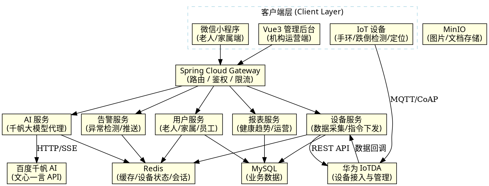

# 全景导读：zznursing 养老机构综合运营平台技术栈深度剖析

> 从一次老人健康监测数据采集出发，穿透 10 个技术栈，理解养老机构物联网平台的完整链路。
>
> **适用读者：** Java 后端工程师转型物联网 / AI 应用开发
> **对照体系：** Spring Boot / Spring Cloud 生态
> **项目源码：** `zznursing` 养老机构综合运营平台

---

## 一、项目定位

**zznursing** 是一个面向养老机构的综合运营平台，核心理念是 **"物联网感知 + AI 智能 + 移动互联"**三位一体：

- **物联网感知层**：通过华为 IoTDA 平台接入老人穿戴设备（心率手环、跌倒检测器、定位胸牌等），实时采集健康数据
- **AI 智能层**：集成百度千帆大模型平台，提供智能问答、健康建议、异常预警等 AI 能力
- **移动互联层**：微信小程序（老人家属端）+ Vue3 管理后台（机构运营端）双端覆盖

---

## 二、架构全景



> **注意：** 如上 Graphviz 图描述了完整的架构分层和调用关系。实际文档中可将此图渲染为 PNG 插入。

---

## 三、技术栈总表

| 层次 | 技术组件 | 版本/选型 | 用途 |
|------|----------|-----------|------|
| **前端-管理端** | Vue 3 + Element Plus + Vite | Vue 3.4+ | 机构运营管理后台 |
| **前端-移动端** | 微信小程序原生 + WeUI | 小程序基础库 3.x | 老人/家属端应用 |
| **网关层** | Spring Cloud Gateway | 2023.0.x | API 路由、鉴权、限流 |
| **后端框架** | Spring Boot 3 + Spring Cloud Alibaba | 3.2.x | 微服务基础框架 |
| **AI 平台** | 百度千帆大模型平台 | 文心一言 4.0 | 智能问答、健康建议 |
| **IoT 平台** | 华为 IoTDA | 标准版 | 设备接入、数据采集、命令下发 |
| **设备协议** | MQTT 5.0 + CoAP | EMQX 消息中间件 | 物联网设备通信 |
| **数据库** | MySQL 8.0 + Redis 7.x | InnoDB + RDB/AOF | 业务数据 + 缓存/状态 |
| **对象存储** | MinIO | 最新版 | 图片、文档、报表文件 |
| **消息队列** | RocketMQ | 5.x | 设备数据异步处理、告警通知 |
| **注册中心** | Nacos | 2.3.x | 服务发现与配置管理 |
| **部署** | Docker + Docker Compose | Linux | 容器化部署 |

---

## 四、模块划分

| 模块 | 功能描述 | 关键技术点 |
|------|----------|------------|
| **设备管理模块** | 设备注册、状态管理、OTA 升级、心跳检测 | IoTDA 设备影子、MQTT 遗嘱消息 |
| **数据采集模块** | 心率/血压/体温实时采集、运动数据上报 | IoTDA 数据转发规则、消息队列削峰 |
| **告警引擎模块** | 跌倒检测、心率异常、电子围栏越界 | 规则引擎 + 流式计算 |
| **AI 智能模块** | 智能客服、健康建议、饮食推荐 | 百度千帆 API、Prompt 工程、流式输出 |
| **人员管理模块** | 老人档案、家属绑定、员工排班 | RBAC 权限模型 |
| **健康档案模块** | 健康趋势分析、体检报告管理 | 时序数据聚合、图表可视化 |
| **运营报表模块** | 入住率、服务满意度、营收分析 | 数据聚合 + ECharts 大屏 |
| **消息推送模块** | 微信订阅消息、短信告警、小程序通知 | 微信模板消息、阿里云短信 |
| **定位服务模块** | 室内定位、电子围栏、轨迹回放 | IoTDA 位置上报 + Geo 计算 |
| **费用管理模块** | 床位费、护理费、餐饮费自动结算 | 定时任务 + 计费规则引擎 |

---

## 五、面试介绍话术

### 1. 项目概述（1 分钟版本）

> "我主导设计并实现了 **zznursing 养老机构综合运营平台**，这是一个面向养老机构的物联网 + AI 整体解决方案。平台采用 **Spring Boot 3 + Spring Cloud Alibaba 微服务架构**，前端提供 **Vue3 管理后台** 和 **微信小程序** 双端覆盖。技术上的核心亮点是：通过 **华为 IoTDA 平台** 接入老人穿戴设备实现实时健康监测，集成 **百度千帆大模型** 提供智能问答和健康建议，所有业务数据最终落盘到 **MySQL + Redis** 做分层存储。平台支持每天百万级设备数据上报，告警延迟控制在秒级。"

### 2. 技术难点（2 分钟版本）

> "项目中最有挑战的是 **IoT 设备数据的高并发处理**。养老院高峰期上千台设备同时上报数据，我们设计了 **消息队列削峰 + 批量写入 + 缓存预热** 三层防护：设备数据先落地 RocketMQ，消费端批量聚合后写入 MySQL，同时 Redis 实时维护最新状态。另外，**百度千帆大模型的流式输出** 在微信小程序端的体验优化也花了很大精力，我们实现了 SSE 到 WebSocket 的协议转换，让老人家属端能流畅看到 AI 回复的逐字流式效果。"

### 3. 架构决策（3 分钟版本）

> "架构设计上我们做了几个关键决策：**第一**，选择华为 IoTDA 而非自建 MQTT 服务器，理由是企业级设备管理平台在多租户、设备认证、OTA 升级方面开箱即用，省去大量基础设施工作；**第二**，AI 能力选择百度千帆而非私有化部署大模型，主要考虑成本——养老场景的并发量不大，千帆的按量计费模式更经济；**第三**，设备数据采用 MySQL 分表 + Redis 缓存的混合存储方案，热数据（最近 1 小时）在 Redis 中，温数据（最近 7 天）在 MySQL 热表中，冷数据归档到历史表，兼顾查询性能与存储成本。"

---

## 六、核心业务流程

### 老人健康监测全链路

```
老人佩戴手环
    │
    ▼
心率/血氧/体温数据采集 (每 5 秒)
    │ MQTT 上报
    ▼
华为 IoTDA 平台
    │ 数据转发规则
    ▼
Spring Boot 设备服务 (RocketMQ 消费)
    │ 校验 → 转换 → 存储
    ▼
MySQL (时序数据) + Redis (实时状态)
    │
    ├─ 告警引擎检测异常 → 微信推送 → 家属手机
    ├─ AI 服务生成健康建议 → 小程序展示 → 老人查看
    └─ 报表服务聚合趋势 → 管理后台 → 护工查看
```

### 智能问答流程

```
家属在小程序提问："父亲今天血压偏高怎么办？"
    │
    ▼
Spring Boot AI 服务
    │ 1. 拼接 Prompt（历史数据 + 问题）
    │ 2. 调用百度千帆文心一言 API
    │ 3. SSE 流式接收回复
    ▼
微信小程序流式展示回答
    │
    ▼
"建议：请先让老人休息10分钟复测，若收缩压仍超过160mmHg，
请及时联系值班医生。最近7天血压趋势显示...（附图表）"
```

---

## 七、技术栈分层详解

（后续文档逐一深入每个技术栈的细节）