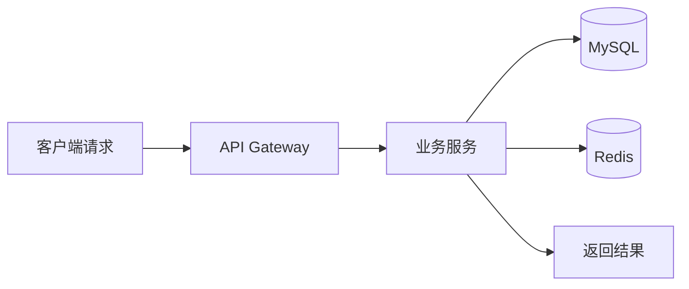
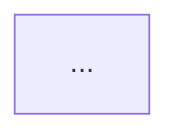

# CLAUDE.md — Java & AI 面试笔记 | 知识库

> 本文件是 Claude Code 的项目级上下文指南。每次会话开始时自动加载。
> 请先阅读本文件，再执行任何操作。

---

## 一、项目概况

本项目是一个面向 **Java 后端工程师 + AI 全栈开发者** 的面试笔记与知识库，覆盖 1000+ 面试题、17 个技术栈教程、28 篇生态深度教程、8 个项目深度剖析，以及一套完整的 AI 编程工具实战指南。

### 核心定位

从 Java 后端到 AI Agent 的全栈面试知识体系，帮助开发者系统性准备技术面试，同时掌握 AI 编程工具在企业级项目中的工程化落地能力。

---

## 二、目录结构

```
interview-note/
├── 1-knowledge/          # 📚 面试题库（按技术领域组织）
│   ├── 01-java/          # Java 核心 + Spring + Spring Cloud
│   ├── 02-infrastructure/ # 中间件 + DevOps
│   └── 03-ai/            # AI 技术栈
├── 2-learning/           # 🎯 系统教程（17 技术栈 × 5 层）
│   ├── roadmap/          # 学习路线图
│   ├── stacks/           # 17 个技术栈教程
│   └── projects/         # 项目实战
├── 3-ecosystem/          # 🗺️ 生态索引（AI Agent 六大生态）
│   ├── tutorials/        # 28 篇深度教程
│   ├── categories/       # 生态分类
│   └── repositories/     # 27 个仓库详情
├── 4-interview/          # 💼 面试准备
│   ├── preparation-plan.md  # 3 个月面试计划
│   ├── project-interview-guide.md  # 项目面试说辞手册
│   └── projects/         # 4 个项目的深度面试文档
├── 5-research/           # 🔬 项目分析 + 研究
│   ├── tech-stack-analysis/ # 8 个项目深度剖析
│   └── liyupi/           # 鱼皮分析
├── ai-coding-guide/      # 🤖 AI 编程工具实战指南
│   ├── 01-*.md ~ 12-*.md # 12 章知识体系
│   └── tutorials/        # 17 个实操教程（T01-T17）
├── _assets/              # 🎨 共享资源
├── _scripts/             # 🔧 工具脚本
└── docs/                 # 项目元文档
```

---

## 三、技术栈

| 领域 | 技术 | 定位 |
|------|------|------|
| Java 后端 | Spring Boot 3, Spring Cloud Alibaba, MyBatis-Plus | 微服务架构 |
| 中间件 | Redis/Redisson, RocketMQ, Elasticsearch, Seata, Sentinel | 高并发与分布式 |
| AI 应用 | LangChain, LangGraph, Spring AI Alibaba, FastAPI | RAG/Agent 开发 |
| 数据库 | MySQL 8.0, PostgreSQL, Elasticsearch, ChromaDB, Neo4j | 存储与检索 |
| 工具链 | Docker, Git, GitHub Actions, Maven | CI/CD 与协作 |

---

## 四、文件编写规范

### 4.1 通用规范

- Markdown 语法，UTF-8 编码，LF 换行
- 中英文混排时，中文与英文之间加空格
- 代码块标注语言（java, bash, yaml, json, xml 等）
- 技术术语保留英文（如 Redis、Spring Boot、AGENTS.md）
- 图片使用绝对路径或相对仓库根目录的相对路径

### 4.2 面试题目录规范

每个面试题目录包含：
- `README.md` — 面试题汇总索引（按 Level 1-4 难度分级，包含题目和答案）
- 题目按难度分级：L1=初级 / L2=中级 / L3=高级 / L4=架构师
- 每个答案包含：核心要点 + 展开说明 + 代码示例（可选）

### 4.3 教程目录规范

每个教程按「入门→核心→进阶→项目→面试」5 层组织：
- `01-basics/` — 入门基础
- `02-core/` — 核心概念
- `03-advanced/` — 进阶技巧
- `04-project/` — 项目实战
- `05-interview/` — 面试准备

### 4.4 生态索引规范

- `guide_repos.json` 是单一数据源，所有 Stars 数据从GitHub API 同步
- 仓库详情页在 `repositories/{name}.md`，与 JSON 保持严格一致
- `ecosystem-index.md` 是生态总索引表，自动汇总各生态数据
- SVG 图表在 `assets/` 目录，手动更新 Stars 数据

---

## 五、AI 编程工具使用约定

### 5.1 工具选择

| 任务 | 推荐工具 | 原因 |
|------|---------|------|
| 日常编辑、小范围修改 | Cursor | IDE 原生集成，响应快 |
| 大型架构重构、跨模块分析 | Claude Code | 大上下文 + Subagent 并行 |
| 长时间自动修复循环 | Codex | Full Auto 模式自主执行 |
| Agent 系统研究 | DeepSeek Harness | 插件化架构，可实验 |
| 日常自动化工作流 | Hermes | 持久记忆 + 自进化 Skills |

### 5.2 任务执行流程

```
1. 先理解需求（有问题先问清楚，不假设）
2. 分析项目结构（读 README / CLAUDE.md / 相关文件）
3. 制定计划（复杂任务先输出 Plan）
4. 执行（从最小改动开始，逐步推进）
5. 验证（运行测试 / 检查 diff / 确认结果）
6. 提交（git add + commit + push，附完整 commit message）
```

### 5.3 编码规范

- 这条规则用于编辑本项目中的 `.md` 文件
- 面试题答案必须准确、完整，不确定时标注"待确认"
- 所有链接使用相对路径，不以 `/` 开头
- 新增文件必须更新上级目录的索引文件
- 引用外部资料时必须附来源链接

---

## 六、关键数据

| 维度 | 数据 |
|------|------|
| 面试题 | 1000+ 道（L1-L4 四级难度） |
| 技术栈教程 | 17 个（每栈 5 层体系） |
| 生态深度教程 | 28 篇（覆盖 Claude Code / Codex / MCP / Harness 等） |
| 项目深度剖析 | 8 个项目（38+ 篇系列文章） |
| 收录仓库 | 27 个（总 Stars 186k+） |
| AI 编程实战教程 | 12 章知识体系 + 17 个实操教程 |

---

## 七、常用命令

```bash
# 同步 Stars 数据
python3 _scripts/sync_stars.py

# 预览 Stars 变更
python3 _scripts/sync_stars.py --dry-run

# 数据一致性校验
python3 _scripts/validate.py

# 检查链接有效性
python3 _scripts/check_links.py

# 提交与推送
git add -A && git commit -m "type(scope): description" && git push
```

---

## 八、项目源码路径（面试项目）

| 项目 | 本地路径 | GitHub |
|------|---------|--------|
| 分布式微云商城 | `D:/code/codeClaudeCode/demo-practicalTrainingProject/mall-ai/mall-micro-cloud` | [mall-micro-cloud](https://github.com/1byteone/mall-micro-cloud) |
| 灵犀智能写作 | `D:/code/codeJava/codeYuJavaAi/ai-passage-creator` | [ai-passage-creator](https://github.com/1byteone/ai-passage-creator) |
| 农业知识库问答 | `D:/code/codeByCursor/AI_EXAM/agri-qa-assistant` | [agri-qa-assistant](https://github.com/1byteone/agri-qa-assistant) |
| 智颐养老护理系统 | `D:/code/codeJava/heima-phase4/zznursing` | [zznursing](https://github.com/1byteone/zznursing) |
| 传习教育实习 | `D:/code/实习/传习教育` | [ai-search-rag-internship](https://github.com/1byteone/ai-search-rag-internship) |

---

## 九、注意事项

- 不要修改 `_scripts/` 中的工具脚本，除非明确要求
- 不要删除 `.nojekyll` 文件（GitHub Pages 需要）
- 面试题答案涉及技术判断时，优先引用权威文档而非个人经验
- 本项目是面试知识库，每个答案都应假设读者需要"深入理解"而非"表面了解"
- 代码示例优先使用 Java 和 Python，两者切换时标注语言

---

## 十、Mermaid 图表规范

### 10.1 适用范围与支持类型

GitHub `README.md` 和面试文档优先使用 Mermaid 绘制可由文本维护的技术图表。当前项目统一支持以下图表类型：

| 图表类型 | Mermaid 声明 | 主要用途 |
|---------|--------------|----------|
| 流程图 | `flowchart` | 展示业务流程、请求链路、数据处理和故障降级路径 |
| 时序图 | `sequenceDiagram` | 展示服务调用顺序、消息交互、异常分支和 Agent 执行过程 |
| ER 图 | `erDiagram` | 展示数据库实体、字段关系和聚合边界 |
| 状态图 | `stateDiagram-v2` | 展示订单、任务、审核、护理计划等状态流转 |
| 类图 | `classDiagram` | 展示领域模型、核心类职责和接口实现关系 |
| 甘特图 | `gantt` | 展示项目阶段、迭代计划、里程碑和依赖关系 |
| C4 图 | `C4Context`、`C4Container`、`C4Component` | 分层说明系统上下文、容器、组件及其边界 |

### 10.2 图表类型选择

| 说明场景 | 首选类型 | 面试文档中的典型问题 |
|---------|---------|----------------------|
| 从用户操作到系统结果的业务路径 | `flowchart` | “一次请求经过哪些模块？” |
| 多服务、数据库、缓存和消息队列之间的调用 | `sequenceDiagram` | “服务如何协作？失败后如何处理？” |
| 表、实体以及一对多/多对多关系 | `erDiagram` | “核心数据模型如何设计？” |
| 生命周期、审核或异常恢复 | `stateDiagram-v2` | “状态如何推进？哪些状态不能回退？” |
| Java 接口、实现类和领域对象 | `classDiagram` | “核心抽象和职责如何划分？” |
| 研发排期和交付节奏 | `gantt` | “项目如何拆分阶段和控制风险？” |
| 从宏观架构逐层下钻 | `C4Context` / `C4Container` / `C4Component` | “系统边界和模块职责是什么？” |

### 10.3 源码可维护性与格式选择原则

1. **优先选择 Mermaid**：图表内容主要由节点、关系、文字和方向组成，且需要频繁修改、代码评审、在 README 中直接渲染时，使用 `.mmd` 源文件或 Markdown 中的 `mermaid` 代码块。
2. **保留唯一事实来源**：不要只提交导出的图片。若必须生成 SVG、PNG 或 GIF，应同时保留 Mermaid 源码，并在文件或文档中说明生成关系，避免图片与源码长期不一致。
3. **使用 SVG 的场景**：需要精确视觉排版、品牌样式、复杂图标、矢量缩放或 Mermaid 无法表达的定制图表时使用 SVG；优先保留可编辑源文件。
4. **使用 PNG 的场景**：需要固定快照、兼容不支持 Mermaid 的外部平台、打印或归档时使用 PNG；不把 PNG 作为可持续维护的唯一格式。
5. **使用 GIF 的场景**：仅用于动画演示、动态流程或录屏式教学；架构和面试文档默认不用 GIF，以免影响加载速度、无障碍阅读和版本对比。
6. **使用 GeoJSON 的场景**：仅在表达地理要素、行政区域、路线或空间数据时使用 GeoJSON；它不是通用的流程图或系统架构图格式。
7. **以读者和生命周期为准**：README 和面试笔记重视可读性、可检索性和变更可审查性，通常采用 Mermaid；对外发布、跨平台展示或像素级设计有硬性要求时，再补充 SVG/PNG/GIF 等派生物。

### 10.4 GitHub README 示例

GitHub README 中直接使用 `mermaid` 代码围栏，提交 Markdown 源码即可渲染：

````markdown

````

- 节点名称应使用读者熟悉的业务术语，必要时在图下补充缩写说明。
- 单张图聚焦一个问题；复杂架构应拆成上下文图、容器图和关键链路时序图。
- README 中的图表应能在纯文本审查时读懂，避免依赖颜色、动画或图片文字。

### 10.5 Mermaid 文件命名与存放约定

- 独立 Mermaid 源文件统一使用 `.mmd` 扩展名，文件名采用小写 `kebab-case`：`<project>-<topic>.mmd`，例如 `mall-micro-cloud-order-sequence.mmd`。
- 项目专属图表放在 `4-interview/projects/<project>/diagrams/`；共享架构图放在 `_assets/diagrams/`。
- 同一主题的派生图片与源文件使用相同主文件名，例如 `order-flow.mmd`、`order-flow.svg`、`order-flow.png`，禁止使用含义不明的 `image1`、`new-diagram` 等名称。
- 在 `README.md` 或项目面试文档中嵌入图表时，优先直接写 `mermaid` 代码块；引用独立源文件时使用相对路径，并在上级索引中登记新增文件。
- 每张图只表达一个主题，文件名可包含 `context`、`container`、`component`、`flow`、`sequence`、`er`、`state`、`class` 或 `gantt` 等语义后缀。

### 10.6 样式与主题规范

#### 10.6.1 基础主题

所有图表统一使用 `default` 主题作为起点，通过 `%%{ init: { ... } }%%` 前置指令覆盖配色和字体，禁止依赖 Mermaid 内置的 `dark` / `forest` / `neutral` 等完整主题切换，以保证跨平台渲染一致性。

````markdown

````

#### 10.6.2 字体与国际化

- **英文回退链**：`Arial` → `Helvetica` → 系统无衬线字体。
- **中文回退链**：`Microsoft YaHei`（微软雅黑）→ `PingFang SC` → `Noto Sans SC` → 系统无衬线字体。
- 在 `themeVariables` 中设置 `fontFamily: 'Arial, Microsoft YaHei, Helvetica, PingFang SC, sans-serif'`。
- 节点文字避免硬换行；若标签过长，优先缩减措辞或拆分节点，而非使用 `<br/>`。

#### 10.6.3 语义化调色板

使用以下固定色板，确保图表在亮色/暗色背景下均可辨识，同时满足色觉障碍可读性：

| 语义 | `themeVariables` 键 | 色值 | 用途 |
|------|---------------------|------|------|
| 主色 | `primaryColor` | `#4A90D9` | 默认节点填充、主要流程 |
| 边框 | `primaryBorderColor` | `#3A7BC8` | 节点描边 |
| 文字 | `primaryTextColor` | `#1F2937` | 节点内文字 |
| 强调色 | `secondaryColor` | `#F59E0B` | 异常分支、警告、重试路径 |
| 辅助色 | `tertiaryColor` | `#10B981` | 成功终态、健康检查 |
| 线条 | `lineColor` | `#6B7280` | 连线默认色 |
| 背景 | `backgroundColor` | `#FFFFFF` | 图表画布背景 |
| 聚合线 | `clusterBkg` | `#F3F4F6` | 子图 / 聚合背景 |
| 聚合边框 | `clusterBorder` | `#D1D5DB` | 子图 / 聚合描边 |

> **注意**：禁止使用纯红 `#FF0000` 或纯绿 `#00FF00` 作为节点填充——它们在色觉障碍读者和灰度打印中几乎不可辨。需要表达「错误」语义时，使用 `secondaryColor`（`#F59E0B`）配合文字标签 `❌` 或 `error`。

#### 10.6.4 classDef 与节点样式约定

使用 `classDef` 为语义类别定义可复用样式，而非在每个节点上内联 `style`：

````
```mermaid
classDef service fill:#4A90D9,stroke:#3A7BC8,color:#FFFFFF,stroke-width:2px
classDef database fill:#10B981,stroke:#059669,color:#FFFFFF,stroke-width:2px
classDef queue fill:#F59E0B,stroke:#D97706,color:#1F2937,stroke-width:2px
classDef gateway fill:#8B5CF6,stroke:#7C3AED,color:#FFFFFF,stroke-width:2px
classDef external fill:#6B7280,stroke:#4B5563,color:#FFFFFF,stroke-width:2px,stroke-dasharray:5,5
```
````

| classDef 名称 | 语义 | 典型用途 |
|---------------|------|----------|
| `service` | 业务服务 | Spring Boot 微服务、Agent 模块 |
| `database` | 数据存储 | MySQL、Redis、ES、ChromaDB |
| `queue` | 消息队列 | RocketMQ、Kafka |
| `gateway` | 网关 / 路由 | Spring Cloud Gateway、Nginx |
| `external` | 外部系统 | 第三方 API、LLM 服务（虚线边框） |

在图表末尾统一应用样式：`class ServiceA,ServiceB service`。禁止在节点定义中混用 `style` 和 `classDef`。

#### 10.6.5 连线语义与样式

| 连线类型 | Mermaid 语法 | 视觉 | 语义 |
|---------|-------------|------|------|
| 主流程 | `-->` | 实线、`lineColor` 默认宽 | 正常业务调用链 |
| 异步 / 事件 | `-.->` | 虚线、`secondaryColor` | 消息发送、事件发布、回调 |
| 补偿 / 回滚 | `--x` 或 `-.->` + `secondaryColor` | 虚线、强调色 | Seata 事务回滚、Saga 补偿 |
| 双向 | `<-->` | 实线双向 | 同步 RPC 双向通信 |
| 粗线强调 | `==>` | 粗实线、`primaryColor` | 核心链路、关键数据流 |

- 每条连线应附带简洁标签（如 `REST`、`MQ`、`gRPC`），让读者无需查看图例即可理解通信协议。
- 连线标签文字不超过 8 个字符；更长的描述放在图下方注释中。

#### 10.6.6 图表复杂度限制

为保证可读性和 GitHub 渲染性能，每张图表应满足以下约束：

| 约束 | 限制值 | 原因 |
|------|--------|------|
| 最大节点数 | 25 个 | 超过则拆分为多张子图 |
| 最大连线数 | 30 条 | 过多连线降低可读性 |
| 最大嵌套层级 | 2 层（`subgraph`） | 超过则使用 C4 分层图 |
| 最大文字标签长度 | 30 字符 | 超过则缩减或使用缩写 + 图下注释 |
| 单张图最大行数 | 80 行源码 | 超过则拆分 |

超出限制时的拆分策略：

1. **架构图** → 使用 C4 分层：`C4Context`（全局）→ `C4Container`（服务间）→ `C4Component`（模块内）。
2. **流程图** → 按业务阶段拆分为 `flow-phase-1.mmd`、`flow-phase-2.mmd`。
3. **时序图** → 按场景拆分：正常流程一张、异常补偿一张。
4. **ER 图** → 按聚合根拆分，避免跨聚合直接连线。

#### 10.6.7 无障碍与可访问性

- **纯文本可理解**：图表在 GitHub `README.md` 中以 Markdown 源码形式呈现，确保纯文本审查时逻辑链完整，不依赖颜色、动画或渲染特效。
- **节点标签自解释**：每个节点的文字标签应包含足够的上下文（如 `订单服务 (OrderService)` 而非仅 `OS`），使首次阅读者无需对照图例。
- **颜色不作为唯一信息通道**：关键语义（正常/异常/补偿）必须同时通过连线样式（实线/虚线）或标签文字传达。
- **避免闪烁和动画**：Mermaid `%%{ init: { 'sequence': { 'mirrorActors': false } } }%%` 等动画配置在面试文档中禁用。
- **缩写需注释**：首次出现的缩写在图下方以 `> 缩写说明：...` 格式展开。

#### 10.6.8 GitHub 兼容性注意事项

- GitHub Mermaid 渲染版本可能滞后于最新 Mermaid API；避免使用发布晚于 Mermaid v10.6 的实验性语法（如 `architecture-beta`）。
- `C4Context` / `C4Container` / `C4Component` 需在代码块首行声明 `C4Context` 等关键字，GitHub 已支持。
- `%%` 注释在 GitHub 中正常渲染；`<!-- -->` HTML 注释在 Mermaid 块内不被支持。
- GitHub 不支持 Mermaid `click` 交互语法——不要在 README 图表中使用 `click` 回调。
- 若图表在 GitHub 上渲染失败，优先检查：引号嵌套、特殊字符转义、节点 ID 是否包含空格或中文标点。

### 10.7 提交前验证清单

- [ ] 图表类型与要表达的问题匹配，没有用一张图堆叠过多主题。
- [ ] Mermaid 代码围栏写为 ` ```mermaid `，结束围栏完整，未混入 Markdown 语法错误。
- [ ] 节点 ID 唯一、连线方向清晰，括号、引号和特殊字符符合 Mermaid 语法。
- [ ] 在 Mermaid Live Editor 或项目约定的渲染工具中验证通过，并确认 GitHub README 能正常渲染。
- [ ] 图表文字与正文术语、服务名、数据库名和状态名保持一致。
- [ ] 关键异常分支、超时、重试、降级或最终状态已表达；不为追求完整而泄露密钥、内网地址或个人数据。
- [ ] 独立 `.mmd` 文件已放入约定目录，文件名符合 `kebab-case`，相对链接可用。
- [ ] 若存在 SVG/PNG/GIF 派生文件，已同步更新 Mermaid 源码并确认没有过期图片。
- [ ] 新增图表已更新对应目录的索引或 README，且通过 Markdown、链接和仓库校验脚本。
- [ ] 图表节点数 ≤ 25、连线数 ≤ 30、嵌套层级 ≤ 2；超限已拆分。
- [ ] 所有 `classDef` 样式已统一定义，节点无内联 `style` 与 `classDef` 混用。
- [ ] 连线标签 ≤ 8 字符，异步和补偿路径使用虚线样式。
- [ ] 缩写和术语在图下方有注释，首次出现的节点标签包含完整业务含义。
- [ ] 无 `click` 交互语法、无动画配置；纯文本审查时逻辑链完整。

### 10.8 四个面试项目的推荐图表

| 项目 | 推荐图表 | 推荐表达内容 |
|------|----------|--------------|
| `mall-micro-cloud` 分布式微云商城 | C4、`flowchart`、`sequenceDiagram`、`erDiagram`、`stateDiagram-v2` | 用 C4 展示网关、微服务和基础设施边界；用时序图说明下单、库存、支付及 Seata 事务链路；用 ER 图说明用户、商品、订单和库存关系；用状态图说明订单状态与补偿路径。 |
| `ai-passage-creator` 灵犀智能写作 | C4、`flowchart`、`sequenceDiagram`、`stateDiagram-v2`、`classDiagram` | 用 C4 展示 Web、写作服务、模型服务和持久化边界；用流程图说明选题到文章生成流程；用时序图说明 Prompt、模型调用、流式输出和失败重试；用状态图说明生成任务生命周期；用类图补充核心领域对象和策略抽象。 |
| `agri-qa-assistant` 农业知识库问答 | C4、`flowchart`、`sequenceDiagram`、`erDiagram`、`stateDiagram-v2` | 用 C4 展示文档处理、向量检索、LLM 和 API 边界；用流程图说明文档切分、向量化、召回和回答生成；用时序图说明检索增强问答链路；用 ER 图说明知识文档、分片、会话和问答记录；用状态图说明文档索引任务状态。 |
| `zznursing` 智颐养老护理系统 | C4、`flowchart`、`sequenceDiagram`、`erDiagram`、`stateDiagram-v2`、`gantt` | 用 C4 展示护理业务、管理端和基础设施边界；用流程图说明入住、评估、护理和费用处理；用时序图说明护理计划执行与提醒；用 ER 图说明老人、房间、护理项目和记录关系；用状态图说明入住/护理计划生命周期；用甘特图展示模块实施和迭代里程碑。 |

上述四个项目的图表应围绕面试高频主线组织：先用 C4 或流程图讲清边界，再用时序图解释关键链路，最后用 ER 图、状态图或类图证明数据与领域设计；`gantt` 仅在确需说明项目计划时使用。
