# 📐 Mermaid 图表使用指南

> 面向 GitHub README 与技术面试文档的 Mermaid 编写、设计和校验规范
>
> 适用场景：项目架构说明、接口调用链、数据库模型、状态流转、类关系和 C4 架构建模。

---

## 1. Mermaid 是什么

Mermaid 使用接近 Markdown 的文本语法描述图表，再由渲染器生成 SVG。图表源码可以和业务代码、配置文件一起进行版本管理，适合持续演进的 README、设计文档和面试材料。

### 1.1 为什么优先使用 Mermaid，而不是截图

| 维度 | Mermaid 源码 | 截图 / 位图 |
|------|--------------|------------|
| 可维护性 | 修改节点和连线即可，适合架构迭代 | 需要重新绘图、导出和替换图片 |
| 版本管理 | 纯文本，可被 Git diff、Code Review 和搜索 | 二进制 diff 几乎不可读 |
| 适配性 | GitHub 按页面宽度渲染 SVG，缩放不易失真 | 小屏阅读或高 DPI 场景容易模糊、溢出 |
| 一致性 | 可以复用模板、命名和主题约定 | 不同人导出的字体、颜色和尺寸容易漂移 |
| 协作效率 | 后端、前端和面试准备者都能直接编辑 | 依赖绘图软件和原作者 |
| 可访问性 | 可补充标题、描述和语义化源码 | 图片通常只有一段 alt 文本 |
| 交付成本 | 不需要提交额外的 PNG 文件 | 会增加资源体积和路径管理成本 |

**结论**：架构和技术流程有持续修改需求时，Mermaid 应作为“可审查的图表源文件”。当需要印刷、社交卡片、精确像素控制或复杂视觉设计时，再导出 SVG/PNG，或改用专业制图工具。

### 1.2 Mermaid 不适合什么

- 需要精确像素布局、品牌插画或出版级排版的宣传页。
- 包含大量节点、自由曲线、图标和跨页标注的复杂拓扑图。
- 需要逐帧播放的演示动画；Mermaid 源码应保持静态语义，动画另行制作。
- 地理坐标、行政区边界等空间数据；这类内容应使用 GeoJSON/TopoJSON。
- 只表达一条简单关系的内容；一句话或一个表格通常更清楚。

---

## 2. GitHub Markdown 支持范围

GitHub 可以在 README、普通 Markdown 文件、Issue、Pull Request、Discussion 和 Wiki 中渲染以下图表语法：

| 语法 | 适用内容 | 代码块标识 |
|------|----------|------------|
| Mermaid | 流程、架构、时序、ER、状态、类图等 | `mermaid` |
| GeoJSON | 点、线、面等地理空间数据 | `geojson` |
| TopoJSON | 拓扑化的地理空间数据 | `topojson` |
| ASCII STL | 3D 三角网格模型 | `stl` |

最小 Mermaid 示例：


GitHub 的渲染版本和 Mermaid Live Editor、Mermaid CLI 可能不同。不要只在本地预览通过就直接提交；应以目标 GitHub 仓库的预览结果为准。可以用 `info` 查询当前 GitHub 渲染器支持的 Mermaid 版本：

```mermaid
info
```

### 2.1 推荐的 README 组织方式

一个面向项目面试的图表章节可以固定为：

````markdown
## 架构与面试辅助图

> 图表源码可直接编辑；完整链路后的文字说明用于面试复述。

### 1. 系统总览

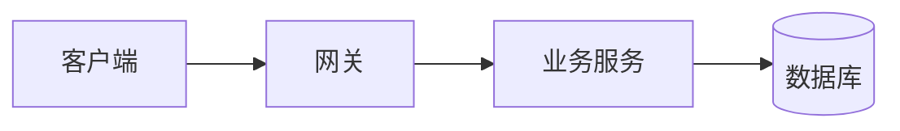

**面试主线**：先讲请求入口，再讲核心约束，最后讲数据落库和失败补偿。
````

建议一个章节只放最能回答问题的 2～4 张图，并把大图拆成“总览图 + 关键链路图”，不要把所有服务和字段堆进一张图。

---

## 3. 通用语法和设计约定

### 3.1 代码块基本结构

````markdown
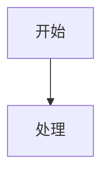
````

注意：外层 Markdown 文件使用三个反引号时，示例中的嵌套代码块应改用四个反引号，或使用 `markdown` 代码块展示，否则会提前闭合。

### 3.2 通用设计原则

1. **一图一问**：每张图先写清楚要回答的问题，例如“库存如何防止超卖”，不要同时塞入部署、表结构和监控。
2. **先主链路，后异常链路**：主路径使用实线，超时、重试、补偿和降级使用虚线或单独分支。
3. **方向一致**：流程和调用链优先 `LR`；分层架构可用 `TB`。不要让读者在同一张图里频繁上下左右跳转。
4. **节点表达名词，连线表达动词**：节点写“订单服务”，连线写“创建订单 / 回滚库存”，避免箭头只有方向没有语义。
5. **形状表达语义**：矩形表示处理步骤，菱形表示判断，圆柱或 `[(...)]` 表示存储，参与者表示调用方，不要仅为装饰而换形状。
6. **控制复杂度**：总览图建议不超过 9 个核心节点；一张图超过 12 条连线时，优先拆分，而不是缩小字体。
7. **颜色少而有意义**：只突出 1～2 个核心节点；颜色应解释“重点、外部系统、异步链路”等语义，不能每个节点一种颜色。
8. **文字短而可讲**：节点标签尽量控制在一到两行；实现细节放在图下的说明或链接中。
9. **保留单一事实来源**：架构图中的服务名、表名、接口名应与代码和配置一致，重命名时同步修改图表源码。
10. **先保证黑白可读**：去掉颜色后，连线、形状和文字仍应能表达关系；颜色只能是辅助信号。

### 3.3 面试图的固定讲解顺序

每张图下方建议用四句话组织讲解：

- **主链路**：请求或数据从哪里来，经过哪些关键节点，最后到哪里。
- **关键保护**：鉴权、限流、锁、幂等、校验或事务边界在哪里。
- **失败补偿**：超时、重试、回滚、降级、死信或对账如何处理。
- **工程取舍**：为什么使用异步、缓存或最终一致性，以及它牺牲了什么。

---

## 3. 统一视觉设计系统

本节定义本仓库所有 Mermaid 图表的视觉基线，确保跨文档、跨项目的风格一致性，并兼顾 GitHub 渲染兼容性和无障碍需求。

### 3.1 基础 init 指令与字体回退

**规则**：始终以 `%%{init: {"theme":"base"}}%%` 开头。`base` 是 Mermaid 唯一允许被配置项覆盖的主题。

**字体回退链**：Mermaid 默认字体回退为 `Trebuchet MS, Verdana, Arial, Sans-Serif`。本仓库统一使用此回退链，无需额外配置。

**注意**：避免使用 `%%{init: {"theme":"dark"}}%%` 或 `%%{init: {"theme":"forest"}}%%`，除非文档明确要求特定主题。GitHub 暗色模式会自动应用暗色主题，手动设置可能导致冲突。

### 3.2 语义化调色板

本仓库使用以下语义化颜色，基于 `neutral` / `base` 主题。所有颜色均经过 Light/Dark 模式及色盲友好性验证（WCAG 2.1 AA）。

| 语义角色 | 颜色名称 | Hex 值 | 适用场景 |
|----------|----------|--------|----------|
| **Primary (主要)** | Blue | `#337ea9` | 核心流程、主链路、强调节点 |
| **Secondary (次要)** | Grey | `#6e7781` | 辅助说明、次要流程 |
| **Success (成功)** | Green | `#1a7f37` | 成功状态、完成节点 |
| **Warning (警告)** | Orange | `#bc4c00` | 警告状态、风险点 |
| **Danger (危险)** | Red | `#cf222e` | 错误状态、失败路径、关键拦截点 |
| **Info (信息)** | Purple | `#8250df` | 外部系统、依赖服务 |
| **Highlight (强调)** | Yellow | `#9a6700` | 需要特别注意的节点 |

### 3.3 classDef 命名规范

**命名规则**：使用小写英文，采用 `语义-变体` 格式。

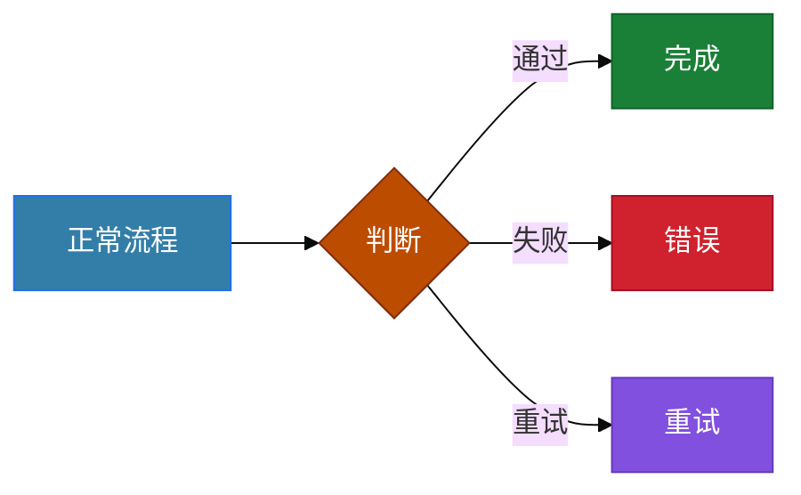

### 3.4 连线语义与方向规则

| 线型 | 语法 | 语义 |
|------|------|------|
| 实线 | `-->` | 主流程、同步调用 |
| 虚线 | `-.->` | 异步消息、旁路、补偿 |
| 粗线 | `==>` | 强调路径、核心依赖 |
| 标签线 | `-->|标签|` | 描述动作或条件 |

**方向规则**：

- **Flowchart**：主流程使用 `LR`（从左到右），分层架构使用 `TB`（从上到下）。
- **Class Diagram**：使用 `direction LR`。
- **State Diagram**：使用 `direction TB`。
- **Sequence Diagram**：无需设置方向，默认从左到右。

### 3.5 图表类型专项规则

#### Sequence Diagram

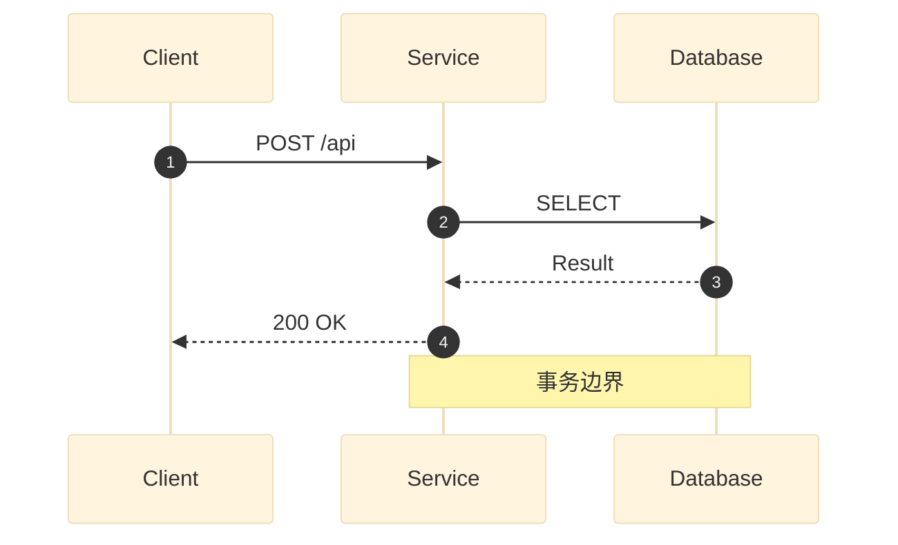

**规则**：
- 参与者数量 ≤ 5。
- 同步调用使用 `->>`，异步返回使用 `-->>`。
- 关键事务或边界使用 `Note over`。

#### ER Diagram

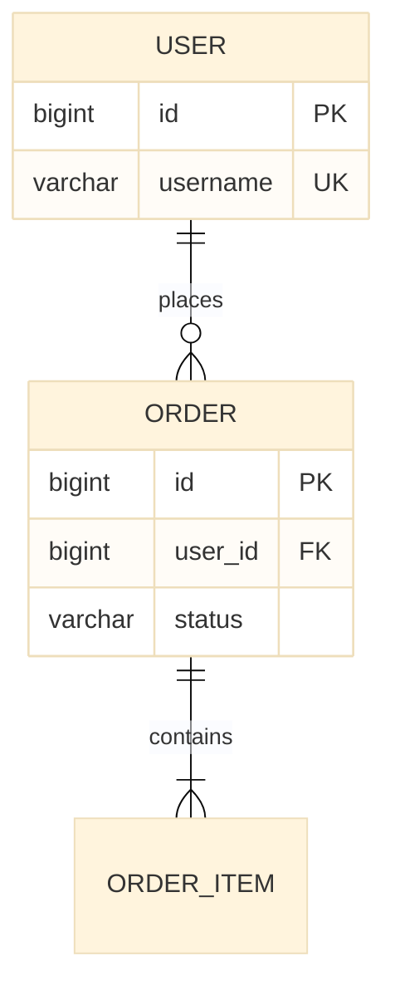

**规则**：
- 字段注释仅保留核心字段（PK, FK, UK）。
- 基数符号必须准确：`||` (恰好一个), `o|` (零或一个), `|{` (一个或多个), `o{` (零或多个)。

#### State Diagram

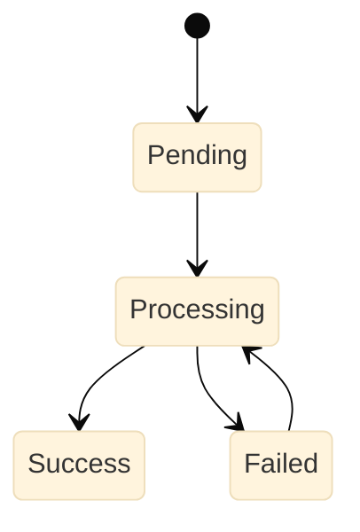

**规则**：
- 使用 `direction TB`。
- 状态名使用统一语言（英文或中文，全文一致）。
- 必须有明确的起点 `[*]` 和终点 `[*]` 或循环路径。

### 3.6 无障碍性与 GitHub 兼容性

#### accTitle / accDescr 限制

**重要警告**：GitHub 当前版本的 Mermaid 渲染器**不支持** `accTitle` 和 `accDescr` 指令。虽然 Mermaid 官方文档推荐使用，但在 GitHub 环境中会被忽略。

**建议**：
1. 在 Mermaid 源码中**不要**添加 `accTitle` / `accDescr`，以免造成混淆。
2. 无障碍支持应通过**图表下方的文字说明**（Alt Text 性质的描述）来实现。
3. 这是本仓库与官方文档的差异点，请务必遵守。

#### GitHub 渲染限制

1. **版本锁定**：GitHub 使用特定版本的 Mermaid，可能滞后于最新版。使用 `info` 指令查询版本。
2. **主题限制**：GitHub 会根据用户设置自动切换 Light/Dark 主题，手动设置 `theme: "dark"` 可能导致冲突。
3. **CSS/JS 限制**：不支持自定义 CSS 或外部脚本。
4. **布局限制**：复杂布局可能在 GitHub 渲染器中出现偏差，务必在 GitHub 预览中确认。

#### Light/Dark 模式与色盲友好性

1. **Base 主题**：使用 `base` 主题可确保在 Light/Dark 模式下均有良好表现。
2. **颜色对比度**：所有颜色组合均满足 WCAG 2.1 AA 标准（对比度 ≥ 4.5:1）。
3. **色盲友好**：避免仅依赖颜色区分信息，始终结合形状、标签或位置。
4. **验证方法**：使用 Chrome DevTools 的 Rendering 面板模拟色盲模式。

### 3.7 提交前检查清单

```markdown
- [ ] 已添加 `%%{init: {"theme":"base"}}%%` 指令
- [ ] 节点 ID 使用 ASCII，显示文本使用中文或英文
- [ ] 连线语义明确，主流程/异步/补偿已区分
- [ ] classDef 命名符合 `语义-变体` 规范
- [ ] 颜色使用语义化调色板，无随意颜色
- [ ] Sequence/ER/State 图遵循专项规则
- [ ] 已移除 `accTitle` / `accDescr`（GitHub 不支持）
- [ ] 已在 GitHub 预览中确认渲染效果
- [ ] 图表下方有文字说明，确保可访问性
- [ ] 复杂图已拆分，节点数 ≤ 9（总览图）或 ≤ 15（细节图）
```

### 3.8 标准化模板（可直接复制）

以下模板覆盖本仓库统一视觉设计系统的所有约定，复制后替换业务标签即可：

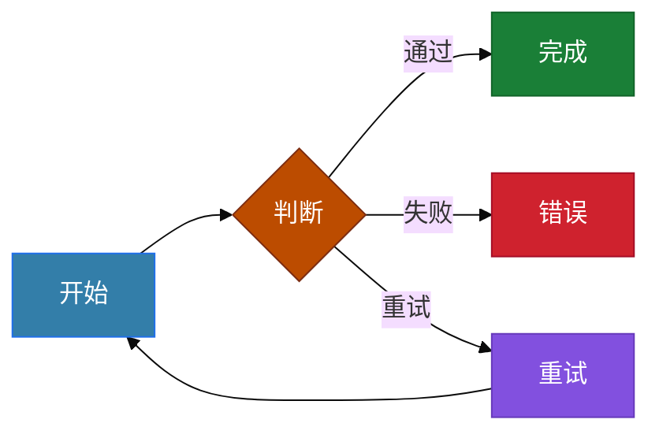

**使用说明**：将以上代码块粘贴到文档中，替换 `A`、`B`、`C`、`D`、`E` 等节点标签及其业务逻辑即可。如需调整节点数量，按 `节点名[显示文本]:::class名` 格式追加即可。

---

## 4. 六类常用图表模板

以下模板都可以直接复制到 GitHub Markdown 中，再替换节点名和业务术语。模板刻意保持中等复杂度，适合 README 和面试材料；实际项目应根据真实代码调整，不要照抄不存在的组件。

### 4.1 Flowchart：架构和业务流程

适合表达“组件之间如何连接”或“请求经过哪些判断”。`subgraph` 用于划分边界，`style` 用于少量强调。

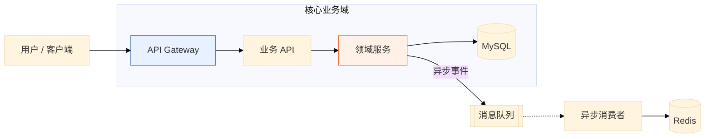

**写法要点**：

- `flowchart LR` 表示从左到右；`TD`/`TB` 表示从上到下。
- `-->` 表示主链路，`-.->` 表示异步、可选或补偿链路。
- `|异步事件|` 给箭头加业务语义；标签应短，详细说明放在图下。
- `subgraph` 代表边界，不等同于部署容器；部署关系需要另画部署图。

### 4.2 Sequence Diagram：API 调用链、`alt` 和 `loop`

适合表达时间顺序、同步/异步交互、重试和条件分支。参与者建议控制在 5 个以内。

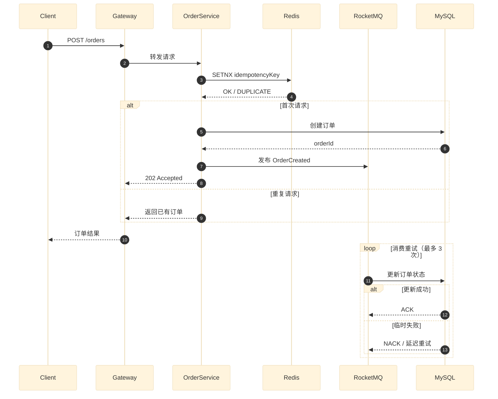

**写法要点**：

- `alt ... else ... end` 表示互斥条件；每个分支都要说明结果。
- `loop ... end` 表示重复动作，务必给出退出条件或最大次数。
- `->>` 表示请求或消息，`-->>` 常用于返回；不要把所有箭头都写成同一种样式。
- `Note over A,B: ...` 可补充事务边界、超时或 SLA，但不要用大段文字代替时序。
- 同步调用和异步消息应在参与者命名或箭头标签中明确区分。

### 4.3 ER Diagram：数据库实体关系

适合表达表、主外键和基数。字段注释只保留面试需要的字段，完整 DDL 另放在数据库文档中。

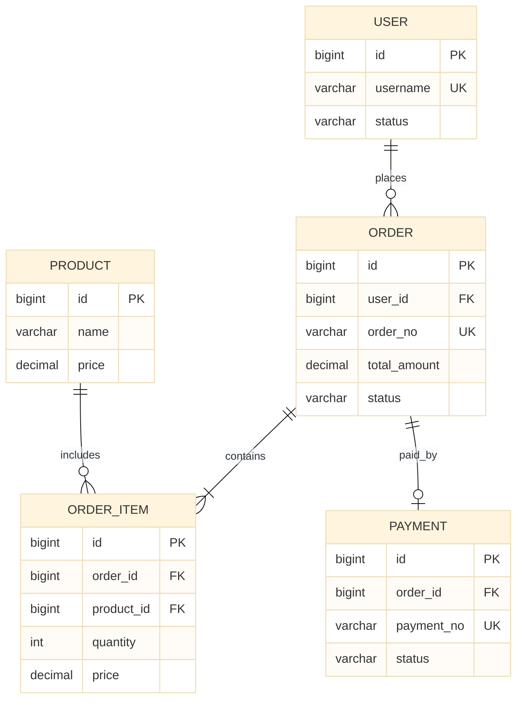

**基数速记**：`||` 是恰好一个，`o|` 是零或一个，`|{` 是一个或多个，`o{` 是零或多个。`PK`、`FK`、`UK` 应与真实约束对应；如果只是逻辑关联，不要误标成数据库外键。

### 4.4 State Diagram：状态机

适合表达订单、支付、任务、审核和设备状态。状态名使用统一语言，转移条件写在箭头后。

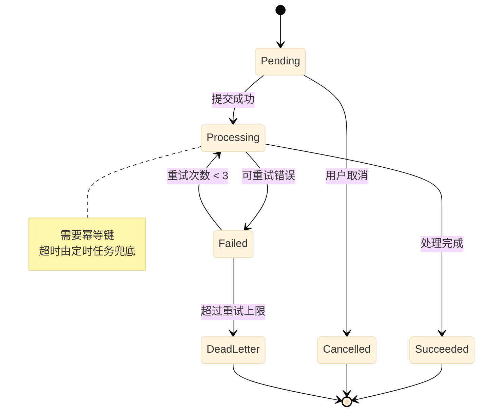

**写法要点**：

- `[ * ]` 表示起点或终点。
- 一条转移只写一个清晰事件；多个条件应拆成不同箭头。
- 重试、补偿和人工介入是面试重点，应明确画出，而不是只在正文提及。
- `note` 用于解释约束，不要放实现代码或长段落。

### 4.5 Class Diagram：领域对象与服务关系

适合表达领域模型、接口实现和依赖关系，不适合替代完整 UML 类设计。

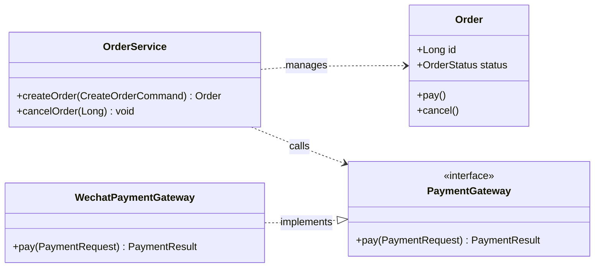

**写法要点**：

- `+`、`-`、`#` 分别表示 public、private、protected；仅保留对设计有解释力的成员。
- `..>` 表示依赖，`..|>` 表示实现；不要把所有调用都画成继承。
- 接口使用 `<<interface>>`，抽象类或值对象也应明确标识。
- 类图回答“谁拥有行为、谁依赖谁”；调用先后应使用时序图。

### 4.6 C4 Diagram：上下文和容器视图

C4 适合从系统边界逐步下钻。README 通常先放 `C4Context`，需要说明服务内部职责时再放 `C4Container` 或组件图。

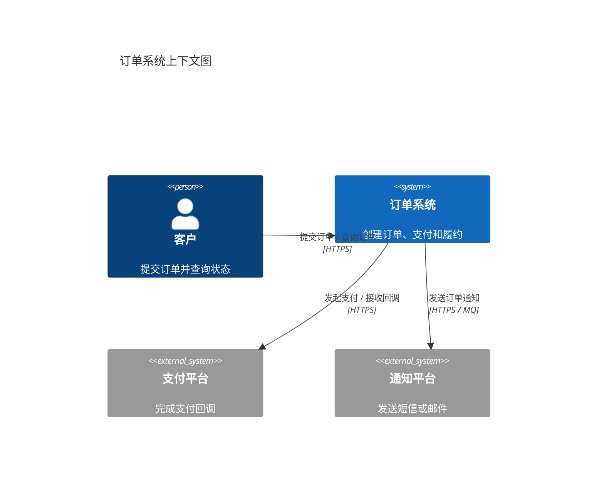

**写法要点**：

- `Person` 表示人或角色，`System` 表示被描述的系统，`System_Ext` 表示外部系统。
- `C4Context` 关注系统与外部世界；不要把数据库表、线程池和方法名塞进上下文图。
- 下钻到容器时，应把系统边界保持稳定，并用 `Container`、`ContainerDb` 和 `Rel` 表达内部职责。
- C4 图是抽象层次模型，不是部署拓扑；云资源和节点位置另画部署架构图。

---

## 5. 面试导向的标注技巧

### 5.1 把“技术名词”改成“责任 + 结果”

| 不推荐 | 推荐 | 面试价值 |
|--------|------|----------|
| Redis | Redis：原子扣减库存 | 说明组件承担的约束 |
| MQ | RocketMQ：异步落库 | 说明为什么引入组件 |
| Lock | Redisson 锁：商品粒度 | 说明并发控制范围 |
| Retry | 最多重试 3 次，失败进死信 | 说明边界和兜底 |
| DB | MySQL：最终一致性落库 | 说明数据落点和一致性 |

### 5.2 在连线上标注“动作”，在节点上标注“能力”

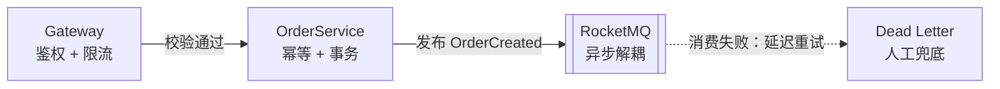

建议连线标签回答“发生了什么”，节点副标题回答“这个节点解决什么问题”。不要把“鉴权、限流、熔断、降级、缓存、锁、事务、幂等”全部写到一个节点里；按责任拆开，或在正文列出。

### 5.3 用不同线型表达可靠性语义

- 实线：主流程或同步调用。
- 虚线：异步通知、旁路、重试、补偿或最终一致性路径。
- 回环：重试或状态回退，必须标注最大次数或终止条件。
- 红色/强调色：只给真正的风险点或面试核心点，例如“防超卖”或“事务边界”。

### 5.4 图下固定补充“四问”

每张图之后可直接使用以下模板，避免面试时只会读图：

```markdown
**面试复述**

1. 主链路：请求从哪里进入，经过哪些节点，结果在哪里产生？
2. 关键保护：哪一步负责鉴权、限流、幂等、并发控制或一致性？
3. 异常处理：失败如何重试、回滚、降级、补偿或人工介入？
4. 取舍：为什么选同步/异步、缓存/数据库或强一致/最终一致？
```

### 5.5 四个项目的图表映射

| 项目 | 首选图表 | 应突出的问题 | 适合的面试标注 |
|------|----------|--------------|----------------|
| [分布式微云商城](../4-interview/projects/mall-micro-cloud/) | Flowchart + Sequence + ER + State | 秒杀防超卖、MQ 异步落库、订单支付和库存补偿 | 布隆过滤器 → Redisson 锁 → Redis 原子扣减 → RocketMQ → 幂等消费 → 对账 |
| [灵犀智能写作](../4-interview/projects/ai-passage-creator/) | Flowchart + Sequence + State | StateGraph 编排、阶段并行、SSE 流式输出和线程池隔离 | `START → Title → Outline → Content → Image → Merge → END`，标明并行图片和流式边界 |
| [农业知识库问答智能体](../4-interview/projects/agri-qa-assistant/) | Architecture/Flowchart + Sequence + C4 | Hybrid RAG、知识图谱、Reranker 和领域守卫 | Vector + BM25 → RRF → BGE-Reranker → Agent；非农业问题在入口拒绝 |
| [智颐养老护理系统](../4-interview/projects/zznursing/) | C4 + Sequence + State + ER | 千帆 AI 健康评估、华为 IoTDA、AMQP 消息和 JWT 鉴权 | PDF → Redis → AI → 结构化结果；设备同步、缓存最新数据和消息消费链路 |

> 图表映射是讲解重点，不是要求每个项目都制作全部类型。优先选择能解释“核心难点 + 工程取舍”的两张图。

---

## 6. GitHub/GFM 常见陷阱

### 6.1 代码块和 Markdown 语法

1. **语言标识必须是 `mermaid`**：写成 `markdown`、`text` 或无标识时，GitHub 不会渲染图表。
2. **反引号必须成对**：嵌套展示 Mermaid 源码时，外层使用四个反引号。
3. **图表前后留空行**：不要把标题、列表或 HTML 标签和围栏紧贴在一起，避免 GFM 解析成同一段。
4. **不要在 Mermaid 代码块内混入 Markdown**：粗体、链接和列表应改为 Mermaid 支持的文本或放到图下。
5. **README 相对链接按文件位置计算**：本文件位于 `_assets/`，链接到项目文档时使用 `../4-interview/...`，不要写仓库根路径 `/4-interview/...`。

### 6.2 Mermaid 解析和兼容性

1. **节点 ID 用 ASCII**：用 `orderService[订单服务]`，不要把中文、空格和标点混在 ID 中；中文放在显示文本里。
2. **特殊字符要谨慎**：`<`、`>`、`&`、`:`、`(`、`)`、引号和换行可能影响解析。复杂文本使用引号、实体编码或拆成两行。
3. **避免保留字冲突**：`end`、`class`、`stateDiagram-v2` 等是语法关键字；不要把它们直接当作节点 ID。
4. **统一使用稳定语法**：GitHub 版本不一定支持 Mermaid 最新特性；新语法应先用 `info` 和 GitHub 预览验证。
5. **少依赖自定义 CSS/初始化指令**：`theme`、`%%{init: ...}%%` 和实验性布局在不同渲染器上可能表现不同。颜色应服务于语义，不能依赖某个渲染器才能读懂。本仓库约定统一使用 `%%{init: {"theme":"base"}}%%`（见第 3 章），避免依赖 `dark` / `forest` 等主题。
6. **HTML 标签并非万能**：`<br/>` 在很多场景可用，但复杂 HTML、脚本和外部资源不应放进图表；出现解析错误时先改为短标签或换行拆节点。
7. **不要把 Mermaid 当作可执行代码**：图中的 URL、SQL、命令和用户输入都应脱敏；不要在标签中放密钥、Token 或真实个人信息。
8. **方向和布局不是绝对保证**：`LR`、`TB` 是布局意图，不是每个节点的像素坐标。节点过多时应拆图，而不是通过大量 `linkStyle` 强行修布局。
9. **同一文件中的图表要有独立语义**：不要把所有项目图拼成一张图；每张图应有标题和图下解释。
10. **可访问性不能只依赖图形**：为关键图表补充图下文字说明，并确保正文仍能读懂主链路。注意：GitHub 渲染器不识别 `accTitle` / `accDescr`，无障碍信息需落在图下文字说明中（见 3.6 节）——本仓库约定不使用这两个指令。

### 6.3 Mermaid 源码中的高频错误


推荐使用上述写法，而不是以下容易出错的形式：

```text
A -> B                 # Flowchart 箭头不完整
A[节点] --> B[节点     # 方括号未闭合
A --> end              # end 可能被当作语法关键字
A -->|条件 < 0| B      # 特殊字符可能触发解析问题，建议改写为“低于 0”
```

---

## 7. 验证清单

提交 README 或面试文档前，按以下顺序检查：

### 7.1 结构检查

- [ ] 代码围栏使用 ` ```mermaid `，且前后成对闭合。
- [ ] 图表前后有空行，标题和说明没有被包进代码块。
- [ ] 每张图只有一个明确主题，节点数量和文字长度适合 GitHub 页面宽度。
- [ ] 所有项目名、服务名、表名和接口名与代码保持一致。
- [ ] 图下有主链路、关键保护、异常处理和取舍说明。

### 7.2 语法检查

- [ ] 在 Mermaid Live Editor 中可以解析。
- [ ] 在 GitHub Markdown 预览或 Pull Request 中可以渲染。
- [ ] 使用 `info` 确认目标 GitHub 的 Mermaid 版本，再检查是否使用了过新的语法。
- [ ] Flowchart 的节点 ID 使用 ASCII，显示文本再使用中文。
- [ ] `alt`、`loop`、`subgraph`、`note` 等块均有对应的 `end`。
- [ ] ER 图的 `PK`、`FK`、`UK` 与真实数据库约束一致。
- [ ] State Diagram 的所有状态都有合法的进入或结束路径。
- [ ] C4 图的抽象层次一致，没有混入字段级或部署级细节。

### 7.3 视觉和内容检查

- [ ] 主链路方向统一，返回、异步和补偿路径清晰可辨。
- [ ] 箭头标签是动作或结果，不是无意义的“调用”。
- [ ] 颜色不承担唯一语义，黑白模式下仍然可读。
- [ ] 没有把一段面试答案直接塞进节点或 `Note`。
- [ ] 缩放到移动端宽度时没有依赖固定像素才能理解的细节。
- [ ] 大图已经拆为总览图和关键细节图。
- [ ] 代码块中没有真实密码、Token、手机号或内部地址。

### 7.4 可选的本地校验

将 Mermaid 源码保存为 `diagram.mmd` 后，可以使用 Mermaid CLI 生成 SVG 做语法和视觉检查。CLI 校验通过不代表 GitHub 一定完全一致，仍需进行 GitHub 预览。

```bash
npx @mermaid-js/mermaid-cli -i diagram.mmd -o diagram.svg
```

如果项目已经配置 Mermaid CLI，也可以把渲染步骤加入 CI：对 `.mmd` 文件和 Markdown 中的 Mermaid 代码块分别提取、渲染，并把 SVG 作为构建产物。不要把渲染出的 SVG 误当成唯一源文件，源 Mermaid 文本仍应保留在文档中。

---

## 8. Mermaid、SVG、PNG、GIF 与 GeoJSON 的选择

### 8.1 决策树

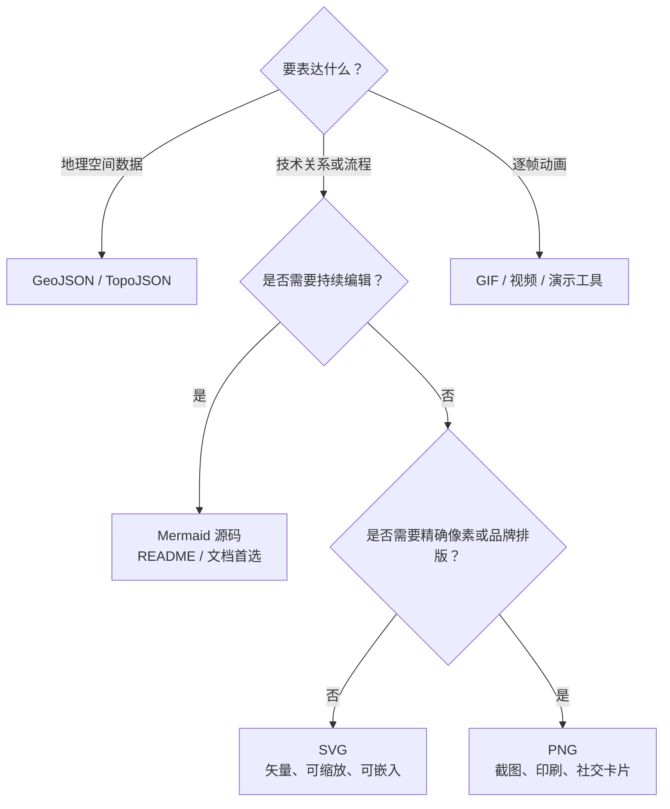

### 8.2 对比表

| 格式 | 首选场景 | 优点 | 主要限制 |
|------|----------|------|----------|
| Mermaid | GitHub README、架构和面试文档 | 文本可审查、易维护、可重渲染 | 布局控制有限，复杂图需拆分 |
| SVG | 需要矢量交付、网页嵌入、印刷 | 清晰、可缩放、可进行精细排版 | 源码较长，手工维护成本高 |
| PNG | 截图、演示封面、外部平台上传 | 兼容性最好，所见即所得 | 不可编辑，放大失真，二进制 diff 差 |
| GIF | 简短循环演示、动效说明 | 直观展示动态过程 | 体积大、无障碍性弱、细节易糊；不适合核心架构事实 |
| GeoJSON / TopoJSON | 地图和空间数据 | 保留地理坐标和拓扑语义 | 不适合表达服务调用、状态或数据库关系 |

**实践建议**：在 GitHub 中保留 Mermaid 源码作为事实来源；需要发布到不支持 Mermaid 的平台时，从同一源码导出 SVG/PNG，并在文件名或说明中标明生成来源和日期。

---

## 9. 推荐工作流

1. **定义问题**：先写一句“这张图要回答什么”。
2. **选择图型**：流程选 Flowchart，调用顺序选 Sequence，数据关系选 ER，生命周期选 State，领域结构选 Class，系统边界选 C4。
3. **列出最小节点集**：只保留能证明结论的组件、角色、数据或状态。
4. **先写主链路**：再补一个最关键的异常、补偿或安全路径。
5. **增加语义标签**：用短动词说明箭头，用能力和约束说明节点。
6. **在图下写面试复述**：按照“主链路 → 关键保护 → 异常处理 → 取舍”组织。
7. **本地渲染**：使用 Mermaid Live Editor 或 Mermaid CLI 检查语法和可读性。
8. **GitHub 预览**：确认实际 GFM 渲染、换行、主题和移动端宽度。
9. **提交源码而非只提交图片**：让后续维护者能直接修改 Mermaid。

---

## 10. 权威来源

- [GitHub Docs：在 Markdown 中创建图表](https://docs.github.com/en/get-started/writing-on-github/working-with-advanced-formatting/creating-diagrams)
- [GitHub Docs：创建和突出显示代码块](https://docs.github.com/en/get-started/writing-on-github/working-with-advanced-formatting/creating-and-highlighting-code-blocks)
- [Mermaid 官方文档](https://mermaid.js.org/intro/)
- [Mermaid 官方语法总览](https://mermaid.js.org/intro/syntax-reference.html)
- [Mermaid Flowchart 语法](https://mermaid.js.org/syntax/flowchart.html)
- [Mermaid Sequence Diagram 语法](https://mermaid.js.org/syntax/sequenceDiagram.html)
- [Mermaid ER Diagram 语法](https://mermaid.js.org/syntax/entityRelationshipDiagram.html)
- [Mermaid State Diagram 语法](https://mermaid.js.org/syntax/stateDiagram.html)
- [Mermaid Class Diagram 语法](https://mermaid.js.org/syntax/classDiagram.html)
- [Mermaid C4 Diagram 语法](https://mermaid.js.org/syntax/c4.html)
- [Mermaid CLI 官方仓库](https://github.com/mermaid-js/mermaid-cli)

> 外部文档会随 GitHub 和 Mermaid 版本更新。遇到渲染差异时，优先以目标 GitHub 页面和上述官方文档的当前版本为准。
