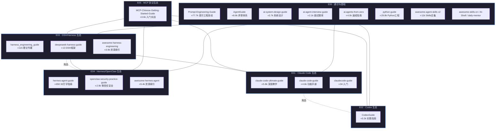
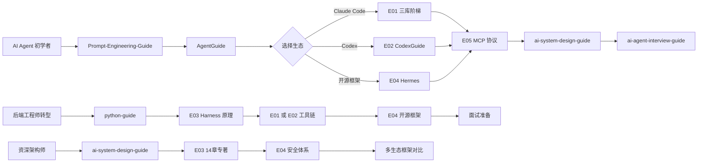
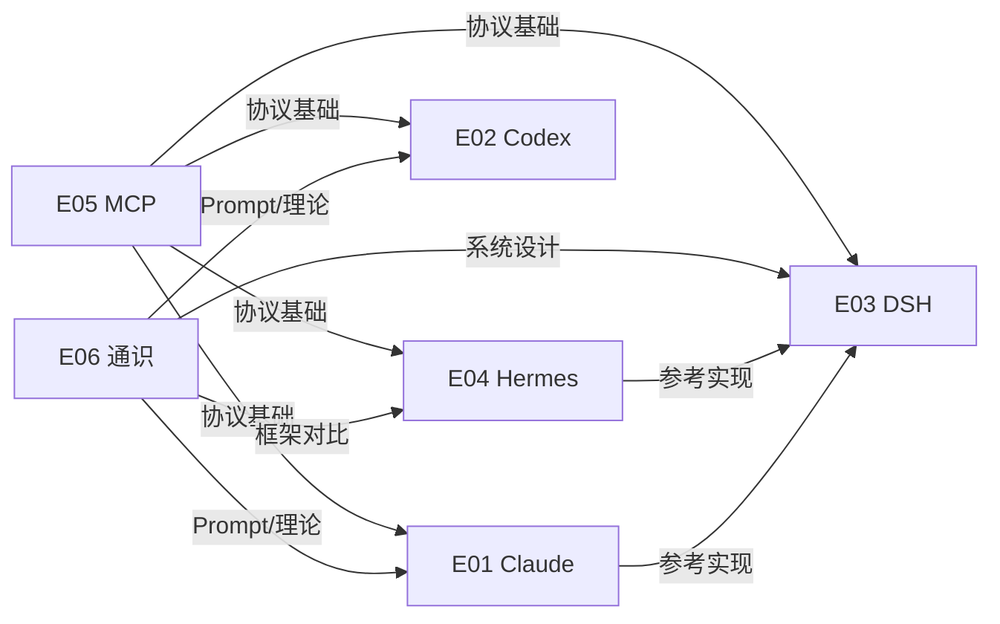

# 🌐 AI Agent 生态全景图（Mermaid）

> 六大技术栈生态 + 仓库归属 + 交叉引用关系  
> 生成日期: 2026-08-22  
> GitHub 原生渲染：在仓库中打开本文件或嵌入 `.md` 文件时自动渲染。

---

## 1. 生态总览

---

## 2. 学习路线图（场景驱动）

---

## 3. 生态关联矩阵（简化版）

---

> 本图与 [`guide/data/landscape.md`](../data/landscape.md) 和 [`guide/data/cross-reference.md`](../data/cross-reference.md) 内容一致，为可视化表达。