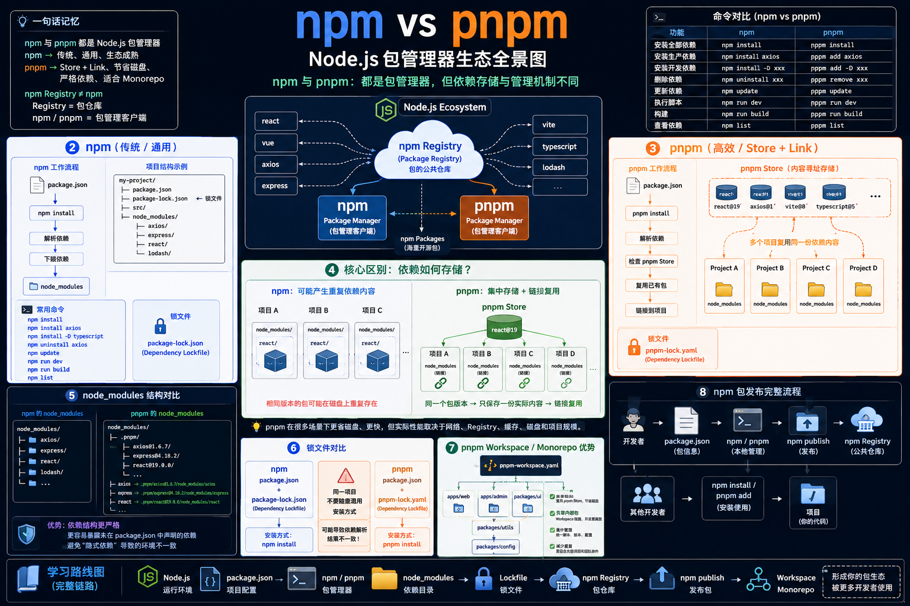

# npm vs pnpm — Node.js 包管理器生态全景图

> 为高级 JS/TS/Node.js/AI Agent 开发者设计的包管理器技术架构信息图，覆盖 npm 与 pnpm 的底层机制、依赖存储、Monorepo 与发布链路。

---

## 全景图总览



> 📐 1536×1024 PNG | 2.4 MB | 原图未压缩

---

## 图中共 10 大模块

| # | 模块 | 内容 |
|---|------|------|
| 1 | **一句话记忆** | npm 与 pnpm 核心定位，npm Registry ≠ npm 的区分 |
| 2 | **命令对比矩阵** | 7 对常用命令的 npm / pnpm 对照 |
| 3 | **Node.js 生态系统** | npm Registry 作为中央仓库，npm / pnpm 作为客户端 |
| 4 | **npm 工作流** | `package.json` → `npm install` → `node_modules` |
| 5 | **pnpm 工作流** | `package.json` → `pnpm install` → Store 检查 → 硬链接复用 |
| 6 | **核心区别：依赖如何存储** | npm 可能重复 vs pnpm 集中 Store + 链接复用 |
| 7 | **node_modules 结构对比** | 扁平 vs `.pnpm/` 严格结构 |
| 8 | **锁文件对比** | `package-lock.json` vs `pnpm-lock.yaml`，不得混用 |
| 9 | **pnpm Workspace / Monorepo** | 多包共享依赖、内部包链接、集中管理 |
| 10 | **npm 包发布完整流程** | 开发者 → Registry → 其他开发者 → 项目 |

---

## 可用于生图模型的 Prompt

> 以下 Prompt 可直接用于 GPT Image / Midjourney / Flux / Gemini Image 等生图模型，用于重新生成或调整风格。

````text
Create a premium professional software-engineering infographic explaining:

"npm vs pnpm — Node.js Package Managers & How They Work Together"

Chinese subtitle:

"npm 与 pnpm：都是包管理器，但依赖存储与管理机制不同"

PURPOSE:
Create a highly polished educational technical infographic for senior
JavaScript / TypeScript / Node.js / AI Agent developers.

The image must clearly explain:
1. What npm is
2. What pnpm is
3. Their relationship
4. npm Registry vs npm/pnpm package managers
5. The fundamental difference in dependency storage
6. node_modules structure
7. lockfiles
8. pnpm Store and hardlink/symlink mechanism
9. Monorepo / workspace advantages
10. npm package publishing lifecycle

OVERALL STYLE:

Premium enterprise software architecture infographic,
senior developer documentation quality,
modern technical whiteboard,
clean vector + subtle 3D isometric elements,
high information density but excellent readability,
strict grid layout,
strong visual hierarchy,
precise arrows and dependency relationships,
professional GitHub README / technical course poster,
minimal futuristic developer aesthetic,
dark navy background with white panels,
cyan and blue technical connectors,
orange highlights for pnpm,
green highlights for successful package installation,
subtle glow,
no excessive decoration,
16:9 landscape.

==================================================
TOP HEADER
==================================================

Large title:

"npm vs pnpm"

Subtitle:

"Node.js Package Manager Ecosystem"

Chinese explanation:

"共同管理依赖 · 不同的安装与存储机制"

Under the title, show a concise conceptual formula:

npm / pnpm
      ↓
Package Manager
      ↓
Install / Update / Remove / Run / Manage Dependencies

==================================================
SECTION 1 — NODE.JS ECOSYSTEM
==================================================

Create a large ecosystem diagram:

                    Node.js Ecosystem
                           │
                     npm Registry
                    "Package Registry"
                           │
          ┌────────────────┴────────────────┐
          ↓                                 ↓
        npm                               pnpm
   Package Manager                  Package Manager
          │                                 │
          └────────────────┬────────────────┘
                           ↓
                     npm Packages

Show package examples around the Registry:

react
vue
axios
express
vite
typescript
lodash

Important:
Visually distinguish:

"NPM REGISTRY"
= Package Repository

from:

"NPM / PNPM"
= Package Managers / Clients

Make this distinction extremely obvious.

==================================================
SECTION 2 — npm
==================================================

LEFT COLUMN:

Large heading:

"npm"

Subtitle:

"传统 / 通用 Node.js 包管理器"

Show a clean npm workflow:

package.json
      ↓
npm install
      ↓
Resolve Dependencies
      ↓
Download Packages
      ↓
node_modules

Show a realistic project structure:

my-project/
├── package.json
├── package-lock.json
├── src/
└── node_modules/
    ├── axios/
    ├── express/
    ├── react/
    └── lodash/

Add command examples:

npm install
npm install axios
npm install -D typescript
npm uninstall axios
npm update
npm run dev
npm run build

Highlight:

"package-lock.json"

with label:

"Dependency Lockfile"

==================================================
SECTION 3 — pnpm
==================================================

RIGHT COLUMN:

Large heading:

"pnpm"

Subtitle:

"高效 / Store + Link 依赖管理"

Show workflow:

package.json
      ↓
pnpm install
      ↓
Resolve Dependencies
      ↓
Check pnpm Store
      ↓
Reuse Existing Package
      ↓
Link into Project

Show:

"pnpm Store"

as a central content-addressable storage area.

Inside it:

react@19
axios@1
vite@8
typescript@5

Then connect the Store to:

Project A
Project B
Project C
Project D

Use visual hardlink / symlink arrows.

Important conceptual label:

"Same package version → reuse stored content"

Highlight:

"pnpm-lock.yaml"

with label:

"Dependency Lockfile"

==================================================
SECTION 4 — CORE DIFFERENCE
==================================================

Create a large central comparison panel titled:

"核心区别：依赖如何存储？"

LEFT:

"NPM"

Show multiple projects:

Project A → node_modules/react
Project B → node_modules/react
Project C → node_modules/react

Visually communicate possible duplicated package contents.

RIGHT:

"PNPM"

Show:

                 pnpm Store
                     │
                  react@19
                     │
        ┌────────────┼────────────┐
        ↓            ↓            ↓
      Project A   Project B    Project C

Use linking arrows.

Large conclusion:

"pnpm：集中存储 + 内容寻址 + 链接复用"

Secondary conclusion:

"减少重复依赖内容，提高磁盘利用率"

Do not imply pnpm is always faster.
Add small note:

"实际性能取决于网络、Registry、缓存、磁盘和项目规模。"

==================================================
SECTION 5 — node_modules STRUCTURE
==================================================

Create a side-by-side technical filesystem comparison.

NPM:

node_modules/
├── axios/
├── express/
├── react/
└── lodash/

PNPM:

node_modules/
├── .pnpm/
│   ├── axios@...
│   ├── express@...
│   └── react@...
│
├── axios → .pnpm/...
├── express → .pnpm/...
└── react → .pnpm/...

Use filesystem icons.

Add highlighted label:

"pnpm 的 node_modules 结构更加严格"

And explain visually:

"更容易暴露未在 package.json 中声明的依赖"

==================================================
SECTION 6 — LOCKFILES
==================================================

Create a clean comparison:

npm
    ↓
package.json
    +
package-lock.json

pnpm
    ↓
package.json
    +
pnpm-lock.yaml

Add a warning symbol:

"同一项目不要随意混用安装方式"

Show:

pnpm-lock.yaml
      ↓
pnpm install

and

package-lock.json
      ↓
npm install

Use subtle warning styling.

==================================================
SECTION 7 — MONOREPO
==================================================

Create a large architecture diagram:

                 pnpm Workspace
                       │
          ┌────────────┼────────────┐
          ↓            ↓            ↓
        apps/web    apps/admin   packages/ui
          │            │            │
          └────────────┼────────────┘
                       ↓
                 packages/utils
                       ↓
                 packages/config

Show:

pnpm-workspace.yaml

Use shared package connections.

Label:

"Monorepo / Workspace"

Add benefits:

Shared Dependencies
Shared Packages
Centralized Management
Workspace Linking
Reduced Duplication

Make this section visually impressive and clearly connected to pnpm.

==================================================
SECTION 8 — PACKAGE PUBLISHING
==================================================

At the bottom create a complete npm package lifecycle:

Developer
   ↓
package.json
   ↓
npm / pnpm
   ↓
npm publish
   ↓
npm Registry
   ↓
Other Developers
   ↓
npm install / pnpm add
   ↓
Project

Show example package:

my-ai-skill
my-cli
my-agent-tool
my-dsh-plugin

Make the Registry a central package repository.

Important visual distinction:

npm Registry
= Public Package Repository

npm / pnpm
= Package Management Clients

==================================================
SECTION 9 — COMMAND COMPARISON
==================================================

Create a compact professional command matrix:

FUNCTION              npm                    pnpm

Install               npm install            pnpm install
Add package           npm install axios      pnpm add axios
Dev dependency        npm install -D xxx     pnpm add -D xxx
Remove                npm uninstall xxx      pnpm remove xxx
Update                npm update             pnpm update
Run script             npm run dev            pnpm run dev
Build                  npm run build          pnpm run build

Use monospace typography.

==================================================
BOTTOM — ONE SENTENCE MEMORY
==================================================

Create a strong final summary:

"npm 与 pnpm 都是 Node.js 包管理器"

Then:

"npm → 传统、通用、生态成熟"

"pnpm → Store + Link、节省磁盘、严格依赖、适合 Monorepo"

And:

"npm Registry ≠ npm"

"Registry = 包仓库"
"npm / pnpm = 包管理客户端"

==================================================
FINAL VISUAL ROADMAP
==================================================

At the very bottom create a learning roadmap:

Node.js
   ↓
package.json
   ↓
npm / pnpm
   ↓
node_modules
   ↓
Lockfile
   ↓
npm Registry
   ↓
npm publish
   ↓
Workspace / Monorepo

==================================================
DESIGN QUALITY REQUIREMENTS
==================================================

Use a strict professional technical layout.

Every major concept must have its own visual card.

Use:
- filesystem icons
- package icons
- registry/cloud icon
- dependency graph
- workspace graph
- terminal snippets
- arrows
- storage layers
- project folders
- package boxes

Use consistent iconography.

Use monospace font for:
package.json
package-lock.json
pnpm-lock.yaml
node_modules
commands
package names

Use large bold typography for:
npm
pnpm
npm Registry
pnpm Store
Monorepo

Make npm and pnpm visually distinct but equally important.

Do not make pnpm look like a completely different ecosystem.

Show that both consume packages from the same npm Registry ecosystem.

CRITICAL ACCURACY:

Do not depict npm Registry as npm itself.

Do not imply pnpm always performs faster than npm.

Do not imply npm always duplicates every package physically.

Clearly communicate that pnpm's major architectural distinction is
content-addressable storage plus links/reuse.

All arrows must represent correct relationships.

Chinese text must be legible, correctly spelled, and not distorted.

English technical terminology must remain accurate.

No random text.
No fake logos.
No meaningless code.
No excessive gradients.
No cartoon characters.
No generic cloud-computing decoration.
No photorealism.

Visual impression:

"Designed by a senior Node.js infrastructure engineer and technical educator."

The final image should look suitable for:
GitHub README,
Node.js course material,
AI Agent engineering documentation,
technical blog,
developer interview preparation,
professional software architecture poster.

Aspect ratio: 16:9 landscape.
````

---

## 核心视觉主线

```
                 NODE.JS ECOSYSTEM
                         │
                   npm Registry
                  /             \
                 /               \
              npm                pnpm
               │                  │
        node_modules        pnpm Store
               │                  │
       Project A/B/C        Shared Package Content
               │                  │
               └────────┬─────────┘
                        ↓
                  Dependencies
                        ↓
                 Monorepo / Apps
                        ↓
                  npm publish
                        ↓
                  npm Registry
```

**npm Registry** 作为中央云仓库、**npm 与 pnpm** 作为左右两个包管理器入口、**pnpm Store** 作为视觉重点，是这张图的核心技术主线。

---

## Quick Start

```bash
# 查看本图
open images/npm-vs-pnpm-ecosystem.png

# 用生图模型重新生成
# 将上方 Prompt 复制到 GPT Image / Midjourney / Flux / Gemini Image 中
```

---

## 图中所用图标 & 颜色语义

| 元素 | 颜色 | 含义 |
|------|------|------|
| npm | 蓝色 | 传统、通用、成熟 |
| pnpm | 橙色 | 高效、Store + Link、严格 |
| npm Registry | 青色/白色 | 中央包仓库 |
| 成功/安装 | 绿色 | 依赖安装成功 |
| 警告 | 黄色/红色 | 不得混用锁文件 |
| 背景 | 深蓝/黑 | 科技感、信息密度高 |