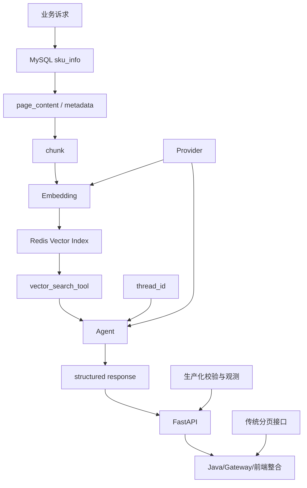

# 云商城智能搜索知识图谱与题目覆盖矩阵

> 本文件是 Task 2 的题库章节规划和题号唯一分配表，不是题库全文。事实基线仅来自 `projects/ai-mall/mall-ai-search-project-analysis.md`；不接触目标项目源码。
>
> 证据标签：`[源码已确认]` 表示指定源码中可定位；`[Word描述]` 表示配套 Word 的目标/叙述；`[架构规划]` 表示生产化建议；`[待验证]` 表示静态材料不足以确认。标签不可互换。

## 1. 项目知识树

```text
云商城智能搜索
├── 业务层：自然语言商品搜索 / 推荐摘要与推荐解释 / 条件提取后的传统分页兜底
├── 数据层：MySQL sku_info（deleted=0） / Redis RedisVectorStore 与 Vector Index
├── RAG：page_content / metadata / RecursiveCharacterTextSplitter / embedding / similarity_search top-k（源码 k=10）
├── Agent：LangGraph/LangChain create_agent / vector_search_tool / ProductRecommendResponse 结构化输出
├── 会话：thread_id / InMemorySaver（当前源码） / Redis checkpoint（架构规划，非当前实现）
├── 服务层：FastAPI /api/v1 / OpenAI-compatible Embedding 与 Chat Provider / Pydantic Schema / 统一 Result
├── Java 集成：Gateway / Java service / OpenFeign / DTO / timeout（Word描述或待验证，无本次 Java 源码）
└── 生产化：一致性 / 幂等 / 降级 / 安全 / 可观测性 / 评估（全部规划或待验证）
```

### 1.1 知识依赖关系



依赖阅读顺序：项目定位与数据源 → 文档构造与向量化 → 向量召回 → Agent 与 Schema → 会话/接口 → 整合与生产化。ES、Rerank、MQ、业务缓存和生产高可用只出现在规划或待验证分支，不是当前 Python 模块实现。

## 2. 事实证据矩阵

| 知识点 | 项目证据 | Word 章节 | 状态 | 对应题目 | 常见误区 |
|---|---|---|---|---|---|
| 商品加载 | S1：`vector_sync_service.py:52-70` 查询 `sku_info`、`deleted=0`，使用 `lazy_load` | 9.1 数据同步 | `[源码已确认]` | 1, 13, 45 | 把全量扫描说成增量同步 |
| page_content 构造 | S1:31-37 拼接名称、属性、品牌、类目、价格 | 9.1 文档构造 | `[源码已确认]` | 2, 14, 46 | 以为全部数据库字段都进入正文 |
| metadata | S1:39-44 复制查询行全部字段 | 9.1 元数据 | `[源码已确认]` | 3, 15, 47 | 把 metadata 自动变成硬过滤 |
| 切分 | S1:13-17、72-78，cl100k_base，256/25 | 9.1 向量化 | `[源码已确认]` | 4, 16, 48 | 把 chunk 参数当作效果保证 |
| Embedding | S3:51-93、145-155，OpenAI-compatible 工厂 | 9.1 模型配置 | `[源码已确认]` | 5, 17, 49 | 把 Provider 默认值当成已连通 |
| Redis Vector | S3:145-155 使用 `RedisVectorStore`；未证明索引已存在 | 9.1 向量库 | `[源码已确认]` / `[待验证]` | 6, 18, 50 | 写成 Elasticsearch 或已验证生产索引 |
| 批量写入与 ID | S1:46-50、80-101，MD5 ID，100 条批次 | 9.1 同步接口 | `[源码已确认]` | 7, 19, 51 | 以为重复任务、旧分片会自动清理 |
| Agent | S2:13-36、59-79，`create_agent` + 单一工具 | 9.1 Agent | `[源码已确认]` | 8, 20, 31, 52 | 说 Agent 已有库存/价格工具 |
| vector_search_tool/top-k | S2:24-36，`similarity_search(query,k=10)` | 9.1 检索 | `[源码已确认]` | 9, 21, 32, 53 | 把后端 k=10 说成后端 top5 |
| 结构化输出 | S4:7-35，`ProductRecommendResponse` 校验字段类型 | 9.1 输出 | `[源码已确认]` | 10, 22, 33, 54 | 把 Pydantic 校验说成业务真实性校验 |
| 条件提取 | S2:38-57、S4:23-28，仅 keyword/min/max price | 9.1/9.2 条件解析 | `[源码已确认]`；Word更宽 | 11, 23, 34, 55 | 说当前已解析品牌、库存、属性 |
| FastAPI 路由 | S5、S6：`/test`、`/sync`、`/recommend`、`/extract` | 9.1 服务接口 | `[源码已确认]` | 12, 24, 35, 56 | 忽略同步是同步阻塞调用 |
| Checkpoint | S2 使用 `InMemorySaver`；S12 仅声明 Redis checkpoint 依赖 | 9.1 会话 | `[源码已确认]` / `[架构规划]` | 25, 36, 57 | 把依赖声明写成 Redis 持久会话 |
| Provider | S3、S7：Embedding siliconflow/openrouter；LLM aliyun/agnes | 9.1 模型选型 | `[源码已确认]`；连通性待验证 | 26, 37, 58 | 猜测固定上游或自动故障转移 |
| 异常处理 | S6:16-26 全局 Exception handler；HTTP status 未显式设置 | 9.2 异常与网关 | `[源码已确认]` / `[待验证]` | 27, 38, 59 | 认为 body code=500 就等于 HTTP 500 |
| 前端协作 | S9:495-845，AI/传统模式、`Promise.allSettled`、结果前5 | 9.2 前端整合 | `[源码已确认]` | 28, 39, 60 | 认为前端路径已被本模块证明可达 |
| Java/Gateway/Feign | 分析文件明确无 Java 适配层源码；Word 第9.2节描述方案 | 9.2 SpringCloud整合 | `[Word描述]` / `[待验证]` | 29, 40, 44 | 把 Word 方案当现有实现 |
| 测试 | S10 向量同步 Mock 单测；S11 手工 async 示例无断言 | 9.1 测试说明 | `[源码已确认]` | 30, 41, 43 | 说全链路已由 pytest 覆盖 |
| 一致性/幂等 | 分析 7.3、13.3：无增量、删除、锁、断点、重试 | 9.1/9.2 业务闭环 | `[架构规划]` / `[待验证]` | 42, 45, 51 | 把 `/sync` 入口等同于一致性保证 |
| 过滤与业务回查 | 分析 8.2-8.3：无硬过滤、ID 白名单和 MySQL 二次回查 | 9.1 推荐安全 | `[源码已确认]`；改造为规划 | 46, 52, 59 | 认为结构化输出不会幻觉或过期 |
| 生产化观测与评估 | 分析 16：指标、Trace、质量集、成本、SLO 均为建议 | 9.2 部署/优化 | `[架构规划]` / `[待验证]` | 43, 44, 50, 53, 60 | 把建议的 P95/Recall 数字说成实测 |
| ES/Rerank/MQ/业务缓存/高可用 | 分析 4.3、6、16：未发现当前实现，列为规划或待验证 | 9.1/9.2 方案背景 | `[架构规划]` / `[待验证]` | 31, 42, 48, 50, 57 | 将规划组件写进当前架构 |

> 证据编号 S1-S13 与 Task 1 分析文件第 1.3 节一致。Word 章节列仅表示叙述入口，不提升证据等级。

## 3. 十类题型与数量

十类题型固定为：事实复述、原理解释、代码走读、接口契约、故障排查、性能成本、测试验证、一致性幂等、安全可靠性、架构设计。以下统计已按最终题库的 `**类型**` 字段重算；OpenFeign 基础题为题 12，因此接口契约为 8 题、事实复述为 6 题。

| 题型 | 题号范围（主归类） | 数量 |
|---|---|---:|
| 事实复述 | 1-3, 11, 25-26 | 6 |
| 原理解释 | 4-6, 14-17, 20-21 | 9 |
| 代码走读 | 7-10, 13, 18-19, 22-23 | 9 |
| 接口契约 | 12, 24, 28-29, 36-37, 39-40 | 8 |
| 故障排查 | 27, 34, 38, 41, 55 | 5 |
| 性能成本 | 35, 42-43, 48-49, 53 | 6 |
| 测试验证 | 30, 44, 50, 57 | 4 |
| 一致性幂等 | 45, 51, 58 | 3 |
| 安全可靠性 | 31-33, 46-47, 52, 59 | 7 |
| 架构设计 | 54, 56, 60 | 3 |
| **合计** | **1-60（每题一个主归类）** | **60** |

## 4. Level 1—5 题目覆盖矩阵（与最终题库同步）

> 本矩阵以最终题库的 `### 题目 N` 标题为事实来源；Task 3 在 Level 3/5 采用了代码题、测试题和综合架构题的新主题，因此这里同步更新主题与编号，避免“预留题目”与题库正文漂移。

### Level 1：基础项目事实与主链路（12 题）

| 题号 | 最终题目主题 | 覆盖知识点 | 题目事实边界 |
|---:|---|---|---|
| 1 | 一句话说明项目的输入、处理和输出 | 以题目正文为准 | 与题目正文的 `[源码已确认]`、`[Word描述]`、`[架构规划]`、`[待验证]` 标签一致 |
| 2 | 哪些 SKU 字段进入 page_content | 以题目正文为准 | 与题目正文的 `[源码已确认]`、`[Word描述]`、`[架构规划]`、`[待验证]` 标签一致 |
| 3 | metadata 保存什么，边界是什么 | 以题目正文为准 | 与题目正文的 `[源码已确认]`、`[Word描述]`、`[架构规划]`、`[待验证]` 标签一致 |
| 4 | chunk size 和 overlap 是什么 | 以题目正文为准 | 与题目正文的 `[源码已确认]`、`[Word描述]`、`[架构规划]`、`[待验证]` 标签一致 |
| 5 | Embedding 工厂如何接 OpenAI-compatible API | 以题目正文为准 | 与题目正文的 `[源码已确认]`、`[Word描述]`、`[架构规划]`、`[待验证]` 标签一致 |
| 6 | 当前向量存储是什么 | 以题目正文为准 | 与题目正文的 `[源码已确认]`、`[Word描述]`、`[架构规划]`、`[待验证]` 标签一致 |
| 7 | 同步批次和文档 ID 如何生成 | 以题目正文为准 | 与题目正文的 `[源码已确认]`、`[Word描述]`、`[架构规划]`、`[待验证]` 标签一致 |
| 8 | 推荐 Agent 由哪些部分组成 | 以题目正文为准 | 与题目正文的 `[源码已确认]`、`[Word描述]`、`[架构规划]`、`[待验证]` 标签一致 |
| 9 | vector_search_tool 召回多少条 | 以题目正文为准 | 与题目正文的 `[源码已确认]`、`[Word描述]`、`[架构规划]`、`[待验证]` 标签一致 |
| 10 | 推荐结构化响应有哪些层次 | 以题目正文为准 | 与题目正文的 `[源码已确认]`、`[Word描述]`、`[架构规划]`、`[待验证]` 标签一致 |
| 11 | extract 当前能提取什么 | 以题目正文为准 | 与题目正文的 `[源码已确认]`、`[Word描述]`、`[架构规划]`、`[待验证]` 标签一致 |
| 12 | OpenFeign 基础：声明式 HTTP 调用是什么 | 以题目正文为准 | 与题目正文的 `[源码已确认]`、`[Word描述]`、`[架构规划]`、`[待验证]` 标签一致 |

### Level 2：组件原理、契约与测试边界（18 题）

| 题号 | 最终题目主题 | 覆盖知识点 | 题目事实边界 |
|---:|---|---|---|
| 13 | 从 lazy_load 到批量入库的执行顺序 | 以题目正文为准 | 与题目正文的 `[源码已确认]`、`[Word描述]`、`[架构规划]`、`[待验证]` 标签一致 |
| 14 | page_content 与 metadata 分离的 RAG 意义 | 以题目正文为准 | 与题目正文的 `[源码已确认]`、`[Word描述]`、`[架构规划]`、`[待验证]` 标签一致 |
| 15 | 为什么 metadata 复制全部查询行 | 以题目正文为准 | 与题目正文的 `[源码已确认]`、`[Word描述]`、`[架构规划]`、`[待验证]` 标签一致 |
| 16 | 256/25 分片如何影响召回上下文 | 以题目正文为准 | 与题目正文的 `[源码已确认]`、`[Word描述]`、`[架构规划]`、`[待验证]` 标签一致 |
| 17 | Embedding 工厂缓存的作用与边界 | 以题目正文为准 | 与题目正文的 `[源码已确认]`、`[Word描述]`、`[架构规划]`、`[待验证]` 标签一致 |
| 18 | RedisVectorStore 如何承接向量化 | 以题目正文为准 | 与题目正文的 `[源码已确认]`、`[Word描述]`、`[架构规划]`、`[待验证]` 标签一致 |
| 19 | MD5 文档 ID 对内容变化意味着什么 | 以题目正文为准 | 与题目正文的 `[源码已确认]`、`[Word描述]`、`[架构规划]`、`[待验证]` 标签一致 |
| 20 | Agent 与固定 Chain 的职责区别 | 以题目正文为准 | 与题目正文的 `[源码已确认]`、`[Word描述]`、`[架构规划]`、`[待验证]` 标签一致 |
| 21 | 后端 k=10 与前端显示 5 的区别 | 以题目正文为准 | 与题目正文的 `[源码已确认]`、`[Word描述]`、`[架构规划]`、`[待验证]` 标签一致 |
| 22 | Pydantic 结构校验不能保证什么 | 以题目正文为准 | 与题目正文的 `[源码已确认]`、`[Word描述]`、`[架构规划]`、`[待验证]` 标签一致 |
| 23 | 条件提取链的 parser 如何工作 | 以题目正文为准 | 与题目正文的 `[源码已确认]`、`[Word描述]`、`[架构规划]`、`[待验证]` 标签一致 |
| 24 | `/recommend` 与 `/extract` 的职责边界 | 以题目正文为准 | 与题目正文的 `[源码已确认]`、`[Word描述]`、`[架构规划]`、`[待验证]` 标签一致 |
| 25 | `thread_id` 如何传入 Agent config | 以题目正文为准 | 与题目正文的 `[源码已确认]`、`[Word描述]`、`[架构规划]`、`[待验证]` 标签一致 |
| 26 | 两类 Embedding 和两类 LLM Provider | 以题目正文为准 | 与题目正文的 `[源码已确认]`、`[Word描述]`、`[架构规划]`、`[待验证]` 标签一致 |
| 27 | 全局异常 handler 的响应风险 | 以题目正文为准 | 与题目正文的 `[源码已确认]`、`[Word描述]`、`[架构规划]`、`[待验证]` 标签一致 |
| 28 | AI 模式为何并行 recommend/extract | 以题目正文为准 | 与题目正文的 `[源码已确认]`、`[Word描述]`、`[架构规划]`、`[待验证]` 标签一致 |
| 29 | `/v1/search/*` 到 `/api/v1/*` 的契约问题 | 以题目正文为准 | 与题目正文的 `[源码已确认]`、`[Word描述]`、`[架构规划]`、`[待验证]` 标签一致 |
| 30 | 现有测试真正覆盖哪些路径 | 以题目正文为准 | 与题目正文的 `[源码已确认]`、`[Word描述]`、`[架构规划]`、`[待验证]` 标签一致 |

### Level 3：代码题、场景排障与局部设计（14 题）

| 题号 | 最终题目主题 | 覆盖知识点 | 题目事实边界 |
|---:|---|---|---|
| 31 | 代码题——为向量同步增加批次失败统计 | 以题目正文为准 | 与题目正文的 `[源码已确认]`、`[Word描述]`、`[架构规划]`、`[待验证]` 标签一致 |
| 32 | 代码题——为搜索条件增加价格区间校验 | 以题目正文为准 | 与题目正文的 `[源码已确认]`、`[Word描述]`、`[架构规划]`、`[待验证]` 标签一致 |
| 33 | 代码题——修复异常处理 HTTP 状态码 | 以题目正文为准 | 与题目正文的 `[源码已确认]`、`[Word描述]`、`[架构规划]`、`[待验证]` 标签一致 |
| 34 | 场景题——只有 Redis 向量工具时如何补业务过滤 | 以题目正文为准 | 与题目正文的 `[源码已确认]`、`[Word描述]`、`[架构规划]`、`[待验证]` 标签一致 |
| 35 | 场景题——召回 k=10 但相关性差 | 以题目正文为准 | 与题目正文的 `[源码已确认]`、`[Word描述]`、`[架构规划]`、`[待验证]` 标签一致 |
| 36 | 场景题——结构合法但商品不存在 | 以题目正文为准 | 与题目正文的 `[源码已确认]`、`[Word描述]`、`[架构规划]`、`[待验证]` 标签一致 |
| 37 | 场景题——品牌/库存诉求可能提取失败 | 以题目正文为准 | 与题目正文的 `[源码已确认]`、`[Word描述]`、`[架构规划]`、`[待验证]` 标签一致 |
| 38 | 场景题——`/sync` 同步阻塞请求 | 以题目正文为准 | 与题目正文的 `[源码已确认]`、`[Word描述]`、`[架构规划]`、`[待验证]` 标签一致 |
| 39 | Bug 题——修复 `threadId`/`thread_id` 映射 | 以题目正文为准 | 与题目正文的 `[源码已确认]`、`[Word描述]`、`[架构规划]`、`[待验证]` 标签一致 |
| 40 | Bug 题——排查旧向量残留 | 以题目正文为准 | 与题目正文的 `[源码已确认]`、`[Word描述]`、`[架构规划]`、`[待验证]` 标签一致 |
| 41 | Bug 题——Agent 空召回仍生成商品 | 以题目正文为准 | 与题目正文的 `[源码已确认]`、`[Word描述]`、`[架构规划]`、`[待验证]` 标签一致 |
| 42 | 测试/排障题——测试 Agent tool call 和结构化输出失败 | 以题目正文为准 | 与题目正文的 `[源码已确认]`、`[Word描述]`、`[架构规划]`、`[待验证]` 标签一致 |
| 43 | 测试/排障题——把手工 async 示例变成可执行测试 | 以题目正文为准 | 与题目正文的 `[源码已确认]`、`[Word描述]`、`[架构规划]`、`[待验证]` 标签一致 |
| 44 | 测试/排障题——设计外部 Embedding 超时重试 | 以题目正文为准 | 与题目正文的 `[源码已确认]`、`[Word描述]`、`[架构规划]`、`[待验证]` 标签一致 |

### Level 4：项目深挖与生产化方案（12 题）

| 题号 | 最终题目主题 | 覆盖知识点 | 题目事实边界 |
|---:|---|---|---|
| 45 | 设计增量、删除和版本化同步 | 以题目正文为准 | 与题目正文的 `[源码已确认]`、`[Word描述]`、`[架构规划]`、`[待验证]` 标签一致 |
| 46 | 设计推荐 SKU 白名单和实时回查 | 以题目正文为准 | 与题目正文的 `[源码已确认]`、`[Word描述]`、`[架构规划]`、`[待验证]` 标签一致 |
| 47 | 错误信息如何脱敏并保持可排障 | 以题目正文为准 | 与题目正文的 `[源码已确认]`、`[Word描述]`、`[架构规划]`、`[待验证]` 标签一致 |
| 48 | 混合检索和 Rerank 是否值得引入 | 以题目正文为准 | 与题目正文的 `[源码已确认]`、`[Word描述]`、`[架构规划]`、`[待验证]` 标签一致 |
| 49 | 为同步和查询设置 timeout/retry | 以题目正文为准 | 与题目正文的 `[源码已确认]`、`[Word描述]`、`[架构规划]`、`[待验证]` 标签一致 |
| 50 | 建立离线查询评估集 | 以题目正文为准 | 与题目正文的 `[源码已确认]`、`[Word描述]`、`[架构规划]`、`[待验证]` 标签一致 |
| 51 | 同步任务如何做到幂等、锁和断点 | 以题目正文为准 | 与题目正文的 `[源码已确认]`、`[Word描述]`、`[架构规划]`、`[待验证]` 标签一致 |
| 52 | InMemorySaver 改造成多实例会话 | 以题目正文为准 | 与题目正文的 `[源码已确认]`、`[Word描述]`、`[架构规划]`、`[待验证]` 标签一致 |
| 53 | 制定 P95、成本和召回 SLO | 以题目正文为准 | 与题目正文的 `[源码已确认]`、`[Word描述]`、`[架构规划]`、`[待验证]` 标签一致 |
| 54 | Agent/Tool/Schema 的安全边界 | 以题目正文为准 | 与题目正文的 `[源码已确认]`、`[Word描述]`、`[架构规划]`、`[待验证]` 标签一致 |
| 55 | Provider 失败时如何降级而非盲目切换 | 以题目正文为准 | 与题目正文的 `[源码已确认]`、`[Word描述]`、`[架构规划]`、`[待验证]` 标签一致 |
| 56 | 前端和网关如何形成稳定版本化契约 | 以题目正文为准 | 与题目正文的 `[源码已确认]`、`[Word描述]`、`[架构规划]`、`[待验证]` 标签一致 |

### Level 5：综合架构设计（4 题）

| 题号 | 最终题目主题 | 覆盖知识点 | 题目事实边界 |
|---:|---|---|---|
| 57 | 设计亿级商品的增量向量同步平台 | 以题目正文为准 | 与题目正文的 `[源码已确认]`、`[Word描述]`、`[架构规划]`、`[待验证]` 标签一致 |
| 58 | 设计传统关键词 + 向量召回 + Rerank 的混合搜索 | 以题目正文为准 | 与题目正文的 `[源码已确认]`、`[Word描述]`、`[架构规划]`、`[待验证]` 标签一致 |
| 59 | 设计面向生产的 AI 搜索微服务高可用与降级 | 以题目正文为准 | 与题目正文的 `[源码已确认]`、`[Word描述]`、`[架构规划]`、`[待验证]` 标签一致 |
| 60 | 设计支持多轮会话、SSE、成本控制和安全校验的智能搜索系统 | 以题目正文为准 | 与题目正文的 `[源码已确认]`、`[Word描述]`、`[架构规划]`、`[待验证]` 标签一致 |

### 4.1 Level 数量核对

| Level | 题号范围 | 目标数量 | 实际数量 |
|---|---|---:|---:|
| 1 | 1-12 | 12 | 12 |
| 2 | 13-30 | 18 | 18 |
| 3 | 31-44 | 14 | 14 |
| 4 | 45-56 | 12 | 12 |
| 5 | 57-60 | 4 | 4 |
| **合计** | **1-60** | **60** | **60** |

## 5. 推荐复习路线

| 阶段 | 学习内容 | 必须能回答的题号 | 自测标准 |
|---|---|---|---|
| 1. 项目定位 | 业务目标、当前主链路、源码/Word边界 | 1-3, 11-12 | 2 分钟内画出 MySQL→Redis→Agent→API，并指出至少 3 个未验证项 |
| 2. MySQL 到 Redis 的向量同步 | SKU 查询、正文/元数据、懒加载、分片、批次、ID | 4-7, 13-19 | 能逐函数说明 100 批次、MD5 ID、删除/增量缺口；不声称一致性已保证 |
| 3. Embedding / Chunk / Top-K | Provider、向量化、chunk 参数、召回 k=10 | 5-6, 16-18, 21, 26 | 能解释参数与效果的区别，明确没有 ES/Rerank 现实现证据 |
| 4. Agent / Tool / Schema | Agent 初始化、单一工具、Prompt、结构化响应和条件提取 | 8-10, 20, 22-24, 31-34, 54 | 能区分格式校验、业务校验和模型约束；指出推荐不消费 extract |
| 5. 会话与微服务集成 | thread_id、InMemorySaver、FastAPI、前端、Java/Gateway/Feign | 25, 28-29, 36-40, 52, 56-57 | 能指出路径/命名映射证据不足，并提出契约测试；不把 Word 方案当源码 |
| 6. 异常和性能 | 全局异常、HTTP status、超时、批量、成本、测试和观测 | 27, 30, 35, 38-44, 49-50, 53, 55, 58 | 能给出失败分类、P95/成本指标和可执行测试，但不编造实测数值 |
| 7. 一致性与生产化架构 | 增量/删除、幂等/锁/断点、回查、降级、安全、多实例 | 42, 45-60 | 能在 10 分钟内讲出现状、风险、方案、验收指标四层；清楚标出规划项 |

## 6. 完整性检查

### 6.1 题号唯一性与连续性

- 题目映射覆盖 `1-60`，Level 分段为 `1-12`、`13-30`、`31-44`、`45-56`、`57-60`。
- 每个编号在 Level 矩阵中恰出现一次；题型表使用主归类，不另造题号。
- 目标数量 `12/18/14/12/4`，合计 `60`，无断号、无重复。

### 6.2 核心知识点三层覆盖

> 按可独立回答的核心点检查三层覆盖，不用“全链路”粗粒度聚合项冒充。基础/事实层优先为 Level 1；原理/场景层为 Level 2 或 3；深挖/架构层为 Level 4 或 5。缺少基础层时明确标注缺口。

| 核心知识点 | 基础/事实层 | 原理/场景层 | 项目深挖/架构层 | 检查结论 |
|---|---|---|---|---|
| SKU 加载与正文构造 | 2 | 13-16 | 45,57 | 通过 |
| Chunk 与 Embedding | 4-5 | 16-18,35,44 | 48-50,53,57-58 | 通过 |
| Redis Vector 与 Top-K | 6,9 | 18,21,35,40 | 48-50,58-59 | 通过 |
| 批次同步与文档 ID | 7 | 13,19,31,38,40,42 | 45,51,57 | 通过 |
| Agent 与 Tool | 8 | 20,34,41-43 | 54,58-60 | 通过 |
| Schema 与条件提取 | 10-11 | 22-24,32-37,42 | 46,54,58,60 | 通过 |
| OpenFeign/Java/Gateway 契约 | 12 | 24,29,39 | 47,56,60 | 通过（Java实现仍待验证） |
| 会话与 Checkpoint | 1 | 25,39 | 52,59-60 | 通过（持久化方案为规划） |
| 异常、超时与 Provider | 5 | 17,26-28,33,38,44 | 47,49,53,55,59 | 通过 |
| 测试与可观测性 | 30（事实基线） | 42-44 | 47,50,53,57,59-60 | 基础题不在 Level 1，已明确而非冒充 |
| 前端协作与版本契约 | 1 | 24,28-29,36-39 | 47,56,60 | 通过 |

### 6.3 事实边界检查

- ES、Rerank、消息队列、业务缓存、Redis 持久 checkpoint、多实例高可用没有标记为当前实现；题 48、52、57 等明确写为规划/综合设计。
- Java Gateway、OpenFeign、DTO 只作为 Word 描述或待验证整合边界；无 Java 源码时不补写实现细节。
- `/sync`、`k=10`、`InMemorySaver`、Schema 字段、前端显示前 5 项等源码事实保留原边界。
- 测试覆盖、Provider 连通性、Redis 索引状态、真实 HTTP status、前后端路径映射和业务收益均未虚构为已验证。
- 本文件未读取或引用目标项目源码；仅消费 Task 1 分析文件。
