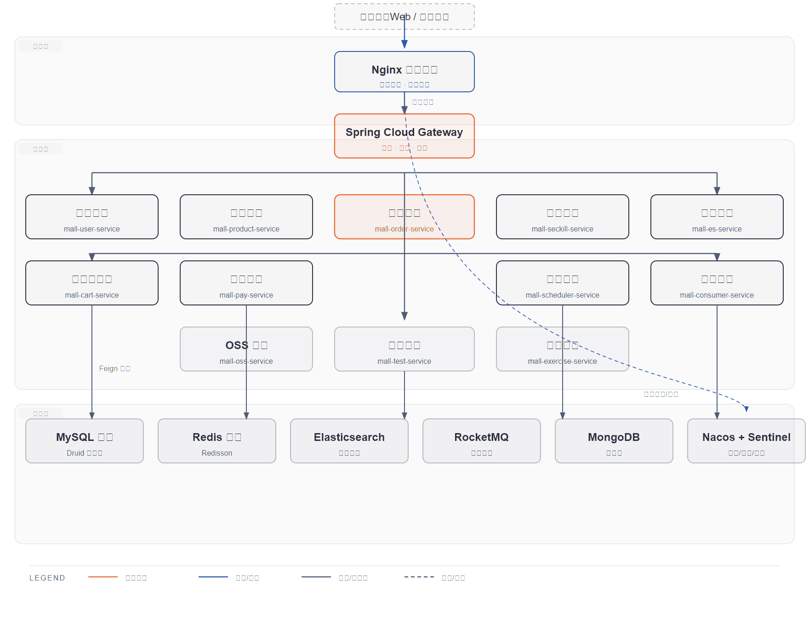

# 第2篇：Spring Cloud 微服务架构设计

> 技术点：微服务拆分、服务治理、Spring Cloud Alibaba 组件栈
> 场景项目：mall-micro-cloud（11 个微服务）

---

## 一、基础篇：概念与价值

### 1.1 什么是微服务架构？

微服务架构是将单一应用拆分为一组小型服务的架构模式，每个服务运行在自己的进程中，通过轻量级通信机制协作。

### 1.2 单体 vs 微服务

| 维度 | 单体架构 | 微服务架构 |
|------|----------|------------|
| 部署 | 整体部署 | 独立部署 |
| 扩展 | 全量扩展 | 按需扩展 |
| 技术栈 | 单一 | 可异构 |
| 团队协作 | 代码冲突多 | 独立开发 |
| 运维 | 简单 | 复杂 |

---

## 二、进阶篇：架构设计原则

### 2.1 服务拆分原则

1. **高内聚低耦合**：每个服务只负责一个业务域
2. **数据独立**：每个服务拥有独立数据库
3. **接口契约**：通过 API 定义交互，不直接访问对方数据库
4. **团队自治**：服务可由独立团队开发部署

### 2.2 mall-micro-cloud 架构总览



*11 个微服务 + Gateway 网关 + Nacos 注册中心 + 6 种中间件集群*

### 2.3 11 个微服务职责

| 服务 | 职责 | 技术特点 |
|------|------|----------|
| mall-gateway | 统一入口、路由、鉴权、限流 | Spring Cloud Gateway |
| mall-user-service | 用户管理、登录注册 | JWT + Spring Security |
| mall-product-service | 商品管理、库存 | Seata 分布式事务 |
| mall-order-service | 订单管理、订单状态流转 | Seata + RocketMQ |
| mall-seckill-service | 秒杀活动 | Redis 预扣 + MQ 异步 |
| mall-es-service | 商品全文搜索 | Elasticsearch |
| mall-cart-service | 购物车管理 | MongoDB |
| mall-pay-service | 支付集成 | 支付宝 SDK |
| mall-oss-service | 文件存储 | 阿里云 OSS |
| mall-scheduler-service | 定时任务 | ElasticJob + Zookeeper |
| mall-consumer-service | 消息消费 | RocketMQ |

---

## 三、项目篇：真实代码与场景

### 3.1 父工程版本管理

```xml
<!-- mall-micro-cloud/pom.xml -->
<parent>
    <groupId>org.springframework.boot</groupId>
    <artifactId>spring-boot-starter-parent</artifactId>
    <version>3.3.2</version>
</parent>

<properties>
    <spring-cloud.version>2023.0.1</spring-cloud.version>
    <spring-cloud-alibaba.version>2023.0.1.0</spring-cloud-alibaba.version>
</properties>
```

### 3.2 服务间调用链路

```
用户请求 → Nginx → Gateway → mall-order-service → OpenFeign → mall-product-service
                                                              ↓
                                                         Seata 分布式事务
                                                              ↓
                                                     RocketMQ 异步 → mall-seckill-service
```

### 3.3 服务治理体系

| 治理能力 | 实现组件 | 在项目中的使用 |
|----------|---------|---------------|
| 服务注册发现 | Nacos | 11 个服务统一注册 |
| 配置中心 | Nacos | 环境隔离 dev/prod |
| 路由网关 | Gateway | 统一入口 + 鉴权 |
| 远程调用 | OpenFeign | 服务间 API 调用 |
| 限流熔断 | Sentinel | 秒杀接口保护 |
| 分布式事务 | Seata | 下单扣库存 |
| 消息队列 | RocketMQ | 异步削峰 |

---

> 下一篇：[第3篇：Nacos 服务注册与配置中心](../03-nacos/README.md)