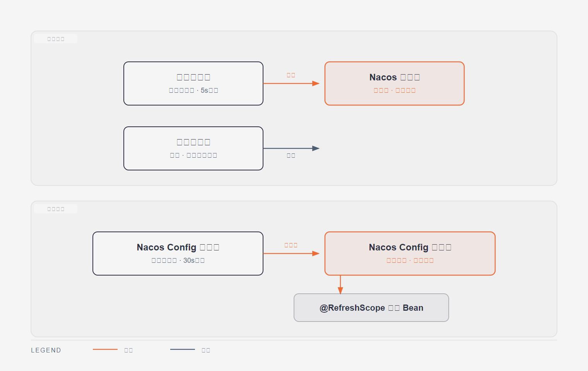

# 第3篇：Nacos 服务注册与配置中心

> 技术点：服务注册发现、配置管理、命名空间隔离、长轮询
> 场景项目：mall-micro-cloud（11 服务统一注册，dev/prod 环境隔离）

---

## 一、基础篇：概念与价值

### 1.1 Nacos 是什么？

Nacos（Dynamic Naming and Configuration Service）是阿里巴巴开源的服务发现与配置管理平台，是 Spring Cloud Alibaba 生态的核心组件。

**两大核心能力**：
| 能力 | 说明 | 类比 |
|------|------|------|
| 服务发现 | 服务注册到 Nacos，消费者按名字调用 | 电话簿 |
| 配置中心 | 集中管理配置，动态刷新 | 远程遥控器 |

### 1.2 为什么需要 Nacos？

微服务架构下服务数量多、IP 会变，直接写死 IP 无法维护：
```
❌ http://192.168.1.10:8080/order   （IP 变了就挂）
✅ http://mall-order-service/order  （Nacos 自动解析）
```

---

## 二、进阶篇：原理深剖

### 2.1 服务注册与发现机制



```
服务提供者(Provider)
    │ ① 启动时注册 (register)
    │ ② 发送心跳 (beat) 每 5s
    ▼
┌─────────────────┐
│      Nacos      │
└─────────────────┘
    ▲
    │ ① 订阅 (subscribe)
    │ ② 拉取实例列表
服务消费者(Consumer)
```

**健康检查机制**：
- 临时实例：心跳续约，15s 未心跳标记不健康，30s 剔除
- 持久实例：Nacos 主动 TCP/HTTP 探测

### 2.2 配置中心长轮询原理

```
客户端发起长轮询 → 服务端挂起（最长30s）
    ↓ 配置变更
服务端立即响应 → 客户端拉取最新配置
    ↓
@RefreshScope 重新注入 Bean
```

### 2.3 CAP 理论在 Nacos 中的体现

| 功能 | 协议 | 一致性 |
|------|------|--------|
| 注册中心（临时实例） | Distro | AP（最终一致） |
| 配置中心 / 持久实例 | Raft | CP（强一致） |

---

## 三、项目篇：mall-micro-cloud 中的应用

### 3.1 应用场景

```yaml
# 每个服务的 application.yml
spring:
  cloud:
    nacos:
      discovery:
        server-addr: 192.168.150.101:8848
        namespace: ${spring.profiles.active:public}
      config:
        server-addr: 192.168.150.101:8848
        namespace: ${spring.profiles.active:public}
        file-extension: yml
```

### 3.2 命名空间环境隔离

```
Nacos Namespace
├── public（默认）
├── dev（开发）
└── prod（生产）
```
通过 `${spring.profiles.active}` 动态切换，开发/生产配置互不干扰。

### 3.3 在项目中的实际作用

| 用途 | 说明 |
|------|------|
| 服务注册 | 11 个微服务统一注册，Gateway 通过 `lb://` 路由 |
| 配置管理 | 数据库连接、Redis 地址、限流规则集中管理 |
| 动态刷新 | 修改配置无需重启服务，灰度发布更平滑 |

### 3.4 服务发现链路

```
Gateway 收到 /order/** 请求
    ↓
通过服务名 mall-order-service 从 Nacos 拉取实例
    ↓
LoadBalancer 负载均衡选择一个实例
    ↓
转发到 http://192.168.x.x:8080
```

---

> 下一篇：[第4篇：Spring Cloud Gateway 网关](04-gateway/README.md)