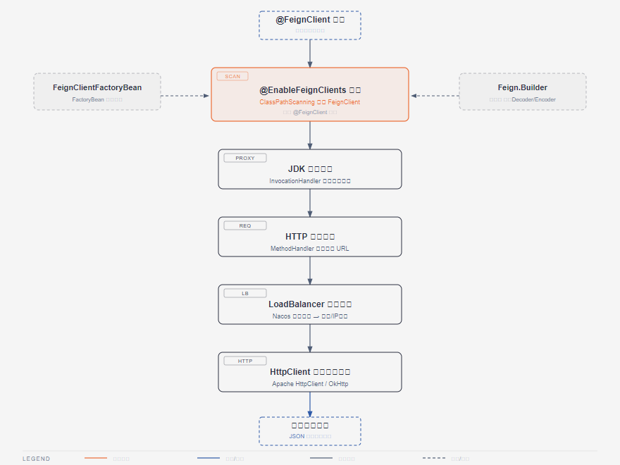

# 第5篇：OpenFeign 远程调用与负载均衡

> 技术点：声明式 HTTP 客户端、动态代理、负载均衡、服务降级
> 场景项目：mall-micro-cloud（mall-api 模块 + 各服务 Feign 接口）

---

## 一、基础篇：概念与价值

### 1.1 什么是 OpenFeign？

OpenFeign 是一个**声明式 HTTP 客户端**，通过注解定义接口即可完成远程调用，无需手写 HTTP 请求代码。

### 1.2 为什么用 Feign 而不是 RestTemplate？

| 对比 | OpenFeign | RestTemplate |
|------|-----------|-------------|
| 编程方式 | 声明式（接口） | 命令式（代码） |
| 代码量 | 少 | 多 |
| 负载均衡 | 自动集成 | 需 @LoadBalanced |
| 可读性 | 高（接口一目了然） | 低 |

---

## 二、进阶篇：动态代理原理



*从 @FeignClient 接口扫描到 JDK 动态代理、HTTP 请求构建的完整流程*

### 2.1 核心流程

```
@FeignClient → 接口扫描 → JDK 动态代理
    ↓
InvocationHandler 拦截方法调用
    ↓
解析注解 → 构建 HTTP 请求
    ↓
LoadBalancer 选择实例
    ↓
HttpClient 发送请求 → 解码响应
```

### 2.2 关键配置

```yaml
feign.client.config:
  default:
    connectTimeout: 5000
    readTimeout: 10000
  order-service:
    connectTimeout: 3000
    readTimeout: 5000
```

---

## 三、项目篇：实现与降级

### 3.1 接口定义

```java
@FeignClient(name = "mall-order-service", fallbackFactory = OrderFallbackFactory.class)
public interface OrderClient {
    @GetMapping("/order/{id}")
    Result<OrderDTO> getOrder(@PathVariable("id") Long id);
}
```

### 3.2 服务降级

```java
@Component
public class OrderFallbackFactory implements FallbackFactory<OrderClient> {
    @Override
    public OrderClient create(Throwable cause) {
        return id -> Result.error(500, "订单服务暂不可用");
    }
}
```

### 3.3 拦截器传递 Token

```java
@Bean
public RequestInterceptor tokenInterceptor() {
    return template -> {
        String token = ((ServletRequestAttributes) RequestContextHolder
            .getRequestAttributes()).getRequest()
            .getHeader("Authorization");
        template.header("Authorization", token);
    };
}
```

---

> 下一篇：[第6篇：Sentinel 流量控制与熔断降级](../06-sentinel/README.md)