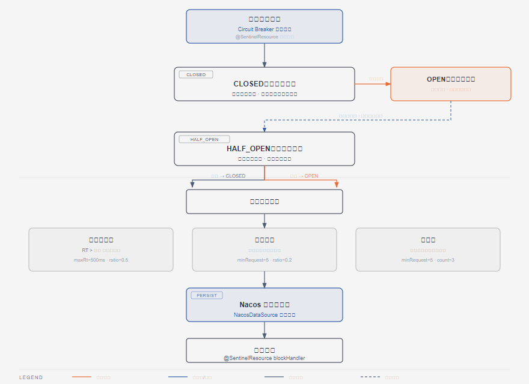

# 第6篇：Sentinel 流量控制与熔断降级

> 技术点：限流算法、熔断状态机、热点参数限流、规则持久化
> 场景项目：mall-micro-cloud（秒杀服务 + Gateway 集成）

---

## 一、基础篇：概念与价值

### 1.1 Sentinel 是什么？

Sentinel 是阿里巴巴开源的**流量控制、熔断降级、系统负载保护**组件，是微服务稳定性的核心保障。

### 1.2 核心功能

| 功能 | 说明 |
|------|------|
| 流量控制 | 按 QPS/线程数限制请求 |
| 熔断降级 | 下游异常时快速失败 |
| 热点限流 | 针对特定参数限流 |
| 系统保护 | 自适应系统负载 |

---

## 二、进阶篇：熔断状态机



*CLOSED→OPEN→HALF_OPEN 状态流转及三种熔断策略*

### 2.1 状态流转

```
CLOSED（关闭）→ 阈值触发 → OPEN（开启）
    ↑                           ↓
    └──────── HALF_OPEN ←─────────┘
              成功 → CLOSED
              失败 → OPEN
```

### 2.2 熔断策略

| 策略 | 触发条件 | 适用场景 |
|------|----------|----------|
| 慢调用比例 | RT > 阈值 且 比例 > 阈值 | 接口响应慢 |
| 异常比例 | 异常比例 > 阈值 | 频繁报错 |
| 异常数 | 1 分钟内异常数 > 阈值 | 异常量超大 |

---

## 三、项目篇：秒杀服务限流应用

### 3.1 接口限流

```java
@GetMapping("/product/{id}")
@SentinelResource(value = "getProduct", blockHandler = "handleBlock")
public Product getProduct(@PathVariable Long id) {
    return productService.getProductById(id);
}

public Product handleBlock(Long id, BlockException e) {
    return Product.defaultProduct(); // 降级返回
}
```

### 3.2 规则持久化到 Nacos

```java
@Bean
public SentinelDataSource sentinelDataSource() {
    ReadableDataSource<String, List<FlowRule>> ds = new NacosDataSource<>(
        "localhost:8848", "DEFAULT_GROUP", "sentinel-flow-rules",
        source -> JSON.parseObject(source, new TypeReference<>() {}));
    FlowRuleManager.register2Property(ds.getProperty());
    return ds;
}
```

### 3.3 Gateway 限流集成

```yaml
filters:
  - name: SentinelGatewayFilter
  - name: RequestRateLimiter
    args:
      key-resolver: "#{@userKeyResolver}"
      redis-rate-limiter:
        replenishRate: 100
        burstCapacity: 200
```

---

> 下一篇：[第7篇：Seata 分布式事务](../07-seata/README.md)