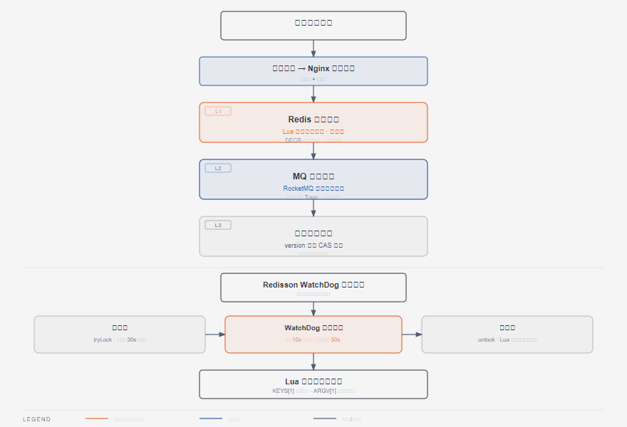

# 第9篇：Redis 缓存与分布式锁

> 技术点：5 种数据结构、缓存穿透/击穿/雪崩、分布式锁、Redisson
> 场景项目：mall-micro-cloud（秒杀库存预扣 + 幂等）

---

## 一、基础篇：概念与价值

### 1.1 Redis 核心数据结构

| 结构 | 说明 | 场景 |
|------|------|------|
| String | 字符串/数值 | 库存预扣 |
| Hash | 键值对映射 | 缓存对象 |
| List | 双向链表 | 消息队列 |
| Set | 无序集合 | 去重 |
| Sorted Set | 有序集合 | 排行榜 |

### 1.2 缓存三大问题

| 问题 | 描述 | 解决方案 |
|------|------|----------|
| 缓存穿透 | 查不存在的数据 | 布隆过滤器 |
| 缓存击穿 | 热点 key 过期 | 互斥锁/逻辑过期 |
| 缓存雪崩 | 大量 key 同时过期 | 随机过期时间 |

---

## 二、进阶篇：分布式锁原理



*Redis 预扣库存→MQ 异步→乐观锁的三层秒杀架构*

### 2.1 Redisson 分布式锁

```java
RLock lock = redissonClient.getLock("seckill:lock:" + activityId);
lock.lock(10, TimeUnit.SECONDS);
try {
    // 业务逻辑
} finally {
    lock.unlock();
}
```

**WatchDog 机制**：锁过期时间默认 30s，每 10s 自动续期，防止业务未完成锁提前释放。

### 2.2 底层 Lua 脚本

```lua
-- 加锁（可重入）
if redis.call('exists', KEYS[1]) == 0 then
    redis.call('hset', KEYS[1], ARGV[2], 1)
    redis.call('pexpire', KEYS[1], ARGV[1])
    return nil
end
if redis.call('hexists', KEYS[1], ARGV[2]) == 1 then
    redis.call('hincrby', KEYS[1], ARGV[2], 1)
    redis.call('pexpire', KEYS[1], ARGV[1])
    return nil
end
return redis.call('pttl', KEYS[1])
```

---

## 三、项目篇：秒杀库存预扣与幂等

### 3.1 秒杀库存预扣

```java
// 预扣库存（原子操作）
Long remain = redisTemplate.opsForValue()
    .increment("seckill:stock:" + activityId + ":" + skuId, -1);
if (remain >= 0) {
    // 发送 MQ 异步落库
    rocketMQ.send("stock_order", order);
} else {
    // 回补库存
    redisTemplate.opsForValue()
        .increment("seckill:stock:" + activityId + ":" + skuId, 1);
}
```

### 3.2 幂等校验

```java
// 幂等 key：que:lock:stock:{transactionId}
Boolean acquired = redisTemplate.opsForValue()
    .setIfAbsent(lockKey, "1", 30, TimeUnit.SECONDS);
```

---

> 下一篇：[第10篇：MySQL 数据库设计与优化](../10-mysql/README.md)