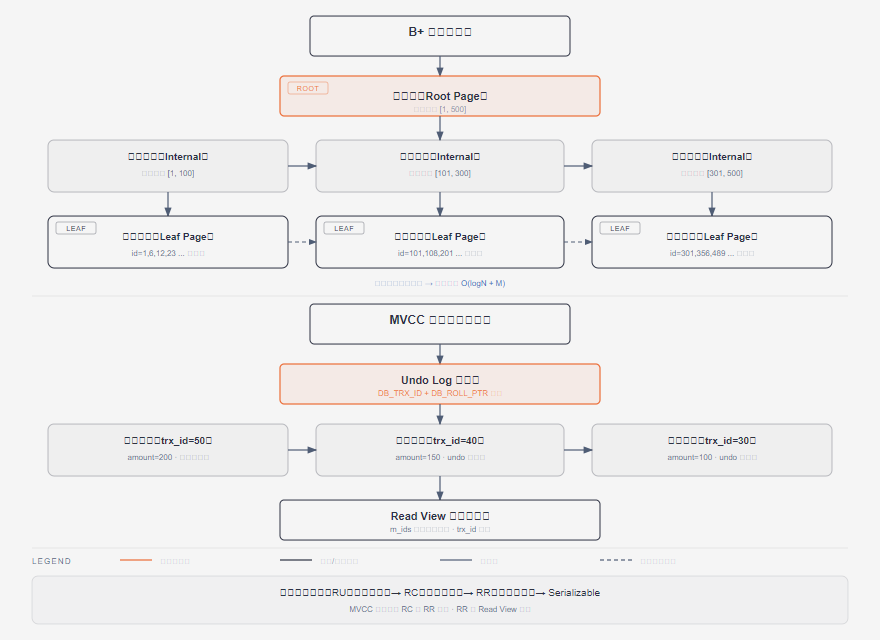

# 第10篇：MySQL 数据库设计与优化

> 技术点：索引原理、事务隔离、MVCC、SQL 优化
> 场景项目：mall-micro-cloud（订单表设计 + 商品查询优化）

---

## 一、基础篇：概念与价值

### 1.1 索引原理



*B+树的多层索引结构及范围查询路径*

MySQL 使用 B+ 树作为索引结构，相比二叉树：

| 特性 | B+ 树 | 二叉树 |
|------|-------|--------|
| 高度 | 3-4 层（百万级） | 20+ 层 |
| 范围查询 | 叶子节点链表 | 需多次回溯 |
| 磁盘 IO | 少 | 多 |

### 1.2 事务隔离级别

| 级别 | 脏读 | 不可重复读 | 幻读 | 默认 |
|------|------|------------|------|------|
| 读未提交 | ✗ | ✗ | ✗ | - |
| 读已提交 | ✓ | ✗ | ✗ | - |
| 可重复读 | ✓ | ✓ | ✗ | MySQL |
| 串行化 | ✓ | ✓ | ✓ | - |

---

## 二、进阶篇：MVCC 原理

MVCC 通过**隐藏字段 + Undo Log + Read View** 实现可重复读：

```
DB_TRX_ID（事务ID） + DB_ROLL_PTR（回滚指针）
    ↓
Undo Log 版本链（多个历史版本）
    ↓
Read View（事务快照）决定可见性
```

---

## 三、项目篇：订单表设计与优化

### 3.1 订单表设计要点

```sql
CREATE TABLE `order_info` (
    `id` bigint NOT NULL AUTO_INCREMENT,
    `order_no` varchar(32) NOT NULL COMMENT '订单号',
    `user_id` bigint NOT NULL COMMENT '用户ID',
    `total_amount` decimal(10,2) NOT NULL,
    `status` tinyint NOT NULL DEFAULT '0' COMMENT '0=待支付 1=已支付 2=已取消',
    `create_time` datetime NOT NULL,
    PRIMARY KEY (`id`),
    KEY `idx_order_no` (`order_no`),
    KEY `idx_user_id` (`user_id`),
    KEY `idx_create_time` (`create_time`)
) ENGINE=InnoDB DEFAULT CHARSET=utf8mb4;
```

### 3.2 索引优化建议

| 原则 | 说明 |
|------|------|
| 覆盖索引 | 查询列都在索引中，避免回表 |
| 最左前缀 | 联合索引从最左列开始匹配 |
| 避免函数 | 索引列上不要用函数 |
| 慢查询 | EXPLAIN 分析 + 慢查询日志 |

---

> 下一篇：[第11篇：Elasticsearch 全文搜索](../11-elasticsearch/README.md)