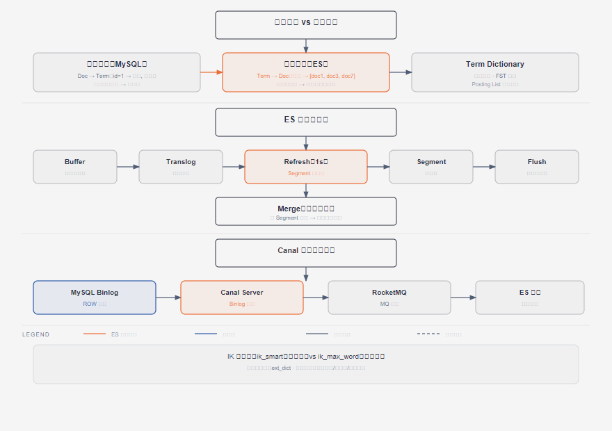

# 第11篇：Elasticsearch 全文搜索

> 技术点：倒排索引、分词、集群架构、数据同步
> 场景项目：mall-micro-cloud（mall-es-service 商品搜索）

---

## 一、基础篇：概念与价值



*正向索引与倒排索引的对比，以及写入流程*

### 1.1 什么是 Elasticsearch？

ES 是基于 Lucene 的分布式搜索引擎，提供 RESTful API 的全文检索、聚合分析能力。

### 1.2 为什么用 ES 而不是 MySQL LIKE？

| 对比 | ES | MySQL LIKE |
|------|-----|------------|
| 机制 | 倒排索引 | 全表扫描 |
| 速度 | O(词项查找) | O(N) |
| 相关度 | BM25 评分 | 不支持 |
| 分词 | IK 中文分词 | 不支持 |

---

## 二、进阶篇：倒排索引原理

```
正向索引（文档 → 词）：
Doc1: {水稻, 稻飞虱, 防治}
Doc2: {水稻, 施肥, 灌溉}

倒排索引（词 → 文档）：
水稻   → Doc1, Doc2
稻飞虱 → Doc1
防治   → Doc1
施肥   → Doc2
```

### 2.1 写入流程

```
请求 → 路由到主分片 → 写内存 buffer
→ 写 translog → 每秒 refresh → segment（可搜索）
→ flush → segment 落盘 + 合并
```

---

## 三、项目篇：商品搜索实现

### 3.1 商品索引定义

```json
{
  "mappings": {
    "properties": {
      "productId": {"type": "keyword"},
      "name": {"type": "text", "analyzer": "ik_max_word"},
      "price": {"type": "float"},
      "categoryName": {"type": "keyword"},
      "onSale": {"type": "boolean"}
    }
  }
}
```

### 3.2 搜索查询

```java
// 关键词匹配 + 过滤 + 排序 + 高亮
NativeSearchQuery query = new NativeSearchQueryBuilder()
    .withQuery(QueryBuilders.boolQuery()
        .must(QueryBuilders.matchQuery("name", keyword))
        .filter(QueryBuilders.termQuery("onSale", true)))
    .withSort(SortBuilders.fieldSort("salesCount").order(SortOrder.DESC))
    .withHighlightBuilder(new HighlightBuilder()
        .field("name")
        .preTags("<em>").postTags("</em>"))
    .build();
```

### 3.3 MySQL → ES 数据同步

| 方案 | 原理 | 适用 |
|------|------|------|
| 业务双写 | 写 MySQL 后调 ES 接口 | 数据量小 |
| Canal | 监听 binlog → 同步 | 数据量大 |
| Logstash | 定时增量同步 | 准实时 |

---

> 下一篇：[第12篇：Docker 容器化与部署](../12-docker/README.md)