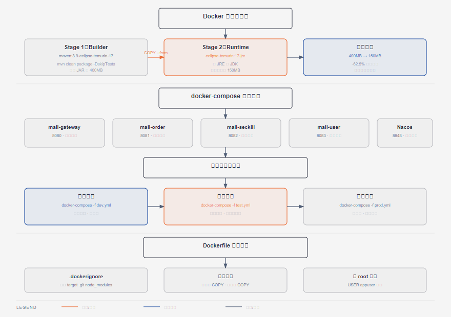

# 第12篇：Docker 容器化与部署

> 技术点：Dockerfile 多阶段构建、Docker Compose、镜像优化
> 场景项目：mall-micro-cloud（全套微服务容器化部署）

---

## 一、基础篇：概念与价值

### 1.1 Docker 核心概念

| 概念 | 说明 | 类比 |
|------|------|------|
| 镜像（Image） | 只读模板，包含运行环境 | 类 |
| 容器（Container） | 镜像的运行实例 | 实例 |
| Dockerfile | 构建镜像的脚本 | 食谱 |
| Compose | 多容器编排 | 厨房清单 |

---

## 二、进阶篇：多阶段构建



*Maven 构建阶段和 JRE 运行阶段的两阶段镜像优化*

### 2.1 优化前后对比

```dockerfile
# 第一阶段：构建（Maven + JDK 17，体积大）
FROM maven:3.8-openjdk-17 AS builder
WORKDIR /build
COPY pom.xml . && COPY src ./src
RUN mvn package -DskipTests

# 第二阶段：运行（JRE 17，体积小）
FROM eclipse-temurin:17-jre-alpine
WORKDIR /app
COPY --from=builder /build/target/*.jar app.jar
EXPOSE 8080
ENTRYPOINT ["java", "-jar", "app.jar"]
```

**优化效果**：从 ~400MB 降到 ~150MB

---

## 三、项目篇：微服务容器化部署

### 3.1 全套 docker-compose

```yaml
version: '3.8'
services:
  gateway:
    build: ./mall-gateway
    ports: ["8080:8080"]
    depends_on: [nacos, redis]

  nacos:
    image: nacos/nacos-server:v2.2.3
    environment:
      MODE: standalone
    ports: ["8848:8848"]

  redis:
    image: redis:7-alpine
    ports: ["6379:6379"]

  mysql:
    image: mysql:8.0
    environment:
      MYSQL_ROOT_PASSWORD: root123
    volumes:
      - mysql_data:/var/lib/mysql
    ports: ["3306:3306"]

volumes:
  mysql_data:
```

### 3.2 多环境部署

| 环境 | 策略 | 配置 |
|------|------|------|
| 开发 | 单机 Docker Compose | 每服务单独启动 |
| 测试 | 单机 + 服务编排 | docker-compose 全量 |
| 生产 | K8s 集群 | 高可用 + 自动扩缩容 |

---

> 下一篇：[第13篇：Hybrid RAG 检索增强生成](../13-hybrid-rag/README.md)