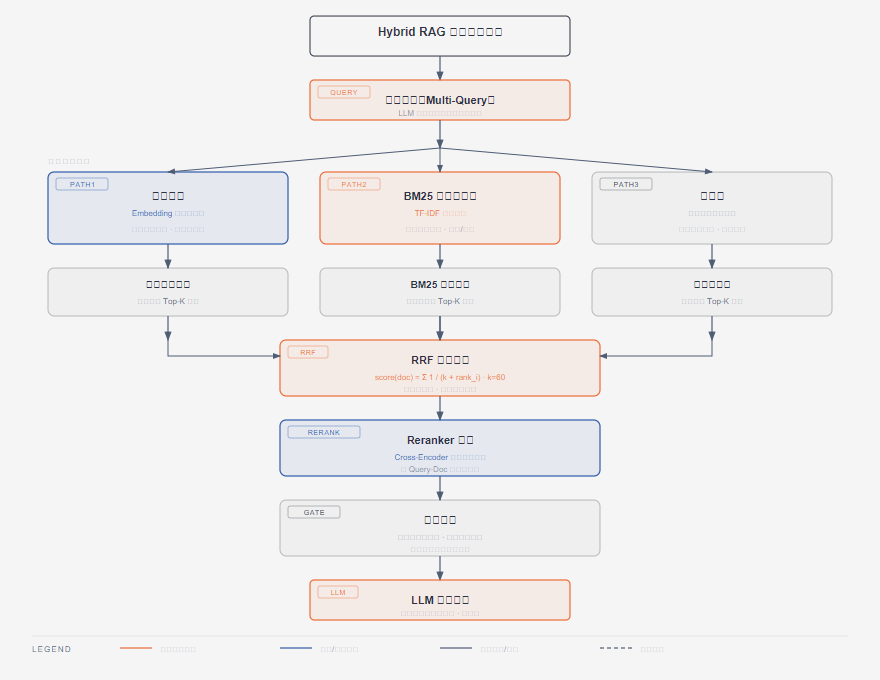

# 第13篇：Hybrid RAG 检索增强生成

> 技术点：混合检索、向量召回、BM25、RRF 融合、Reranker、幻觉控制
> 场景项目：CropWise（农业知识问答系统）

---

## 一、基础篇：概念与价值

### 1.1 什么是 RAG？

RAG（Retrieval-Augmented Generation）检索增强生成，通过在生成回答前**检索相关文档**作为上下文，解决 LLM 的知识截止和幻觉问题。

### 1.2 为什么需要混合检索？

| 检索方式 | 擅长 | 不足 |
|----------|------|------|
| 向量检索 | 语义相似（"刚入职的员工"→employee） | 精确匹配弱（型号/编号） |
| BM25 关键词 | 精确匹配（"稻飞虱"） | 语义理解弱（同义词） |

**混合检索 = 向量 + BM25 + 图 多路召回，取长补短**

---

## 二、进阶篇：RRF 融合原理



*Multi-Query 分解→多路并行检索→RRF 融合→Reranker 精排→证据门控→LLM 生成*

### 2.1 RRF（Reciprocal Rank Fusion）

```
RRF 公式：score(doc) = Σ 1 / (k + rank_i)

k = 60（平滑参数）
```

**为什么不加权平均？**
- 不同检索器分数尺度不同（余弦 0-1，BM25 0-100）
- 直接加权没意义
- RRF 对排名敏感、对分数不敏感 → 天然鲁棒

### 2.2 Python 实现

```python
def rrf_fusion(vector_results, bm25_results, k=60):
    scores = {}
    for rank, doc in enumerate(vector_results):
        doc_id = doc.metadata.get("id")
        scores[doc_id] = scores.get(doc_id, 0) + 1 / (k + rank + 1)
    for rank, doc in enumerate(bm25_results):
        doc_id = doc.metadata.get("id")
        scores[doc_id] = scores.get(doc_id, 0) + 1 / (k + rank + 1)
    return sorted(scores.items(), key=lambda x: x[1], reverse=True)
```

### 2.3 Reranker 精排

```
向量检索（双编码器）→ top-30 召回
        ↓
BGE-Reranker（交叉编码器）→ top-5 精排
```

交叉编码器把 query 和 doc **拼接**后输入，能看到完整交互 → 更准（但慢）。

---

## 三、项目篇：CropWise 完整检索流程

### 3.1 检索链路

```
用户问题
  → QueryTransformer（实体提取 + Multi-Query 分解）
  → 并行检索：Vector(BGE-M3) + BM25 + Graph(Neo4j)
  → RRF Fusion（k=60）
  → BGE-Reranker 精排
  → 证据门控（低分过滤）
  → LLM 生成 + SSE 流式
```

### 3.2 领域守卫（幻觉控制第一层）

```python
# domain_guard.py — 非农业问题直接拒绝
AGRICULTURE_TERMS = ("水稻", "小麦", "病虫害", "施肥", ...)
NON_AGRICULTURE_TERMS = ("java", "python", "编程", "代码", ...)

def classify_query(message):
    agri_hits = [t for t in AGRICULTURE_TERMS if t in message]
    non_agri = [t for t in NON_AGRICULTURE_TERMS if t in message]
    if non_agri and not agri_hits:
        return {"allowed": False, "category": "non_agriculture"}
    if agri_hits:
        return {"allowed": True, "category": "agriculture"}
    return {"allowed": False, "category": "ambiguous"}
```

### 3.3 证据门控（幻觉控制第二层）

| 级别 | 来源 | 可用性 |
|------|------|--------|
| A 级 | 官方来源 | 可支撑剂量/政策结论 |
| B 级 | 权威文档 | 背景解释 |
| C 级 | 普通知识包 | 仅参考 |
| D 级 | 未核验 | 不可用 |

**高风险闸门**：涉及农药/政策时，只用 A 级证据，否则明确"待官方核验"。

### 3.4 配置（真实项目 config.py）

```python
# 检索配置
rrf_k: int = 60
bm25_weight: float = 0.4
vector_weight: float = 0.6
hybrid_top_k: int = 5

# 嵌入模式：local(哈希) / remote(API) / bge_m3
rag_embedding_mode: str = "bge_m3"
```

---

> 下一篇：[第14篇：LangGraph Agent 智能体编排](../14-langgraph-agent/README.md)