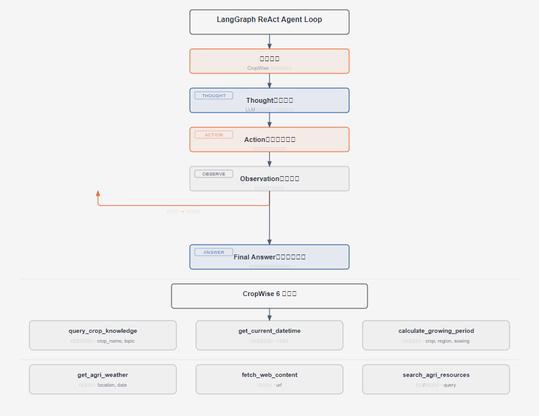

# 第14篇：LangGraph Agent 智能体编排

> 技术点：Agent Loop、ReAct、工具调用、Multi-Agent、StateGraph
> 场景项目：CropWise（6 工具农业问答 Agent）

---

## 一、基础篇：概念与价值

### 1.1 什么是 AI Agent？

AI Agent 是**能够自主感知环境、做出决策、采取行动**以实现目标的智能体。区别于 LLM 的"一问一答"，Agent 能**调用工具、多步推理、自我纠错**。

### 1.2 LangGraph vs LangChain

| 对比 | LangChain | LangGraph |
|------|-----------|-----------|
| 流程 | 线性 DAG（链式） | 图（循环+分支） |
| 循环 | 不支持 | 原生支持 |
| 状态管理 | 需手动 | StateGraph 自动 |
| 适用 | 简单 Chain | Agent Loop |

---

## 二、进阶篇：ReAct Agent Loop



*Thought→Action→Observation 循环及 6 个工具*

### 2.1 核心循环

```
Thought（推理）→ Action（调工具）→ Observation（观察）
    ↓ 循环直到任务完成
Final Answer（最终回答）
```

### 2.2 CropWise 的 6 个工具

| 工具 | 功能 | 输入 |
|------|------|------|
| query_crop_knowledge | 作物知识检索 | crop_name, topic |
| get_current_datetime | 获取当前时间 | 无 |
| calculate_growing_period | 生育期计算 | crop, region, sowing_date |
| get_agri_weather | 农业气象 | location, date |
| fetch_web_content | 网页抓取 | url |
| search_agri_resources | 图片/资料搜索 | query |

---

## 三、项目篇：CropWise Agent 实现

### 3.1 Agent 核心代码

```python
class AgricultureAgent:
    def __init__(self):
        self.llm = ChatOpenAI(
            model=settings.agnes_chat_model,
            api_key=settings.agnes_api_key,
            base_url=settings.agnes_base_url,
        )
        self.tools = get_all_tools()

    async def stream(self, message: str, session_id: str):
        # 1. 领域守卫
        decision = classify_query(message)
        if not decision["allowed"]:
            yield {"type": "rejection", "reason": decision["reason"]}
            return
        # 2. 检索增强
        context = await agriir_pipeline.run(message)
        # 3. Agent 执行
        async for event in self._react_loop(message, context, session_id):
            yield event
```

### 3.2 工具调用审计

```python
def _run_tool_audited(name: str, args: Any) -> Dict[str, Any]:
    """带审计日志的工具调用"""
    started = time.perf_counter()
    tool = _TOOL_MAP.get(name)
    if not tool:
        return {"ok": False, "error_code": "TOOL_NOT_FOUND", ...}
    try:
        result = tool.invoke(args)
        return {"ok": True, "result": str(result), "duration_ms": ...}
    except Exception as e:
        return {"ok": False, "error_code": "TOOL_ERROR", "result": str(e)}
```

### 3.3 工具调用失败处理

| 失败类型 | 处理策略 |
|----------|----------|
| 工具不存在 | 返回错误，LLM 换工具 |
| 工具超时 | 重试 1 次，失败后跳过 |
| 参数错误 | LLM 重新生成参数 |
| 全部失败 | 返回通用建议，不编造答案 |

---

> 下一篇：[第15篇：Neo4j 知识图谱与 GraphRAG](../15-neo4j-graph/README.md)